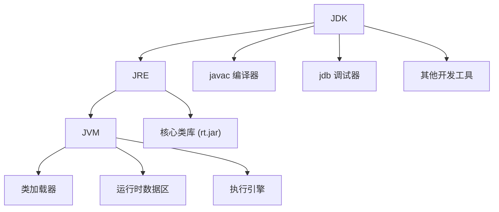
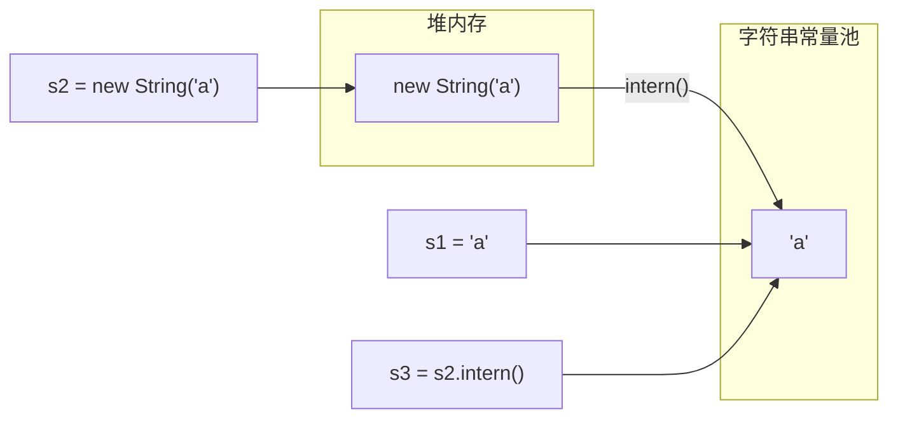
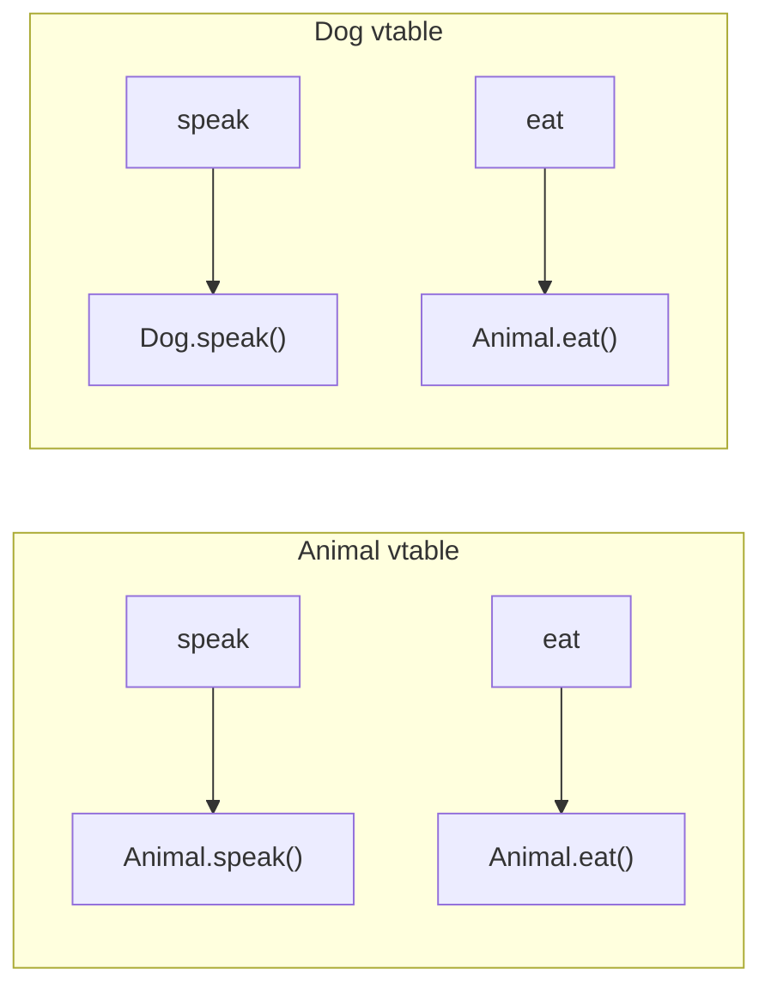
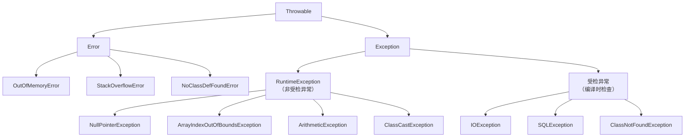
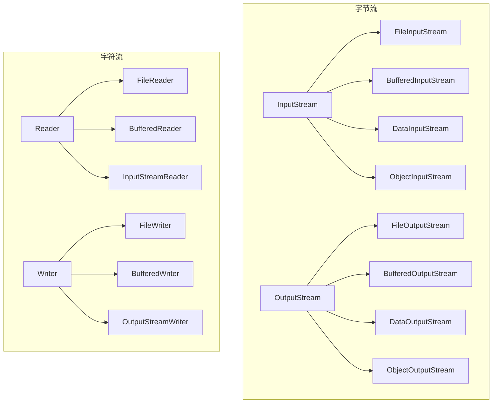
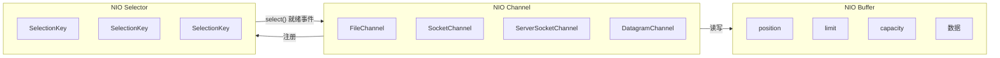
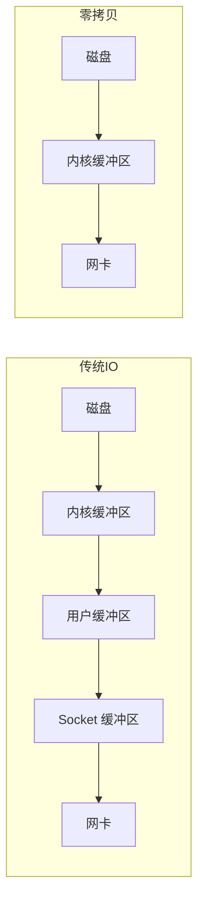
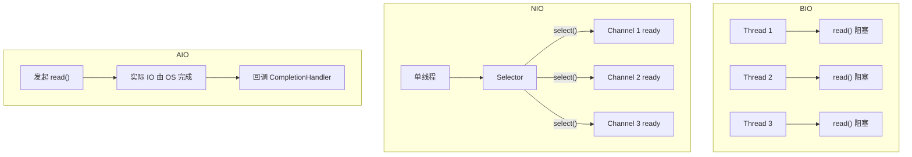

# Java Core 知识体系

---

## 1. Java 语言基础

### 1.1 JDK / JRE / JVM 区别与关系

| 概念 | 全称 | 说明 |
|------|------|------|
| **JDK** | Java Development Kit | 开发工具包，包含 JRE + 编译器（javac）、调试器（jdb）、javadoc 等 |
| **JRE** | Java Runtime Environment | 运行环境，包含 JVM + 核心类库（rt.jar） |
| **JVM** | Java Virtual Machine | Java 虚拟机，负责加载 .class 并解释执行 |



### 1.2 跨平台原理

Java 源码（`.java`）通过 `javac` 编译为平台无关的**字节码**（`.class` 文件），字节码由 JVM 解释执行或 JIT 编译为本地机器码。不同平台有不同的 JVM 实现，但同一 `.class` 文件可在所有平台上运行 —— **"一次编写，到处运行"**。

```
.java ---javac---> .class ---JVM---> 机器码 (Windows / Linux / macOS)
```

### 1.3 基本数据类型（8种）

| 类型 | 大小 | 默认值 | 范围 |
|------|------|--------|------|
| `byte` | 1B | 0 | -128 ~ 127 |
| `short` | 2B | 0 | -32768 ~ 32767 |
| `int` | 4B | 0 | -2^31 ~ 2^31-1 |
| `long` | 8B | 0L | -2^63 ~ 2^63-1 |
| `float` | 4B | 0.0f | ±3.4e-38 ~ ±3.4e+38 |
| `double` | 8B | 0.0d | ±1.7e-308 ~ ±1.7e+308 |
| `char` | 2B | '\u0000' | 0 ~ 65535 |
| `boolean` | 未明确定义 | false | true / false |

#### 包装类缓存池

`Integer` 默认缓存 `-128 ~ 127`，`Long`、`Short`、`Byte` 同理；`Character` 缓存 `0 ~ 127`；`Boolean` 直接缓存 `TRUE / FALSE`。

```java
Integer a = 100;  // 等价于 Integer.valueOf(100)
Integer b = 100;
System.out.println(a == b); // true（缓存命中）

Integer c = 200;
Integer d = 200;
System.out.println(c == d); // false（超出缓存范围，新建对象）
```

缓存池上限可通过 JVM 参数 `-XX:AutoBoxCacheMax=<size>` 调整。

### 1.4 自动装箱拆箱原理

```java
// 自动装箱：int → Integer
Integer x = 10;  // 编译为 Integer.valueOf(10)

// 自动拆箱：Integer → int
int y = x;       // 编译为 x.intValue()

// 注意空指针
Integer z = null;
int w = z;       // NullPointerException！编译为 z.intValue()
```

**装箱**调用包装类的 `valueOf()`（优先走缓存池）；**拆箱**调用包装类的 `xxxValue()` 方法。

### 1.5 String 不可变性

`String` 被 `final` 修饰，内部 `char[]`（Java 8）或 `byte[]`（Java 9+）也被 `final` 修饰，初始化后不可更改。所有"修改"操作都会返回新对象。

```java
String s = "hello";
s = s + " world"; // 生成新的 String 对象，原 "hello" 仍在常量池中
```

#### StringBuilder vs StringBuffer

| 特性 | StringBuilder | StringBuffer |
|------|---------------|--------------|
| 线程安全 | 否 | 是（方法用 `synchronized`） |
| 性能 | 高 | 较低 |
| 适用场景 | 单线程字符串拼接 | 多线程共享字符串操作 |

```java
// 推荐用法
StringBuilder sb = new StringBuilder();
sb.append("a").append("b").append("c");
String result = sb.toString();
```

### 1.6 String.intern() 与常量池



```java
String s1 = "a";                            // 常量池
String s2 = new String("a");                // 堆中新对象
String s3 = s2.intern();                    // 返回常量池引用

System.out.println(s1 == s2); // false（堆对象 vs 常量池）
System.out.println(s1 == s3); // true（常量池中同一引用）
System.out.println(s2 == s3); // false
```

`intern()` 会从常量池查找字符串，找到则返回池中引用，否则将字符串加入池中并返回引用。

---

## 2. 面向对象 OOP

### 2.1 四大特性

#### 封装（Encapsulation）

隐藏内部实现，通过公开方法暴露行为。

```java
public class Person {
    private String name;
    private int age;

    public Person(String name, int age) {
        this.name = name;
        setAge(age);
    }

    public String getName() {
        return name;
    }

    public int getAge() {
        return age;
    }

    public void setAge(int age) {
        if (age < 0 || age > 150) {
            throw new IllegalArgumentException("Invalid age");
        }
        this.age = age;
    }
}
```

#### 继承（Inheritance）

子类继承父类非 `private` 成员，`extends` 关键字。

```java
public class Animal {
    protected String name;

    public Animal(String name) {
        this.name = name;
    }

    public void speak() {
        System.out.println(name + " makes a sound");
    }
}

public class Dog extends Animal {
    public Dog(String name) {
        super(name);
    }

    @Override
    public void speak() {
        System.out.println(name + " barks");
    }
}
```

#### 多态（Polymorphism）

同一行为在不同对象上有不同实现。

```java
public interface Shape {
    double area();
}

public class Circle implements Shape {
    private double radius;
    public Circle(double r) { this.radius = r; }

    @Override
    public double area() {
        return Math.PI * radius * radius;
    }
}

public class Rectangle implements Shape {
    private double w, h;
    public Rectangle(double w, double h) { this.w = w; this.h = h; }

    @Override
    public double area() {
        return w * h;
    }
}

// 使用
Shape s1 = new Circle(2.0);
Shape s2 = new Rectangle(3.0, 4.0);
System.out.println(s1.area()); // 12.566...
System.out.println(s2.area()); // 12.0
```

#### 抽象（Abstraction）

通过 `abstract class` 或 `interface` 定义行为契约。

```java
public abstract class Database {
    public abstract void connect(String url);
    public abstract void disconnect();

    public void log(String msg) {
        System.out.println("[DB] " + msg);
    }
}

public class MySQL extends Database {
    @Override
    public void connect(String url) {
        System.out.println("Connecting to MySQL: " + url);
    }

    @Override
    public void disconnect() {
        System.out.println("Disconnecting MySQL");
    }
}
```

### 2.2 接口 vs 抽象类

| 维度 | 抽象类 | 接口 |
|------|--------|------|
| 关键字 | `abstract class` | `interface` |
| 构造方法 | 可以有 | 不能有 |
| 多继承 | 不支持（单继承） | 支持（多实现） |
| 成员变量 | 任意类型 | `public static final`（常量） |
| 方法 | 抽象 + 具体方法 | 抽象 + default + static（Java 8+）|
| 设计理念 | **is-a** 关系 | **can-do** 契约能力 |

```java
// Java 8+ 接口中的 default 和 static 方法
public interface Loggable {
    void log(String msg);

    // default 方法（可被重写）
    default void logWithTimestamp(String msg) {
        log(java.time.Instant.now() + " " + msg);
    }

    // static 方法（不能被子类继承）
    static Loggable console() {
        return msg -> System.out.println(msg);
    }
}
```

### 2.3 多态实现原理

Java 多态通过**虚方法表（vtable / Virtual Method Table）**实现：

1. JVM 为每个类加载时创建虚方法表，存储方法实际入口地址
2. 子类重写父类方法时，虚方法表中对应条目替换为子类实现地址
3. 运行时通过 `invokevirtual` 指令查找虚方法表，实现**动态分派（Dynamic Dispatch）**



### 2.4 内部类

#### 成员内部类

```java
public class Outer {
    private String msg = "Hello";

    public class Inner {
        public void print() {
            System.out.println(msg); // 可直接访问外部类 private 成员
        }
    }
}

// 使用
Outer outer = new Outer();
Outer.Inner inner = outer.new Inner();
```

#### 静态内部类

```java
public class Outer {
    private static String staticMsg = "static";
    private String instanceMsg = "instance";

    public static class StaticInner {
        public void print() {
            System.out.println(staticMsg);   // 只能访问外部静态成员
            // System.out.println(instanceMsg); // 编译错误
        }
    }
}

// 使用
Outer.StaticInner inner = new Outer.StaticInner();
```

#### 局部内部类（方法内定义）

```java
public void method() {
    class LocalInner {
        void doSomething() {
            System.out.println("local");
        }
    }
    new LocalInner().doSomething();
}
```

#### 匿名内部类

```java
// 匿名内部类
Runnable task = new Runnable() {
    @Override
    public void run() {
        System.out.println("Running");
    }
};
```

#### 内存泄漏风险

**非静态内部类持有外部类的隐式引用**，可能导致外部类无法被 GC 回收：

```java
public class LeakExample {
    private byte[] bigData = new byte[1024 * 1024 * 100]; // 100MB

    public class Inner {
        // 隐式持有 LeakExample.this 引用
    }

    // 推荐：用静态内部类避免泄漏
    public static class SafeInner {
        // 不持有外部类引用
    }
}
```

### 2.5 浅拷贝 / 深拷贝 / Cloneable

```java
public class Address implements Cloneable {
    String city;
    public Address(String city) { this.city = city; }

    @Override
    protected Object clone() throws CloneNotSupportedException {
        return super.clone(); // 浅拷贝
    }
}

public class Person implements Cloneable {
    String name;
    Address address;

    public Person(String name, Address address) {
        this.name = name;
        this.address = address;
    }

    // 浅拷贝
    @Override
    protected Object clone() throws CloneNotSupportedException {
        return super.clone();
    }

    // 深拷贝（手动克隆引用字段）
    public Person deepClone() throws CloneNotSupportedException {
        Person p = (Person) super.clone();
        p.address = (Address) address.clone();
        return p;
    }
}

// 使用
Address addr = new Address("Beijing");
Person p1 = new Person("Alice", addr);
Person p2 = (Person) p1.clone();          // 浅拷贝：p2.address == p1.address
Person p3 = p1.deepClone();               // 深拷贝：p3.address != p1.address
```

### 2.6 final / static / super / this

#### final

| 修饰 | 含义 |
|------|------|
| `final class` | 不能被继承（如 `String`） |
| `final method` | 不能被重写 |
| `final variable` | 值不可变（基本类型值不变，引用类型指向不变） |

#### static

```java
public class StaticDemo {
    static int count = 0;          // 类变量
    int instanceCount = 0;         // 实例变量

    static void staticMethod() {   // 类方法
        // 只能访问 static 成员
    }

    static {                       // 静态代码块，类加载时执行一次
        count = 100;
    }
}
```

#### super 与 this

```java
public class Parent {
    protected int x = 10;
    public Parent(String name) { }
    public void method() { }
}

public class Child extends Parent {
    private int x = 20;

    public Child(String name) {
        super(name);  // 调用父类构造器，必须第一行
    }

    public void method() {
        super.method();        // 调用父类方法
        int px = super.x;      // 父类字段（10）
        int cx = this.x;       // 当前类字段（20）
    }
}
```

### 2.7 方法重载 vs 重写

| 维度 | 重载（Overload） | 重写（Override） |
|------|------------------|------------------|
| 发生位置 | 同一类中 | 父子类之间 |
| 方法名 | 相同 | 相同 |
| 参数列表 | 必须不同 | 必须相同 |
| 返回类型 | 可不同 | 相同或协变返回类型 |
| 访问修饰符 | 无限制 | 不能更严格 |
| 异常 | 无限制 | 不能抛出更宽泛的异常 |
| 绑定时机 | 编译期（静态多态） | 运行期（动态多态） |

```java
// 重载
public class Calculator {
    public int add(int a, int b) { return a + b; }
    public double add(double a, double b) { return a + b; }
    public int add(int a, int b, int c) { return a + b + c; }
}

// 重写
public class Base {
    public Number getValue() throws IOException { return 1; }
}

public class Child extends Base {
    @Override
    public Integer getValue() throws FileNotFoundException { return 2; }
    // 返回类型：Integer（协变），异常：FileNotFoundException（更窄）
}
```

---

## 3. 异常处理

### 3.1 Throwable 体系



| 类别 | 说明 | 是否需要 try-catch |
|------|------|-------------------|
| **Error** | JVM 内部错误，程序无法处理 | 否 |
| **受检异常（Checked Exception）** | 编译器强制检查，必须处理 | 是 |
| **非受检异常（Unchecked / RuntimeException）** | 程序逻辑缺陷，可避免 | 否 |

### 3.2 try-catch-finally 与 return

```java
public static int test() {
    int x = 1;
    try {
        return x;     // 1）先保存返回值 1
    } catch (Exception e) {
        return -1;
    } finally {
        x = 999;      // 2）修改 x 不影响已保存的返回值
        // 若 finally 中有 return，会覆盖 try 中的 return！
    }
}
// 结果：1（finally 修改 x 不影响返回值）

// finally 中的 return 会覆盖前面的 return（应避免）
public static int test2() {
    try {
        return 1;
    } finally {
        return 2;     // 结果：2
    }
}
```

### 3.3 try-with-resources（AutoCloseable）

Java 7+ 引入，自动关闭实现了 `AutoCloseable` 的资源。

```java
// 传统方式
BufferedReader br = null;
try {
    br = new BufferedReader(new FileReader("test.txt"));
    System.out.println(br.readLine());
} catch (IOException e) {
    e.printStackTrace();
} finally {
    if (br != null) {
        try { br.close(); } catch (IOException e) { }
    }
}

// try-with-resources（推荐）
try (BufferedReader br = new BufferedReader(new FileReader("test.txt"))) {
    System.out.println(br.readLine());
} catch (IOException e) {
    e.printStackTrace();
}
// br 自动关闭，无需 finally
```

#### 原理：AutoCloseable 接口

```java
public interface AutoCloseable {
    void close() throws Exception;
}

public class MyResource implements AutoCloseable {
    public void use() { System.out.println("using"); }

    @Override
    public void close() {
        System.out.println("closed automatically");
    }
}

// 使用
try (MyResource r = new MyResource()) {
    r.use();
} // 自动调用 r.close()
```

### 3.4 抑制异常（Suppressed）

try-with-resources 中，如果 try 块和 close() 都抛出异常，close() 的异常会被**抑制**并附加到 try 块的异常中。

```java
public class FlakyResource implements AutoCloseable {
    @Override
    public void close() throws Exception {
        throw new Exception("close failed");
    }
}

try (FlakyResource r = new FlakyResource()) {
    throw new Exception("try failed");
} catch (Exception e) {
    System.out.println(e.getMessage());           // try failed
    Throwable[] suppressed = e.getSuppressed();
    System.out.println(suppressed[0].getMessage()); // close failed
}
```

### 3.5 自定义异常最佳实践

```java
// 受检异常：继承 Exception
public class BusinessException extends Exception {
    private int errorCode;

    public BusinessException(int errorCode, String message) {
        super(message);
        this.errorCode = errorCode;
    }

    public int getErrorCode() { return errorCode; }
}

// 非受检异常：继承 RuntimeException
public class ValidationException extends RuntimeException {
    public ValidationException(String field, String reason) {
        super(String.format("Field '%s' validation failed: %s", field, reason));
    }
}

// 使用
public void transfer(String from, String to, double amount)
        throws BusinessException {
    if (amount <= 0) {
        throw new ValidationException("amount", "must be positive");
    }
    if (from.equals(to)) {
        throw new BusinessException(1001, "same account");
    }
}
```

**最佳实践：**
- 受检异常用于可恢复的外部错误（IO、网络）
- 非受检异常用于程序 bug（空指针、参数校验）
- 异常信息包含上下文（参数值、错误码）
- 不要捕获 `Throwable` 或 `Error`
- 不要忽略异常（空的 catch 块）

---

## 4. 泛型

### 4.1 泛型擦除（Type Erasure）与桥方法

Java 泛型在编译期进行**类型擦除**，运行时不存在泛型类型信息。

```java
// 源码
public class Box<T> {
    private T value;
    public T get() { return value; }
    public void set(T v) { this.value = v; }
}

// 擦除后（相当于）
public class Box {
    private Object value;
    public Object get() { return value; }
    public void set(Object v) { this.value = v; }
}

// 若上界为 Number
public class NumBox<T extends Number> {
    private T value;
    public T get() { return value; }
    public void set(T v) { this.value = v; }
}

// 擦除后
public class NumBox {
    private Number value;
    public Number get() { return value; }
    public void set(Number v) { this.value = v; }
}
```

#### 桥方法（Bridge Method）

泛型擦除后，子类重写的方法签名不匹配，编译器自动生成桥方法：

```java
public class Parent {
    public Object get() { return null; }
}

public class Child extends Parent {
    @Override
    public String get() { return "hello"; } // 返回类型协变

    // 编译器生成桥方法（伪代码）：
    // public Object get() {
    //     return this.get(); // 调用 String get()
    // }
}
```

### 4.2 通配符与 PECS 原则

| 通配符 | 含义 | 可读 | 可写 |
|--------|------|------|------|
| `? extends T` | T 或 T 的子类 | 可读（读到 T） | 不可写（null 除外） |
| `? super T` | T 或 T 的父类 | 可读（读到 Object） | 可写（可写 T） |
| `?` | 任意类型 | 可读（读到 Object） | 不可写（null 除外） |

**PECS 原则**：Producer `extends`，Consumer `super`。

```java
// Producer: 只读不写 → extends
public void readAll(List<? extends Number> list) {
    Number n = list.get(0);   // OK
    // list.add(1);           // 编译错误！不能写入
}

// Consumer: 只写不读 → super
public void addAll(List<? super Integer> list) {
    list.add(1);              // OK
    Object o = list.get(0);   // 只能读到 Object
}

// 经典应用：Collections.copy
public static <T> void copy(List<? super T> dest, List<? extends T> src) {
    for (int i = 0; i < src.size(); i++) {
        dest.set(i, src.get(i));
    }
}
```

### 4.3 泛型类 / 接口 / 方法

```java
// 泛型类
public class Pair<K, V> {
    private K key;
    private V value;
    public Pair(K key, V value) {
        this.key = key;
        this.value = value;
    }
    public K getKey() { return key; }
    public V getValue() { return value; }
}

// 泛型接口
public interface Transformer<T, R> {
    R transform(T input);
}

// 泛型方法（在方法上声明类型参数）
public class Utils {
    public static <T> T getMiddle(T... args) {
        return args[args.length / 2];
    }

    public static <T extends Comparable<T>> T max(T a, T b) {
        return a.compareTo(b) > 0 ? a : b;
    }
}

// 使用
Pair<String, Integer> pair = new Pair<>("age", 30);
String middle = Utils.getMiddle("a", "b", "c");           // "b"
int max = Utils.max(3, 7);                                // 7
```

---

## 5. 反射

### 5.1 Class 对象获取方式

```java
public class ReflectionDemo {
    public static void main(String[] args) throws Exception {
        // 方式一：类名.class
        Class<?> clazz1 = String.class;

        // 方式二：对象.getClass()
        String str = "hello";
        Class<?> clazz2 = str.getClass();

        // 方式三：Class.forName()
        Class<?> clazz3 = Class.forName("java.lang.String");

        // 方式四：类加载器
        Class<?> clazz4 = ClassLoader.getSystemClassLoader()
                .loadClass("java.lang.String");

        System.out.println(clazz1 == clazz2); // true
        System.out.println(clazz2 == clazz3); // true
        System.out.println(clazz3 == clazz4); // true
    }
}
```

### 5.2 Field / Method / Constructor / Annotation API

```java
public class User {
    private String name;
    private int age;

    public User() {}
    public User(String name, int age) {
        this.name = name;
        this.age = age;
    }

    private String getInfo() {
        return name + " (" + age + ")";
    }
}

// 反射操作
public class ReflectTest {
    public static void main(String[] args) throws Exception {
        Class<?> clazz = User.class;

        // === Constructor ===
        Constructor<?> constructor = clazz.getConstructor(String.class, int.class);
        Object user = constructor.newInstance("Alice", 25);

        // === Field ===
        Field nameField = clazz.getDeclaredField("name");
        nameField.setAccessible(true);              // 绕过 private
        String name = (String) nameField.get(user);  // "Alice"
        nameField.set(user, "Bob");

        // === Method ===
        Method method = clazz.getDeclaredMethod("getInfo");
        method.setAccessible(true);
        String info = (String) method.invoke(user); // "Bob (25)"

        // === Annotation ===
        if (clazz.isAnnotationPresent(Deprecated.class)) {
            Deprecated dep = clazz.getAnnotation(Deprecated.class);
        }
    }
}
```

### 5.3 动态代理：JDK Proxy vs CGLIB

#### JDK 动态代理（基于接口）

```java
public interface HelloService {
    String sayHello(String name);
}

public class HelloServiceImpl implements HelloService {
    @Override
    public String sayHello(String name) {
        return "Hello, " + name;
    }
}

// InvocationHandler
public class LogHandler implements InvocationHandler {
    private final Object target;

    public LogHandler(Object target) {
        this.target = target;
    }

    @Override
    public Object invoke(Object proxy, Method method, Object[] args)
            throws Throwable {
        System.out.println("Before: " + method.getName());
        Object result = method.invoke(target, args);
        System.out.println("After: " + method.getName());
        return result;
    }
}

// 创建代理
HelloService target = new HelloServiceImpl();
HelloService proxy = (HelloService) Proxy.newProxyInstance(
        target.getClass().getClassLoader(),
        target.getClass().getInterfaces(),
        new LogHandler(target)
);
proxy.sayHello("Alice");
// 输出:
// Before: sayHello
// Hello, Alice
// After: sayHello
```

#### CGLIB 动态代理（基于子类，需引入 cglib 依赖）

```java
// 不需要接口的类
public class UserService {
    public String greet(String name) {
        return "Hi, " + name;
    }
}

// MethodInterceptor
public class CglibProxy implements MethodInterceptor {
    @Override
    public Object intercept(Object obj, Method method, Object[] args,
                            MethodProxy proxy) throws Throwable {
        System.out.println("CGLIB before");
        Object result = proxy.invokeSuper(obj, args);
        System.out.println("CGLIB after");
        return result;
    }
}

// 创建代理
Enhancer enhancer = new Enhancer();
enhancer.setSuperclass(UserService.class);
enhancer.setCallback(new CglibProxy());
UserService proxy = (UserService) enhancer.create();
proxy.greet("Bob");
```

#### JDK Proxy vs CGLIB 对比

| 维度 | JDK Proxy | CGLIB |
|------|-----------|-------|
| 目标要求 | 必须实现接口 | 无接口要求 |
| 原理 | 生成接口实现类 | 生成子类（字节码增强） |
| 性能（创建） | 较快 | 较慢（需生成字节码） |
| 性能（调用） | 较慢（反射） | 较快（FastClass 机制） |
| 限制 | 只能代理接口方法 | `final` 类/方法不可代理 |

### 5.4 反射性能优化

```java
// 1. 缓存 Method/Field 对象（避免重复查找）
private static final Method GET_NAME_METHOD;
static {
    try {
        GET_NAME_METHOD = User.class.getDeclaredMethod("getName");
        GET_NAME_METHOD.setAccessible(true);
    } catch (NoSuchMethodException e) {
        throw new ExceptionInInitializerError(e);
    }
}

// 2. setAccessible(true) 跳过安全检查
// 3. 使用 MethodHandle（Java 7+，性能优于反射）
public class MethodHandleDemo {
    public static void main(String[] args) throws Throwable {
        MethodHandles.Lookup lookup = MethodHandles.lookup();
        MethodType mt = MethodType.methodType(String.class);
        MethodHandle mh = lookup.findVirtual(User.class, "getName", mt);
        User user = new User("Alice", 25);
        String name = (String) mh.invoke(user); // "Alice"
    }
}
```

---

## 6. 注解

### 6.1 元注解

| 注解 | 说明 | 取值 |
|------|------|------|
| `@Retention` | 保留策略 | `SOURCE` / `CLASS` / `RUNTIME` |
| `@Target` | 可修饰的目标 | `TYPE` / `FIELD` / `METHOD` / `PARAMETER` / `CONSTRUCTOR` / `ANNOTATION_TYPE` / `PACKAGE` |
| `@Documented` | 包含在 javadoc 中 | - |
| `@Inherited` | 子类可继承父类的该注解 | - |
| `@Repeatable` | 允许重复使用（Java 8+） | - |

```java
@Retention(RetentionPolicy.RUNTIME)
@Target(ElementType.METHOD)
public @interface Loggable {
    String value() default "";
    LogLevel level() default LogLevel.INFO;
}

public enum LogLevel { DEBUG, INFO, WARN, ERROR }
```

### 6.2 注解处理：运行时反射 / APT

#### 运行时反射处理

```java
@Retention(RetentionPolicy.RUNTIME)
@Target(ElementType.FIELD)
public @interface NotNull {
    String message() default "field must not be null";
}

public class Validator {
    public static void validate(Object obj) throws IllegalAccessException {
        Class<?> clazz = obj.getClass();
        for (Field field : clazz.getDeclaredFields()) {
            NotNull ann = field.getAnnotation(NotNull.class);
            if (ann != null) {
                field.setAccessible(true);
                if (field.get(obj) == null) {
                    throw new IllegalArgumentException(
                        field.getName() + ": " + ann.message());
                }
            }
        }
    }
}
```

#### APT（编译期处理，AbstractProcessor）

```java
@SupportedAnnotationTypes("com.example.Builder")
@SupportedSourceVersion(SourceVersion.RELEASE_8)
public class BuilderProcessor extends AbstractProcessor {
    @Override
    public boolean process(Set<? extends TypeElement> annotations,
                           RoundEnvironment roundEnv) {
        for (Element elem : roundEnv.getElementsAnnotatedWith(Builder.class)) {
            // 生成源代码或修改 AST
        }
        return true;
    }
}
```

### 6.3 自定义注解示例

```java
// 定义注解
@Retention(RetentionPolicy.RUNTIME)
@Target(ElementType.METHOD)
public @interface RateLimit {
    int maxRequests() default 100;
    long windowSeconds() default 60;
}

// 使用注解
public class ApiService {
    @RateLimit(maxRequests = 10, windowSeconds = 1)
    public String getData() {
        return "sensitive data";
    }
}

// 解析注解
public class RateLimiter {
    private final Map<String, AtomicInteger> counters = new ConcurrentHashMap<>();

    public void check(Object obj, String methodName) throws Exception {
        Method method = obj.getClass().getMethod(methodName);
        RateLimit limit = method.getAnnotation(RateLimit.class);
        if (limit != null) {
            String key = methodName;
            int count = counters.computeIfAbsent(key,
                    k -> new AtomicInteger(0)).incrementAndGet();
            if (count > limit.maxRequests()) {
                throw new RuntimeException("Rate limit exceeded");
            }
        }
    }
}
```

### 6.4 注解与 AOP 应用

```java
// 自定义注解
@Target(ElementType.METHOD)
@Retention(RetentionPolicy.RUNTIME)
public @interface Timing { }

// AspectJ / Spring AOP 切面（伪代码）
@Aspect
@Component
public class TimingAspect {

    @Around("@annotation(Timing)")
    public Object measureTime(ProceedingJoinPoint pjp) throws Throwable {
        long start = System.nanoTime();
        Object result = pjp.proceed();
        long elapsed = System.nanoTime() - start;
        System.out.println(pjp.getSignature() + " took " + elapsed + "ns");
        return result;
    }
}
```

AOP（Aspect-Oriented Programming）底层原理：
- **Spring AOP**：目标实现接口 → JDK Proxy；无接口 → CGLIB
- **AspectJ**：编译期或加载时字节码增强

---

## 7. IO / NIO

### 7.1 BIO 体系



```java
// 字节流读写
try (FileInputStream fis = new FileInputStream("input.bin");
     FileOutputStream fos = new FileOutputStream("output.bin")) {
    byte[] buf = new byte[8192];
    int len;
    while ((len = fis.read(buf)) != -1) {
        fos.write(buf, 0, len);
    }
}

// 字符流读写
try (BufferedReader reader = new BufferedReader(new FileReader("in.txt"));
     BufferedWriter writer = new BufferedWriter(new FileWriter("out.txt"))) {
    String line;
    while ((line = reader.readLine()) != null) {
        writer.write(line);
        writer.newLine();
    }
}

// 转换流（字节↔字符）
try (BufferedReader reader = new BufferedReader(
        new InputStreamReader(new FileInputStream("data.txt"), "UTF-8"))) {
    String line;
    while ((line = reader.readLine()) != null) {
        System.out.println(line);
    }
}
```

### 7.2 装饰器模式在 IO 中的应用

Java IO 使用**装饰器模式**，通过嵌套包装增强功能：

```
FileInputStream fis = new FileInputStream("test.txt");
BufferedInputStream bis = new BufferedInputStream(fis);   // 缓冲
DataInputStream dis = new DataInputStream(bis);            // 基本类型读写
```

```java
// 等价于一行
DataInputStream dis = new DataInputStream(
    new BufferedInputStream(
        new FileInputStream("test.txt")
    )
);
int data = dis.readInt(); // 直接读 int
```

### 7.3 NIO 三大核心



```java
// === Buffer ===
ByteBuffer buffer = ByteBuffer.allocate(1024);
buffer.put("hello".getBytes());  // 写入
buffer.flip();                    // 切换为读模式
byte b = buffer.get();            // 读取
buffer.rewind();                  // 重读
buffer.clear();                   // 清空（切换为写模式）

// === Channel + Buffer ===
RandomAccessFile file = new RandomAccessFile("data.txt", "rw");
FileChannel channel = file.getChannel();

ByteBuffer buf = ByteBuffer.allocate(1024);
int bytesRead = channel.read(buf);  // 从 Channel 读入 Buffer
while (bytesRead != -1) {
    buf.flip();
    while (buf.hasRemaining()) {
        System.out.print((char) buf.get());
    }
    buf.clear();
    bytesRead = channel.read(buf);
}

// === Selector（多路复用）===
Selector selector = Selector.open();
ServerSocketChannel ssc = ServerSocketChannel.open();
ssc.configureBlocking(false);                    // 非阻塞
ssc.bind(new InetSocketAddress(8080));
ssc.register(selector, SelectionKey.OP_ACCEPT);  // 注册接受连接事件

while (true) {
    selector.select();                           // 阻塞直到有事件就绪
    Set<SelectionKey> keys = selector.selectedKeys();
    for (SelectionKey key : keys) {
        if (key.isAcceptable()) {
            SocketChannel sc = ssc.accept();
            sc.configureBlocking(false);
            sc.register(selector, SelectionKey.OP_READ);
        } else if (key.isReadable()) {
            SocketChannel sc = (SocketChannel) key.channel();
            ByteBuffer buf = ByteBuffer.allocate(256);
            sc.read(buf);
        }
        keys.remove(key);
    }
}
```

### 7.4 零拷贝

传统 IO 需要内核态和用户态之间多次拷贝；零拷贝通过 `transferTo()` 或 `MappedByteBuffer` 减少拷贝次数。



```java
// FileChannel.transferTo（零拷贝发送文件）
public static void copyFile(String src, String dst) throws IOException {
    try (FileInputStream fis = new FileInputStream(src);
         FileOutputStream fos = new FileOutputStream(dst);
         FileChannel in = fis.getChannel();
         FileChannel out = fos.getChannel()) {
        in.transferTo(0, in.size(), out);
    }
}

// MappedByteBuffer（内存映射文件）
public static void mmapRead(String path) throws IOException {
    try (RandomAccessFile file = new RandomAccessFile(path, "r");
         FileChannel channel = file.getChannel()) {
        MappedByteBuffer buffer = channel.map(
                FileChannel.MapMode.READ_ONLY, 0, channel.size());
        byte[] data = new byte[buffer.remaining()];
        buffer.get(data);
        System.out.println(new String(data, StandardCharsets.UTF_8));
    }
}
```

### 7.5 IO 模型对比



| 模型 | 特点 | 适用场景 |
|------|------|----------|
| **BIO**（Blocking IO） | 一连接一线程，阻塞 | 连接数少、固定架构 |
| **NIO**（Non-blocking IO） | 多路复用（Selector），少量线程管理大量连接 | 高并发、连接数多（如聊天服务） |
| **AIO**（Async IO） | 异步非阻塞，OS 完成 IO 后通知回调 | 文件 IO、长连接少 |
| **多路复用**（epoll / kqueue） | 事件驱动，内核通知就绪 FD | 高性能网络服务器（Netty） |

---

## 8. 序列化

### 8.1 Serializable / serialVersionUID / transient

```java
import java.io.*;

public class User implements Serializable {
    private static final long serialVersionUID = 1L;  // 版本号

    private String name;
    private int age;
    private transient String password;   // transient 字段不序列化
    private static String staticField;    // 静态字段不序列化

    public User(String name, int age, String password) {
        this.name = name;
        this.age = age;
        this.password = password;
    }

    @Override
    public String toString() {
        return String.format("User{name='%s', age=%d, password='%s'}",
                             name, age, password);
    }
}

// 序列化与反序列化
public class SerializeDemo {
    public static void main(String[] args) throws Exception {
        User user = new User("Alice", 25, "secret123");

        // 序列化
        try (ObjectOutputStream oos = new ObjectOutputStream(
                new FileOutputStream("user.ser"))) {
            oos.writeObject(user);
        }

        // 反序列化
        try (ObjectInputStream ois = new ObjectInputStream(
                new FileInputStream("user.ser"))) {
            User loaded = (User) ois.readObject();
            System.out.println(loaded);
            // password 为 null（transient）
        }
    }
}
```

**serialVersionUID** 作用：反序列化时校验类版本一致性。若未显式声明，JVM 根据类结构自动生成；类结构变化后自动生成的 UID 会变，导致 `InvalidClassException`。**始终显式声明 `serialVersionUID`**。

**transient** 标记的字段不会被默认序列化机制处理，反序列化后恢复为默认值（对象为 null，基本类型为 0/false）。

### 8.2 Externalizable 自定义序列化

```java
public class User implements Externalizable {
    private String name;
    private int age;
    private transient String password;

    public User() { }  // 必须有无参构造器

    @Override
    public void writeExternal(ObjectOutput out) throws IOException {
        out.writeUTF(name);
        out.writeInt(age);
        // 自定义：加密后序列化 password
        String encrypted = "enc_" + password;
        out.writeUTF(encrypted);
    }

    @Override
    public void readExternal(ObjectInput in) throws IOException, ClassNotFoundException {
        name = in.readUTF();
        age = in.readInt();
        password = in.readUTF().substring(4);  // 解密
    }
}
```

| 特性 | Serializable | Externalizable |
|------|--------------|----------------|
| 自动序列化 | 是 | 否 |
| 性能 | 较慢（反射遍历所有字段） | 快（手动控制） |
| 灵活性 | 低 | 高（可加密、压缩等） |
| 必须写无参构造器 | 否 | 是 |

### 8.3 JSON（Jackson / Gson）vs Protobuf

```java
// === Jackson ===
import com.fasterxml.jackson.databind.ObjectMapper;

public class JacksonDemo {
    public static void main(String[] args) throws Exception {
        ObjectMapper mapper = new ObjectMapper();
        User user = new User("Alice", 25, "secret");

        // 序列化
        String json = mapper.writeValueAsString(user);
        System.out.println(json); // {"name":"Alice","age":25}

        // 反序列化
        User loaded = mapper.readValue(json, User.class);
    }
}

// === Gson ===
import com.google.gson.Gson;

public class GsonDemo {
    public static void main(String[] args) {
        Gson gson = new Gson();
        User user = new User("Bob", 30, "pwd");

        String json = gson.toJson(user);
        User loaded = gson.fromJson(json, User.class);
    }
}
```

| 维度 | JSON（Jackson / Gson） | Protobuf |
|------|----------------------|----------|
| 格式 | 文本（可读性强） | 二进制（不可读） |
| 性能 | 中等 | 高（序列化/反序列化快） |
| 体积 | 大 | 小（压缩率高） |
| Schema | 无（或 JSON Schema） | 必须 `.proto` 定义 |
| 类型安全 | 弱（运行时） | 强（生成 Java 类） |
| 适用场景 | REST API、配置文件 | RPC（gRPC）、高性能内部通信 |

```protobuf
// user.proto
syntax = "proto3";
package com.example;

message UserProto {
  string name = 1;
  int32 age = 2;
  string password = 3;
}
```

```java
// Protobuf 使用
UserProto.UserProto user = UserProto.UserProto.newBuilder()
    .setName("Alice")
    .setAge(25)
    .setPassword("secret")
    .build();

byte[] data = user.toByteArray();               // 序列化
UserProto.UserProto loaded = 
    UserProto.UserProto.parseFrom(data);         // 反序列化
```

---

## 附录：推荐学习资源

- **《Java 核心技术》（Core Java）** — Horstmann 著
- **《深入理解 Java 虚拟机》** — 周志明
- **《Effective Java》** — Joshua Bloch
- **Java 官方文档**：https://docs.oracle.com/en/java/

---

*本文档由 opencode 生成，涵盖 Java Core 核心知识体系。*
