# Java 集合框架（Java Collections Framework）

---

## 目录

1. [集合框架总览](#1-集合框架总览)
2. [List](#2-list)
3. [Set](#3-set)
4. [Queue/Deque](#4-queuedeque)
5. [Map](#5-map)
6. [Collections/Arrays 工具类](#6-collectionsarrays-工具类)

---

## 1. 集合框架总览

Java 集合框架（JCF）是 Java 标准库中最核心的部分，提供了一套统一的接口和实现，用于存储、操作和传递对象集合。

### Collection / Map 接口体系

Collection 是单列集合的根接口，Map 是双列集合的根接口。两大体系独立但相关（Set 的实现基于 Map）。

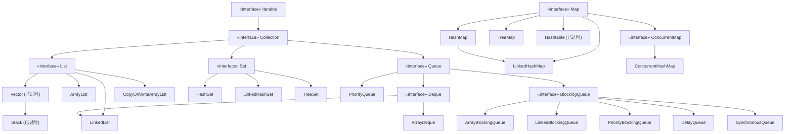

### Iterable / Iterator 迭代器模式

Java 集合框架使用**迭代器模式**统一遍历行为。`Iterable` 接口表示"可迭代"，`Iterator` 接口提供迭代协议。

```java
public interface Iterable<T> {
    Iterator<T> iterator();
    default void forEach(Consumer<? super T> action) {
        Objects.requireNonNull(action);
        for (T t : this) { action.accept(t); }
    }
    default Spliterator<T> spliterator() {
        return Spliterators.spliteratorUnknownSize(iterator(), 0);
    }
}

public interface Iterator<E> {
    boolean hasNext();
    E next();
    default void remove() { throw new UnsupportedOperationException(); }
    default void forEachRemaining(Consumer<? super E> action) {
        Objects.requireNonNull(action);
        while (hasNext()) action.accept(next());
    }
}
```

**迭代器模式** 的核心在于将遍历行为与集合实现解耦。`for-each` 语法糖本质上就是编译器对 `Iterator` 的调用。

**ListIterator** 支持双向遍历：

```java
List<String> list = new ArrayList<>(Arrays.asList("A", "B", "C"));
ListIterator<String> it = list.listIterator();
while (it.hasNext()) {
    System.out.println("[" + it.nextIndex() + "] " + it.next());
}
while (it.hasPrevious()) {
    System.out.println("[" + it.previousIndex() + "] " + it.previous());
}
```

---

## 2. List

### ArrayList 底层：动态数组

ArrayList 底层使用 `Object[]` 数组存储元素，默认初始容量为 **10**。

```java
public class ArrayList<E> extends AbstractList<E>
        implements List<E>, RandomAccess, Cloneable, java.io.Serializable {
    private static final int DEFAULT_CAPACITY = 10;
    private static final Object[] EMPTY_ELEMENTDATA = {};
    private static final Object[] DEFAULTCAPACITY_EMPTY_ELEMENTDATA = {};
    transient Object[] elementData;
    private int size;
}
```

#### 扩容机制（1.5 倍 grow 方法）

当添加元素超出数组容量时，ArrayList 自动扩容为新容量的 **1.5 倍**（`oldCapacity + (oldCapacity >> 1)`），并将原数组内容复制到新数组。

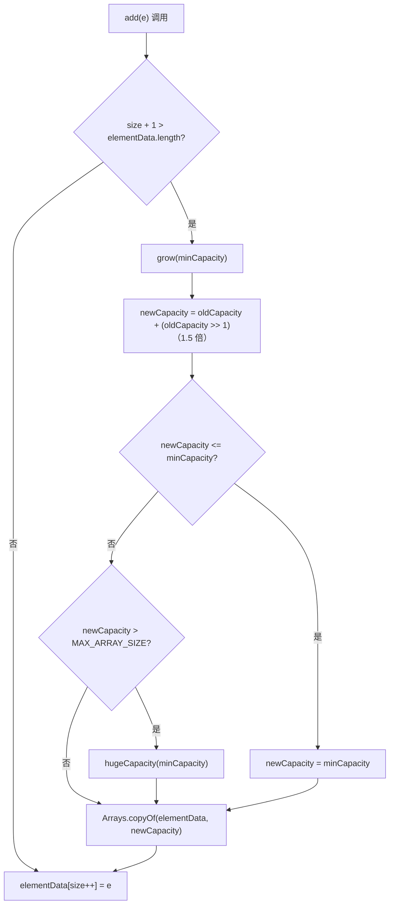

```java
private Object[] grow(int minCapacity) {
    int oldCapacity = elementData.length;
    int newCapacity = oldCapacity + (oldCapacity >> 1);
    if (newCapacity - minCapacity < 0) newCapacity = minCapacity;
    if (newCapacity - MAX_ARRAY_SIZE > 0) newCapacity = hugeCapacity(minCapacity);
    return elementData = Arrays.copyOf(elementData, newCapacity);
}

public static void main(String[] args) throws Exception {
    ArrayList<Integer> list = new ArrayList<>();
    Field field = ArrayList.class.getDeclaredField("elementData");
    field.setAccessible(true);
    for (int i = 0; i < 20; i++) {
        list.add(i);
        Object[] data = (Object[]) field.get(list);
        System.out.printf("size=%2d, capacity=%2d%n", list.size(), data.length);
    }
}
```

#### 插入 / 删除性能

插入和删除操作涉及**元素移动**，最坏情况为 O(n)。

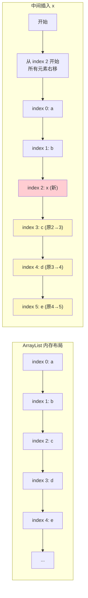

```java
public void add(int index, E element) {
    rangeCheckForAdd(index);
    ensureCapacityInternal(size + 1);
    System.arraycopy(elementData, index, elementData, index + 1, size - index);
    elementData[index] = element;
    size++;
}

public static void main(String[] args) {
    List<Integer> list = new ArrayList<>();
    long start = System.nanoTime();
    for (int i = 0; i < 100000; i++) {
        list.add(0, i);
    }
    long end = System.nanoTime();
    System.out.println("头插 10万次: " + (end - start) / 1_000_000 + " ms");
    list.clear();
    start = System.nanoTime();
    for (int i = 0; i < 100000; i++) {
        list.add(i);
    }
    end = System.nanoTime();
    System.out.println("尾插 10万次: " + (end - start) / 1_000_000 + " ms");
}
```

### LinkedList 底层：双向链表

LinkedList 基于**双向链表**实现，每个节点包含前驱指针、后继指针和数据。

```java
private static class Node<E> {
    E item;
    Node<E> next;
    Node<E> prev;
    Node(Node<E> prev, E element, Node<E> next) {
        this.item = element;
        this.next = next;
        this.prev = prev;
    }
}

public class LinkedList<E> extends AbstractSequentialList<E>
        implements List<E>, Deque<E>, Cloneable, java.io.Serializable {
    transient int size = 0;
    transient Node<E> first;
    transient Node<E> last;
}
```

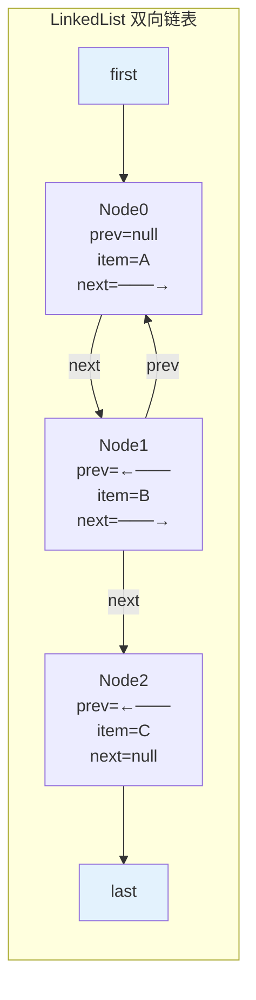
#### CRUD 性能分析

| 操作 | 时间复杂度 | 说明 |
|------|-----------|------|
| `addLast(e)` | O(1) | 直接操作 `last` 指针 |
| `addFirst(e)` | O(1) | 直接操作 `first` 指针 |
| `add(index, e)` | O(n) | 先遍历到 index，再插入 |
| `get(index)` | O(n) | 从头/尾双向遍历到目标位置 |
| `remove(index)` | O(n) | 遍历 + 断链 |
| `remove(Object)` | O(n) | 遍历查找 + 断链 |

```java
public E get(int index) {
    checkElementIndex(index);
    return node(index).item;
}

Node<E> node(int index) {
    if (index < (size >> 1)) {
        Node<E> x = first;
        for (int i = 0; i < index; i++)
            x = x.next;
        return x;
    } else {
        Node<E> x = last;
        for (int i = size - 1; i > index; i--)
            x = x.prev;
        return x;
    }
}
```

### ArrayList vs LinkedList 对比

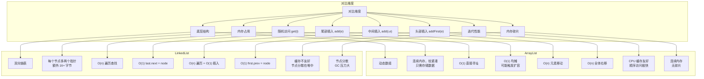

### Vector / Stack（已过时）

Vector 是 JDK1.0 的遗留类，方法使用 `synchronized` 保证线程安全，但性能差。Stack 继承 Vector。

```java
public Vector(int initialCapacity, int capacityIncrement) {
    // capacityIncrement > 0 时，扩容 = old + capacityIncrement
    // capacityIncrement <= 0 时，扩容 = old * 2（翻倍）
}

Stack<String> stack = new Stack<>();
stack.push("A");
stack.push("B");
String top = stack.pop();     // "B"
String peek = stack.peek();   // "A"

// 推荐替代：ArrayDeque
Deque<String> deque = new ArrayDeque<>();
deque.addLast("A");
deque.addLast("B");
String last = deque.removeLast(); // "B"
```

### CopyOnWriteArrayList：写时复制原理

CopyOnWriteArrayList 是线程安全的 List，适用于**读多写少**场景。核心思想：**每次修改操作都复制整个底层数组**。

```java
public class CopyOnWriteArrayList<E>
        implements List<E>, RandomAccess, Cloneable, java.io.Serializable {
    private transient volatile Object[] array;

    public E get(int index) {
        return get(getArray(), index);
    }

    public boolean add(E e) {
        final ReentrantLock lock = this.lock;
        lock.lock();
        try {
            Object[] elements = getArray();
            int len = elements.length;
            Object[] newElements = Arrays.copyOf(elements, len + 1);
            newElements[len] = e;
            setArray(newElements);
            return true;
        } finally {
            lock.unlock();
        }
    }
}
```

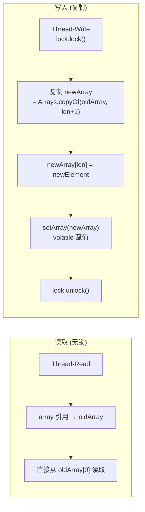

#### 适用场景

- **读多写少**：配置管理、白名单、事件监听器列表
- **不允许读阻塞**：读操作完全无锁
- **集合较小**：复制成本随 size 线性增长

---
## 3. Set

### HashSet（基于 HashMap）

HashSet 底层使用 **HashMap** 实现，元素作为 Map 的 key，value 统一为 `PRESENT` 常量。去重依赖 `hashCode()` 和 `equals()`。

```java
public class HashSet<E> extends AbstractSet<E>
        implements Set<E>, Cloneable, java.io.Serializable {
    private transient HashMap<E, Object> map;
    private static final Object PRESENT = new Object();

    public HashSet() { map = new HashMap<>(); }

    public boolean add(E e) { return map.put(e, PRESENT) == null; }

    public boolean contains(Object o) { return map.containsKey(o); }

    public boolean remove(Object o) { return map.remove(o) == PRESENT; }
}
```

#### 去重原理

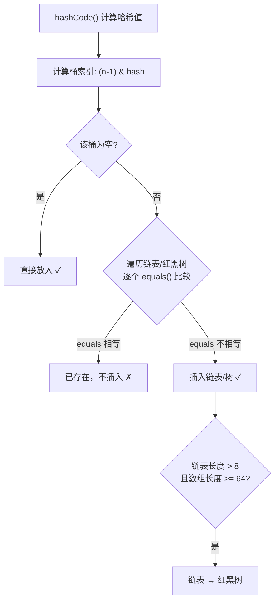

```java
public class HashSetDemo {
    public static void main(String[] args) {
        Set<Person> set = new HashSet<>();
        set.add(new Person("Alice", 25));
        set.add(new Person("Alice", 25));
        System.out.println("未重写: size = " + set.size()); // 2

        Set<Person2> set2 = new HashSet<>();
        set2.add(new Person2("Alice", 25));
        set2.add(new Person2("Alice", 25));
        System.out.println("已重写: size = " + set2.size()); // 1
    }
}

class Person { String name; int age;
    Person(String name, int age) { this.name = name; this.age = age; }
}
class Person2 {
    String name; int age;
    Person2(String name, int age) { this.name = name; this.age = age; }
    @Override public boolean equals(Object o) {
        if (this == o) return true;
        if (!(o instanceof Person2)) return false;
        Person2 p = (Person2) o;
        return age == p.age && Objects.equals(name, p.name);
    }
    @Override public int hashCode() { return Objects.hash(name, age); }
}
```

### LinkedHashSet

LinkedHashSet 继承 HashSet，内部使用 **LinkedHashMap** 存储，通过双向链表维护**插入顺序**。

```java
public class LinkedHashSet<E> extends HashSet<E>
        implements Set<E>, Cloneable, java.io.Serializable {
    public LinkedHashSet() { super(16, .75f, true); }
}
HashSet(int initialCapacity, float loadFactor, boolean dummy) {
    map = new LinkedHashMap<>(initialCapacity, loadFactor);
}
```

```java
public static void main(String[] args) {
    Set<String> hashSet = new HashSet<>();
    Set<String> linkedHashSet = new LinkedHashSet<>();
    List<String> items = Arrays.asList("C", "A", "B", "D", "E");
    hashSet.addAll(items);
    linkedHashSet.addAll(items);
    System.out.println("HashSet:      " + hashSet);      // 无序
    System.out.println("LinkedHashSet: " + linkedHashSet); // [C, A, B, D, E]
}
```

### TreeSet

TreeSet 底层使用 **TreeMap**（红黑树），元素按**自然顺序**或 **Comparator** 排序。

```java
public class TreeSet<E> extends AbstractSet<E>
        implements NavigableSet<E>, Cloneable, java.io.Serializable {
    private transient NavigableMap<E, Object> m;
    private static final Object PRESENT = new Object();
    public TreeSet() { this(new TreeMap<>()); }
    public TreeSet(Comparator<? super E> comparator) { this(new TreeMap<>(comparator)); }
    public boolean add(E e) { return m.put(e, PRESENT) == null; }
}
```

```java
public static void main(String[] args) {
    Set<String> treeSet = new TreeSet<>();
    treeSet.addAll(Arrays.asList("D", "B", "A", "C"));
    System.out.println("自然排序: " + treeSet); // [A, B, C, D]

    Set<String> byLength = new TreeSet<>(Comparator.comparingInt(String::length));
    byLength.addAll(Arrays.asList("BBB", "A", "CC", "DDDD"));
    System.out.println("按长度: " + byLength); // [A, CC, BBB, DDDD]
}
```
---

## 4. Queue / Deque

### PriorityQueue：二叉堆

PriorityQueue 基于**最小二叉堆**（数组实现），元素按优先级排序。默认最小堆，可通过 Comparator 改为最大堆。

```java
public class PriorityQueue<E> extends AbstractQueue<E>
        implements java.io.Serializable {
    transient Object[] queue;
    private final Comparator<? super E> comparator;

    public boolean offer(E e) {
        if (e == null) throw new NullPointerException();
        int i = size;
        if (i >= queue.length) grow(i + 1);
        siftUp(i, e);
        size = i + 1;
        return true;
    }

    public E poll() {
        if (size == 0) return null;
        int s = --size;
        E result = (E) queue[0];
        E x = (E) queue[s];
        queue[s] = null;
        if (s != 0) siftDown(0, x);
        return result;
    }
}
```

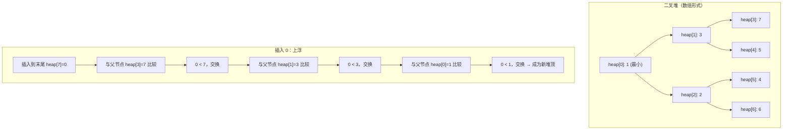

```java
// PriorityQueue 实现 TopK（保留最大 K 个元素）
public class TopKExample {
    public static List<Integer> topK(int[] nums, int k) {
        PriorityQueue<Integer> minHeap = new PriorityQueue<>(k);
        for (int num : nums) {
            if (minHeap.size() < k) {
                minHeap.offer(num);
            } else if (num > minHeap.peek()) {
                minHeap.poll();
                minHeap.offer(num);
            }
        }
        List<Integer> result = new ArrayList<>(minHeap);
        result.sort(Collections.reverseOrder());
        return result;
    }

    public static void main(String[] args) {
        int[] nums = {3, 2, 1, 5, 6, 4};
        System.out.println("TopK(3): " + topK(nums, 3)); // [6, 5, 4]
        int[] nums2 = {3, 2, 3, 1, 2, 4, 5, 5, 6};
        System.out.println("TopK(4): " + topK(nums2, 4)); // [6, 5, 5, 4]
    }
}
```

### ArrayDeque：循环数组双端队列

ArrayDeque 基于**循环数组**实现，既是 Deque 的高效实现，也是推荐替代 Stack 的选择。

```java
public class ArrayDeque<E> extends AbstractCollection<E>
        implements Deque<E>, Cloneable, java.io.Serializable {
    transient Object[] elements;
    transient int head;
    transient int tail;

    public void addFirst(E e) {
        elements[head = (head - 1) & (elements.length - 1)] = e;
        if (head == tail) doubleCapacity();
    }

    public void addLast(E e) {
        elements[tail] = e;
        tail = (tail + 1) & (elements.length - 1);
        if (tail == head) doubleCapacity();
    }
}
```

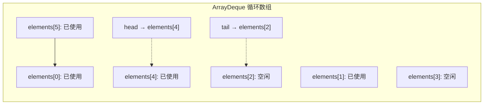
### BlockingQueue 体系

BlockingQueue 是线程安全的阻塞队列接口，支持在队列空/满时的等待/唤醒。

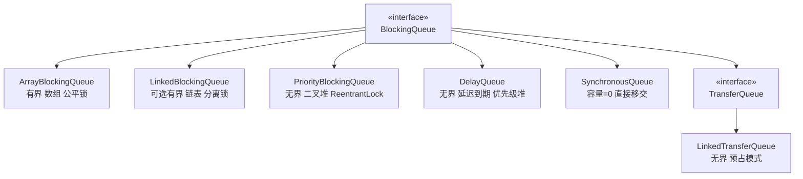

| 实现 | 特性 | 数据结构 | 锁策略 |
|------|------|----------|--------|
| ArrayBlockingQueue | 有界、公平可配 | 循环数组 | 单锁（put/take 同一锁） |
| LinkedBlockingQueue | 可选有界（默认 Integer.MAX_VALUE） | 单向链表 | 双锁（putLock/takeLock） |
| PriorityBlockingQueue | 无界 | 二叉堆 | ReentrantLock + Condition |
| DelayQueue | 延迟到期元素 | PriorityQueue + 可重入锁 | 延迟条件等待 |
| SynchronousQueue | 容量为 0，直接传递 | 传送者-接收者配对 | CAS/自旋 |
| LinkedTransferQueue | 无界、预占模式 | 链表 + CAS | 无锁（CAS） |

```java
public class BlockingQueueDemo {
    private static final int CAPACITY = 5;
    private static BlockingQueue<Integer> queue = new ArrayBlockingQueue<>(CAPACITY);

    public static void main(String[] args) {
        Thread producer = new Thread(() -> {
            try {
                for (int i = 0; i < 20; i++) {
                    queue.put(i);
                    System.out.println("生产: " + i + " (队列: " + queue.size() + ")");
                    Thread.sleep(200);
                }
            } catch (InterruptedException e) { Thread.currentThread().interrupt(); }
        });

        Thread consumer = new Thread(() -> {
            try {
                for (int i = 0; i < 20; i++) {
                    Integer val = queue.take();
                    System.out.println("消费: " + val + " (队列: " + queue.size() + ")");
                    Thread.sleep(500);
                }
            } catch (InterruptedException e) { Thread.currentThread().interrupt(); }
        });

        producer.start();
        consumer.start();
    }
}
```
---

## 5. Map

### HashMap 核心：数组 + 链表 + 红黑树

HashMap 底层为 `Node<K,V>[]` 数组（table），每个槽位是链表或红黑树（JDK 8+）。

```java
public class HashMap<K,V> extends AbstractMap<K,V>
        implements Map<K,V>, Cloneable, Serializable {
    static final int DEFAULT_INITIAL_CAPACITY = 1 << 4;
    static final int MAXIMUM_CAPACITY = 1 << 30;
    static final float DEFAULT_LOAD_FACTOR = 0.75f;
    static final int TREEIFY_THRESHOLD = 8;
    static final int UNTREEIFY_THRESHOLD = 6;
    static final int MIN_TREEIFY_CAPACITY = 64;
    transient Node<K,V>[] table;
    transient int size;
    int threshold;
    final float loadFactor;

    static class Node<K,V> implements Map.Entry<K,V> {
        final int hash;
        final K key;
        V value;
        Node<K,V> next;
    }

    static final class TreeNode<K,V> extends LinkedHashMap.Entry<K,V> {
        TreeNode<K,V> parent;
        TreeNode<K,V> left;
        TreeNode<K,V> right;
        TreeNode<K,V> prev;
        boolean red;
    }
}
```

#### HashMap put 过程完整流程图

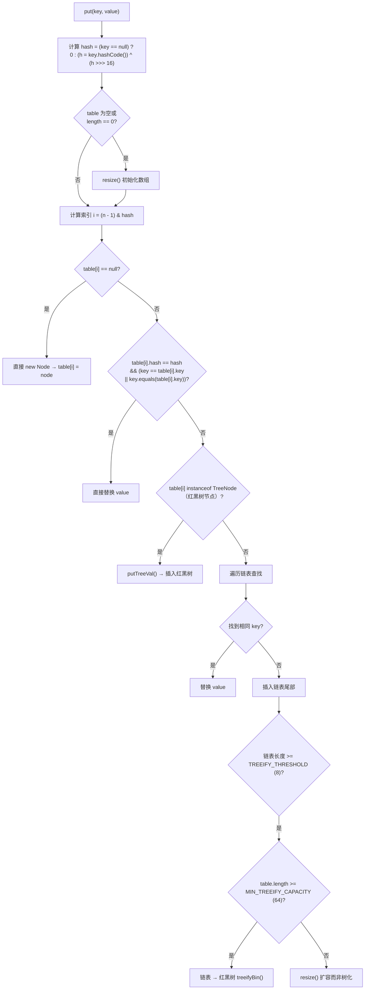

#### HashMap get 过程流程图

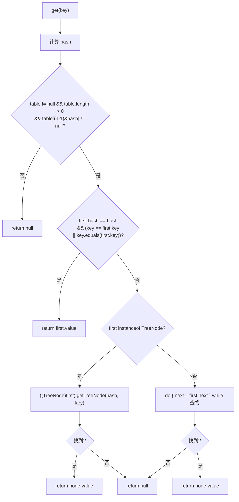
```java
public class HashMapPutSimulation {
    public static void main(String[] args) {
        Map<String, Integer> map = new HashMap<>(4);
        map.put("A", 1); map.put("B", 2); map.put("C", 3);
        map.put("D", 4); map.put("E", 5); map.put("F", 6);
        map.put("G", 7); map.put("H", 8); map.put("I", 9);

        // 哈希碰撞演示
        String k1 = "Aa";
        String k2 = "BB";
        map.put(k1, 100);
        map.put(k2, 200);

        System.out.println("Aa hashCode: " + "Aa".hashCode()); // 2112
        System.out.println("BB hashCode: " + "BB".hashCode()); // 2112
        System.out.println("map size: " + map.size());
    }
}
```

### HashMap 扩容机制详解

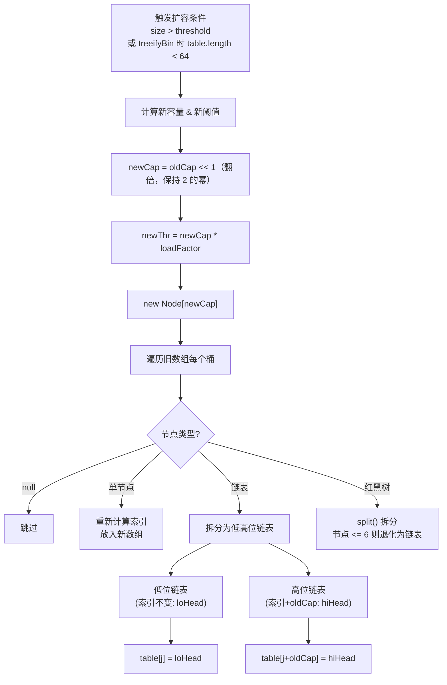

```java
final Node<K,V>[] resize() {
    Node<K,V>[] oldTab = table;
    int oldCap = (oldTab == null) ? 0 : oldTab.length;
    int oldThr = threshold;
    int newCap, newThr = 0;

    if (oldCap > 0) {
        if (oldCap >= MAXIMUM_CAPACITY) {
            threshold = Integer.MAX_VALUE;
            return oldTab;
        } else if ((newCap = oldCap << 1) <= MAXIMUM_CAPACITY &&
                 oldCap >= DEFAULT_INITIAL_CAPACITY)
            newThr = oldThr << 1;
    }

    threshold = newThr;
    Node<K,V>[] newTab = (Node<K,V>[]) new Node[newCap];
    table = newTab;

    if (oldTab != null) {
        for (int j = 0; j < oldCap; ++j) {
            Node<K,V> e;
            if ((e = oldTab[j]) != null) {
                oldTab[j] = null;
                if (e.next == null) {
                    newTab[e.hash & (newCap - 1)] = e;
                } else if (e instanceof TreeNode) {
                    ((TreeNode<K,V>)e).split(this, newTab, j, oldCap);
                } else {
                    Node<K,V> loHead = null, loTail = null;
                    Node<K,V> hiHead = null, hiTail = null;
                    do {
                        Node<K,V> next = e.next;
                        if ((e.hash & oldCap) == 0) {
                            if (loTail == null) loHead = e;
                            else loTail.next = e;
                            loTail = e;
                        } else {
                            if (hiTail == null) hiHead = e;
                            else hiTail.next = e;
                            hiTail = e;
                        }
                        e = next;
                    } while (e != null);
                    if (loTail != null) { loTail.next = null; newTab[j] = loHead; }
                    if (hiTail != null) { hiTail.next = null; newTab[j + oldCap] = hiHead; }
                }
            }
        }
    }
    return newTab;
}
```

#### 关键参数总结

| 参数 | 值 | 说明 |
|------|-----|------|
| 初始容量 | 16 | 懒加载，首次 put 时初始化 |
| 最大容量 | 2^30 | - |
| 负载因子 | 0.75 | 时间与空间的折中 |
| 树化阈值 | 8 | 链表长度 >= 8 且数组 >= 64 时树化 |
| 非树化阈值 | 6 | 红黑树节点 <= 6 时退化为链表 |
| 最小树化容量 | 64 | 数组长度 < 64 时扩容而非树化 |
### HashMap 线程不安全表现

```java
public class HashMapDeadLoop {
    public static void main(String[] args) throws Exception {
        final Map<Integer, Integer> map = new HashMap<>();
        final int THREADS = 10;
        final int COUNT = 10000;

        CountDownLatch latch = new CountDownLatch(THREADS);
        for (int t = 0; t < THREADS; t++) {
            final int threadId = t;
            new Thread(() -> {
                for (int i = 0; i < COUNT; i++) {
                    map.put(threadId * COUNT + i, i);
                }
                latch.countDown();
            }).start();
        }
        latch.await();

        System.out.println("预期 size: " + (THREADS * COUNT));
        System.out.println("实际 size: " + map.size());
    }
}
```

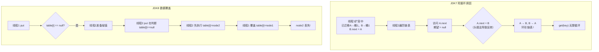

### ConcurrentHashMap

#### JDK7 vs JDK8 架构对比

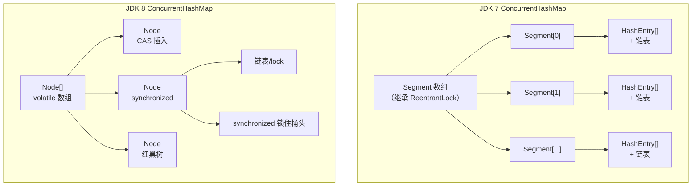

| 对比维度 | JDK 7 | JDK 8 |
|---------|-------|-------|
| 并发粒度 | Segment（默认 16 个） | 每个桶（table[i]） |
| 锁机制 | ReentrantLock（Segment 继承） | CAS + synchronized |
| 数据结构 | Segment + HashEntry + 链表 | Node + 链表 + 红黑树 |
| 并发度 | 默认 16 | 随 table 长度动态变化 |
| 查询性能 | 两次 hash | 一次 hash |
| 空间开销 | 额外 Segment 对象 | 无额外结构 |

#### 多线程安全写入演示

```java
public class ConcurrentHashMapDemo {
    public static void main(String[] args) throws Exception {
        final Map<String, Integer> chm = new ConcurrentHashMap<>();
        final Map<String, Integer> hm = new HashMap<>();
        final int THREADS = 10;
        final int COUNT = 10000;

        // ConcurrentHashMap 测试
        CountDownLatch latch = new CountDownLatch(THREADS);
        for (int t = 0; t < THREADS; t++) {
            final int threadId = t;
            new Thread(() -> {
                for (int i = 0; i < COUNT; i++)
                    chm.put("key-" + threadId + "-" + i, i);
                latch.countDown();
            }).start();
        }
        latch.await();
        System.out.println("CHM 正确 size: " + chm.size()); // 100000

        // HashMap 对比
        CountDownLatch latch2 = new CountDownLatch(THREADS);
        for (int t = 0; t < THREADS; t++) {
            final int threadId = t;
            new Thread(() -> {
                for (int i = 0; i < COUNT; i++)
                    hm.put("key-" + threadId + "-" + i, i);
                latch2.countDown();
            }).start();
        }
        latch2.await();
        System.out.println("HM 可能丢失: " + hm.size());
    }
}
```
#### ConcurrentHashMap 核心源码（JDK 8）

```java
final V putVal(K key, V value, boolean onlyIfAbsent) {
    if (key == null || value == null) throw new NullPointerException();
    int hash = spread(key.hashCode());

    for (Node<K,V>[] tab = table;;) {
        Node<K,V> f; int n, i, fh;

        if (tab == null || (n = tab.length) == 0)
            tab = initTable();
        else if ((f = tabAt(tab, i = (n - 1) & hash)) == null) {
            if (casTabAt(tab, i, null, new Node<>(hash, key, value, null)))
                break;
        }
        else if ((fh = f.hash) == MOVED)
            tab = helpTransfer(tab, f);
        else {
            V oldVal = null;
            synchronized (f) {
                if (tabAt(tab, i) == f) {
                    if (fh >= 0) {
                        for (Node<K,V> e = f; e != null; e = e.next) {
                            if (e.hash == hash && ((ek = e.key) == key
                                || (ek != null && key.equals(ek)))) {
                                oldVal = e.val;
                                if (!onlyIfAbsent) e.val = value;
                                break;
                            }
                        }
                        Node<K,V> pred = e;
                        if ((e = e.next) == null) {
                            pred.next = new Node<>(hash, key, value, null);
                            break;
                        }
                    } else if (f instanceof TreeBin) { }
                }
            }
        }
    }
    addCount(1L, binCount);
    return null;
}

public V get(Object key) {
    Node<K,V>[] tab; Node<K,V> e, p; int n, eh; K ek;
    int h = spread(key.hashCode());
    if ((tab = table) != null && (n = tab.length) > 0 &&
        (e = tabAt(tab, (n - 1) & h)) != null) {
        if ((eh = e.hash) == h) {
            if ((ek = e.key) == key || (ek != null && key.equals(ek)))
                return e.val;
        } else if (eh < 0)
            return (p = e.find(h, key)) != null ? p.val : null;
        while ((e = e.next) != null) {
            if (e.hash == h && ((ek = e.key) == key || (ek != null && key.equals(ek))))
                return e.val;
        }
    }
    return null;
}
```

#### ConcurrentHashMap 扩容（多线程协助 transfer）

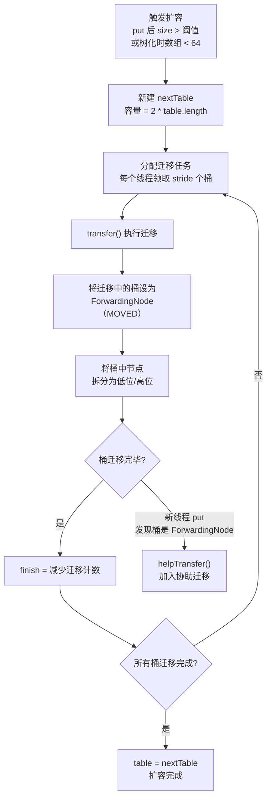
### LinkedHashMap：accessOrder / LRU 缓存

LinkedHashMap 在 HashMap 基础上增加了**双向链表**维护顺序，支持插入顺序和访问顺序两种模式。

```java
public class LinkedHashMap<K,V> extends HashMap<K,V> {
    transient LinkedHashMap.Entry<K,V> head;
    transient LinkedHashMap.Entry<K,V> tail;
    final boolean accessOrder;

    static class Entry<K,V> extends HashMap.Node<K,V> {
        Entry<K,V> before, after;
    }

    public LinkedHashMap(int initialCapacity, float loadFactor, boolean accessOrder) {
        super(initialCapacity, loadFactor);
        this.accessOrder = accessOrder;
    }

    void afterNodeAccess(Node<K,V> e) { }
    void afterNodeInsertion(boolean evict) {
        LinkedHashMap.Entry<K,V> first;
        if (evict && (first = head) != null && removeEldestEntry(first)) {
            K key = first.key;
            removeNode(hash(key), key, null, false, true);
        }
    }
    protected boolean removeEldestEntry(Map.Entry<K,V> eldest) { return false; }
}
```

#### 自定义 LRU 缓存

```java
class LRUCache<K, V> extends LinkedHashMap<K, V> {
    private final int maxCapacity;

    public LRUCache(int maxCapacity) {
        super(16, 0.75f, true);
        this.maxCapacity = maxCapacity;
    }

    @Override
    protected boolean removeEldestEntry(Map.Entry<K, V> eldest) {
        return size() > maxCapacity;
    }
}

public class LRUCacheDemo {
    public static void main(String[] args) {
        LRUCache<Integer, String> cache = new LRUCache<>(3);
        cache.put(1, "A"); cache.put(2, "B"); cache.put(3, "C");
        System.out.println("初始: " + cache);

        cache.get(1);
        System.out.println("访问 1: " + cache); // 1 移到尾部

        cache.put(4, "D");
        System.out.println("插入 4: " + cache); // 2 被淘汰

        cache.get(3);
        System.out.println("访问 3: " + cache);

        cache.put(5, "E");
        System.out.println("插入 5: " + cache);
    }
}
```

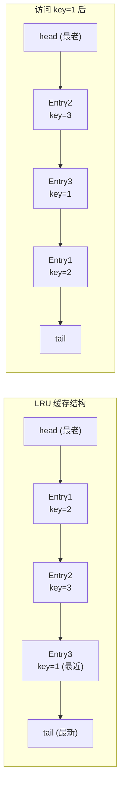
### TreeMap：红黑树

TreeMap 基于**红黑树**实现，保证 key 的排序顺序。

```java
public class TreeMap<K,V> extends AbstractMap<K,V>
        implements NavigableMap<K,V>, Cloneable, java.io.Serializable {
    private final Comparator<? super K> comparator;
    private transient Entry<K,V> root;
    private transient int size = 0;

    static final class Entry<K,V> implements Map.Entry<K,V> {
        K key; V value; Entry<K,V> left;
        Entry<K,V> right; Entry<K,V> parent;
        boolean color = BLACK;
        Entry(K key, V value, Entry<K,V> parent) {
            this.key = key; this.value = value; this.parent = parent;
        }
    }

    public V put(K key, V value) {
        Entry<K,V> t = root;
        if (t == null) {
            root = new Entry<>(key, value, null);
            size = 1; return null;
        }
        int cmp; Entry<K,V> parent;
        Comparator<? super K> cpr = comparator;
        if (cpr != null) {
            do {
                parent = t;
                cmp = cpr.compare(key, t.key);
                if (cmp < 0) t = t.left;
                else if (cmp > 0) t = t.right;
                else return t.setValue(value);
            } while (t != null);
        }
        Entry<K,V> e = new Entry<>(key, value, parent);
        if (cmp < 0) parent.left = e;
        else parent.right = e;
        fixAfterInsertion(e);
        size++;
        return null;
    }
}
```

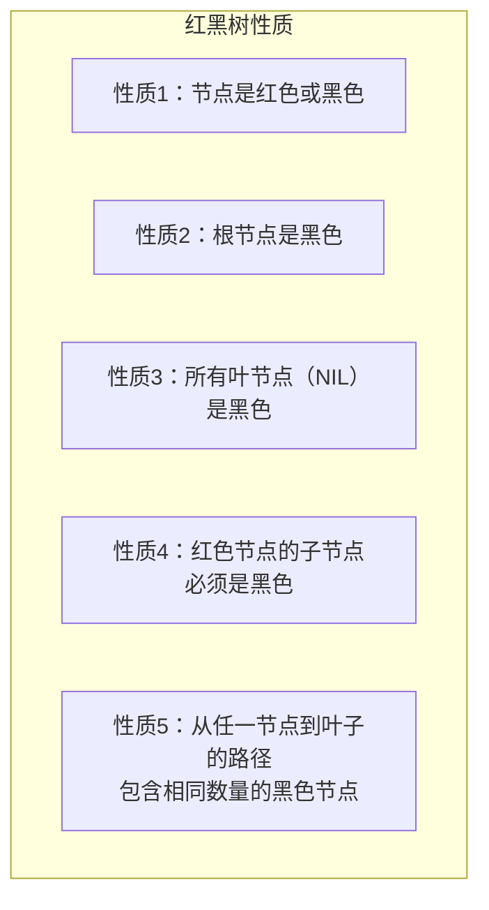

### WeakHashMap / IdentityHashMap / EnumMap

```java
// WeakHashMap：弱引用 key，GC 时自动回收
public class WeakHashMapDemo {
    public static void main(String[] args) throws Exception {
        WeakHashMap<Object, String> map = new WeakHashMap<>();
        Object key1 = new Object();
        Object key2 = new Object();
        map.put(key1, "value1");
        map.put(key2, "value2");
        System.out.println("GC 前 size: " + map.size()); // 2

        key2 = null;
        System.gc();
        Thread.sleep(1000);
        System.out.println("GC 后 size: " + map.size()); // 1
    }
}

// IdentityHashMap：引用相等（==）而非 equals 相等
public class IdentityHashMapDemo {
    public static void main(String[] args) {
        IdentityHashMap<String, Integer> map = new IdentityHashMap<>();
        String s1 = new String("hello");
        String s2 = new String("hello");
        map.put(s1, 1); map.put(s2, 2);
        System.out.println("IdentityHashMap size: " + map.size()); // 2

        HashMap<String, Integer> hm = new HashMap<>();
        hm.put(s1, 1); hm.put(s2, 2);
        System.out.println("HashMap size: " + hm.size()); // 1
    }
}

// EnumMap：key 为枚举类型，内部使用数组，性能极佳
public class EnumMapDemo {
    enum Day { MONDAY, TUESDAY, WEDNESDAY, THURSDAY, FRIDAY, SATURDAY, SUNDAY }
    public static void main(String[] args) {
        EnumMap<Day, String> map = new EnumMap<>(Day.class);
        map.put(Day.MONDAY, "工作日开始");
        map.put(Day.FRIDAY, "工作日结束");
        map.put(Day.SATURDAY, "周末");
        map.put(Day.SUNDAY, "周末");
        for (Day d : Day.values()) {
            System.out.println(d + ": " + map.getOrDefault(d, "?"));
        }
    }
}
```
---

## 6. Collections / Arrays 工具类

### Collections 工具类

```java
public class CollectionsDemo {
    public static void main(String[] args) {
        List<Integer> list = new ArrayList<>(Arrays.asList(3, 1, 4, 1, 5, 9));

        Collections.sort(list);
        System.out.println("排序: " + list);

        Collections.sort(list, Collections.reverseOrder());
        System.out.println("降序: " + list);

        Collections.sort(list);
        int idx = Collections.binarySearch(list, 4);
        System.out.println("4 的位置: " + idx);

        // 不可变包装
        List<String> mutable = new ArrayList<>(Arrays.asList("A", "B", "C"));
        List<String> immutable = Collections.unmodifiableList(mutable);

        // 同步包装（迭代时仍需外部同步）
        List<String> syncList = Collections.synchronizedList(new ArrayList<>());
        synchronized (syncList) {
            for (String s : syncList) { System.out.println(s); }
        }

        List<Integer> nums = new ArrayList<>(Arrays.asList(1, 2, 3, 4, 5));
        Collections.reverse(nums);       // 反转
        Collections.shuffle(nums);       // 随机打乱
        Collections.rotate(nums, 2);     // 循环右移
        Collections.swap(nums, 0, 1);    // 交换
        Collections.fill(nums, 0);       // 全部填 0
    }
}
```

### Arrays.asList 陷阱

```java
public class ArraysAsListTrap {
    public static void main(String[] args) {
        // 陷阱1：固定大小列表
        List<String> list = Arrays.asList("A", "B", "C");
        list.set(0, "Z"); // 可修改
        // list.add("D"); // 不可增删

        // 陷阱2：基本类型数组被当作单个元素
        int[] arr = {1, 2, 3};
        List<int[]> list2 = Arrays.asList(arr);
        System.out.println("基本类型陷阱: size=" + list2.size()); // 1

        Integer[] arr2 = {1, 2, 3};
        List<Integer> list3 = Arrays.asList(arr2);
        System.out.println("包装类型: size=" + list3.size()); // 3

        // 陷阱3：引用传递
        String[] strings = {"A", "B", "C"};
        List<String> list4 = Arrays.asList(strings);
        strings[0] = "X";
        System.out.println("list4[0]: " + list4.get(0)); // "X"

        // 正确做法
        List<String> safe = new ArrayList<>(Arrays.asList("A", "B", "C"));
        safe.add("D"); // 正常
    }
}
```
### 快速失败（fail-fast） vs 安全失败（fail-safe）

```java
// fail-fast：检测到并发修改立即抛出 ConcurrentModificationException
public class FailFastDemo {
    public static void main(String[] args) {
        List<String> list = new ArrayList<>(Arrays.asList("A", "B", "C", "D"));

        try {
            for (String s : list) {
                System.out.println(s);
                if (s.equals("B")) {
                    list.remove(s); // 触发 ConcurrentModificationException
                }
            }
        } catch (ConcurrentModificationException e) {
            System.out.println("触发 fail-fast!");
        }

        // 正确移除：使用 Iterator.remove()
        Iterator<String> it = list.iterator();
        while (it.hasNext()) {
            String s = it.next();
            if (s.equals("C")) {
                it.remove();
            }
        }
        System.out.println("移除后: " + list);
    }
}

// fail-safe：遍历的是快照，不抛异常
public class FailSafeDemo {
    public static void main(String[] args) {
        List<String> list = new CopyOnWriteArrayList<>(Arrays.asList("A", "B", "C", "D"));

        for (String s : list) {
            System.out.println(s);
            if (s.equals("B")) {
                list.remove(s);
                list.add("E");
            }
        }
        System.out.println("最终: " + list);

        Map<String, Integer> map = new ConcurrentHashMap<>();
        map.put("A", 1); map.put("B", 2); map.put("C", 3);
        for (String key : map.keySet()) {
            System.out.println(key);
            map.put("D", 4);
            map.remove("B");
        }
    }
}
```

#### fail-fast vs fail-safe 对比

| 对比维度 | fail-fast | fail-safe |
|---------|-----------|-----------|
| 检测机制 | 通过 modCount 检测 | 遍历快照（副本） |
| 抛出异常 | ConcurrentModificationException | 不抛异常 |
| 代表集合 | ArrayList, HashMap, HashSet 等 | CopyOnWriteArrayList, ConcurrentHashMap |
| 遍历一致性 | 强一致 | 弱一致（可能看不到最新修改） |
| 性能开销 | 低 | 高（复制开销） |
| 适用场景 | 单线程或同步控制下 | 高并发读多写少 |

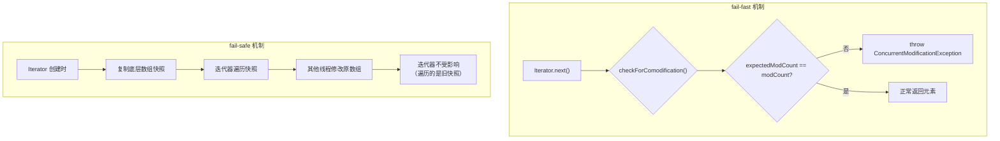
---

> **总结：Java 集合框架的核心设计思想**
>
> 1. **接口与实现分离**：Collection、List、Set、Map 等接口定义契约，具体实现自由选择
> 2. **算法与数据结构分离**：Collections、Arrays 工具类提供的算法操作任何实现了接口的集合
> 3. **性能可预期**：每个实现都有明确的时间/空间复杂度说明
> 4. **线程安全分层次**：从无锁（非安全）→ 乐观锁（CAS）→ 悲观锁（synchronized）→ 写时复制（CopyOnWrite），按需选择
> 5. **Java 8+ 持续演进**：红黑树优化哈希冲突、Lambda/Stream 增强函数式操作
