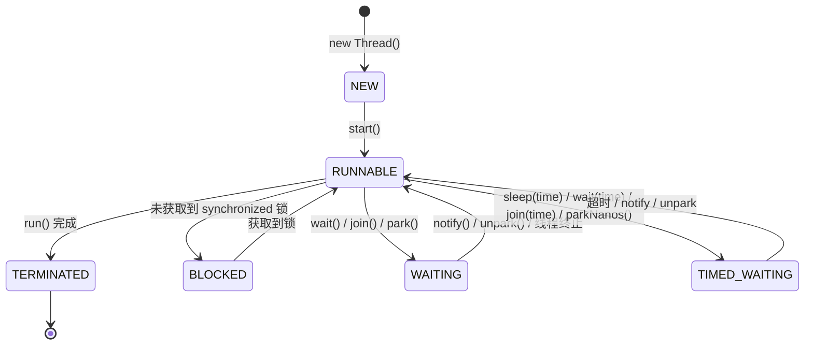
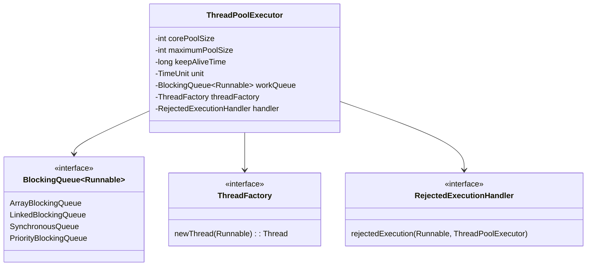
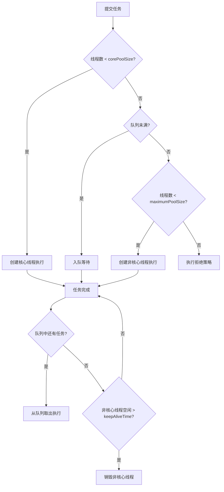
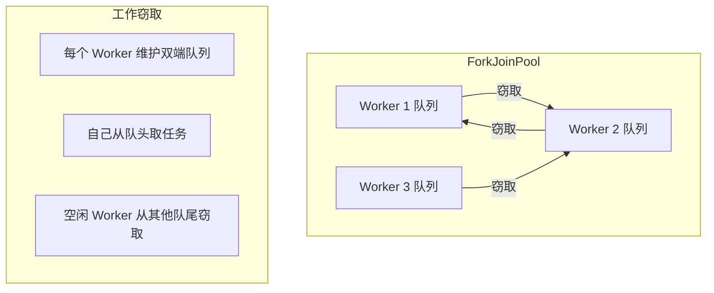
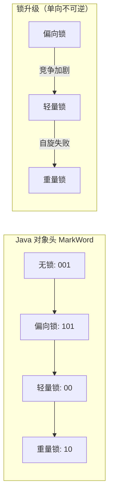
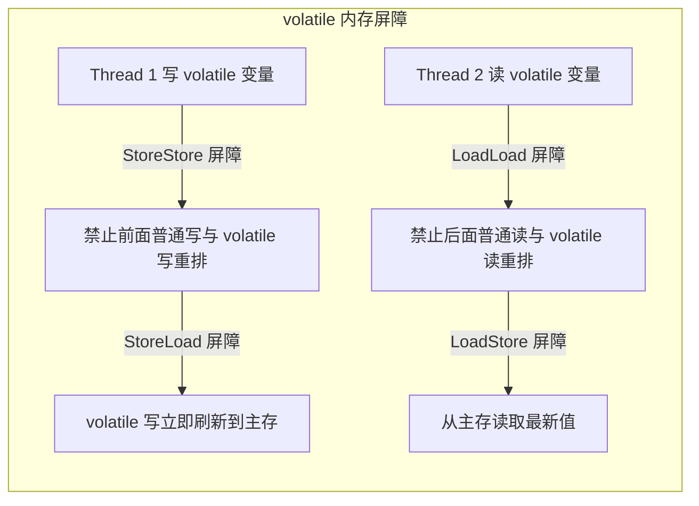
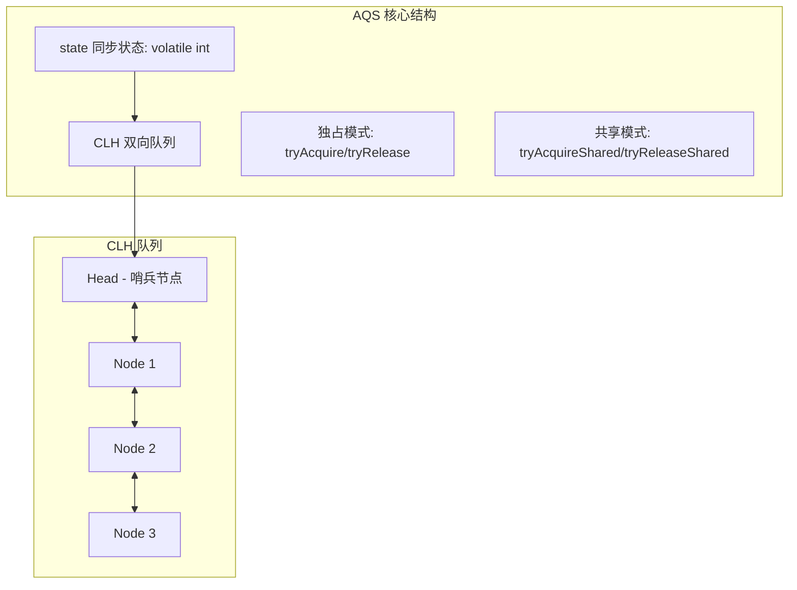
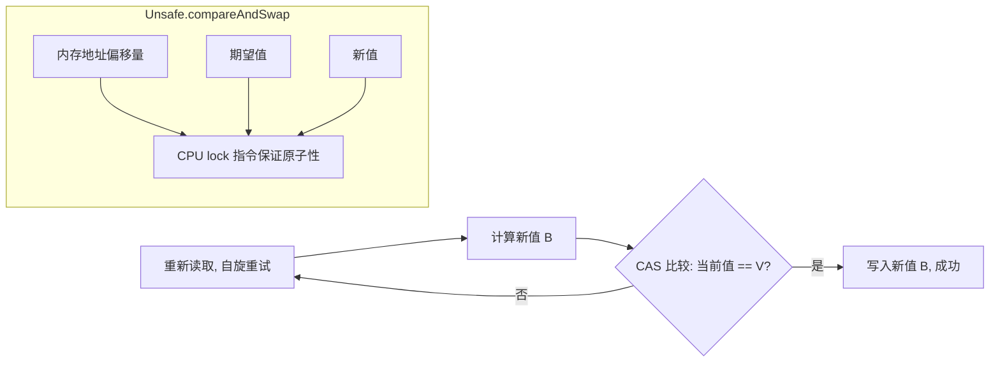
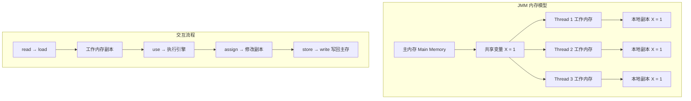
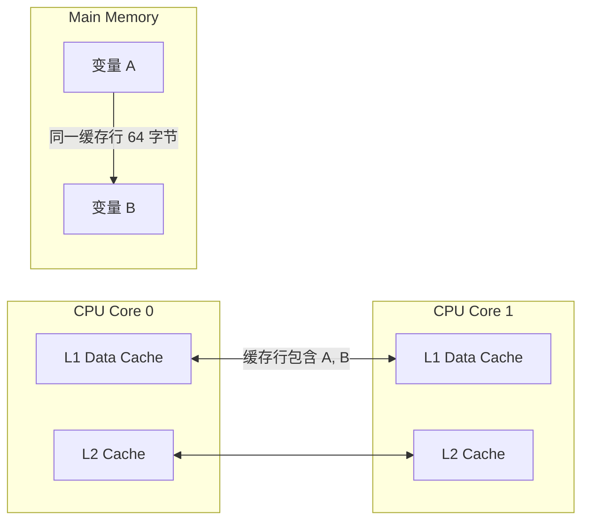

# Java 并发编程（JUC）全面详解

---

## 目录

1. [线程基础](#1-线程基础)
2. [线程池](#2-线程池)
3. [锁机制](#3-锁机制)
4. [同步工具类](#4-同步工具类)
5. [CAS 与原子类](#5-cas-与原子类)
6. [ThreadLocal](#6-threadlocal)
7. [JMM（Java 内存模型）](#7-jmmjava-内存模型)
8. [伪共享（False Sharing）](#8-伪共享false-sharing)

---

## 1. 线程基础

### 1.1 线程创建方式

Java 提供四种创建线程的方式：

- **Thread**：继承 Thread 类，重写 run()
- **Runnable**：实现 Runnable 接口，作为任务传入 Thread
- **Callable + FutureTask**：带返回值，可抛异常
- **FutureTask**：包装 Callable，获取异步结果

```java
// 1. 继承 Thread
class MyThread extends Thread {
    @Override
    public void run() {
        System.out.println("Thread: " + Thread.currentThread().getName());
    }
}

// 2. 实现 Runnable
class MyRunnable implements Runnable {
    @Override
    public void run() {
        System.out.println("Runnable: " + Thread.currentThread().getName());
    }
}

// 3. Callable + FutureTask
class MyCallable implements Callable<String> {
    @Override
    public String call() throws Exception {
        return "Callable result from " + Thread.currentThread().getName();
    }
}

public class ThreadDemo {
    public static void main(String[] args) throws Exception {
        // Thread
        new MyThread().start();

        // Runnable
        new Thread(new MyRunnable()).start();

        // Callable
        FutureTask<String> futureTask = new FutureTask<>(new MyCallable());
        new Thread(futureTask).start();
        System.out.println(futureTask.get()); // 阻塞获取结果

        // Lambda 简化
        new Thread(() -> System.out.println("Lambda")).start();
        FutureTask<Integer> ft = new FutureTask<>(() -> 42);
        new Thread(ft).start();
        System.out.println(ft.get());
    }
}
```

### 1.2 线程状态与流转

Java 线程有 6 种状态，定义在 `Thread.State` 枚举中：

| 状态 | 说明 |
|------|------|
| NEW | 新建，尚未调用 start() |
| RUNNABLE | 就绪/运行，可能在等待 CPU 时间片 |
| BLOCKED | 阻塞等待监视器锁（synchronized） |
| WAITING | 等待被显式唤醒（wait/join/park） |
| TIMED_WAITING | 超时等待（sleep/wait(time)/join(time)/parkNanos） |
| TERMINATED | 已终止，run() 执行完毕 |



### 1.3 线程通信

#### wait / notify / notifyAll

必须在 `synchronized` 同步块内使用，操作的是对象的监视器（Monitor）。

```java
class MessageQueue {
    private final LinkedList<String> queue = new LinkedList<>();
    private final int capacity;

    public MessageQueue(int capacity) { this.capacity = capacity; }

    public synchronized void put(String msg) throws InterruptedException {
        while (queue.size() == capacity) {
            wait(); // 队列满，等待消费者消费
        }
        queue.addLast(msg);
        notifyAll(); // 唤醒消费者
    }

    public synchronized String take() throws InterruptedException {
        while (queue.isEmpty()) {
            wait(); // 队列空，等待生产者生产
        }
        String msg = queue.removeFirst();
        notifyAll(); // 唤醒生产者
        return msg;
    }
}
```

#### LockSupport.park / unpark

基于线程的许可证（permit），不需要同步块，语义更清晰。

```java
public class LockSupportDemo {
    public static void main(String[] args) throws InterruptedException {
        Thread t = new Thread(() -> {
            System.out.println("线程启动，准备 park...");
            LockSupport.park(); // 等待许可证
            System.out.println("线程被 unpark 唤醒");
        });
        t.start();

        Thread.sleep(1000);
        System.out.println("主线程发放许可证");
        LockSupport.unpark(t); // 给线程 t 发放许可证
    }
}
```

### 1.4 sleep vs wait / yield vs join

| 对比 | sleep | wait |
|------|-------|------|
| 所属类 | Thread 静态方法 | Object 成员方法 |
| 是否释放锁 | **不释放** | **释放** |
| 必须同步块 | 否 | 是 |
| 唤醒方式 | 超时自动唤醒 | notify/notifyAll + 超时 |

| 对比 | yield | join |
|------|-------|------|
| 作用 | 提示调度器让出 CPU（仍可被调度） | 等待目标线程终止 |
| 释放锁 | 不释放 | 不释放（底层 wait(0) 但释放的是 this 的锁） |
| 实际价值 | 依赖调度器，很少使用 | 常用于线程间协作等待 |

```java
public class SleepWaitDemo {
    private static final Object lock = new Object();

    public static void main(String[] args) throws InterruptedException {
        // sleep 不释放锁
        Thread t1 = new Thread(() -> {
            synchronized (lock) {
                System.out.println("t1 获取锁，sleep 2s");
                try { Thread.sleep(2000); } catch (InterruptedException e) { }
                System.out.println("t1 释放锁");
            }
        });

        // wait 释放锁
        Thread t2 = new Thread(() -> {
            synchronized (lock) {
                System.out.println("t2 获取锁，wait 2s");
                try { lock.wait(2000); } catch (InterruptedException e) { }
                System.out.println("t2 重新获取锁");
            }
        });

        t1.start();
        t2.start();

        // join 示例
        Thread worker = new Thread(() -> {
            try { Thread.sleep(2000); } catch (InterruptedException e) { }
            System.out.println("worker 完成");
        });
        worker.start();
        worker.join(); // 主线程等待 worker 完成
        System.out.println("主线程继续");
    }
}
```

### 1.5 线程中断机制

Java 中断是**协作式**的，通过中断标志位通知线程停止工作。

```java
public class InterruptDemo {
    public static void main(String[] args) throws InterruptedException {
        Thread t = new Thread(() -> {
            while (!Thread.currentThread().isInterrupted()) {
                // 执行任务...
                System.out.println("运行中...");
                try {
                    Thread.sleep(500); // 会响应中断：抛出 InterruptedException
                } catch (InterruptedException e) {
                    // 异常清除中断标志，需要重新设置
                    System.out.println("sleep 中被中断");
                    Thread.currentThread().interrupt(); // 重新设置中断标志
                }
            }
            System.out.println("线程退出");
        });
        t.start();
        Thread.sleep(1200);
        t.interrupt(); // 设置中断标志
    }
}
```

关键方法：

| 方法 | 作用 |
|------|------|
| `thread.interrupt()` | 设置中断标志位 |
| `thread.isInterrupted()` | 检查中断标志（不清除） |
| `Thread.interrupted()` | 检查并清除中断标志（静态方法） |
| `InterruptedException` | 阻塞方法检测到中断时抛出，并清除标志位 |

### 1.6 守护线程 Daemon

守护线程在所有用户线程结束后自动退出，JVM 不会等待守护线程结束。

```java
public class DaemonDemo {
    public static void main(String[] args) {
        Thread daemon = new Thread(() -> {
            while (true) {
                System.out.println("守护线程运行中...");
                try { Thread.sleep(500); } catch (InterruptedException e) { }
            }
        });
        daemon.setDaemon(true); // 必须在 start() 之前设置
        daemon.start();

        Thread user = new Thread(() -> {
            try { Thread.sleep(2000); } catch (InterruptedException e) { }
            System.out.println("用户线程结束");
        });
        user.start();

        System.out.println("主线程结束，JVM 将退出（守护线程自动终止）");
    }
}
```

**注意**：守护线程不应执行 IO 或资源释放操作，因为 JVM 随时可能退出。

---

## 2. 线程池

### 2.1 ThreadPoolExecutor 七大核心参数



| 参数 | 说明 |
|------|------|
| `corePoolSize` | 核心线程数（常驻存活） |
| `maximumPoolSize` | 最大线程数 |
| `keepAliveTime` | 非核心线程空闲存活时间 |
| `unit` | 存活时间单位 |
| `workQueue` | 任务阻塞队列 |
| `threadFactory` | 线程工厂（可自定义名称、优先级等） |
| `handler` | 拒绝策略（队列满且线程数达上限时） |

### 2.2 线程池工作流程



### 2.3 四种拒绝策略

| 策略 | 说明 |
|------|------|
| `AbortPolicy`（默认） | 抛出 `RejectedExecutionException` |
| `DiscardPolicy` | 静默丢弃，不抛异常 |
| `DiscardOldestPolicy` | 丢弃队列中最旧的任务，重新提交当前任务 |
| `CallerRunsPolicy` | 由提交任务的线程自己执行该任务（退回到调用者） |

```java
public class RejectPolicyDemo {
    public static void main(String[] args) {
        ThreadPoolExecutor executor = new ThreadPoolExecutor(
            1, 1, 0L, TimeUnit.SECONDS,
            new ArrayBlockingQueue<>(1),
            Executors.defaultThreadFactory(),
            new ThreadPoolExecutor.CallerRunsPolicy() // 调用者运行
        );

        for (int i = 0; i < 5; i++) {
            int taskId = i;
            executor.execute(() -> {
                System.out.println(Thread.currentThread().getName() + " 执行任务 " + taskId);
                try { Thread.sleep(1000); } catch (InterruptedException e) { }
            });
        }
        executor.shutdown();
    }
}
```

### 2.4 Executors 工厂陷阱

```java
// ❌ 危险：无界队列，任务积压可能导致 OOM
ExecutorService fixedPool = Executors.newFixedThreadPool(5);
// 底层：new LinkedBlockingQueue<Runnable>() → 容量 Integer.MAX_VALUE

// ❌ 危险：最大线程数 Integer.MAX_VALUE，无限创建线程
ExecutorService cachedPool = Executors.newCachedThreadPool();
// 底层：new SynchronousQueue<Runnable>()，maximumPoolSize = Integer.MAX_VALUE

// ✅ 推荐：手动创建，明确参数
ThreadPoolExecutor safePool = new ThreadPoolExecutor(
    5,
    10,
    60L, TimeUnit.SECONDS,
    new ArrayBlockingQueue<>(100),
    new ThreadFactoryBuilder().setNameFormat("biz-pool-%d").build(),
    new ThreadPoolExecutor.AbortPolicy()
);
```

### 2.5 自定义线程池（最佳实践）

```java
public class CustomThreadPool {
    public static ThreadPoolExecutor createPool(String name, int cores, int max, int queueSize) {
        return new ThreadPoolExecutor(
            cores,
            max,
            60L, TimeUnit.SECONDS,
            new ArrayBlockingQueue<>(queueSize),
            r -> {
                Thread t = new Thread(r, name + "-" + ThreadLocalRandom.current().nextInt(1000));
                t.setDaemon(false);
                t.setPriority(Thread.NORM_PRIORITY);
                return t;
            },
            (r, executor) -> {
                // 自定义拒绝：日志 + 降级处理
                System.err.println("Task rejected: " + r.toString());
                // 可写入消息队列或 DB 做后续补偿
            }
        );
    }

    public static void main(String[] args) {
        ThreadPoolExecutor pool = createPool("biz", 4, 8, 200);
        pool.execute(() -> System.out.println("Hello from custom pool"));
        pool.shutdown();
    }
}
```

### 2.6 线程池大小估算公式

| 类型 | 公式 | 说明 |
|------|------|------|
| CPU 密集型 | `N + 1` | N = CPU 核心数，+1 弥补缺页中断等 |
| IO 密集型 | `2N` | 或 `N / (1 - 阻塞系数)`，阻塞系数一般在 0.8~0.9 |

```java
public class PoolSizeCalculator {
    public static void main(String[] args) {
        int cores = Runtime.getRuntime().availableProcessors();
        System.out.println("CPU 核心数: " + cores);

        // CPU 密集型
        int cpuPoolSize = cores + 1;

        // IO 密集型（估算阻塞系数 0.8）
        double blockingCoefficient = 0.8;
        int ioPoolSize = (int) (cores / (1 - blockingCoefficient));

        System.out.println("CPU 密集推荐: " + cpuPoolSize);
        System.out.println("IO 密集推荐: " + ioPoolSize);
    }
}
```

### 2.7 ScheduledThreadPoolExecutor 定时任务

```java
public class ScheduledDemo {
    public static void main(String[] args) {
        ScheduledThreadPoolExecutor scheduler = new ScheduledThreadPoolExecutor(
            2,
            r -> new Thread(r, "scheduler-" + System.nanoTime())
        );

        // 延迟 1 秒执行一次
        scheduler.schedule(() -> System.out.println("delay 1s"), 1, TimeUnit.SECONDS);

        // 延迟 1 秒后，每 2 秒执行一次（固定频率，不考虑任务执行时间）
        scheduler.scheduleAtFixedRate(
            () -> System.out.println("fixed rate: " + System.currentTimeMillis()),
            1, 2, TimeUnit.SECONDS
        );

        // 延迟 1 秒后，每次任务完成后间隔 2 秒再执行
        scheduler.scheduleWithFixedDelay(
            () -> System.out.println("fixed delay: " + System.currentTimeMillis()),
            1, 2, TimeUnit.SECONDS
        );
    }
}
```

### 2.8 ForkJoinPool 工作窃取



**斐波那契示例**：

```java
public class ForkJoinFibonacci {
    static class Fibonacci extends RecursiveTask<Integer> {
        final int n;

        Fibonacci(int n) { this.n = n; }

        @Override
        protected Integer compute() {
            if (n <= 1) return n;
            Fibonacci f1 = new Fibonacci(n - 1);
            f1.fork(); // 异步执行子任务
            Fibonacci f2 = new Fibonacci(n - 2);
            return f2.compute() + f1.join(); // 当前线程执行 f2，等待 f1 结果
        }
    }

    public static void main(String[] args) {
        ForkJoinPool pool = new ForkJoinPool(4); // 并行度 4
        Fibonacci task = new Fibonacci(10);
        int result = pool.invoke(task);
        System.out.println("fib(10) = " + result);
        pool.shutdown();
    }
}
```

### 2.9 CompletableFuture 异步编排

```java
public class CompletableFutureDemo {
    public static void main(String[] args) throws Exception {
        // 创建异步任务
        CompletableFuture<String> future = CompletableFuture
            .supplyAsync(() -> {
                sleep(1000);
                return "Hello";
            });

        // thenApply：转换结果（同步）
        CompletableFuture<String> r1 = future
            .thenApply(s -> s + " World")
            .thenApply(String::toUpperCase);

        System.out.println(r1.get()); // HELLO WORLD

        // thenCompose：扁平化（异步回调嵌套）
        CompletableFuture<String> r2 = future
            .thenCompose(s -> CompletableFuture.supplyAsync(() -> s + " from compose"));

        // thenCombine：合并两个独立任务
        CompletableFuture<String> taskA = CompletableFuture.supplyAsync(() -> "A");
        CompletableFuture<String> taskB = CompletableFuture.supplyAsync(() -> "B");
        CompletableFuture<String> combined = taskA.thenCombine(taskB, (a, b) -> a + " + " + b);
        System.out.println(combined.get()); // A + B

        // allOf：等待所有完成
        CompletableFuture<Void> all = CompletableFuture.allOf(taskA, taskB);
        all.get(); // 阻塞直到全部完成

        // anyOf：任一完成
        CompletableFuture<Object> any = CompletableFuture.anyOf(taskA, taskB);
        System.out.println("最先完成: " + any.get());

        // exceptionally：异常处理
        CompletableFuture<String> withError = CompletableFuture
            .supplyAsync(() -> { throw new RuntimeException("error"); })
            .exceptionally(ex -> "fallback: " + ex.getMessage());
        System.out.println(withError.get()); // fallback: java.lang.RuntimeException: error

        // 完整编排示例
        CompletableFuture.supplyAsync(() -> "order")
            .thenApply(s -> s + "-paid")
            .thenApply(s -> s + "-shipped")
            .thenAccept(System.out::println) // order-paid-shipped
            .exceptionally(ex -> {
                System.err.println("失败: " + ex);
                return null;
            });
    }

    static void sleep(int ms) {
        try { Thread.sleep(ms); } catch (InterruptedException e) { }
    }
}
```

---

## 3. 锁机制

### 3.1 synchronized 底层原理

`synchronized` 基于 Monitor 监视器锁实现，每个对象关联一个 Monitor（ObjectMonitor）。



**锁升级过程**：

| 阶段 | 说明 |
|------|------|
| 无锁 | 对象初始状态，MarkWord 低 3 位 = 001 |
| 偏向锁 | 首个线程获取锁时，CAS 将线程 ID 写入 MarkWord（101），以后该线程进入退出无需同步 |
| 轻量锁 | 另一线程竞争，撤销偏向锁，升级为轻量锁（00），通过 CAS + 自旋获取 |
| 重量锁 | 自旋超过阈值，升级为重量锁（10），未获锁线程进入 BLOCKED 状态，由 OS 调度 |

### 3.2 volatile

`volatile` 保证**可见性**和**禁止指令重排**，不保证原子性。



```java
public class VolatileDemo {
    private static volatile boolean running = true;

    public static void main(String[] args) throws InterruptedException {
        Thread worker = new Thread(() -> {
            while (running) {
                // running 是 volatile，线程立即感知变化
            }
            System.out.println("worker 退出");
        });
        worker.start();
        Thread.sleep(1000);
        running = false; // 主线程修改，worker 线程可见
    }
}
```

**volatile 典型场景**：状态标志位、双重检查锁定（单例）。

### 3.3 Lock 体系：ReentrantLock

```java
public class ReentrantLockDemo {
    private static int count = 0;
    private static final ReentrantLock lock = new ReentrantLock(true); // 公平锁

    public static void main(String[] args) throws InterruptedException {
        // 可重入性
        lock.lock();
        try {
            System.out.println("第一次获取锁");
            lock.lock();
            try {
                System.out.println("第二次获取锁（可重入）");
            } finally {
                lock.unlock();
            }
        } finally {
            lock.unlock();
        }

        // 可中断锁
        Thread t = new Thread(() -> {
            try {
                lock.lockInterruptibly(); // 可响应中断
                try {
                    System.out.println("获取到锁");
                } finally {
                    lock.unlock();
                }
            } catch (InterruptedException e) {
                System.out.println("线程被中断");
            }
        });
        t.start();
        t.interrupt(); // 中断等待锁的线程
    }
}
```

**公平 vs 非公平**：

| 类型 | 性能 | 特点 |
|------|------|------|
| 公平锁 | 较低 | 先到先得，减少线程饥饿，但线程切换频繁 |
| 非公平锁（默认） | 较高 | 插队可能，可能导致线程饥饿，但吞吐量大 |

### 3.4 AQS（AbstractQueuedSynchronizer）



```java
// AQS 自定义同步器示例
class CustomLock {
    private static class Sync extends AbstractQueuedSynchronizer {
        @Override
        protected boolean tryAcquire(int acquires) {
            int current = getState();
            if (compareAndSetState(0, acquires)) {
                setExclusiveOwnerThread(Thread.currentThread());
                return true;
            }
            return false;
        }

        @Override
        protected boolean tryRelease(int releases) {
            if (!isHeldExclusively()) throw new IllegalMonitorStateException();
            setExclusiveOwnerThread(null);
            setState(0);
            return true;
        }

        @Override
        protected boolean isHeldExclusively() {
            return getExclusiveOwnerThread() == Thread.currentThread();
        }

        Condition newCondition() { return new ConditionObject(); }
    }

    private final Sync sync = new Sync();

    public void lock() { sync.acquire(1); }
    public void unlock() { sync.release(1); }
    public Condition newCondition() { return sync.newCondition(); }
}
```

### 3.5 ReentrantReadWriteLock

```java
public class ReadWriteLockDemo {
    private final ReentrantReadWriteLock rwLock = new ReentrantReadWriteLock();
    private final Lock rLock = rwLock.readLock();
    private final Lock wLock = rwLock.writeLock();
    private Map<String, String> cache = new HashMap<>();

    // 读读不互斥，读写互斥，写写互斥
    public String get(String key) {
        rLock.lock();
        try {
            return cache.get(key);
        } finally {
            rLock.unlock();
        }
    }

    public void put(String key, String value) {
        wLock.lock();
        try {
            cache.put(key, value);
        } finally {
            wLock.unlock();
        }
    }

    // 锁降级：获取写锁 → 获取读锁 → 释放写锁
    public void lockDowngrade(String key, String value) {
        wLock.lock();
        try {
            cache.put(key, value);
            // 降级为读锁，保证降级后数据可见
            rLock.lock();
        } finally {
            wLock.unlock(); // 释放写锁，持有读锁
        }
        try {
            System.out.println("读取更新后的值: " + cache.get(key));
        } finally {
            rLock.unlock();
        }
    }
}
```

### 3.6 StampedLock

```java
public class StampedLockDemo {
    private final StampedLock sl = new StampedLock();
    private int balance = 100;

    // 悲观写
    public void debit(int amount) {
        long stamp = sl.writeLock();
        try {
            balance -= amount;
        } finally {
            sl.unlockWrite(stamp);
        }
    }

    // 乐观读（无锁，性能高）
    public int getBalance() {
        long stamp = sl.tryOptimisticRead();
        int currentBalance = balance;
        // 检测是否有写操作发生
        if (!sl.validate(stamp)) {
            // 有写操作，升级为悲观读锁
            stamp = sl.readLock();
            try {
                currentBalance = balance;
            } finally {
                sl.unlockRead(stamp);
            }
        }
        return currentBalance;
    }

    // 悲观读
    public int readWithLock() {
        long stamp = sl.readLock();
        try {
            return balance;
        } finally {
            sl.unlockRead(stamp);
        }
    }
}
```

### 3.7 Condition

```java
public class ConditionDemo {
    private final ReentrantLock lock = new ReentrantLock();
    private final Condition notEmpty = lock.newCondition();
    private final Condition notFull = lock.newCondition();
    private final String[] buffer = new String[10];
    private int count, putIndex, takeIndex;

    public void put(String item) throws InterruptedException {
        lock.lock();
        try {
            while (count == buffer.length) {
                notFull.await(); // 队列满，等待
            }
            buffer[putIndex] = item;
            if (++putIndex == buffer.length) putIndex = 0;
            count++;
            notEmpty.signal(); // 唤醒消费者
        } finally {
            lock.unlock();
        }
    }

    public String take() throws InterruptedException {
        lock.lock();
        try {
            while (count == 0) {
                notEmpty.await(); // 队列空，等待
            }
            String item = buffer[takeIndex];
            if (++takeIndex == buffer.length) takeIndex = 0;
            count--;
            notFull.signal(); // 唤醒生产者
            return item;
        } finally {
            lock.unlock();
        }
    }
}
```

### 3.8 Lock vs synchronized 对比

| 对比项 | synchronized | Lock |
|--------|-------------|------|
| 关键字/接口 | Java 关键字 | java.util.concurrent.locks.Lock |
| 锁获取方式 | 隐式自动获取/释放 | 需手动 lock/unlock |
| 响应中断 | 不响应（wait 除外） | 支持 lockInterruptibly() |
| 超时尝试 | 不支持 | 支持 tryLock(time, unit) |
| 公平性 | 非公平 | 支持公平/非公平 |
| 条件等待 | 一个等待队列 | 多个 Condition |
| 性能（低竞争） | 偏向锁更优 | 略差 |
| 性能（高竞争） | 膨胀为重量锁后差 | AQS 更优 |
| 底层实现 | Monitor (ObjectMonitor) | AQS (CAS + CLH) |

---

## 4. 同步工具类

### 4.1 CountDownLatch（倒计数器）

**场景**：主线程等待多个子线程完成后再继续。

```java
public class CountDownLatchDemo {
    public static void main(String[] args) throws InterruptedException {
        int threadCount = 5;
        CountDownLatch latch = new CountDownLatch(threadCount);

        for (int i = 0; i < threadCount; i++) {
            int taskId = i;
            new Thread(() -> {
                try {
                    System.out.println("任务 " + taskId + " 开始执行");
                    Thread.sleep((long) (Math.random() * 1000));
                    System.out.println("任务 " + taskId + " 完成");
                } catch (InterruptedException e) { }
                latch.countDown(); // 计数减 1
            }).start();
        }

        latch.await(); // 主线程阻塞，直到计数归零
        System.out.println("所有任务完成，主线程继续");
    }
}
```

### 4.2 CyclicBarrier（循环屏障）

**场景**：一组线程相互等待，全部到达屏障后同时继续，可循环使用。

```java
public class CyclicBarrierDemo {
    public static void main(String[] args) {
        int playerCount = 4;
        CyclicBarrier barrier = new CyclicBarrier(
            playerCount,
            () -> System.out.println("======== 所有玩家已准备就绪，游戏开始！========")
        );

        for (int i = 0; i < playerCount; i++) {
            int playerId = i;
            new Thread(() -> {
                try {
                    System.out.println("玩家 " + playerId + " 加载中...");
                    Thread.sleep((long) (Math.random() * 2000));
                    System.out.println("玩家 " + playerId + " 准备就绪");
                    barrier.await(); // 等待其他玩家
                    System.out.println("玩家 " + playerId + " 进入游戏");
                } catch (Exception e) { }
            }).start();
        }
    }
}
```

**CountDownLatch vs CyclicBarrier**：

| 对比 | CountDownLatch | CyclicBarrier |
|------|---------------|---------------|
| 重用 | 否（计数归零后不可用） | 是（可复位 reset()） |
| 计数方式 | 递减 | 递减 |
| 屏障动作 | 无 | 可指定 Runnable |
| 使用场景 | 等待事件发生 | 等待线程汇聚 |

### 4.3 Semaphore（信号量）

**场景**：控制并发访问数，如数据库连接池限流。

```java
public class SemaphoreDemo {
    // 模拟 3 个数据库连接
    private static final Semaphore semaphore = new Semaphore(3);

    static class DbConnection implements Runnable {
        private final int id;

        DbConnection(int id) { this.id = id; }

        @Override
        public void run() {
            try {
                semaphore.acquire(); // 获取许可
                System.out.println("线程 " + id + " 获取连接，当前剩余: " + semaphore.availablePermits());
                Thread.sleep(2000); // 模拟数据库操作
                System.out.println("线程 " + id + " 释放连接");
            } catch (InterruptedException e) { }
            finally {
                semaphore.release(); // 释放许可
            }
        }
    }

    public static void main(String[] args) {
        for (int i = 0; i < 10; i++) {
            new Thread(new DbConnection(i)).start();
        }
    }
}
```

### 4.4 Exchanger（交换器）

**场景**：两个线程之间交换数据。

```java
public class ExchangerDemo {
    public static void main(String[] args) {
        Exchanger<String> exchanger = new Exchanger<>();

        new Thread(() -> {
            try {
                String dataA = "来自线程 A 的数据";
                System.out.println("A 发送: " + dataA);
                String dataB = exchanger.exchange(dataA); // 等待 B 交换
                System.out.println("A 收到: " + dataB);
            } catch (InterruptedException e) { }
        }, "Thread-A").start();

        new Thread(() -> {
            try {
                String dataB = "来自线程 B 的数据";
                Thread.sleep(1000); // B 晚到 1 秒
                System.out.println("B 发送: " + dataB);
                String dataA = exchanger.exchange(dataB);
                System.out.println("B 收到: " + dataA);
            } catch (InterruptedException e) { }
        }, "Thread-B").start();
    }
}
```

---

## 5. CAS 与原子类

### 5.1 CAS 原理

CAS（Compare And Swap）通过 `Unsafe.compareAndSwapXXX` 实现，是一条 CPU 原子指令。



### 5.2 ABA 问题与 AtomicStampedReference

CAS 只会比较值是否相同，无法感知中间被修改后又改回原值。

```java
public class ABADemo {
    // 无版本号：存在 ABA 问题
    private static final AtomicReference<String> ref = new AtomicReference<>("A");

    // 带版本号：解决 ABA
    private static final AtomicStampedReference<String> stampedRef =
        new AtomicStampedReference<>("A", 0);

    public static void main(String[] args) throws InterruptedException {
        // ABA 问题演示
        ref.set("A");
        Thread t1 = new Thread(() -> {
            ref.compareAndSet("A", "B");
            ref.compareAndSet("B", "A");
        });
        Thread t2 = new Thread(() -> {
            try { Thread.sleep(100); } catch (InterruptedException e) { }
            boolean success = ref.compareAndSet("A", "C");
            System.out.println("AtomicReference ABA 更新成功: " + success); // true, 但 A 已被修改过
        });
        t1.start(); t2.start();
        t1.join(); t2.join();

        // AtomicStampedReference 解决 ABA
        int[] stampHolder = new int[1];
        String value = stampedRef.get(stampHolder);
        int stamp = stampHolder[0];

        Thread t3 = new Thread(() -> {
            int[] sh = new int[1];
            String v = stampedRef.get(sh);
            stampedRef.compareAndSet(v, "B", sh[0], sh[0] + 1);
            v = stampedRef.get(sh);
            stampedRef.compareAndSet(v, "A", sh[0], sh[0] + 1);
        });
        Thread t4 = new Thread(() -> {
            try { Thread.sleep(100); } catch (InterruptedException e) { }
            boolean success = stampedRef.compareAndSet("A", "C", stamp, stamp + 1);
            System.out.println("AtomicStampedReference ABA 更新成功: " + success); // false, 版本号变了
        });
        t3.start(); t4.start();
    }
}
```

### 5.3 原子类体系

```java
public class AtomicDemo {
    public static void main(String[] args) throws InterruptedException {
        // AtomicInteger
        AtomicInteger ai = new AtomicInteger(0);
        ExecutorService pool = Executors.newFixedThreadPool(10);
        for (int i = 0; i < 1000; i++) {
            pool.execute(ai::incrementAndGet);
        }
        pool.shutdown();
        pool.awaitTermination(1, TimeUnit.MINUTES);
        System.out.println("AtomicInteger 结果: " + ai.get()); // 1000

        // AtomicReference
        AtomicReference<String> ref = new AtomicReference<>("hello");
        ref.compareAndSet("hello", "world");
        System.out.println(ref.get()); // world

        // AtomicIntegerArray
        AtomicIntegerArray arr = new AtomicIntegerArray(5);
        arr.incrementAndGet(0);
        System.out.println(arr.get(0)); // 1
    }
}
```

### 5.4 LongAdder 分段累加原理

高并发下 AtomicLong 的 CAS 自旋会导致大量 CPU 资源浪费。LongAdder 将热点分散到多个 Cell 上。

```java
public class LongAdderDemo {
    public static void main(String[] args) throws InterruptedException {
        // LongAdder 分段累加，适合高并发统计
        LongAdder adder = new LongAdder();
        ExecutorService pool = Executors.newFixedThreadPool(10);
        for (int i = 0; i < 10000; i++) {
            pool.execute(adder::increment);
        }
        pool.shutdown();
        pool.awaitTermination(1, TimeUnit.MINUTES);
        System.out.println("LongAdder 结果: " + adder.sum()); // 10000

        // 对比 AtomicLong vs LongAdder
        benchmark();
    }

    static void benchmark() {
        int threads = Runtime.getRuntime().availableProcessors();
        int iterations = 10_000_000;

        // AtomicLong 测试
        AtomicLong al = new AtomicLong();
        long start = System.nanoTime();
        for (int i = 0; i < threads; i++) {
            new Thread(() -> {
                for (int j = 0; j < iterations / threads; j++) al.incrementAndGet();
            }).start();
        }
        // LongAdder 测试（高并发下性能更优）
        LongAdder la = new LongAdder();
        long start2 = System.nanoTime();
        for (int i = 0; i < threads; i++) {
            new Thread(() -> {
                for (int j = 0; j < iterations / threads; j++) la.increment();
            }).start();
        }
    }
}
```

**LongAdder 原理**：

- 内部维护 base 变量和 Cell 数组
- 低并发时直接 CAS 更新 base
- 高并发时，分散到不同的 Cell 上 CAS 更新
- 最终结果 = base + sum(Cells)

```
Thread 1 → Cell[0]
Thread 2 → Cell[1]
Thread 3 → Cell[2]
→ sum() = base + Cell[0] + Cell[1] + Cell[2]
```

---

## 6. ThreadLocal

### 6.1 ThreadLocalMap 结构

```mermaid
flowchart TD
    subgraph "ThreadLocal 结构"
        A[Thread] --> B[ThreadLocalMap]
        B --> C[Entry[] table]
        C --> D[Entry: key=ThreadLocal 弱引用, value=实际值]
    end

    subgraph "弱引用链"
        E[ThreadLocal 对象] -.->|弱引用| F[Entry.key]
        G[强引用: 业务代码持有] -->|断开后 GC 回收| E
        F -->|key 为 null| H[expungeStaleEntry 清理]
    end
```

### 6.2 内存泄漏原因与 remove()

```java
public class ThreadLocalLeakDemo {
    private static final ThreadLocal<String> tl = new ThreadLocal<>();

    public static void main(String[] args) {
        // 内存泄漏风险
        tl.set("hello"); // ThreadLocalMap 的 Entry.key 弱引用指向 tl
        // tl = null;     // 假设此时业务代码不再持有 tl 强引用
        // GC 会回收 ThreadLocal 对象，Entry.key 变为 null
        // 但 Entry.value 仍然有强引用链：Thread → ThreadLocalMap → Entry → value
        // 除非线程销毁，否则 value 无法回收

        // ✅ 正确做法：使用完后 remove
        try {
            tl.set("hello");
            String v = tl.get();
            System.out.println(v);
        } finally {
            tl.remove(); // 清除 Entry，避免内存泄漏
        }
    }
}
```

**内存泄漏原因总结**：

| 原因 | 说明 |
|------|------|
| Entry.key 弱引用 | ThreadLocal 被 GC 后 key 为 null |
| Entry.value 强引用 | 线程不死亡，value 一直可达 |
| 线程池复用 | 核心线程长期存活，value 无法回收 |

### 6.3 InheritableThreadLocal / TransmittableThreadLocal

```java
public class InheritableDemo {
    private static final InheritableThreadLocal<String> itl =
        new InheritableThreadLocal<>();

    public static void main(String[] args) {
        itl.set("parent-value");

        new Thread(() -> {
            System.out.println("子线程获取: " + itl.get()); // parent-value
        }).start();

        // InheritableThreadLocal 在创建子线程时传递值，但线程池复用时不传递
        // 需要使用 TransmittableThreadLocal（阿里开源）解决
    }
}
```

```xml
<!-- Maven 依赖 -->
<dependency>
    <groupId>com.alibaba</groupId>
    <artifactId>transmittable-thread-local</artifactId>
    <version>2.14.2</version>
</dependency>
```

```java
import com.alibaba.ttl.TransmittableThreadLocal;
import com.alibaba.ttl.TtlRunnable;
import com.alibaba.ttl.threadpool.TtlExecutors;

public class TransmittableDemo {
    private static final TransmittableThreadLocal<String> ttl =
        new TransmittableThreadLocal<>();

    public static void main(String[] args) {
        ttl.set("ttl-value");

        // 线程池中也能传递
        ExecutorService pool = Executors.newFixedThreadPool(2);
        pool.execute(TtlRunnable.get(() -> {
            System.out.println("线程池中获取: " + ttl.get()); // ttl-value
        }));

        // 也可代理整个线程池
        ExecutorService ttlPool = TtlExecutors.getTtlExecutorService(pool);
        ttlPool.execute(() -> {
            System.out.println("代理线程池获取: " + ttl.get());
        });

        pool.shutdown();
    }
}
```

---

## 7. JMM（Java 内存模型）

### 7.1 主内存 vs 工作内存



### 7.2 8 种原子操作

| 操作 | 作用 |
|------|------|
| **lock** | 锁定主内存变量，独占 |
| **unlock** | 解锁主内存变量 |
| **read** | 从主内存读取到工作内存 |
| **load** | 将 read 读取的值放入工作内存副本 |
| **use** | 将工作内存值传给执行引擎 |
| **assign** | 将执行引擎结果赋值给工作内存副本 |
| **store** | 将工作内存副本传送到主内存 |
| **write** | 将 store 的值写入主内存变量 |

### 7.3 JMM 三大特性

| 特性 | 说明 | 实现方式 |
|------|------|----------|
| **原子性** | 一个或多个操作不可中断 | synchronized、Lock、原子类 |
| **可见性** | 一个线程修改共享变量，其他线程立即看到 | volatile、synchronized、final |
| **有序性** | 禁止指令重排序 | volatile、synchronized、happens-before |

```java
public class JMMDemo {
    private int x = 0;
    private volatile boolean flag = false;

    public void writer() {
        x = 42;           // 普通写
        flag = true;      // volatile 写 → 内存屏障，保证 x 的写对读线程可见
    }

    public void reader() {
        if (flag) {       // volatile 读
            System.out.println(x); // 一定输出 42（可见性 + 有序性保证）
        }
    }
}
```

### 7.4 Happens-Before 8 条规则

| 规则 | 说明 |
|------|------|
| **程序次序规则** | 单线程内，写在前面的操作 happens-before 后面的操作 |
| **volatile 规则** | volatile 变量的写 happens-before 后续对该变量的读 |
| **锁规则** | unlock happens-before 后续 lock |
| **传递性** | A happens-before B, B happens-before C → A happens-before C |
| **线程 start 规则** | start() happens-before 线程的任何操作 |
| **线程 join 规则** | 线程的结束 happens-before join() 返回 |
| **线程中断规则** | interrupt() happens-before 被中断线程检测到中断 |
| **对象终结规则** | 构造函数结束 happens-before finalize() |

### 7.5 指令重排序与内存屏障

```java
public class ReorderDemo {
    private static int a = 0, b = 0;
    private static int x = 0, y = 0;

    // 可能的执行结果（若发生重排序）
    // Thread 1: r1 = a, b = 1   → 重排后: b = 1, r1 = a
    // Thread 2: r2 = b, a = 1   → 重排后: a = 1, r2 = b
    // 结果: r1 = 0, r2 = 0 (看似不可能，但重排序下可能发生)

    public static void main(String[] args) throws InterruptedException {
        for (int i = 0; ; i++) {
            a = 0; b = 0;
            x = 0; y = 0;

            Thread t1 = new Thread(() -> {
                a = 1;
                x = b;
            });
            Thread t2 = new Thread(() -> {
                b = 1;
                y = a;
            });

            t1.start(); t2.start();
            t1.join();  t2.join();

            // 若出现 x == 0 && y == 0，则说明发生了指令重排
            if (x == 0 && y == 0) {
                System.out.println("第 " + i + " 次检测到重排序! x=" + x + ", y=" + y);
                break;
            }
        }
    }
}
```

**内存屏障类型**：

| 屏障类型 | 指令示例 | 说明 |
|----------|----------|------|
| LoadLoad | Load1; LoadLoad; Load2 | Load1 先于 Load2 及后续读 |
| StoreStore | Store1; StoreStore; Store2 | Store1 先于 Store2 及后续写 |
| LoadStore | Load1; LoadStore; Store2 | Load1 先于 Store2 及后续写 |
| StoreLoad | Store1; StoreLoad; Load2 | Store1 先于 Load2，**最强屏障**（volatile 底层） |

---

## 8. 伪共享（False Sharing）

### 8.1 缓存行 Cache Line

CPU 缓存以 Cache Line（通常 64 字节）为单位加载数据。如果多个线程修改同一缓存行中的不同变量，会导致缓存一致性协议频繁失效，降低性能。



**伪共享问题**：Core 0 修改 A 导致 Core 1 中 B 的缓存行也失效。

### 8.2 @Contended 注解

```java
// 需要 JVM 参数: -XX:-RestrictContended
public class FalseSharingDemo {
    // ❌ 有伪共享：a 和 b 可能在同一个缓存行
    static class SharedData {
        volatile long a;
        volatile long b;
    }

    // ✅ 无伪共享：填充 64 字节，a 和 b 在不同缓存行
    static class PaddedData {
        volatile long a;
        // 填充 56 字节（对象头 8 字节 + a 的 8 字节 = 16 字节，还需 48 字节）
        private long p1, p2, p3, p4, p5, p6;
        volatile long b;
    }

    // ✅ 使用 @Contended（Java 8+）
    @sun.misc.Contended
    static class ContendedData {
        volatile long a;
        volatile long b; // 自动 padding 到不同缓存行
    }

    public static void main(String[] args) throws InterruptedException {
        final int THREADS = 2;
        final int ITERATIONS = 100_000_000;

        // 对比测试伪共享影响
        testFalseSharing(THREADS, ITERATIONS);
        testPadded(THREADS, ITERATIONS);
    }

    static void testFalseSharing(int threads, int iterations) throws InterruptedException {
        SharedData data = new SharedData();
        long start = System.nanoTime();
        Thread t1 = new Thread(() -> { for (int i = 0; i < iterations; i++) data.a = i; });
        Thread t2 = new Thread(() -> { for (int i = 0; i < iterations; i++) data.b = i; });
        t1.start(); t2.start();
        t1.join(); t2.join();
        System.out.println("有伪共享耗时: " + (System.nanoTime() - start) / 1_000_000 + " ms");
    }

    static void testPadded(int threads, int iterations) throws InterruptedException {
        PaddedData data = new PaddedData();
        long start = System.nanoTime();
        Thread t1 = new Thread(() -> { for (int i = 0; i < iterations; i++) data.a = i; });
        Thread t2 = new Thread(() -> { for (int i = 0; i < iterations; i++) data.b = i; });
        t1.start(); t2.start();
        t1.join(); t2.join();
        System.out.println("无伪共享耗时: " + (System.nanoTime() - start) / 1_000_000 + " ms");
    }
}
```

### 8.3 LongAdder 中的伪共享优化

```java
// LongAdder 内部 Cell 类使用 @Contended 避免伪共享
@sun.misc.Contended
static final class Cell {
    volatile long value;
    Cell(long x) { value = x; }

    final boolean cas(long cmp, long val) {
        return UNSAFE.compareAndSwapLong(this, valueOffset, cmp, val);
    }
    // ...
}
```

**伪共享优化手段总结**：

| 方法 | 说明 |
|------|------|
| 缓存行填充 | 手动添加 long 占位变量填满 64 字节 |
| `@Contended` | Java 8+ 注解，自动填充（需要 JVM 参数） |
| 数据隔离 | 将高并发访问的变量分开声明 |
| 业务拆分 | 避免不同线程操作相邻的共享变量 |

---

## 总结

| 模块 | 核心要点 |
|------|----------|
| 线程基础 | 4 种创建方式、6 种状态、wait/notify/park、中断机制 |
| 线程池 | 7 大参数、工作流程、4 种拒绝策略、ForkJoinPool、CompletableFuture |
| 锁机制 | synchronized 锁升级、volatile 内存屏障、AQS、ReentrantLock、StampedLock |
| 同步工具 | CountDownLatch / CyclicBarrier / Semaphore / Exchanger |
| CAS 与原子类 | CAS 原理、ABA 解决、LongAdder 分段累加 |
| ThreadLocal | 弱引用、内存泄漏、remove()、InheritableThreadLocal |
| JMM | 主存/工作存、8 操作、3 特性、happens-before、内存屏障 |
| 伪共享 | 缓存行、@Contended、缓存行填充 |

---

> **参考**：Java Concurrency in Practice、《深入理解 Java 虚拟机》、Java 源码 (java.util.concurrent)
