# JVM 深入理解

> 涵盖 JVM 内存区域、类加载机制、垃圾回收、调优实战、JIT 编译及 JDK 内置工具

---

## 目录

1. [JVM 内存区域](#1-jvm-内存区域)
2. [类加载机制](#2-类加载机制)
3. [垃圾回收 GC](#3-垃圾回收-gc)
4. [JVM 调优实战](#4-jvm-调优实战)
5. [JIT 编译](#5-jit-编译)
6. [JDK 内置工具速查表](#6-jdk-内置工具速查表)

---

## 1. JVM 内存区域

### 1.1 堆（Heap）

堆是 JVM 管理的最大一块内存区域，所有线程共享，用于存放对象实例。堆在物理上可以不连续，但在逻辑上连续。

**堆内存分区（分代模型）：**

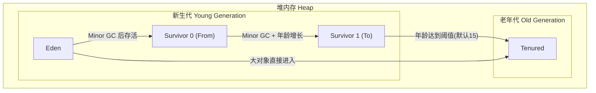

**默认比例（JDK8）：**
- `-XX:NewRatio=2` → 新生代 : 老年代 = 1 : 2
- `-XX:SurvivorRatio=8` → Eden : S0 : S1 = 8 : 1 : 1
- `-XX:MaxTenuringThreshold=15` → 对象晋升老年代年龄阈值

### 1.2 虚拟机栈（Java Stack）

每个线程私有，生命周期与线程相同。每个方法调用创建一个栈帧。

**栈帧结构：**

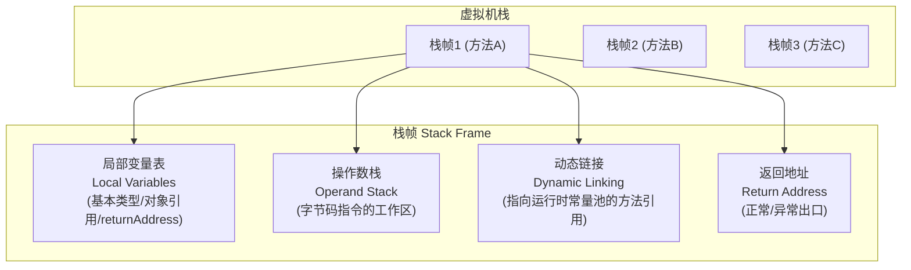

- **局部变量表**：存放方法参数和局部变量，Slot 复用
- **操作数栈**：字节码指令的工作区，压栈/出栈
- **动态链接**：将符号引用转换为直接引用
- **返回地址**：正常返回（PC 计数器）或异常返回（异常处理器表）

### 1.3 方法区 / 元空间

| 版本 | 实现 | 位置 | 默认大小 | 特点 |
|------|------|------|----------|------|
| JDK 7- | PermGen（永久代） | JVM 堆内 | 82MB | 容易 OOM |
| JDK 8+ | Metaspace（元空间） | 本地内存（Native Memory） | 无上限（默认） | 避免 OOM，自动扩展 |

**存储内容：** 类型信息、常量、静态变量、JIT 代码缓存、构造方法、接口定义

```java
// JDK 7- PermGen OOM 示例
for (int i = 0; i < 100_000_000; i++) {
    // 使用 CGLIB/ASM 动态生成类，填满 PermGen
    Enhancer enhancer = new Enhancer();
    enhancer.setSuperclass(OOMObject.class);
    enhancer.setUseCache(false);
    enhancer.setCallback((MethodInterceptor) (obj, method, args, proxy) -> proxy.invokeSuper(obj, args));
    enhancer.create();
}
```

### 1.4 运行时常量池 vs 字符串常量池

| 常量池 | 位置（JDK8） | 存储内容 |
|--------|-------------|---------|
| Class 文件常量池 | 磁盘上的 .class 文件 | 字面量 + 符号引用 |
| 运行时常量池 | 元空间（Metaspace） | 类加载后将 Class 文件常量池解析到此处 |
| 字符串常量池 | 堆（Heap） | `String.intern()` 的字符串实例 |

```java
String s1 = "hello";                    // 字符串常量池
String s2 = new String("hello");        // 堆中对象
String s3 = s2.intern();               // 返回常量池中的引用

System.out.println(s1 == s2);  // false
System.out.println(s1 == s3);  // true
System.out.println(s1 == "hel" + "lo"); // true（编译期常量折叠）
```

### 1.5 程序计数器（PC Register）

- 线程私有，记录当前线程执行的字节码指令地址
- 唯一不会 OOM 的区域
- 执行 Native 方法时 PC 为空（undefined）

### 1.6 本地方法栈（Native Method Stack）

- 为 Native 方法（C/C++ 实现）服务
- HotSpot 中与虚拟机栈合并

### 1.7 直接内存（Direct Memory）

- 不受 JVM 堆大小限制，受本机物理内存限制
- 通过 `DirectByteBuffer` 操作，使用 `Unsafe.allocateMemory` 分配
- 零拷贝（Zero-Copy），适合 NIO 场景

```java
import java.nio.ByteBuffer;
import java.nio.ByteOrder;

// 分配 1GB 直接内存（不占用堆空间）
ByteBuffer directBuf = ByteBuffer.allocateDirect(1024 * 1024 * 1024);

// 通过 -XX:MaxDirectMemorySize 控制上限
// 默认等于 -Xmx
```

### 1.8 TLAB（Thread Local Allocation Buffer）

- 每个线程在 Eden 区预分配一块私有缓冲区
- 避免线程安全开销（CAS），提升分配效率
- 通过 `-XX:+UseTLAB`（默认开启）控制
- 对象优先在 TLAB 分配，失败后再到 Eden 区加锁分配

### 1.9 对象创建过程

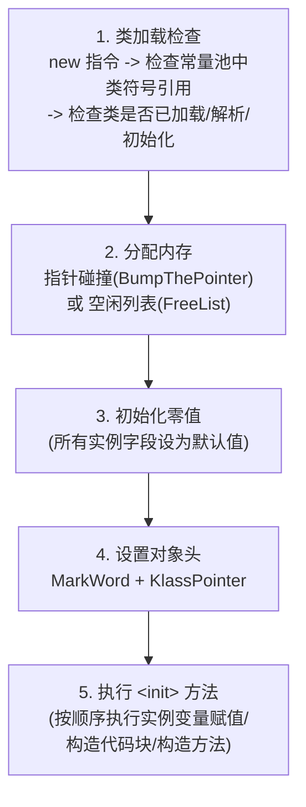

```java
// 对象创建完整过程示例
public class ObjectCreationDemo {
    private int x = 10;          // 步骤5中赋值
    private static int y = 20;   // 类加载的准备阶段赋零值，初始化阶段赋20

    public ObjectCreationDemo(int x) {
        this.x = x;              // 构造方法赋值
    }

    public static void main(String[] args) {
        // 1. 类加载检查（ObjectCreationDemo 是否已加载）
        // 2. 分配内存（Eden 区 TLAB）
        // 3. 初始化零值（x = 0）
        // 4. 设置对象头（MarkWord + KlassPointer）
        // 5. 执行 <init>（x = 10 → 构造方法 x = 42）
        ObjectCreationDemo obj = new ObjectCreationDemo(42);
    }
}
```

### 1.10 对象内存布局

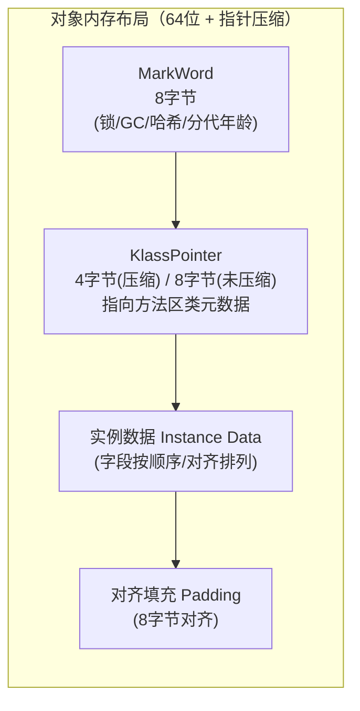

```java
// 使用 JOL (Java Object Layout) 查看对象内存布局
// 依赖：org.openjdk.jol:jol-core
import org.openjdk.jol.info.ClassLayout;

public class JOLDemo {
    private boolean flag = true;  // 1 字节
    private int    num  = 100;    // 4 字节
    private String str = "abc";   // 4 字节（压缩指针）

    public static void main(String[] args) {
        System.out.println(ClassLayout.parseInstance(new JOLDemo()).toPrintable());
    }
}
/* 输出示例（64位 + 指针压缩）：
com.example.JOLDemo object internals:
 OFFSET  SIZE      TYPE DESCRIPTION
      0    12           (object header: MarkWord 8B + KlassPointer 4B)
     12     4       int JOLDemo.num
     16     1   boolean JOLDemo.flag
     17     3           (alignment/padding gap)
     20     4   String JOLDemo.str
 Instance size: 24 bytes (loss: 3 bytes)
*/
```

### 1.11 指针压缩（CompressedOops）

- **普通对象指针（OOP）**：64 位 JVM 中每个引用占 8 字节
- **压缩后**：占 4 字节，最大可寻址 32GB 堆（2^32 × 8 = 32GB）
- 通过 `-XX:+UseCompressedOops`（JDK8 默认开启）控制
- 当堆 > 32GB 时自动关闭

### 1.12 内存泄漏常见场景

```java
import java.util.*;
import java.util.stream.*;

// 场景1：静态集合类持有对象
public class StaticCollectionLeak {
    private static final List<byte[]> CACHE = new ArrayList<>();

    public void leak() {
        CACHE.add(new byte[1024 * 1024]); // 永远不会被回收
    }
}

// 场景2：未关闭的资源
public class ResourceLeak {
    public void leak() throws Exception {
        java.sql.Connection conn = DriverManager.getConnection("jdbc:...");
        // 没有 finally { conn.close(); }
        // 连接对象无法被 GC 回收
    }
}

// 场景3：内部类持有外部类引用
public class OuterLeak {
    private byte[] bigData = new byte[100 * 1024 * 1024];

    public class InnerClass {
        // 隐式持有 OuterLeak.this 引用
        public void doSomething() {}
    }

    public Object getInner() {
        return new InnerClass(); // 外部类无法被 GC
    }
}

// 场景4：ThreadLocal 未清理
public class ThreadLocalLeak {
    private static final ThreadLocal<byte[]> TL = new ThreadLocal<>();

    public void leak() {
        TL.set(new byte[100 * 1024 * 1024]);
        // 没有 TL.remove()
        // ThreadLocalMap 的 Entry 的 key 是弱引用，但 value 是强引用
    }
}

// 场景5：String.intern() 滥用
public class InternLeak {
    public void leak() {
        List<String> list = new ArrayList<>();
        for (int i = 0; i < 10_000_000; i++) {
            list.add(String.valueOf(i).intern()); // 字符串常量池膨胀
        }
    }
}
```

---

## 2. 类加载机制

### 2.1 类加载 7 步

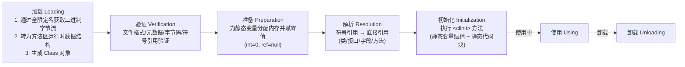

**注意：** 解析（Resolution）可以在初始化之后发生，这是 JVM 规范允许的（动态绑定）。

### 2.2 类加载时机

**主动引用（6 种，必须立即初始化）：**

1. `new`、`getstatic`、`putstatic`、`invokestatic` 指令
2. `java.lang.reflect` 反射调用
3. 子类初始化时，父类未初始化
4. JVM 启动时指定主类（`main` 方法所在类）
5. `java.lang.invoke.MethodHandle` 解析结果
6. `default` 方法接口的实现类初始化时

**被动引用（不会触发初始化）：**

```java
// 1. 通过子类引用父类的静态字段
class Parent {
    static { System.out.println("Parent init"); }
    static int value = 42;
}
class Child extends Parent {
    static { System.out.println("Child init"); }
}
// 只会输出 "Parent init"
System.out.println(Child.value);

// 2. 通过数组定义引用类
Parent[] arr = new Parent[10]; // 不会触发 Parent 初始化

// 3. 引用常量（编译期进入常量池）
class Const {
    static final String HELLO = "hello"; // 编译期常量
    static { System.out.println("Const init"); }
}
System.out.println(Const.HELLO); // 不会触发初始化
```

### 1.13 对象创建过程

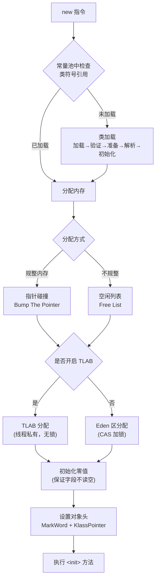

### 1.10 对象内存布局

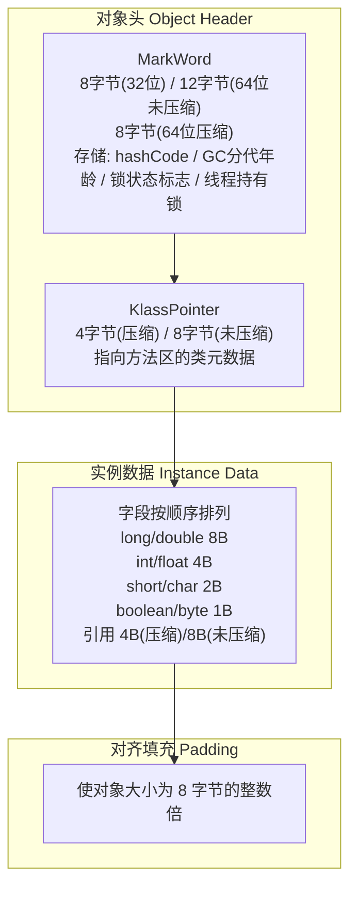

**MarkWord 结构（64位）：**

| 状态 | 标志位 | 存储内容 |
|------|--------|---------|
| 无锁 | 01 | 对象哈希码 + 分代年龄 |
| 偏向锁 | 01 | 线程ID + 偏向时间戳 + 分代年龄 |
| 轻量级锁 | 00 | 指向栈中锁记录的指针 |
| 重量级锁 | 10 | 指向管程（Monitor）的指针 |
| GC 标记 | 11 | 空（不存储信息） |

### 1.11 指针压缩（Compressed Oops）

```java
// 验证指针压缩是否开启
java -XX:+PrintFlagsFinal -version | findstr UseCompressedOops
// bool UseCompressedOops = true

// 手动关闭
java -XX:-UseCompressedOops -jar app.jar
```

**影响：**
- 开启后引用从 8B → 4B，节省内存
- 堆上限 32GB（2^32 × 8 = 32GB）
- 超过 32GB 自动关闭

### 1.12 内存泄漏常见场景

```java
// 场景1：静态集合类
public class StaticListLeak {
    private static final List<Object> LIST = new ArrayList<>();

    public void add(Object o) {
        LIST.add(o); // 类卸载前永不释放
    }
}

// 场景2：未关闭的流/连接
public class StreamLeak {
    public void readFile() throws IOException {
        java.io.FileInputStream fis = new java.io.FileInputStream("test.txt");
        // 没有 finally { fis.close(); }
        // 文件描述符泄漏，OutOfMemoryError: unable to create new native thread
    }
}

// 场景3：内部类持有外部引用
public class Outer {
    private byte[] data = new byte[100 * 1024 * 1024];

    class Inner {
        void print() {
            System.out.println(Outer.this); // 隐式持有 Outer 引用
        }
    }

    public Inner getInner() {
        return new Inner(); // Outer 无法被 GC
    }
}

// 场景4：ThreadLocal 未清理
public class ThreadLocalLeakDemo {
    private static final ThreadLocal<byte[]> TL = new ThreadLocal<>();

    public static void main(String[] args) {
        TL.set(new byte[100 * 1024 * 1024]);
        // 忘记 TL.remove()
        // ThreadLocalMap$Entry 的 key 是弱引用（可回收），但 value 是强引用
    }
}

// 场景5：变更监听器未注销
public class ListenerLeak {
    public void addListener() {
        SomeEventSource source = new SomeEventSource();
        source.addListener(new SomeListener() {
            // 匿名内部类持有外部类引用
        });
        // source 生命周期长，导致外部类无法回收
    }
}
```

---

## 2. 类加载机制

### 2.1 类加载 7 步

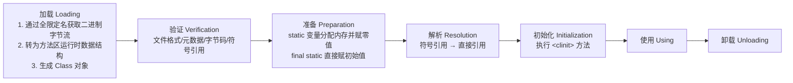

**各阶段关键点：**

| 阶段 | 说明 |
|------|------|
| 加载 | 通过类全限定名获取二进制字节流；将静态存储结构转为方法区运行时数据结构；生成 `java.lang.Class` 对象 |
| 验证 | 文件格式验证（魔数 0xCAFEBABE）、元数据验证、字节码验证、符号引用验证 |
| 准备 | `static int x = 10` → 此时 x = 0（零值），`<clinit>` 中才赋值为 10 |
| 解析 | 符号引用 → 直接引用（指针/偏移量） |
| 初始化 | 执行 `<clinit>` 方法，按顺序执行静态变量赋值和静态代码块 |

### 2.2 类加载时机

**主动引用（6 种，必须立即初始化）：**

```java
// 1. new 关键字
new MyClass();

// 2. 访问静态字段（非 final）
System.out.println(MyClass.staticField);

// 3. 调用静态方法
MyClass.staticMethod();

// 4. 反射
Class.forName("com.example.MyClass");

// 5. 子类初始化
new SubClass(); // 父类也会初始化

// 6. 接口 default 方法
// 实现类初始化时，接口有 default 方法也会触发接口初始化
```

**被动引用（不会触发初始化）：**

```java
// 1. 子类引用父类静态字段
System.out.println(Child.value); // 只触发 Parent 初始化

// 2. 数组定义
Parent[] arr = new Parent[10];   // 触发的是 [Lcom/example/Parent 的初始化

// 3. final 常量（编译期常量）
System.out.println(Const.HELLO); // 编译期已替换为常量值
```

### 2.3 双亲委派模型

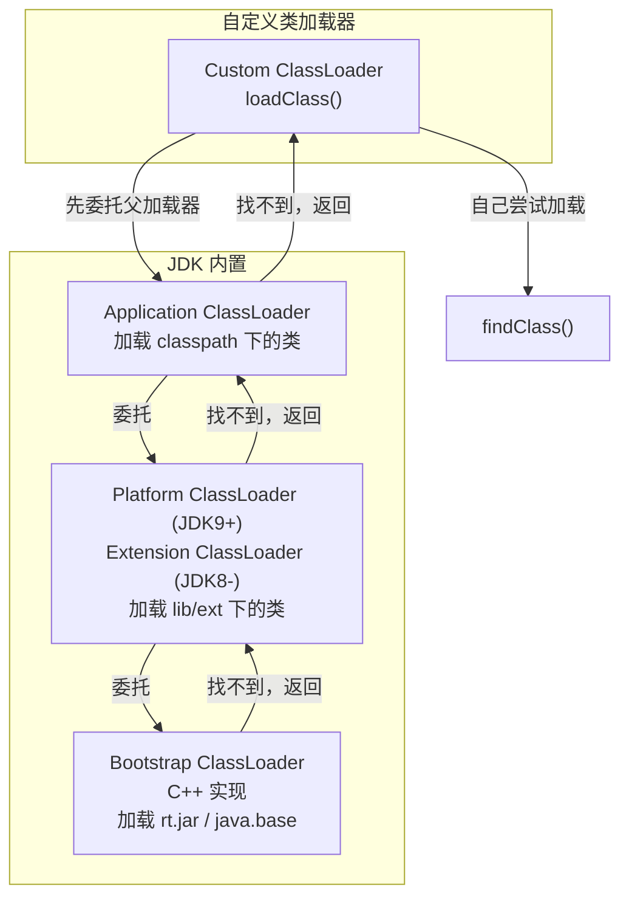

**双亲委派核心逻辑（`loadClass` 源码）：**

```java
protected Class<?> loadClass(String name, boolean resolve) throws ClassNotFoundException {
    synchronized (getClassLoadingLock(name)) {
        // 1. 检查是否已加载
        Class<?> c = findLoadedClass(name);
        if (c == null) {
            try {
                // 2. 委托给父加载器
                if (parent != null) {
                    c = parent.loadClass(name, false);
                } else {
                    c = findBootstrapClassOrNull(name);
                }
            } catch (ClassNotFoundException e) {
                // 父加载器找不到
            }
            if (c == null) {
                // 3. 自己加载
                c = findClass(name);
            }
        }
        return c;
    }
```

### 2.3 双亲委派模型

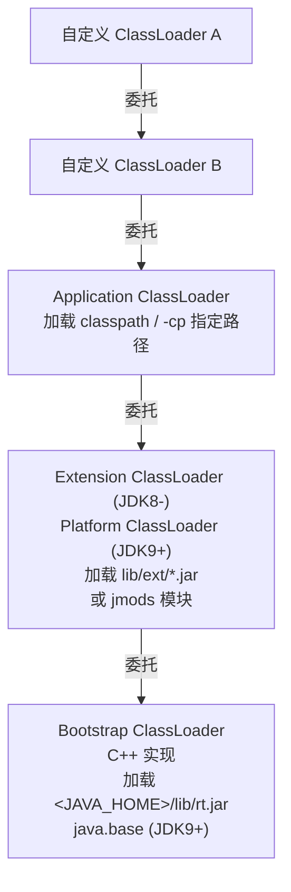

### 2.4 破坏双亲委派

**场景 1：TCCL（Thread Context ClassLoader）—— JDBC SPI**

```java
// JDBC 4.0+ 使用 ServiceLoader 加载驱动
// DriverManager 在启动类加载器中，但 JDBC 驱动在 classpath 中
// 使用 Thread.currentThread().getContextClassLoader() 打破委派

// 源码分析：DriverManager.getConnection()
// java.sql.DriverManager 在 rt.jar（Bootstrap ClassLoader）
// 但 MySQL 驱动在 classpath（Application ClassLoader）
// 使用 TCCL 绕过双亲委派
public class JDBCDemo {
    public static void main(String[] args) throws Exception {
        // TCCL 默认是 AppClassLoader
        ClassLoader cl = Thread.currentThread().getContextClassLoader();
        // 加载 MySQL 驱动
        Class<?> driverClass = cl.loadClass("com.mysql.cj.jdbc.Driver");
    }
}
```

**场景 2：Tomcat 容器**

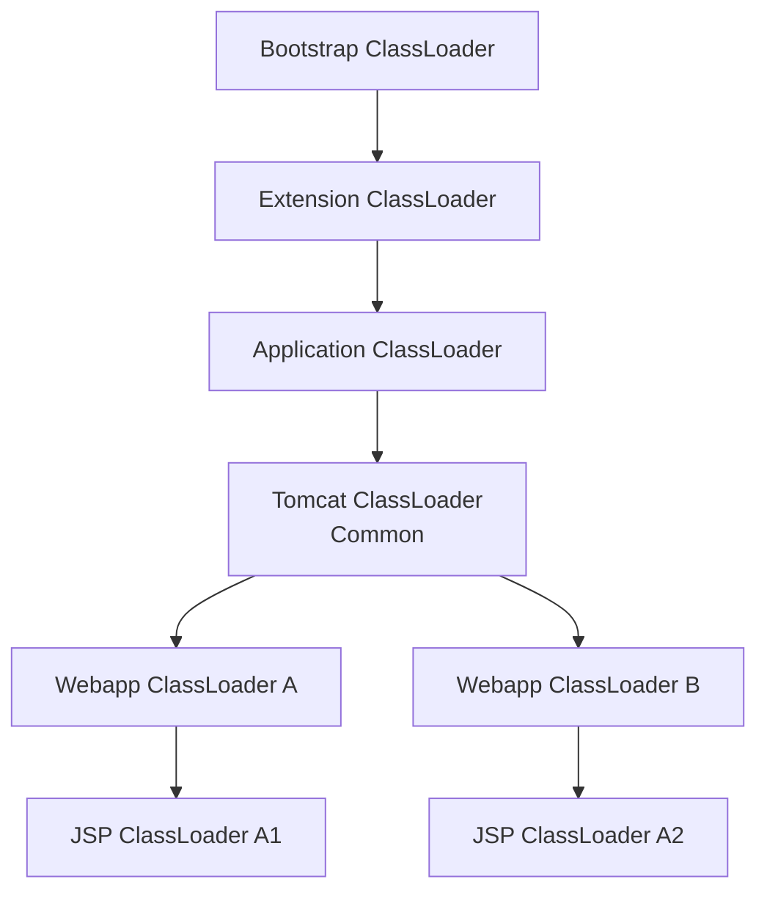

- 每个 Webapp 有独立的 ClassLoader，隔离不同应用的类
- 优先加载自己 `WEB-INF/lib` 和 `WEB-INF/classes` 下的类
- 打破双亲委派：先尝试自己加载，再委托父加载器

### 2.5 自定义类加载器

```java
import java.io.*;

public class MyClassLoader extends ClassLoader {

    private final String classPath;

    public MyClassLoader(String classPath) {
        this.classPath = classPath;
    }

    @Override
    protected Class<?> findClass(String name) throws ClassNotFoundException {
        try {
            String fileName = classPath + File.separator
                    + name.replace('.', File.separatorChar) + ".class";
            FileInputStream fis = new FileInputStream(fileName);
            ByteArrayOutputStream baos = new ByteArrayOutputStream();
            byte[] buf = new byte[4096];
            int len;
            while ((len = fis.read(buf)) != -1) {
                baos.write(buf, 0, len);
            }
            byte[] classBytes = baos.toByteArray();
            // 将字节数组定义为 Class
            return defineClass(name, classBytes, 0, classBytes.length);
        } catch (IOException e) {
            throw new ClassNotFoundException(name, e);
        }
    }
}

// 使用自定义类加载器（打破双亲委派：重写 loadClass）
public class BreakParentDelegationLoader extends ClassLoader {
    @Override
    public Class<?> loadClass(String name, boolean resolve) throws ClassNotFoundException {
        synchronized (getClassLoadingLock(name)) {
            Class<?> c = findLoadedClass(name);
            if (c != null) return c;

            // 先自己尝试加载（打破双亲委派）
            try {
                c = findClass(name);
                if (c != null) return c;
            } catch (ClassNotFoundException ignored) {}

            // 自己加载不到再委托父加载器
            if (getParent() != null) {
                c = getParent().loadClass(name);
            }
            return c;
        }
    }
}
```

### 2.6 Java 9 模块化（Jigsaw）

- `rt.jar` → 拆分为 95 个模块（`java.base`、`java.sql` 等）
- `module-info.java` 定义模块依赖和导出
- 类加载器变为：**Bootstrap ClassLoader** → **Platform ClassLoader** → **Application ClassLoader**
- Extension ClassLoader 被 Platform ClassLoader 替代

```java
// module-info.java
module com.example.myapp {
    requires java.base;      // 默认依赖
    requires java.sql;       // 依赖 JDBC 模块
    exports com.example.api; // 导出包
    uses java.sql.Driver;    // 服务发现
}
```

---

## 3. 垃圾回收 GC

### 3.1 对象存活判断

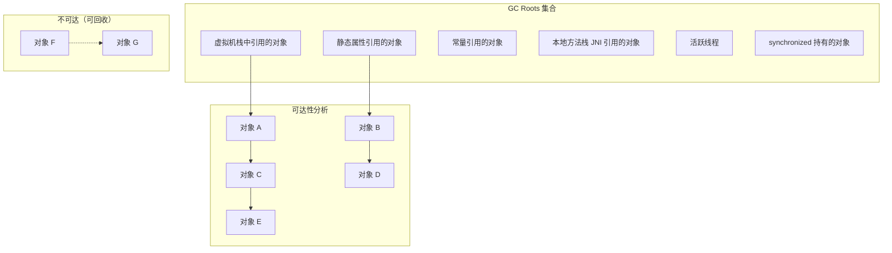

### 3.2 引用类型

```java
import java.lang.ref.*;

public class ReferenceDemo {

    public static void main(String[] args) {
        // 强引用 —— 只要可达就不回收
        Object strong = new Object();

        // 软引用 —— 内存不足时回收（适合缓存）
        SoftReference<byte[]> softRef = new SoftReference<>(new byte[10 * 1024 * 1024]);
        byte[] data = softRef.get(); // 可能为 null

        // 弱引用 —— 下次 GC 即回收
        WeakReference<Object> weakRef = new WeakReference<>(new Object());
        System.gc();
        System.out.println(weakRef.get()); // null

        // 虚引用 —— 无法通过 get() 获取对象，仅用于跟踪回收
        ReferenceQueue<Object> queue = new ReferenceQueue<>();
        PhantomReference<Object> phantomRef = new PhantomReference<>(new Object(), queue);
        // phantomRef.get() 永远返回 null

        // 引用队列：对象被回收后，Reference 被加入队列
        Reference<?> ref = queue.poll();
        if (ref != null) {
            System.out.println("对象已被回收，可执行清理");
        }
    }
}
```

### 3.3 GC 算法对比

| 算法 | 原理 | 优点 | 缺点 | 适用场景 |
|------|------|------|------|---------|
| 标记-清除（Mark-Sweep） | 标记存活对象，清除未标记对象 | 实现简单 | 内存碎片、效率低 |
| 标记-复制（Mark-Copy） | 将存活对象复制到另一块区域 | 无碎片、分配高效 | 浪费一半空间 |
| 标记-整理（Mark-Compact） | 标记存活对象，向一端移动 | 无碎片、内存利用率高 | 移动对象开销大 |
| 分代收集 | 新生代复制 + 老年代标记整理 | 综合优势 | 实现复杂 |

### 3.3 Minor GC / Major GC / Full GC

| GC 类型 | 发生区域 | 触发条件 |
|---------|---------|---------|
| Minor GC / Young GC | 新生代 | Eden 区空间不足 |
| Major GC | 老年代 | 老年代空间不足（通常伴随 Full GC） |
| Full GC | 整个堆 + 方法区 | 见下表 |

**Full GC 触发条件：**

1. `System.gc()` 显式调用（建议通过 `-XX:+DisableExplicitGC` 禁用）
2. 老年代空间不足
3. 方法区空间不足（Metaspace 达到阈值）
4. Minor GC 晋升老年代的平均大小 > 老年代剩余空间
5. CMS 并发模式失败（`Concurrent Mode Failure`）→ 降级为 Serial Old GC
6. `jmap -histo:live` 或 `jcmd GC.heap_dump` 触发

### 3.4 垃圾回收器详解

#### Serial / Serial Old

- **Serial**：新生代，单线程，复制算法，`-XX:+UseSerialGC`
- **Serial Old**：老年代，单线程，标记-整理算法
- 适用：单核 CPU、客户端模式、小内存（< 100MB）

#### ParNew

- 新生代，Serial 的多线程版本
- `-XX:+UseParNewGC`（JDK9 已废弃）
- 唯一能与 CMS 配合的新生代收集器

#### Parallel Scavenge / Parallel Old

- **Parallel Scavenge**：新生代，复制算法，多线程
- **Parallel Old**：老年代，标记-整理算法，多线程
- 关注吞吐量：`-XX:GCTimeRatio=99`（吞吐量 99%）
- `-XX:+UseParallelGC` / `-XX:+UseParallelOldGC`

#### CMS（Concurrent Mark Sweep）

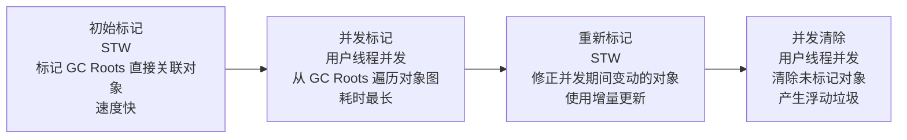

**CMS 优缺点：**

| 优点 | 缺点 |
|------|------|
| 低停顿、并发收集 | 对 CPU 敏感（占用线程） |
| 响应时间优先 | 浮动垃圾（Floating Garbage） |
| | 并发模式失败 → 退化为 Serial Old |
| | 标记-清除算法 → 内存碎片 |
| | `-XX:CMSInitiatingOccupancyFraction=68` 触发阈值 |

```java
// CMS 常用参数
// -XX:+UseConcMarkSweepGC
// -XX:CMSInitiatingOccupancyFraction=68
// -XX:+UseCMSCompactAtFullCollection
// -XX:CMSFullGCsBeforeCompaction=5
// -XX:+CMSScavengeBeforeRemark
```

### 3.5 G1（Garbage First）

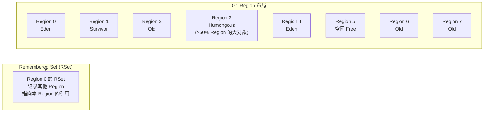

**G1 核心概念：**

| 概念 | 说明 |
|------|------|
| Region | 堆被划分为 2048 个 1MB~32MB 的 Region |
| 停顿预测模型 | `-XX:MaxGCPauseMillis=200` 预测停顿时间 |
| RSet（Remembered Set） | 记录其他 Region 指向本 Region 的引用，避免全堆扫描 |
| CardTable | 卡表，将 Region 分为 512 字节的卡页，标记脏卡 |
| SATB（Snapshot At The Beginning） | 并发标记时记录快照，保证正确性 |

**G1 GC 流程：**

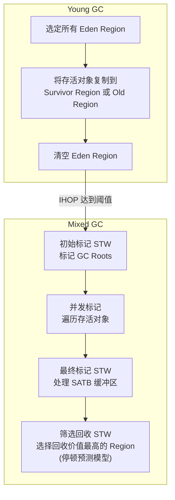

**G1 参数：**

```bash
-XX:+UseG1GC
-XX:MaxGCPauseMillis=200        # 目标停顿时间
-XX:G1HeapRegionSize=4m         # Region 大小（1MB~32MB）
-XX:InitiatingHeapOccupancyPercent=45  # IHOP 触发 Mixed GC 阈值
-XX:G1ReservePercent=10         # 预留空间
-XX:+UnlockExperimentalVMOptions -XX:G1NewSizePercent=5
```

### 3.5 ZGC（JDK 11+ 实验，JDK 15+ 正式）

**核心特性：**
- 停顿时间 < 10ms（与堆大小无关）
- 最大堆支持 16TB
- 并发整理（不产生碎片）

**核心技术：**

| 技术 | 说明 |
|------|------|
| 染色指针（Colored Pointer） | 指针中 42 位地址 + 4 位标志位（Finalizable/Remap/Mark0/Mark1） |
| 读屏障（Load Barrier） | 读取对象时检查指针状态，若被标记则修正 |
| 并发整理 | 重映射（Remap）阶段并发移动对象 |

```bash
# 启用 ZGC
-XX:+UseZGC
-XX:ZAllocationSpikeTolerance=2.0
-Xmx16g
```

### 3.7 GC 收集器选择指南

| 场景 | 推荐收集器 | 参数 |
|------|-----------|------|
| 单核、小内存（< 100MB） | Serial + Serial Old | `-XX:+UseSerialGC` |
| 多核、高吞吐量 | Parallel Scavenge + Parallel Old | `-XX:+UseParallelGC` |
| 低延迟、< 6GB 堆 | CMS + ParNew | `-XX:+UseConcMarkSweepGC` |
| 低延迟、> 4GB 堆 | G1 | `-XX:+UseG1GC` |
| 超低延迟、大堆 | ZGC | `-XX:+UseZGC` |
| 极低延迟、超大堆 | Shenandoah | `-XX:+UseShenandoahGC` |

---

## 4. JVM 调优实战

### 4.1 常用参数详解

```bash
# 堆内存
-Xms4g                    # 初始堆大小
-Xmx4g                    # 最大堆大小
-Xmn2g                    # 新生代大小
-XX:SurvivorRatio=8       # Eden:S0:S1 = 8:1:1
-XX:NewRatio=2            # 新生代:老年代 = 1:2

# 元空间
-XX:MetaspaceSize=256m     # 元空间初始大小（触发 Full GC 的阈值）
-XX:MaxMetaspaceSize=512m  # 元空间最大大小

# 栈
-Xss256k                   # 线程栈大小（默认 1MB，可调小以支持更多线程）

# GC 日志（JDK8）
-XX:+PrintGCDetails
-XX:+PrintGCDateStamps
-Xloggc:gc.log

# GC 日志（JDK17+）
-Xlog:gc*:file=gc.log:time,uptime,level,tags

# OOM 时自动 dump
-XX:+HeapDumpOnOutOfMemoryError
-XX:HeapDumpPath=/path/to/dump.hprof

# 其他
-XX:+DisableExplicitGC          # 禁用 System.gc()
-XX:LargePageSizeInBytes=4m     # 大内存页
-XX:+UseLargePages              # 启用大内存页
-XX:+AlwaysPreTouch             # 启动时预分配物理内存
```

### 4.2 CPU 100% 排查

```java
// 模拟 CPU 100% 的代码
public class CpuHighDemo {
    public static void main(String[] args) {
        // 死循环导致 CPU 100%
        while (true) {
            // 计算密集型任务
            double d = Math.random() * Math.random();
        }
    }
}
```

**排查步骤：**

```bash
# 1. 找到 CPU 最高的 Java 进程
top -H -p $(pgrep java)

# Windows 下使用 tasklist / findstr java
# 或使用 psutil 等工具

# 2. 找到 CPU 最高的线程 ID（十进制）
# 假设线程 ID = 12345

# 3. 将线程 ID 转为十六进制
printf "%x\n" 12345  # 输出 0x3039

# 4. 使用 jstack 查看线程栈
jstack -l <pid> | findstr "0x3039" -A 30

# 或使用 jstack 输出到文件后搜索
jstack <pid> > thread_dump.txt
# 搜索线程 ID 十六进制
```

### 4.3 内存泄漏排查

```bash
# 1. 查看堆使用情况
jmap -heap <pid>

# 2. 查看堆中对象统计（触发 Full GC）
jmap -histo:live <pid> | head -30

# 3. 生成堆转储文件
jmap -dump:live,format=b,file=heap.hprof <pid>

# 4. 使用 MAT (Memory Analyzer Tool) 分析
# - 打开 heap.hprof
# - 查看 Leak Suspects Report
# - 查看 Dominator Tree（支配树）
# - 查看 GC Roots 路径
```

```java
// 内存泄漏排查示例
public class LeakDemo {
    // 使用 -Xmx256m -XX:+HeapDumpOnOutOfMemoryError -XX:HeapDumpPath=leak.hprof
    private static final List<byte[]> LEAK = new ArrayList<>();

    public static void main(String[] args) throws Exception {
        while (true) {
            LEAK.add(new byte[1024 * 1024]); // 每秒泄漏 1MB
            Thread.sleep(100);
        }
    }
}
```

### 4.4 死锁排查

```java
public class DeadlockDemo {
    private static final Object A = new Object();
    private static final Object B = new Object();

    public static void main(String[] args) {
        new Thread(() -> {
            synchronized (A) {
                try { Thread.sleep(100); } catch (Exception e) {}
                synchronized (B) { System.out.println("T1 done"); }
            }
        }).start();

        new Thread(() -> {
            synchronized (B) {
                try { Thread.sleep(100); } catch (Exception e) {}
                synchronized (A) { System.out.println("T2 done"); }
            }
        }).start();
    }
}
```

```bash
# 排查步骤
# 1. 找到 Java 进程
jps -l

# 2. 输出线程栈（自动检测死锁）
jstack -l <pid>

# 输出示例：
# Found one Java-level deadlock:
# =============================
# "Thread-1":
#   waiting to lock monitor 0x00000000035a3e28 (object 0x000000076b5e6d60, a java.lang.Object),
#   which is held by "Thread-0"
# "Thread-0":
#   waiting to lock monitor 0x00000000035a3f28 (object 0x000000076b5e6d70, a java.lang.Object),
#   which is held by "Thread-1"
```

### 4.5 GC 日志分析

**JDK 8 GC 日志格式：**

```log
# Minor GC
2024-01-01T12:00:00.000+0800: 0.456: [GC (Allocation Failure)
  [PSYoungGen: 1024K->128K(2048K)] 1024K->256K(4096K), 0.0023456 secs]
  [Times: user=0.01 sys=0.00, real=0.01 secs]

# Full GC
2024-01-01T12:00:00.000+0800: 10.234: [Full GC (Metadata GC Threshold)
  [PSYoungGen: 512K->0K(2048K)]
  [ParOldGen: 1024K->1024K(2048K)]
  1536K->1024K(4096K), [Metaspace: 20480K->20480K(20480K)]
  [Times: user=0.05 sys=0.01, real=0.05 secs]
```

**JDK 17+ 统一日志格式：**

```log
# JDK 17+ GC 日志
[0.123s][info][gc,start] GC(0) Pause Young (Normal) (G1 Evacuation Pause)
[0.123s][info][gc] GC(0) Pause Young (G1 Evacuation Pause) 256M->32M(1024M) 5.123ms
[0.456s][info][gc,start] GC(1) Pause Full (G1 Compaction)
[0.789s][info][gc,phases] GC(1) Phase 1: Mark Live Objects 0.123ms
[0.789s][info][gc,phases] GC(1) Phase 2: Prepare for Compaction 0.045ms
[0.789s][info][gc,phases] GC(1) Phase 3: Adjust Pointers 0.067ms
[0.789s][info][gc,phases] GC(1) Phase 4: Compact Heap 0.234ms
[0.789s][info][gc] GC(1) Pause Full (G1 Compaction) 1024M->512M(2048M) 0.567ms
```

### 4.6 常见 OOM 场景

```java
// 1. 堆溢出 - Java heap space
// -Xmx128m
List<byte[]> heapOOM = new ArrayList<>();
while (true) {
    heapOOM.add(new byte[1024 * 1024]);
}

// 2. 栈溢出 - StackOverflowError
public class StackSOF {
    private int depth = 0;
    public void stackLeak() {
        depth++;
        stackLeak(); // 无限递归
    }
    // -Xss128k 时 depth 约 1000
}

// 3. 方法区溢出（Metaspace）
// 使用 CGLIB 不断创建新类
while (true) {
    Enhancer e = new Enhancer();
    e.setSuperclass(OOM.class);
    e.setUseCache(false);
    e.setCallback((MethodInterceptor) (o, m, args, p) -> p.invokeSuper(o, args));
    e.create();
}

// 4. 直接内存溢出
ByteBuffer.allocateDirect(Integer.MAX_VALUE);

// 5. 线程过多（无法创建本地线程）
while (true) {
    new Thread(() -> {
        try { Thread.sleep(Long.MAX_VALUE); } catch (Exception e) {}
    }).start();
}
// 报错：java.lang.OutOfMemoryError: unable to create new native thread
```

### 4.7 Arthas 在线诊断

```bash
# 启动 Arthas
java -jar arthas-boot.jar
# 选择目标 Java 进程

# dashboard —— 实时系统面板
dashboard

# thread —— 查看线程
thread -b                    # 查看死锁
thread -n 5                  # 查看最忙的 5 个线程

# stack —— 查看方法调用栈
stack com.example.UserService getUserById

# trace —— 统计方法调用耗时
trace com.example.UserService getUserById

# ognl —— 在线执行表达式
ognl '@java.lang.System@getProperty("java.version")'

# vmtool —— 查看/修改对象字段
vmtool --action getInstances --className java.lang.String --limit 10

# sc/sm —— 查看类/方法信息
sc -d com.example.UserService
sm com.example.UserService

# heap —— 堆 dump
heapdump /tmp/heap.hprof
```

---

## 5. JIT 编译

### 5.1 解释执行 vs 编译执行

| 模式 | 原理 | 优点 | 缺点 |
|------|------|------|------|
| 解释执行 | 字节码逐条翻译为机器码 | 启动快 | 执行慢 |
| 编译执行（JIT） | 将热点代码编译为本地机器码 | 执行快 | 启动慢、占用 CodeCache |

### 5.2 热点检测

- **方法计数器**：记录方法被调用的次数，超过 `-XX:CompileThreshold`（C1: 1500, C2: 10000）触发编译
- **回边计数器**：记录方法中循环体的执行次数，触发 OSR（栈上替换）编译

### 5.3 C1 / C2 / Graal JIT

| 编译器 | 特点 | 适用 |
|--------|------|------|
| C1（Client Compiler） | 编译快、优化少 | 客户端模式、启动阶段 |
| C2（Server Compiler） | 编译慢、优化强 | 服务端模式、稳定运行后 |
| Graal JIT | 高性能、支持 AOT | JDK 17+ 可替代 C2 |

```bash
# 分层编译（JDK8 默认）
-XX:+TieredCompilation
-XX:CompileThreshold=10000  # C2 编译阈值

# 强制使用 C1
-XX:TieredStopAtLevel=1

# 查看 JIT 编译情况
-XX:+PrintCompilation
```

### 5.4 逃逸分析

```java
public class EscapeAnalysisDemo {

    // 对象不逃逸 → 栈上分配（实际是标量替换）
    public static long createPoint() {
        // Point 对象只在方法内使用，没有逃逸
        int x = 10;
        int y = 20;
        // JIT 会进行标量替换：直接在栈上分配 x 和 y
        // 不会在堆上创建 Point 对象
        return x * y;
    }

    // 锁消除
    public static void lockElimination() {
        // StringBuffer 是局部变量，不会逃逸
        // JIT 会消除 synchronized
        StringBuffer sb = new StringBuffer();
        sb.append("a").append("b").append("c");
    }

    // 标量替换
    public static int scalarReplacement() {
        // Point 对象被拆解为 x, y 两个标量
        // 直接在栈上分配，不创建对象
        int x = 1, y = 2;
        return x + y;
    }
}
```

### 5.5 方法内联

```java
// 内联前
public int add(int a, int b) {
    return a + b;
}

public int calc() {
    return add(1, 2); // 方法调用
}

// 内联后（JIT 编译后）
public int calc() {
    return 1 + 2; // 直接计算结果
}
```

### 5.6 AOT（GraalVM Native Image）

```bash
# 安装 GraalVM 后
# 编译为原生镜像（启动毫秒级，无 JIT）
native-image -jar myapp.jar

# 特点：
# - 启动时间 < 100ms
# - 内存占用低
# - 不支持反射（需配置 reflect-config.json）
# - 不支持动态代理（需配置 proxy-config.json）
```

---

## 6. JDK 内置工具速查表

| 工具 | 作用 | 常用命令 |
|------|------|---------|
| `jps` | 列出 Java 进程 | `jps -l -v` |
| `jstat` | 监控 JVM 统计信息 | `jstat -gcutil <pid> 1000 10`（每秒输出 GC 情况） |
| `jinfo` | 查看/修改 JVM 参数 | `jinfo -flags <pid>` / `jinfo -flag +PrintGCDetails <pid>` |
| `jmap` | 堆内存快照 | `jmap -heap <pid>` / `jmap -histo:live <pid>` / `jmap -dump:format=b,file=heap.hprof <pid>` |
| `jhat` | 分析堆 dump（已废弃，推荐 MAT） | `jhat heap.hprof` |
| `jstack` | 线程栈 | `jstack -l <pid>`（显示锁信息） |
| `jcmd` | 多功能诊断 | `jcmd <pid> help` / `jcmd <pid> GC.heap_dump heap.hprof` / `jcmd <pid> VM.flags` |

```bash
# jstat 示例：每 1 秒输出 GC 统计
jstat -gcutil <pid> 1000 5
#  S0     S1     E      O      M     CCS    YGC     YGCT    FGC    FGCT     GCT
#  0.00   0.00  45.23  12.45  85.23  78.12  12     0.234    2     0.123    0.357

# jcmd 示例
jcmd <pid> VM.flags                    # 查看 JVM 参数
jcmd <pid> GC.heap_dump heap.hprof    # 堆 dump
jcmd <pid> Thread.print               # 打印线程栈
jcmd <pid> VM.uptime                  # 运行时间
jcmd <pid> GC.class_stats             # 类统计
```

---

> **参考：** 《深入理解 Java 虚拟机》（周志明）、《Java 性能权威指南》、OpenJDK 官方文档
