# Spring Framework 知识体系

---

## 目录

1. [IoC 容器](#1-ioc-容器)
2. [AOP](#2-aop)
3. [事务管理](#3-事务管理)
4. [Spring MVC](#4-spring-mvc)
5. [其他核心](#5-其他核心)

---

## 1. IoC 容器

### 1.1 IoC/DI 思想

**IoC（Inversion of Control，控制反转）** 是一种设计原则，将对象的创建和依赖关系的管理交给容器。**DI（Dependency Injection，依赖注入）** 是 IoC 的具体实现方式。

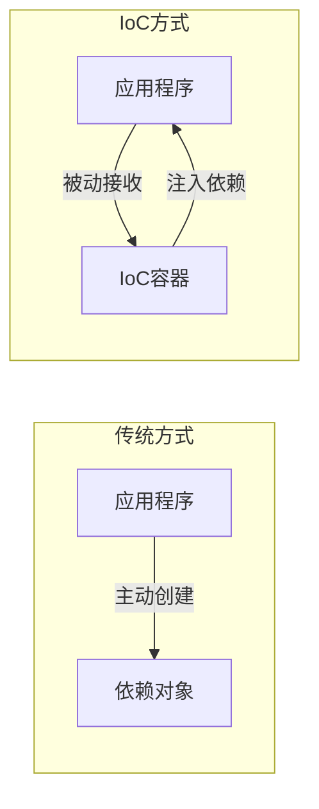

| 对比项 | 传统方式 | IoC 方式 |
|--------|---------|---------|
| 控制权 | 应用程序 | 容器 |
| 对象创建 | new 关键字 | 容器托管 |
| 依赖管理 | 硬编码 | 配置/注解声明 |

### 1.2 BeanFactory vs ApplicationContext

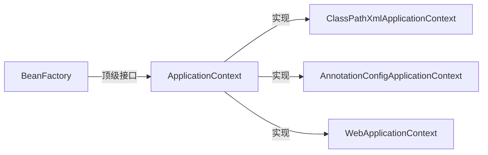

| 特性 | BeanFactory | ApplicationContext |
|------|-------------|-------------------|
| 容器启动 | 延迟初始化（懒加载） | 立即初始化（预加载） |
| 扩展性 | 基础 IoC | + AOP、事件、国际化、 Environment |
| 注解支持 | 需手动注册 | 原生支持 |
| 常用场景 | 嵌入式设备 | Web 应用/企业级 |

```java
// BeanFactory 基础用法
BeanFactory factory = new XmlBeanFactory(new ClassPathResource("beans.xml"));
MyService service = factory.getBean(MyService.class);

// ApplicationContext 推荐用法
ApplicationContext ctx = new AnnotationConfigApplicationContext(AppConfig.class);
MyService service = ctx.getBean(MyService.class);
```

### 1.3 配置方式演进

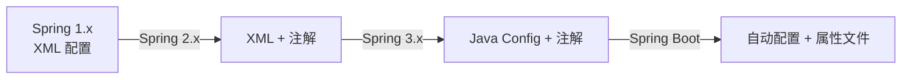

### 1.4 @Configuration + @Bean

```java
public class UserService {
    private final UserRepository repository;
    public UserService(UserRepository repository) {
        this.repository = repository;
    }
    public void doWork() { repository.save(); }
}

public class UserRepository {
    public void save() { System.out.println("saved"); }
}

// Java Config 类
@Configuration
public class AppConfig {

    @Bean
    public UserRepository userRepository() {
        return new UserRepository();
    }

    @Bean
    public UserService userService() {
        return new UserService(userRepository());
    }
}

// 使用
public class Main {
    public static void main(String[] args) {
        ApplicationContext ctx = new AnnotationConfigApplicationContext(AppConfig.class);
        UserService service = ctx.getBean(UserService.class);
        service.doWork();
    }
}
```

### 1.5 立体化分层注解

```mermaid
flowchart TD
    C[Controller<br/>@Controller] --> S[Service<br/>@Service]
    S --> R[Repository<br/>@Repository]
    subgraph Component
        U[Utils/Helper<br/>@Component]
    end
```

| 注解 | 层次 | 职责 |
|------|------|------|
| `@Controller` | 控制层 | 接收请求、返回响应 |
| `@Service` | 服务层 | 业务逻辑编排 |
| `@Repository` | 持久层 | 数据访问、异常转换 |
| `@Component` | 通用 | 任意 Spring 托管组件 |

### 1.6 依赖注入方式对比

```java
// 1. 构造器注入（推荐）
@Component
public class OrderService {
    private final PaymentService paymentService;
    private final InventoryService inventoryService;

    // Spring Boot 可省略 @Autowired
    public OrderService(PaymentService paymentService,
                        InventoryService inventoryService) {
        this.paymentService = paymentService;
        this.inventoryService = inventoryService;
    }
}

// 2. Setter 注入（可选依赖）
@Component
public class NotificationService {
    private EmailSender emailSender;

    @Autowired(required = false)
    public void setEmailSender(EmailSender emailSender) {
        this.emailSender = emailSender;
    }
}

// 3. 字段注入（不推荐 — 不利于测试和不可变性）
@Component
public class LegacyService {
    @Autowired
    private UserRepository userRepository;

    @Autowired
    private LogService logService;
}
```

**推荐原则：**

| 方式 | 优点 | 缺点 |
|------|------|------|
| 构造器 | 不可变、必填依赖、易测试 | 依赖过多时代码长（此时应拆分） |
| Setter | 可选依赖、可重新注入 | 可变性、遗漏注入风险 |
| 字段 | 代码简洁 | 难以测试、反射注入、不可见性 |

### 1.7 @Autowired / @Resource / @Inject 对比

| 特性 | @Autowired (Spring) | @Resource (JSR-250) | @Inject (JSR-330) |
|------|---------------------|--------------------|-------------------|
| 匹配方式 | ByType → ByName | ByName → ByType | ByType → ByName |
| required | `required=false` | 不支持 | 不支持 |
| 组合 | `@Qualifier` 指定名称 | `name` 属性指定名称 | `@Named` 指定名称 |
| 来源 | Spring 原生 | javax.annotation | javax.inject |

```java
@Component
public class ShoppingService {

    // 1. @Autowired ByType
    @Autowired
    private PaymentService paymentService;

    // 2. @Autowired + @Qualifier 精确指定
    @Autowired
    @Qualifier("alipay")
    private PaymentService alipayService;

    // 3. @Resource ByName
    @Resource(name = "wechatPay")
    private PaymentService wechatPayService;

    // 4. @Inject + @Named
    @Inject
    @Named("unionPay")
    private PaymentService unionPayService;
}
```

### 1.8 @Qualifier / @Primary / @Order

```java
// 多个实现时指定首选
@Component
@Primary
public class DefaultLogger implements Logger {
    public void log(String msg) { System.out.println("DEFAULT: " + msg); }
}

@Component
@Qualifier("fileLogger")
public class FileLogger implements Logger {
    public void log(String msg) { System.out.println("FILE: " + msg); }
}

// 使用
@Component
public class AppService {
    // 注入 @Primary 标注的 DefaultLogger
    @Autowired
    private Logger logger;

    // 注入指定的 FileLogger
    @Autowired
    @Qualifier("fileLogger")
    private Logger fileLogger;
}

// @Order 控制 Bean 加载/注入顺序
@Component
@Order(1)
public class FirstFilter implements Filter { }

@Component
@Order(2)
public class SecondFilter implements Filter { }
```

### 1.9 Bean 作用域

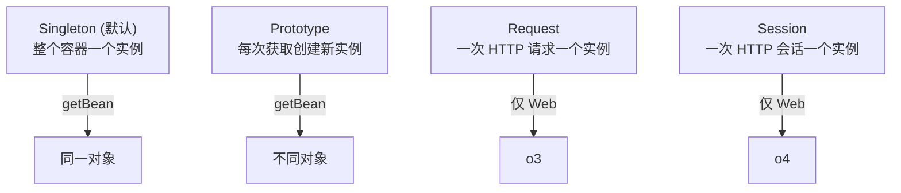

```java
@Component
@Scope("prototype")
public class TaskProcessor {
    private final String id = UUID.randomUUID().toString();
    public void execute() { System.out.println("Task " + id + " running"); }
}

@Component
public class TaskRunner implements ApplicationRunner {
    @Autowired
    private ApplicationContext ctx;

    @Override
    public void run(String... args) {
        TaskProcessor t1 = ctx.getBean(TaskProcessor.class);
        TaskProcessor t2 = ctx.getBean(TaskProcessor.class);
        System.out.println(t1 == t2); // false
    }
}

// singleton 作用域注入 prototype bean —— 需使用 @Lookup 或 ScopeProxy
@Component
@Scope(value = "prototype", proxyMode = ScopedProxyMode.TARGET_CLASS)
public class PrototypeBean { }

@Component
public class SingletonBean {
    @Autowired
    private PrototypeBean prototypeBean;
}
```

### 1.10 Bean 生命周期

```mermaid
flowchart TD
    A[实例化<br/>Instantiation] --> B[属性赋值<br/>Populate Properties]
    B --> C[设置 Bean Name<br/>setBeanName]
    C --> D[设置 BeanFactory<br/>setBeanFactory]
    D --> E[设置 ApplicationContext<br/>setApplicationContext]
    E --> F[BeanPostProcessor#postProcessBeforeInitialization]
    F --> G[初始化<br/>@PostConstruct<br/>InitializingBean#afterPropertiesSet<br/>@Bean(initMethod)]
    G --> H[BeanPostProcessor#postProcessAfterInitialization]
    H --> I[就绪<br/>Ready to Use]
    I --> J[容器关闭<br/>@PreDestroy<br/>DisposableBean#destroy<br/>@Bean(destroyMethod)]
```

### 1.11 BeanPostProcessor / BeanFactoryPostProcessor

```java
// BeanPostProcessor — 对 Bean 实例的处理
@Component
public class CustomBeanPostProcessor implements BeanPostProcessor {

    @Override
    public Object postProcessBeforeInitialization(Object bean, String beanName) {
        if (bean instanceof MyService) {
            System.out.println("Before init: " + beanName);
        }
        return bean;
    }

    @Override
    public Object postProcessAfterInitialization(Object bean, String beanName) {
        if (bean instanceof MyService) {
            System.out.println("After init: " + beanName);
        }
        return bean;
    }
}

// BeanFactoryPostProcessor — 对 BeanDefinition 的处理（容器启动阶段）
@Component
public class CustomBeanFactoryPostProcessor implements BeanFactoryPostProcessor {

    @Override
    public void postProcessBeanFactory(ConfigurableListableBeanFactory factory) {
        BeanDefinition bd = factory.getBeanDefinition("myService");
        bd.getPropertyValues().add("timeout", 5000);
        System.out.println("Modified bean definition: myService");
    }
}
```

### 1.12 @PostConstruct / @PreDestroy / InitializingBean / DisposableBean

```java
@Component
public class DatabaseConnector implements InitializingBean, DisposableBean {

    private Connection connection;

    @PostConstruct
    public void init() {
        System.out.println("@PostConstruct: 资源预检");
    }

    @Override
    public void afterPropertiesSet() {
        System.out.println("InitializingBean: 建立数据库连接");
        this.connection = createConnection();
    }

    @PreDestroy
    public void cleanup() {
        System.out.println("@PreDestroy: 清理缓存");
    }

    @Override
    public void destroy() {
        System.out.println("DisposableBean: 关闭连接");
        if (connection != null) connection.close();
    }

    private Connection createConnection() {
        return null; // 模拟
    }
}

// @Bean 方式指定初始化/销毁方法
@Configuration
public class LifecycleConfig {

    @Bean(initMethod = "start", destroyMethod = "stop")
    public NetworkService networkService() {
        return new NetworkService();
    }
}

public class NetworkService {
    public void start() { System.out.println("NetworkService 启动"); }
    public void stop() { System.out.println("NetworkService 停止"); }
}
```

### 1.13 FactoryBean

```java
// 自定义 FactoryBean
@Component
public class MyServiceFactoryBean implements FactoryBean<MyService> {

    @Override
    public MyService getObject() {
        return new MyService("FactoryBean 创建的实例");
    }

    @Override
    public Class<?> getObjectType() {
        return MyService.class;
    }

    @Override
    public boolean isSingleton() {
        return true;
    }
}

// 使用
@Component
public class FactoryBeanDemo implements ApplicationRunner {
    @Autowired
    private ApplicationContext ctx;

    @Override
    public void run(String... args) {
        // & 前缀获取 FactoryBean 本身
        MyServiceFactoryBean factory = (MyServiceFactoryBean) ctx.getBean("&myServiceFactoryBean");
        // 不加 & 获取 Bean 实例
        MyService service = ctx.getBean(MyService.class);
        service.work();
    }
}

// MyBatis SqlSessionFactoryBean 典型用法（经典 FactoryBean）
/*
@Configuration
public class MyBatisConfig {

    @Bean
    public SqlSessionFactoryBean sqlSessionFactory(DataSource dataSource) {
        SqlSessionFactoryBean factoryBean = new SqlSessionFactoryBean();
        factoryBean.setDataSource(dataSource);
        factoryBean.setMapperLocations(new PathMatchingResourcePatternResolver()
            .getResources("classpath:mapper/*.xml"));
        return factoryBean;
    }
}
*/
```

### 1.14 @Import / @ImportSelector / ImportBeanDefinitionRegistrar

```java
// 1. @Import 直接导入配置
@Configuration
@Import({DatabaseConfig.class, CacheConfig.class})
public class AppConfig { }

// 2. @ImportSelector — 按条件选择导入
public class MyImportSelector implements ImportSelector {
    @Override
    public String[] selectImports(AnnotationMetadata metadata) {
        // 可获取标注类的元数据做判断
        return new String[]{"com.example.CacheConfig",
                           "com.example.LogConfig"};
    }
}

@Configuration
@Import(MyImportSelector.class)
public class AppConfig { }

// 3. ImportBeanDefinitionRegistrar — 手动注册 BeanDefinition
public class MyBeanRegistrar implements ImportBeanDefinitionRegistrar {
    @Override
    public void registerBeanDefinitions(AnnotationMetadata metadata,
                                         BeanDefinitionRegistry registry) {
        BeanDefinition bd = new GenericBeanDefinition();
        bd.setBeanClassName(MyService.class.getName());
        registry.registerBeanDefinition("myService", bd);
    }
}

@Configuration
@Import(MyBeanRegistrar.class)
public class AppConfig { }
```

### 1.15 @Conditional 条件装配

```java
// 自定义条件
public class OnWindowsCondition implements Condition {
    @Override
    public boolean matches(ConditionContext context, AnnotatedTypeMetadata metadata) {
        return System.getProperty("os.name").toLowerCase().contains("win");
    }
}

@Configuration
public class ConditionalConfig {

    @Bean
    @Conditional(OnWindowsCondition.class)
    public WindowsService windowsService() {
        return new WindowsService();
    }

    @Bean
    @ConditionalOnMissingBean(WindowsService.class)
    public DefaultService defaultService() {
        return new DefaultService();
    }
}

// Spring Boot 内置条件注解
// @ConditionalOnClass / @ConditionalOnMissingClass
// @ConditionalOnBean / @ConditionalOnMissingBean
// @ConditionalOnProperty
// @ConditionalOnExpression
// @ConditionalOnResource
```

### 1.16 @Profile 多环境

```java
// 开发环境
@Configuration
@Profile("dev")
public class DevConfig {
    @Bean
    public DataSource dataSource() {
        return new EmbeddedDatabaseBuilder()
            .setType(EmbeddedDatabaseType.H2)
            .build();
    }
}

// 生产环境
@Configuration
@Profile("prod")
public class ProdConfig {
    @Bean
    public DataSource dataSource() {
        HikariDataSource ds = new HikariDataSource();
        ds.setJdbcUrl("jdbc:mysql://prod:3306/db");
        ds.setUsername("prod_user");
        return ds;
    }
}

// 激活方式
// 1. application.properties: spring.profiles.active=dev
// 2. 环境变量: SPRING_PROFILES_ACTIVE=dev
// 3. 代码指定: context.getEnvironment().setActiveProfiles("dev")
```

### 1.17 @Lazy 懒加载

```java
@Component
@Lazy
public class HeavyResource {
    public HeavyResource() {
        System.out.println("HeavyResource 初始化（很耗时）");
    }
}

@Component
public class LazyDemo {
    @Autowired
    @Lazy  // 代理方式，首次调用才初始化
    private HeavyResource heavyResource;

    public void use() {
        heavyResource.toString(); // 此时才真正初始化
    }
}
```

### 1.18 类型转换 Converter/ConversionService

```java
// 自定义 Converter
@Component
public class StringToDateConverter implements Converter<String, Date> {
    private static final SimpleDateFormat FORMAT = new SimpleDateFormat("yyyy-MM-dd");

    @Override
    public Date convert(String source) {
        try {
            return FORMAT.parse(source);
        } catch (ParseException e) {
            throw new IllegalArgumentException("日期格式错误: " + source);
        }
    }
}

// 注册到 ConversionService
@Configuration
public class ConverterConfig implements WebMvcConfigurer {
    @Override
    public void addFormatters(FormatterRegistry registry) {
        registry.addConverter(new StringToDateConverter());
    }
}

// 或使用 @Component 自动注册（Spring Boot）
// 使用 ConversionService
@Component
public class ConversionDemo implements ApplicationRunner {
    @Autowired
    private ConversionService conversionService;

    @Override
    public void run(String... args) {
        Date date = conversionService.convert("2026-07-22", Date.class);
        System.out.println(date);
    }
}
```

### 1.19 SpEL 表达式

```java
@Component
public class SpELDemo {

    @Value("#{ systemProperties['user.home'] }")
    private String userHome;

    @Value("#{ T(java.lang.Math).random() * 100 }")
    private double randomNumber;

    @Value("#{ 'Hello, '.concat('World') }")
    private String greeting;

    @Value("#{ 2 * 3 + 4 }")
    private int computedValue;

    @Value("#{ @userRepository.findByName('admin') }")
    private User adminUser;

    public void show() {
        System.out.println("userHome: " + userHome);
        System.out.println("random: " + randomNumber);
        System.out.println("greeting: " + greeting);
    }
}

// 编程方式使用 SpEL
ExpressionParser parser = new SpelExpressionParser();
Expression exp = parser.parseExpression("'Hello, '.concat('World')");
String result = exp.getValue(String.class); // Hello, World
```

### 1.20 Spring 事件机制

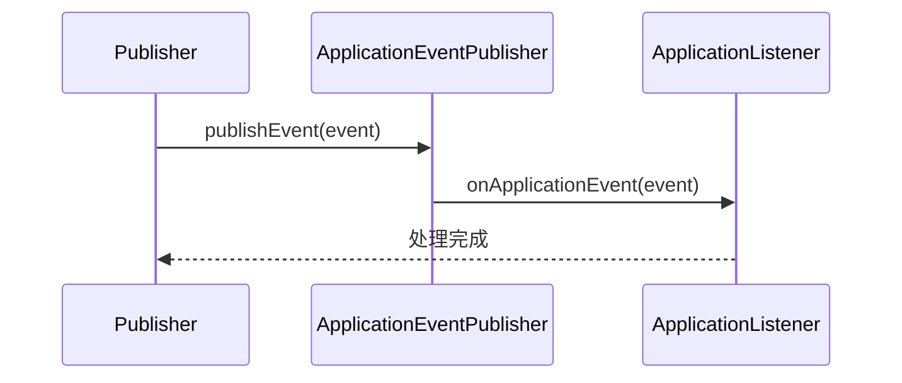

```java
// 1. 自定义事件
public class OrderCreatedEvent extends ApplicationEvent {
    private final Long orderId;
    private final String username;

    public OrderCreatedEvent(Object source, Long orderId, String username) {
        super(source);
        this.orderId = orderId;
        this.username = username;
    }

    public Long getOrderId() { return orderId; }
    public String getUsername() { return username; }
}

// 2. 事件发布
@Component
public class OrderService {
    @Autowired
    private ApplicationEventPublisher publisher;

    public void createOrder(Long orderId, String username) {
        System.out.println("订单创建: " + orderId);
        publisher.publishEvent(new OrderCreatedEvent(this, orderId, username));
    }
}

// 3. 监听事件（传统方式）
@Component
public class EmailListener implements ApplicationListener<OrderCreatedEvent> {
    @Override
    public void onApplicationEvent(OrderCreatedEvent event) {
        System.out.println("发送邮件给 " + event.getUsername()
                         + "，订单号: " + event.getOrderId());
    }
}

// 4. 监听事件（@EventListener 推荐）
@Component
public class SmsListener {

    @EventListener
    public void handleOrderCreated(OrderCreatedEvent event) {
        System.out.println("发送短信给 " + event.getUsername()
                         + "，订单号: " + event.getOrderId());
    }

    // 条件监听：仅处理大额订单
    @EventListener(condition = "#event.orderId > 10000")
    public void handleBigOrder(OrderCreatedEvent event) {
        System.out.println("大额订单特殊处理: " + event.getOrderId());
    }

    // 异步监听
    @Async
    @EventListener
    public void handleAsync(OrderCreatedEvent event) {
        System.out.println("异步处理: " + event.getOrderId());
    }

    // 事务绑定事件
    @TransactionalEventListener(phase = TransactionPhase.AFTER_COMMIT)
    public void handleAfterCommit(OrderCreatedEvent event) {
        System.out.println("事务提交后处理: " + event.getOrderId());
    }
}
```

---

## 2. AOP

### 2.1 AOP 核心概念

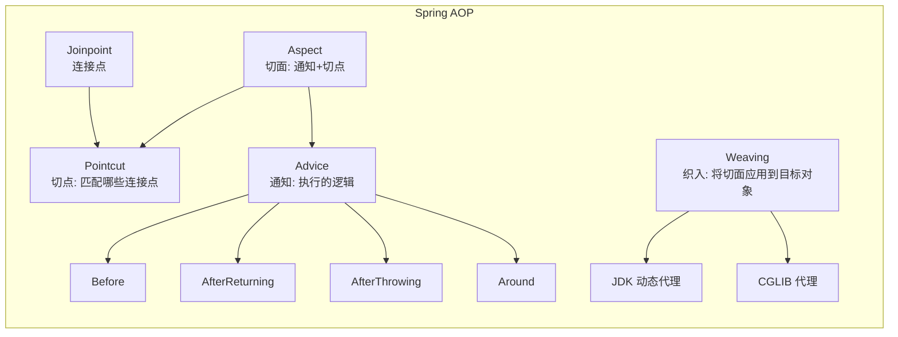

| 概念 | 说明 | 类比 |
|------|------|------|
| **Joinpoint**（连接点） | 程序执行点（方法调用/异常） | 所有可装摄像头的路口 |
| **Pointcut**（切点） | 匹配连接点的表达式 | 指定哪些路口装摄像头 |
| **Advice**（通知） | 切面执行的具体逻辑 | 摄像头录制的动作 |
| **Aspect**（切面） | Pointcut + Advice 的组合 | 摄像头+安装方案的组合 |
| **Weaving**（织入） | 将切面应用到目标对象的过程 | 安装摄像头的过程 |

### 2.2 通知类型

```java
// 通知顺序：@Around → @Before → 方法执行 → @AfterReturning/@AfterThrowing → @After → @Around

@Aspect
@Component
public class LoggingAspect {

    // 前置通知
    @Before("execution(* com.example.service.*.*(..))")
    public void beforeAdvice(JoinPoint jp) {
        System.out.println("[Before] 方法: " + jp.getSignature().getName());
    }

    // 后置通知（无论是否异常）
    @After("execution(* com.example.service.*.*(..))")
    public void afterAdvice(JoinPoint jp) {
        System.out.println("[After] 方法结束: " + jp.getSignature().getName());
    }

    // 返回通知
    @AfterReturning(value = "execution(* com.example.service.*.*(..))",
                     returning = "result")
    public void afterReturningAdvice(JoinPoint jp, Object result) {
        System.out.println("[AfterReturning] 返回值: " + result);
    }

    // 异常通知
    @AfterThrowing(value = "execution(* com.example.service.*.*(..))",
                    throwing = "ex")
    public void afterThrowingAdvice(JoinPoint jp, Exception ex) {
        System.out.println("[AfterThrowing] 异常: " + ex.getMessage());
    }

    // 环绕通知（最强）
    @Around("@annotation(com.example.annotation.Monitor)")
    public Object aroundAdvice(ProceedingJoinPoint pjp) throws Throwable {
        long start = System.currentTimeMillis();
        System.out.println("[Around] 执行前");

        try {
            Object result = pjp.proceed();
            return result;
        } finally {
            long elapsed = System.currentTimeMillis() - start;
            System.out.println("[Around] 执行后，耗时: " + elapsed + "ms");
        }
    }
}
```

### 2.3 JDK 动态代理 vs CGLIB

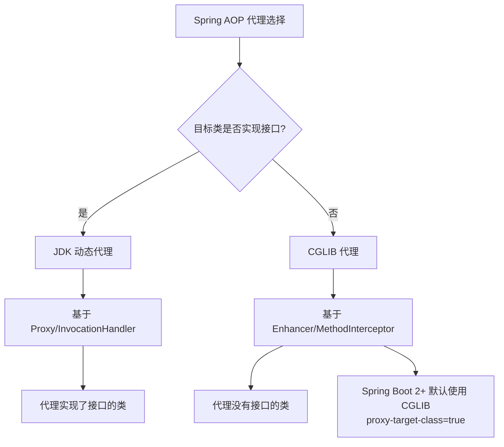

| 对比项 | JDK 动态代理 | CGLIB |
|--------|-------------|-------|
| 原理 | 反射 + Proxy | ASM 字节码生成子类 |
| 条件 | 必须实现接口 | 无需接口 |
| 性能（创建） | 快 | 较慢 |
| 性能（调用） | 慢（反射调） | 快（直接调） |
| 限制 | 仅代理接口方法 | final 类/方法无法代理 |

### 2.4 自定义注解 + AOP（日志/权限）

```java
// 日志注解
@Target(ElementType.METHOD)
@Retention(RetentionPolicy.RUNTIME)
public @interface LogExecution {
    String module() default "";
    String action() default "";
}

// 权限注解
@Target(ElementType.METHOD)
@Retention(RetentionPolicy.RUNTIME)
public @interface RequirePermission {
    String value();
}

// AOP 切面实现
@Aspect
@Component
public class LogAndPermissionAspect {

    // 日志切面
    @Around("@annotation(logExecution)")
    public Object handleLog(ProceedingJoinPoint pjp, LogExecution logExecution) throws Throwable {
        String module = logExecution.module();
        String action = logExecution.action();
        String method = pjp.getSignature().toShortString();

        long start = System.currentTimeMillis();
        System.out.println("[日志] 模块: " + module + ", 动作: " + action
                         + ", 方法: " + method);

        try {
            Object result = pjp.proceed();
            long elapsed = System.currentTimeMillis() - start;
            System.out.println("[日志] 执行成功, 耗时: " + elapsed + "ms");
            return result;
        } catch (Exception e) {
            System.out.println("[日志] 执行失败: " + e.getMessage());
            throw e;
        }
    }

    // 权限切面
    @Around("@annotation(requirePermission)")
    public Object handlePermission(ProceedingJoinPoint pjp,
                                    RequirePermission requirePermission) throws Throwable {
        String permission = requirePermission.value();
        String currentUser = getCurrentUser();

        if (!hasPermission(currentUser, permission)) {
            throw new SecurityException("用户 " + currentUser
                                      + " 无权限: " + permission);
        }
        System.out.println("[权限] 用户: " + currentUser + " 通过权限检查: " + permission);
        return pjp.proceed();
    }

    private String getCurrentUser() {
        return "admin"; // 模拟
    }

    private boolean hasPermission(String user, String permission) {
        return "admin".equals(user); // 模拟
    }
}

// 使用
@Service
public class UserService {

    @LogExecution(module = "用户管理", action = "查询")
    @RequirePermission("user:query")
    public User findById(Long id) {
        return new User(id, "test");
    }

    @LogExecution(module = "用户管理", action = "删除")
    @RequirePermission("user:delete")
    public void deleteById(Long id) {
        System.out.println("删除用户: " + id);
    }
}
```

### 2.5 @EnableAspectJAutoProxy

```java
// Spring Boot 自动配置，无需手动开启
// 普通 Spring 项目需显式开启
@Configuration
@EnableAspectJAutoProxy // 等价于 <aop:aspectj-autoproxy/>
public class AopConfig { }

// 可选属性
@EnableAspectJAutoProxy(
    proxyTargetClass = true,  // 强制使用 CGLIB
    exposeProxy = true        // 暴露代理对象到 ThreadLocal
)
public class AopConfig { }

// exposeProxy 的内部调用场景
@Service
public class UserService {

    public void methodA() {
        System.out.println("methodA");
        // 直接调用 methodB 不会走 AOP 代理
        // this.methodB();

        // 正确方式：通过代理调用
        ((UserService) AopContext.currentProxy()).methodB();
    }

    @LogExecution(module = "用户", action = "B")
    public void methodB() {
        System.out.println("methodB");
    }
}
```

---

## 3. 事务管理

### 3.1 PlatformTransactionManager 体系

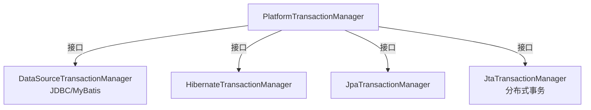

```java
// 编程式使用 TransactionManager
@Component
public class TransactionManagerDemo {

    @Autowired
    private PlatformTransactionManager transactionManager;

    public void manualTransaction() {
        DefaultTransactionDefinition def = new DefaultTransactionDefinition();
        def.setPropagationBehavior(TransactionDefinition.PROPAGATION_REQUIRED);
        def.setIsolationLevel(TransactionDefinition.ISOLATION_READ_COMMITTED);

        TransactionStatus status = transactionManager.getTransaction(def);
        try {
            // 业务操作
            transactionManager.commit(status);
        } catch (Exception e) {
            transactionManager.rollback(status);
            throw e;
        }
    }
}
```

### 3.2 @Transactional 声明式事务

```java
@Service
public class OrderService {

    @Autowired
    private OrderRepository orderRepository;

    @Autowired
    private AccountService accountService;

    @Transactional(rollbackFor = Exception.class)
    public void createOrder(Order order) {
        orderRepository.save(order);

        // 扣减库存
        accountService.deduct(order.getUserId(), order.getAmount());

        // 抛出异常时整个方法事务回滚
        if (order.getAmount() > 10000) {
            throw new RuntimeException("订单金额超限");
        }
    }
}

// 类级别 — 所有方法默认加入事务
@Service
@Transactional(readOnly = true)
public class UserService {

    @Autowired
    private UserRepository userRepository;

    public User findById(Long id) {
        return userRepository.findById(id).orElse(null);
    }

    @Transactional(readOnly = false)
    public void updateUser(User user) {
        userRepository.save(user);
    }
}
```

### 3.3 事务传播行为（7种）

| 传播行为 | 值 | 说明 |
|----------|-----|------|
| `REQUIRED` | 0 | **默认**。支持当前事务，没有则新建 |
| `SUPPORTS` | 1 | 支持当前事务，没有则以非事务执行 |
| `MANDATORY` | 2 | 必须存在事务，否则抛异常 |
| `REQUIRES_NEW` | 3 | 挂起当前事务，新建事务执行 |
| `NOT_SUPPORTED` | 4 | 以非事务方式执行，挂起当前事务 |
| `NEVER` | 5 | 以非事务方式执行，存在事务则抛异常 |
| `NESTED` | 6 | 嵌套事务（JDBC savepoint 实现） |

```java
@Service
public class OuterService {

    @Autowired
    private InnerService innerService;

    @Transactional
    public void outerMethod() {
        // REQUIRED — 内外在同一事务
        innerService.innerRequired();

        // REQUIRES_NEW — 内部分支独立事务，外部回滚不影响内部
        innerService.innerRequiresNew();

        // NESTED — 内部回滚到 savepoint，外部可继续
        innerService.innerNested();
    }
}

@Service
public class InnerService {

    @Transactional(propagation = Propagation.REQUIRES_NEW)
    public void innerRequiresNew() {
        // 独立事务
    }

    @Transactional(propagation = Propagation.NESTED)
    public void innerNested() {
        // 嵌套事务，外部事务的回滚点
    }

    @Transactional(propagation = Propagation.REQUIRED)
    public void innerRequired() {
        // 加入外部事务
    }
}
```

**适用场景：**

| 传播行为 | 适用场景 |
|----------|----------|
| `REQUIRED` | 常规业务方法 |
| `REQUIRES_NEW` | 操作日志记录（即使主业务失败也要保存） |
| `NESTED` | 批量处理中支持部分回滚 |
| `MANDATORY` | 内层方法强制要求外层已开启事务 |
| `NOT_SUPPORTED` | 下载/导出等耗时 IO 操作 |
| `NEVER` | 只读查询、不能运行在事务中 |

### 3.4 事务隔离级别

| 隔离级别 | 值 | 脏读 | 不可重复读 | 幻读 |
|----------|-----|------|------------|------|
| `DEFAULT` | -1 | 取决于数据库 |
| `READ_UNCOMMITTED` | 1 | ✔ | ✔ | ✔ |
| `READ_COMMITTED` | 2 | ✘ | ✔ | ✔ |
| `REPEATABLE_READ` | 4 | ✘ | ✘ | ✔ |
| `SERIALIZABLE` | 8 | ✘ | ✘ | ✘ |

```java
@Transactional(isolation = Isolation.READ_COMMITTED)
public void queryWithLock() {
    // MySQL InnoDB 默认级别，避免脏读
}
```

### 3.5 事务失效 6 种场景

```java
// 场景 1：非 public 方法
@Service
public class TransactionalService {

    @Transactional
    protected void nonPublicMethod() {
        // 失效！@Transactional 只对 public 方法生效
    }
}

// 场景 2：同类内部调用
@Service
public class SelfInvocationService {

    public void methodA() {
        // this.methodB() 不会走代理，事务失效
        methodB();
    }

    @Transactional
    public void methodB() {
        // 事务无效
    }
}

// 场景 3：异常被吞没
@Service
public class SwallowExceptionService {

    @Transactional
    public void method() {
        try {
            // 业务操作
            throw new RuntimeException("error");
        } catch (Exception e) {
            // 异常被捕获未抛出，不会回滚
            System.out.println("吞没异常");
        }
    }
}

// 场景 4：异常类型不对（默认只回滚 RuntimeException 和 Error）
@Service
public class WrongExceptionService {

    @Transactional
    public void method() throws Exception {
        throw new Exception("checked exception");
        // checked exception 不会触发回滚！
        // 需设置 rollbackFor = Exception.class
    }
}

// 场景 5：事务传播行为导致
@Service
public class PropagationFailService {

    @Transactional(propagation = Propagation.NOT_SUPPORTED)
    public void method() {
        // 以非事务方式执行
    }
}

// 场景 6：多线程环境
@Service
public class MultiThreadService {

    @Autowired
    private UserRepository userRepository;

    @Transactional
    public void method() {
        new Thread(() -> {
            // 新线程中的操作不在原事务中
            userRepository.save(new User());
        }).start();
    }
}
```

### 3.6 编程式事务（TransactionTemplate）

```java
@Component
public class TransactionTemplateDemo {

    @Autowired
    private TransactionTemplate transactionTemplate;

    @Autowired
    private JdbcTemplate jdbcTemplate;

    public void transfer(Long fromId, Long toId, double amount) {
        transactionTemplate.execute(status -> {
            try {
                jdbcTemplate.update("UPDATE account SET balance = balance - ? WHERE id = ?",
                                   amount, fromId);
                jdbcTemplate.update("UPDATE account SET balance = balance + ? WHERE id = ?",
                                   amount, toId);
                return null;
            } catch (Exception e) {
                // 设置回滚标记
                status.setRollbackOnly();
                throw e;
            }
        });
    }

    // 有返回值
    public Account queryWithTransaction(Long id) {
        return transactionTemplate.execute(status -> {
            return jdbcTemplate.queryForObject(
                "SELECT * FROM account WHERE id = ?",
                new BeanPropertyRowMapper<>(Account.class), id);
        });
    }

    // 无返回值
    public void executeWithoutResult(Long id) {
        transactionTemplate.executeWithoutResult(status -> {
            jdbcTemplate.update("UPDATE account SET balance = 0 WHERE id = ?", id);
        });
    }
}
```

---

## 4. Spring MVC

### 4.1 DispatcherServlet 处理流程

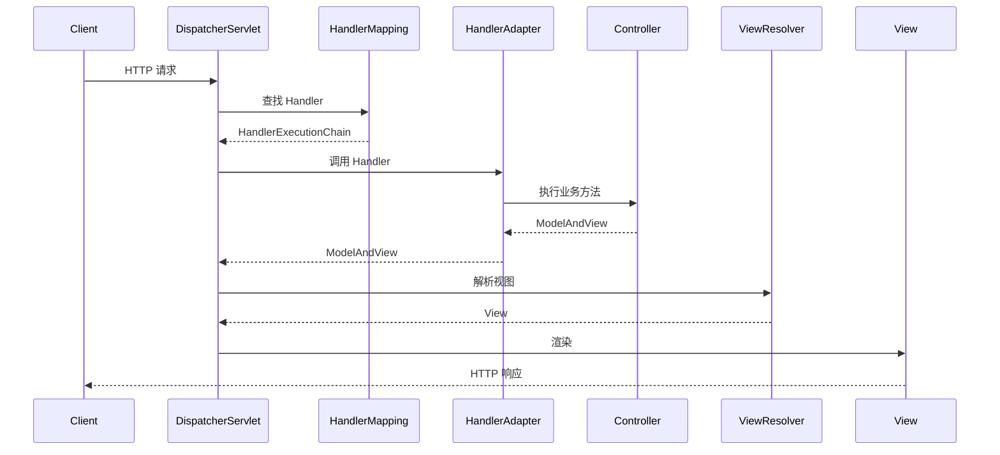

**简化版流程（@ResponseBody/RESTful）：**

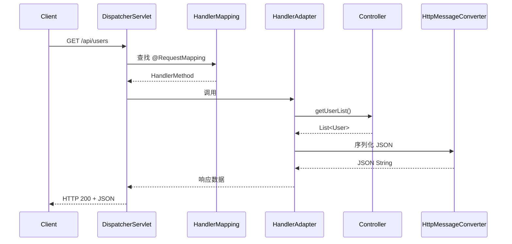

### 4.2 @RestController vs @Controller

| 特性 | @Controller | @RestController |
|------|-------------|----------------|
| 默认返回 | 视图名（View） | JSON/XML（@ResponseBody） |
| 需搭配 | + @ResponseBody | 内置 @ResponseBody |
| 适用场景 | 传统 MVC（JSP/Thymeleaf） | RESTful API |

```java
// 传统 MVC
@Controller
@RequestMapping("/page")
public class PageController {

    @GetMapping("/index")
    public String index(Model model) {
        model.addAttribute("name", "Spring");
        return "index"; // 解析到 /WEB-INF/views/index.jsp
    }
}

// RESTful API
@RestController
@RequestMapping("/api/users")
public class UserController {

    @GetMapping("/{id}")
    public User getUser(@PathVariable Long id) {
        return new User(id, "test");
    }
}
```

### 4.3 请求映射注解

```java
@RestController
@RequestMapping("/api/users")
public class UserController {

    // GET /api/users
    @GetMapping
    public List<User> list() {
        return userService.findAll();
    }

    // GET /api/users/123
    @GetMapping("/{id}")
    public User detail(@PathVariable Long id) {
        return userService.findById(id);
    }

    // POST /api/users
    @PostMapping
    @ResponseStatus(HttpStatus.CREATED)
    public User create(@RequestBody User user) {
        return userService.create(user);
    }

    // PUT /api/users/123
    @PutMapping("/{id}")
    public User update(@PathVariable Long id, @RequestBody User user) {
        return userService.update(id, user);
    }

    // DELETE /api/users/123
    @DeleteMapping("/{id}")
    @ResponseStatus(HttpStatus.NO_CONTENT)
    public void delete(@PathVariable Long id) {
        userService.delete(id);
    }

    // PATCH /api/users/123
    @PatchMapping("/{id}")
    public User partialUpdate(@PathVariable Long id, @RequestBody Map<String, Object> fields) {
        return userService.partialUpdate(id, fields);
    }
}
```

### 4.4 参数绑定注解

```java
@RestController
@RequestMapping("/api")
public class ParamController {

    // @RequestParam — 查询参数
    // GET /api/users?page=1&size=10
    @GetMapping("/users")
    public PageResult<User> list(
            @RequestParam(defaultValue = "1") int page,
            @RequestParam(defaultValue = "10") int size,
            @RequestParam(required = false) String keyword) {
        return userService.findPage(page, size, keyword);
    }

    // @PathVariable — 路径参数
    // GET /api/users/123/orders/456
    @GetMapping("/users/{userId}/orders/{orderId}")
    public Order getOrder(
            @PathVariable Long userId,
            @PathVariable Long orderId) {
        return orderService.findById(userId, orderId);
    }

    // @RequestBody — 请求体（JSON → 对象）
    @PostMapping("/users")
    public User create(@RequestBody @Valid User user) {
        return userService.create(user);
    }

    // @RequestHeader — 请求头
    @GetMapping("/info")
    public Map<String, String> info(
            @RequestHeader("User-Agent") String userAgent,
            @RequestHeader(value = "X-Request-Id", required = false) String requestId) {
        return Map.of("ua", userAgent, "reqId", requestId);
    }

    // @RequestPart — 文件上传 + JSON
    @PostMapping(value = "/upload", consumes = MediaType.MULTIPART_FORM_DATA_VALUE)
    public String upload(
            @RequestPart("file") MultipartFile file,
            @RequestPart("metadata") @Valid FileMetadata metadata) {
        return file.getOriginalFilename() + " uploaded";
    }
}
```

### 4.5 @ResponseBody + HttpMessageConverter

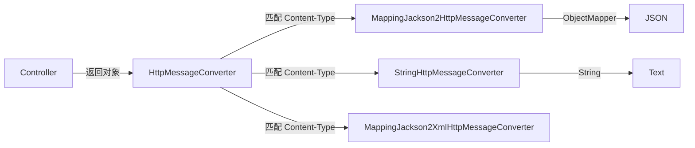

```java
// Spring Boot 自动配置 Jackson
// 依赖 spring-boot-starter-web 自动引入 jackson-databind

@RestController
public class JsonController {

    @GetMapping("/user")
    public User getUser() {
        // 自动通过 MappingJackson2HttpMessageConverter 序列化为 JSON
        return new User(1L, "张三", "zhangsan@example.com");
    }

    // 控制日期格式
    @GetMapping("/config")
    public Config getConfig() {
        return new Config("key1", "value1");
    }
}

// 全局 Jackson 配置（application.yml）
/*
spring:
  jackson:
    date-format: yyyy-MM-dd HH:mm:ss
    time-zone: Asia/Shanghai
    serialization:
      write-dates-as-timestamps: false
    deserialization:
      fail-on-unknown-properties: false
    default-property-inclusion: non_null
*/
```

### 4.6 RESTful API 设计

```java
@RestController
@RequestMapping("/api/v1/products")
public class ProductController {

    // GET    /api/v1/products       — 列表查询
    // GET    /api/v1/products/{id}  — 单个查询
    // POST   /api/v1/products       — 新增
    // PUT    /api/v1/products/{id}  — 全量更新
    // PATCH  /api/v1/products/{id}  — 部分更新
    // DELETE /api/v1/products/{id}  — 删除

    @GetMapping
    public ResponseEntity<PageResult<Product>> list(
            @RequestParam(defaultValue = "1") int page,
            @RequestParam(defaultValue = "20") int size,
            @RequestParam(required = false) String category) {
        PageResult<Product> result = productService.findPage(page, size, category);
        return ResponseEntity.ok(result);
    }

    @GetMapping("/{id}")
    public ResponseEntity<Product> detail(@PathVariable Long id) {
        return productService.findById(id)
                .map(ResponseEntity::ok)
                .orElse(ResponseEntity.notFound().build());
    }

    @PostMapping
    public ResponseEntity<Product> create(@RequestBody @Valid Product product) {
        Product created = productService.create(product);
        URI location = ServletUriComponentsBuilder
                .fromCurrentRequest().path("/{id}")
                .buildAndExpand(created.getId()).toUri();
        return ResponseEntity.created(location).body(created);
    }

    @PutMapping("/{id}")
    public ResponseEntity<Product> update(@PathVariable Long id,
                                          @RequestBody @Valid Product product) {
        Product updated = productService.update(id, product);
        return ResponseEntity.ok(updated);
    }

    @DeleteMapping("/{id}")
    public ResponseEntity<Void> delete(@PathVariable Long id) {
        productService.delete(id);
        return ResponseEntity.noContent().build();
    }
}
```

### 4.7 @ControllerAdvice + @ExceptionHandler 全局异常处理

```java
// 通用异常响应体
@Data
public class ErrorResponse {
    private int code;
    private String message;
    private long timestamp;

    public static ErrorResponse of(int code, String message) {
        ErrorResponse resp = new ErrorResponse();
        resp.code = code;
        resp.message = message;
        resp.timestamp = System.currentTimeMillis();
        return resp;
    }
}

// 自定义业务异常
public class BusinessException extends RuntimeException {
    private final int code;
    public BusinessException(int code, String message) {
        super(message);
        this.code = code;
    }
    public int getCode() { return code; }
}

// 全局异常处理器
@RestControllerAdvice
public class GlobalExceptionHandler {

    // 业务异常
    @ExceptionHandler(BusinessException.class)
    @ResponseStatus(HttpStatus.BAD_REQUEST)
    public ErrorResponse handleBusiness(BusinessException e) {
        return ErrorResponse.of(e.getCode(), e.getMessage());
    }

    // 参数校验异常
    @ExceptionHandler(MethodArgumentNotValidException.class)
    @ResponseStatus(HttpStatus.BAD_REQUEST)
    public ErrorResponse handleValidation(MethodArgumentNotValidException e) {
        String msg = e.getBindingResult().getFieldErrors().stream()
                .map(f -> f.getField() + ": " + f.getDefaultMessage())
                .collect(Collectors.joining(", "));
        return ErrorResponse.of(400, msg);
    }

    // 参数类型转换异常
    @ExceptionHandler(ConstraintViolationException.class)
    @ResponseStatus(HttpStatus.BAD_REQUEST)
    public ErrorResponse handleConstraint(ConstraintViolationException e) {
        return ErrorResponse.of(400, e.getMessage());
    }

    // 404
    @ExceptionHandler(NoHandlerFoundException.class)
    @ResponseStatus(HttpStatus.NOT_FOUND)
    public ErrorResponse handleNotFound() {
        return ErrorResponse.of(404, "资源不存在");
    }

    // 兜底异常
    @ExceptionHandler(Exception.class)
    @ResponseStatus(HttpStatus.INTERNAL_SERVER_ERROR)
    public ErrorResponse handleUnknown(Exception e) {
        log.error("未预期异常", e);
        return ErrorResponse.of(500, "服务器内部错误");
    }

    // 为特定 Controller 定制（组合）
    @ExceptionHandler(SQLException.class)
    @ResponseStatus(HttpStatus.INTERNAL_SERVER_ERROR)
    public ErrorResponse handleSQL(Exception e) {
        return ErrorResponse.of(5000, "数据库异常");
    }

    // 响应头/状态码也可定制
    @ExceptionHandler(AccessDeniedException.class)
    public ResponseEntity<ErrorResponse> handleAccessDenied(AccessDeniedException e) {
        ErrorResponse body = ErrorResponse.of(403, "无访问权限");
        return ResponseEntity.status(HttpStatus.FORBIDDEN)
                .header("X-Error-Code", "ACCESS_DENIED")
                .body(body);
    }
}
```

### 4.8 HandlerInterceptor 拦截器

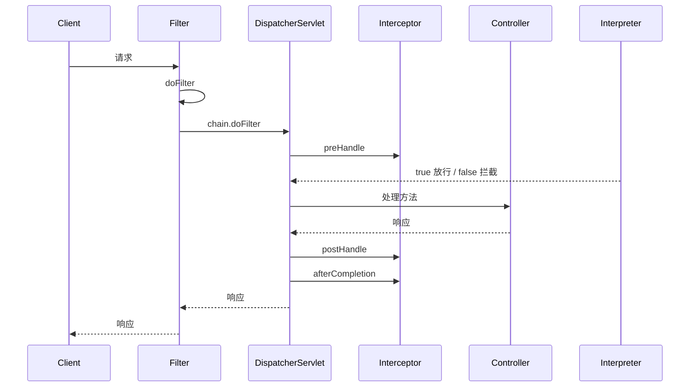

```java
// 登录拦截器
@Component
public class LoginInterceptor implements HandlerInterceptor {

    @Override
    public boolean preHandle(HttpServletRequest request,
                              HttpServletResponse response,
                              Object handler) throws Exception {
        String token = request.getHeader("Authorization");
        if (token == null || token.isBlank()) {
            response.setStatus(401);
            response.setContentType("application/json");
            response.getWriter().write("{\"code\":401,\"message\":\"未登录\"}");
            return false;
        }
        // 解析 token 设置用户信息到 ThreadLocal
        UserContext.setCurrentUserId(parseUserId(token));
        return true;
    }

    @Override
    public void postHandle(HttpServletRequest request,
                            HttpServletResponse response,
                            Object handler,
                            ModelAndView modelAndView) {
        // 视图渲染前（仅 Controller 有用视图时）
    }

    @Override
    public void afterCompletion(HttpServletRequest request,
                                 HttpServletResponse response,
                                 Object handler,
                                 Exception ex) {
        // 清理 ThreadLocal
        UserContext.clear();
    }

    private Long parseUserId(String token) {
        return 1L; // 模拟
    }
}

// 日志拦截器
@Component
public class LoggingInterceptor implements HandlerInterceptor {

    private static final ThreadLocal<Long> START_TIME = new ThreadLocal<>();

    @Override
    public boolean preHandle(HttpServletRequest request,
                              HttpServletResponse response,
                              Object handler) {
        START_TIME.set(System.currentTimeMillis());
        System.out.println("[请求] " + request.getMethod() + " " + request.getRequestURI());
        return true;
    }

    @Override
    public void afterCompletion(HttpServletRequest request,
                                 HttpServletResponse response,
                                 Object handler,
                                 Exception ex) {
        long elapsed = System.currentTimeMillis() - START_TIME.get();
        System.out.println("[响应] " + response.getStatus() + " 耗时: " + elapsed + "ms");
        START_TIME.remove();
    }
}

// 注册拦截器
@Configuration
public class WebConfig implements WebMvcConfigurer {

    @Autowired
    private LoginInterceptor loginInterceptor;

    @Autowired
    private LoggingInterceptor loggingInterceptor;

    @Override
    public void addInterceptors(InterceptorRegistry registry) {
        registry.addInterceptor(loggingInterceptor)
                .addPathPatterns("/**")
                .order(1);

        registry.addInterceptor(loginInterceptor)
                .addPathPatterns("/api/**")
                .excludePathPatterns("/api/auth/login", "/api/auth/register")
                .order(2);
    }
}
```

### 4.9 Filter vs Interceptor vs Aspect 对比

| 特性 | Filter | Interceptor | Aspect |
|------|--------|-------------|--------|
| 规范 | Servlet 规范 | Spring MVC | Spring AOP |
| 作用范围 | 所有 Web 请求 | Spring MVC 请求 | 任意 Bean 方法 |
| 参数 | Servlet 请求/响应 | Handler/ModelAndView | Method/ProceedingJoinPoint |
| 粒度 | 粗（URL 路径） | 中（URL + Handler） | 细（方法签名/注解） |
| 执行时机 | 进入 Servlet 前 | Handler 前后 | 方法调用前后 |
| 可使用 | 无 Spring 依赖 | Spring 容器 | Spring 容器 |

**选择建议：**

| 场景 | 推荐方式 |
|------|----------|
| 字符编码、CORS 全局 | Filter |
| 登录校验、权限拦截 | Interceptor |
| 日志、缓存、事务、性能监控 | Aspect |

### 4.10 CORS 跨域配置

```java
// 方式一：全局配置
@Configuration
public class CorsConfig implements WebMvcConfigurer {

    @Override
    public void addCorsMappings(CorsRegistry registry) {
        registry.addMapping("/api/**")
                .allowedOriginPatterns("*")     // 允许的来源
                .allowedMethods("GET", "POST", "PUT", "DELETE", "OPTIONS")
                .allowedHeaders("*")
                .allowCredentials(true)         // 允许携带 cookie
                .maxAge(3600);                  // 预检请求缓存时间
    }
}

// 方式二：@CrossOrigin 注解（方法/类级别）
@RestController
@RequestMapping("/api/users")
@CrossOrigin(origins = "http://localhost:3000")
public class UserController {

    @GetMapping("/{id}")
    @CrossOrigin(origins = "*")  // 方法级别覆盖类级别
    public User getUser(@PathVariable Long id) {
        return new User(id, "test");
    }
}

// 方式三：CorsFilter Bean（Spring Boot）
@Bean
public CorsFilter corsFilter() {
    UrlBasedCorsConfigurationSource source = new UrlBasedCorsConfigurationSource();
    CorsConfiguration config = new CorsConfiguration();
    config.setAllowCredentials(true);
    config.setAllowedOriginPatterns(List.of("*"));
    config.setAllowedMethods(List.of("*"));
    config.setAllowedHeaders(List.of("*"));
    source.registerCorsConfiguration("/api/**", config);
    return new CorsFilter(source);
}
```

### 4.11 文件上传 MultipartFile

```java
@RestController
@RequestMapping("/api/files")
public class FileUploadController {

    private static final long MAX_FILE_SIZE = 10 * 1024 * 1024; // 10MB

    // 单文件上传
    @PostMapping("/upload")
    public Map<String, String> upload(
            @RequestParam("file") MultipartFile file) {

        if (file.isEmpty()) {
            throw new BusinessException(400, "文件为空");
        }
        if (file.getSize() > MAX_FILE_SIZE) {
            throw new BusinessException(400, "文件大小超过限制");
        }

        // 保存到本地
        String filename = UUID.randomUUID() + "_" + file.getOriginalFilename();
        Path path = Path.of("uploads", filename);
        try {
            Files.createDirectories(path.getParent());
            Files.write(path, file.getBytes());
        } catch (IOException e) {
            throw new RuntimeException("文件保存失败", e);
        }

        return Map.of("url", "/files/" + filename);
    }

    // 多文件上传
    @PostMapping("/uploads")
    public List<Map<String, String>> uploadMultiple(
            @RequestParam("files") List<MultipartFile> files) {
        return files.stream().map(this::uploadSingle).toList();
    }

    private Map<String, String> uploadSingle(MultipartFile file) {
        // 同上
        return Map.of("name", file.getOriginalFilename());
    }

    // 文件下载
    @GetMapping("/download/{filename}")
    public ResponseEntity<Resource> download(@PathVariable String filename) {
        Path path = Path.of("uploads", filename);
        if (!Files.exists(path)) {
            return ResponseEntity.notFound().build();
        }
        Resource resource = new UrlResource(path.toUri());
        return ResponseEntity.ok()
                .contentType(MediaType.APPLICATION_OCTET_STREAM)
                .header(HttpHeaders.CONTENT_DISPOSITION,
                        "attachment; filename=\"" + filename + "\"")
                .body(resource);
    }
}
```

**配置文件上传大小：**

```yaml
# application.yml
spring:
  servlet:
    multipart:
      enabled: true
      max-file-size: 10MB
      max-request-size: 50MB
      location: ${java.io.tmpdir}
```

### 4.12 HandlerMethodArgumentResolver 自定义参数解析器

```java
// 自定义注解
@Target(ElementType.PARAMETER)
@Retention(RetentionPolicy.RUNTIME)
public @interface CurrentUser {
}

// 参数解析器
@Component
public class CurrentUserArgumentResolver implements HandlerMethodArgumentResolver {

    @Override
    public boolean supportsParameter(MethodParameter parameter) {
        return parameter.hasParameterAnnotation(CurrentUser.class)
                && parameter.getParameterType().equals(User.class);
    }

    @Override
    public Object resolveArgument(MethodParameter parameter,
                                   ModelAndViewContainer mavContainer,
                                   NativeWebRequest webRequest,
                                   WebDataBinderFactory binderFactory) {
        // 从请求头/Token 中解析当前用户
        String token = webRequest.getHeader("Authorization");
        if (token == null) {
            return null;
        }
        // 模拟从 Token 解析用户
        return new User(1L, "当前用户");
    }
}

// 注册
@Configuration
public class WebConfig implements WebMvcConfigurer {

    @Autowired
    private CurrentUserArgumentResolver currentUserResolver;

    @Override
    public void addArgumentResolvers(List<HandlerMethodArgumentResolver> resolvers) {
        resolvers.add(currentUserResolver);
    }
}

// 使用
@RestController
@RequestMapping("/api")
public class UserController {

    @GetMapping("/me")
    public User getCurrentUser(@CurrentUser User user) {
        // 直接获取当前登录用户对象
        return user;
    }
}
```

### 4.13 Spring WebFlux 响应式简介

```java
// WebFlux 使用 Reactor 库（Mono/Flux）
// 依赖: spring-boot-starter-webflux

// Mono — 0 或 1 个元素的异步序列
// Flux — 0 到 N 个元素的异步序列

@RestController
@RequestMapping("/api/reactive")
public class ReactiveController {

    // 返回单个元素
    @GetMapping("/user/{id}")
    public Mono<User> getUser(@PathVariable Long id) {
        return userReactiveRepository.findById(id);
    }

    // 返回列表
    @GetMapping("/users")
    public Flux<User> listUsers() {
        return userReactiveRepository.findAll();
    }

    // 异步创建
    @PostMapping("/users")
    public Mono<User> create(@RequestBody User user) {
        return userReactiveRepository.save(user);
    }

    // 延迟 + 转换
    @GetMapping("/delayed")
    public Mono<String> delayed() {
        return Mono.just("Hello")
                .delayElement(Duration.ofSeconds(1))
                .map(s -> s + " WebFlux");
    }

    // 合并多个异步结果
    @GetMapping("/combined")
    public Mono<Map<String, Object>> combined() {
        Mono<User> user = userReactiveRepository.findById(1L);
        Mono<List<Order>> orders = orderReactiveRepository.findByUserId(1L).collectList();

        return Mono.zip(user, orders)
                .map(tuple -> {
                    Map<String, Object> result = new HashMap<>();
                    result.put("user", tuple.getT1());
                    result.put("orders", tuple.getT2());
                    return result;
                });
    }
}

// 响应式 vs 传统：WebFlux 支持高并发、背压、非阻塞 IO
// 适用：高吞吐网关、实时数据流、长连接
```

---

## 5. 其他核心

### 5.1 @Cacheable / @CacheEvict / @CachePut 缓存抽象

```java
@Service
public class UserCacheService {

    // @Cacheable：先从缓存获取，没有则执行方法并放入缓存
    @Cacheable(value = "users", key = "#id")
    public User findById(Long id) {
        System.out.println("查询数据库: " + id);
        return new User(id, "test");
    }

    // condition：满足条件才缓存
    @Cacheable(value = "users", key = "#user.id",
               condition = "#user.age > 18")
    public User create(User user) {
        return userRepository.save(user);
    }

    // unless：满足条件不缓存（返回值判断）
    @Cacheable(value = "users", key = "#id",
               unless = "#result == null")
    public User findOrNull(Long id) {
        return userRepository.findById(id).orElse(null);
    }

    // @CachePut：始终执行方法并更新缓存
    @CachePut(value = "users", key = "#user.id")
    public User update(User user) {
        System.out.println("更新数据库并刷新缓存");
        return userRepository.save(user);
    }

    // @CacheEvict：清除缓存
    @CacheEvict(value = "users", key = "#id")
    public void deleteById(Long id) {
        System.out.println("删除用户并清除缓存");
        userRepository.deleteById(id);
    }

    // allEntries：清除分区所有缓存
    @CacheEvict(value = "users", allEntries = true)
    public void clearAllCache() {
        System.out.println("清空所有用户缓存");
    }

    // 多个缓存操作组合
    @Caching(
        put = { @CachePut(value = "users", key = "#user.id") },
        evict = { @CacheEvict(value = "userLists", allEntries = true) }
    )
    public User saveUser(User user) {
        return userRepository.save(user);
    }
}

// 启用缓存
@SpringBootApplication
@EnableCaching
public class Application {
    public static void main(String[] args) {
        SpringApplication.run(Application.class, args);
    }
}
```

### 5.2 @Scheduled + @EnableScheduling 定时任务

```java
@Component
public class ScheduledTasks {

    // 固定延迟（上次完成后）
    @Scheduled(fixedDelay = 5000)
    public void fixedDelayTask() {
        System.out.println("固定延迟 5s 执行: " + LocalDateTime.now());
    }

    // 固定速率（上次开始后，不考虑执行时间）
    @Scheduled(fixedRate = 10000)
    public void fixedRateTask() {
        System.out.println("固定速率 10s 执行: " + LocalDateTime.now());
    }

    // 初始延迟
    @Scheduled(fixedDelay = 5000, initialDelay = 15000)
    public void delayedTask() {
        System.out.println("启动 15s 后开始，每 5s 执行");
    }

    // Cron 表达式（秒 分 时 日 月 周）
    // 每天 10:15 执行
    @Scheduled(cron = "0 15 10 * * ?")
    public void cronTask() {
        System.out.println("每天 10:15 执行");
    }

    // 每 5 分钟执行一次
    @Scheduled(cron = "0 */5 * * * ?")
    public void cronEvery5Min() {
        System.out.println("每 5 分钟执行");
    }

    // 工作日 9-18 点每小时执行
    @Scheduled(cron = "0 0 9-18 ? * MON-FRI")
    public void workHoursTask() {
        System.out.println("工作日 9-18 点每小时");
    }

    // 每月1号凌晨2点
    @Scheduled(cron = "0 0 2 1 * ?")
    public void monthlyTask() {
        System.out.println("每月1号凌晨2点执行");
    }
}

// 启用调度
@Configuration
@EnableScheduling
public class SchedulingConfig { }

// 配置线程池（避免阻塞主线程）
@Configuration
public class SchedulerConfig implements SchedulingConfigurer {

    @Override
    public void configureTasks(ScheduledTaskRegistrar taskRegistrar) {
        ThreadPoolTaskScheduler scheduler = new ThreadPoolTaskScheduler();
        scheduler.setPoolSize(5);
        scheduler.setThreadNamePrefix("scheduled-");
        scheduler.initialize();
        taskRegistrar.setTaskScheduler(scheduler);
    }
}
```

### 5.3 @Async + @EnableAsync 异步

```java
@Component
public class AsyncService {

    // 无返回值异步
    @Async
    public void sendEmail(String to, String content) {
        System.out.println(Thread.currentThread().getName() + " 发送邮件给 " + to);
        // 模拟耗时
        try { Thread.sleep(2000); } catch (InterruptedException e) { }
        System.out.println("邮件发送完成");
    }

    // 有返回值异步
    @Async
    public CompletableFuture<String> processReport(Long reportId) {
        System.out.println(Thread.currentThread().getName() + " 处理报表 " + reportId);
        try { Thread.sleep(3000); } catch (InterruptedException e) { }
        return CompletableFuture.completedFuture("报表 " + reportId + " 处理完成");
    }
}

@Component
public class AsyncCaller {

    @Autowired
    private AsyncService asyncService;

    public void callAsync() {
        System.out.println("主线程: " + Thread.currentThread().getName());

        // 异步执行，不阻塞
        asyncService.sendEmail("test@test.com", "Hello");

        // 异步并等待结果
        CompletableFuture<String> future = asyncService.processReport(100L);
        future.thenAccept(System.out::println);

        System.out.println("主线程继续...");
    }
}

// 启用异步 + 自定义线程池
@Configuration
@EnableAsync
public class AsyncConfig implements AsyncConfigurer {

    @Override
    public Executor getAsyncExecutor() {
        ThreadPoolTaskExecutor executor = new ThreadPoolTaskExecutor();
        executor.setCorePoolSize(5);
        executor.setMaxPoolSize(10);
        executor.setQueueCapacity(100);
        executor.setThreadNamePrefix("async-");
        executor.setRejectedExecutionHandler(new ThreadPoolExecutor.CallerRunsPolicy());
        executor.initialize();
        return executor;
    }

    @Override
    public AsyncUncaughtExceptionHandler getAsyncUncaughtExceptionHandler() {
        return (ex, method, params) -> {
            System.err.println("异步方法异常: " + method.getName()
                             + ", 错误: " + ex.getMessage());
        };
    }
}

// 或直接在 @Async 指定线程池名称
@Async("customExecutor")
public void customPoolTask() { }
```

### 5.4 Spring 测试

```java
// 完整集成测试
@SpringBootTest(webEnvironment = WebEnvironment.RANDOM_PORT)
@AutoConfigureMockMvc
class UserControllerTest {

    @Autowired
    private MockMvc mockMvc;

    @MockBean  // 替换容器中的真实 Bean
    private UserService userService;

    @Test
    void testGetUser() throws Exception {
        // 模拟 Service 层
        when(userService.findById(1L))
                .thenReturn(new User(1L, "test"));

        mockMvc.perform(get("/api/users/1"))
                .andExpect(status().isOk())
                .andExpect(jsonPath("$.name").value("test"));
    }
}

// 仅测试 Web 层
@WebMvcTest(UserController.class)
class UserControllerWebTest {

    @Autowired
    private MockMvc mockMvc;

    @MockBean
    private UserService userService;

    @Test
    void testList() throws Exception {
        when(userService.findAll()).thenReturn(List.of(
                new User(1L, "Alice"),
                new User(2L, "Bob")
        ));

        mockMvc.perform(get("/api/users"))
                .andExpect(status().isOk())
                .andExpect(jsonPath("$.size()").value(2));
    }
}

// 仅测试持久层
@DataJpaTest
class UserRepositoryTest {

    @Autowired
    private TestEntityManager entityManager;

    @Autowired
    private UserRepository userRepository;

    @Test
    void testFindByName() {
        entityManager.persist(new User("test", "test@test.com"));

        Optional<User> found = userRepository.findByName("test");
        assertThat(found).isPresent();
        assertThat(found.get().getEmail()).isEqualTo("test@test.com");
    }
}

// 切片测试 @JsonTest
@JsonTest
class UserJsonTest {

    @Autowired
    private JacksonTester<User> json;

    @Test
    void testSerialization() throws Exception {
        User user = new User(1L, "test");
        assertThat(json.write(user))
                .isStrictlyEqualToJson("expected-user.json");
    }
}
```

### 5.5 Spring 设计模式总结表

| 设计模式 | Spring 体现 | 示例位置 |
|----------|-------------|----------|
| **工厂模式** | BeanFactory / FactoryBean | 容器创建 Bean 实例 |
| **单例模式** | 默认 Bean 作用域 singleton | `@Scope("singleton")` |
| **原型模式** | prototype 作用域 | `@Scope("prototype")` |
| **代理模式** | AOP / `@Lazy` 代理 | JDK Proxy / CGLIB |
| **模板方法** | JdbcTemplate / RestTemplate / TransactionTemplate | 骨架 + 回调 |
| **策略模式** | Resource 实现类 / 认证 Provider | ClassPathResource / UrlResource |
| **观察者模式** | ApplicationEvent / ApplicationListener | 事件驱动 |
| **适配器模式** | HandlerAdapter / AdvisorAdapter | 适配不同 Controller 类型 |
| **装饰器模式** | BeanWrapper / HttpHeadResponseDecorator | 包装增强 |
| **责任链模式** | HandlerInterceptor chain / FilterChain | 拦截器链 |
| **委派模式** | DispatcherServlet / BeanDefinitionParserDelegate | 委派给实际处理器 |
| **门面模式** | JdbcTemplate 统一数据访问 | 封装 JDBC 细节 |
| **建造者模式** | BeanDefinitionBuilder / UriComponentsBuilder | 链式构建 |
| **桥接模式** | ViewResolver 体系 | 视图逻辑与视图类型解耦 |
| **组合模式** | CompositeCacheManager / CompositeFilter | 统一管理多个组件 |
| **享元模式** | 连接池 / 线程池 | 资源复用 |

---

> **参考**：Spring Framework 6.x 官方文档、Spring Boot 3.x 官方指南

**Done**
