# Spring Boot 知识体系

> 本文档系统梳理 Spring Boot 核心知识点，涵盖自动配置、配置管理、内嵌容器、数据访问、监控运维、测试和部署高级特性。

---

## 目录

1. [自动配置原理](#1-自动配置原理)
2. [配置管理](#2-配置管理)
3. [内嵌 Web 容器](#3-内嵌-web-容器)
4. [数据访问](#4-数据访问)
5. [监控与运维（Actuator）](#5-监控与运维actuator)
6. [测试](#6-测试)
7. [部署与高级特性](#7-部署与高级特性)

---

## 1. 自动配置原理

### 1.1 @SpringBootApplication 组合注解

`@SpringBootApplication` 是一个组合注解，等价于下面三个注解的集合：

```java
@Target(ElementType.TYPE)
@Retention(RetentionPolicy.RUNTIME)
@Documented
@Inherited
@SpringBootConfiguration     // 本质是 @Configuration
@EnableAutoConfiguration    // 开启自动配置
@ComponentScan(excludeFilters = {  // 组件扫描
    @Filter(type = FilterType.CUSTOM, classes = TypeExcludeFilter.class),
    @Filter(type = FilterType.CUSTOM, classes = AutoConfigurationExcludeFilter.class)
})
public @interface SpringBootApplication {
    // ...
}
```

| 注解 | 作用 |
|------|------|
| `@SpringBootConfiguration` | 本质是 `@Configuration`，标识该类为配置类 |
| `@EnableAutoConfiguration` | 开启自动配置机制，是自动配置的核心入口 |
| `@ComponentScan` | 自动扫描 `@Component`、`@Service`、`@Repository`、`@Controller` 等 |

### 1.2 自动配置核心流程

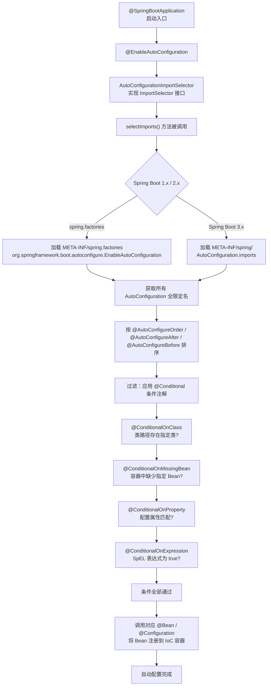

**核心类 `AutoConfigurationImportSelector` 执行流程：**

```java
public class AutoConfigurationImportSelector implements DeferredImportSelector, BeanClassLoaderAware {
    
    @Override
    public String[] selectImports(AnnotationMetadata annotationMetadata) {
        // 1. 检查是否开启自动配置
        if (!isEnabled(annotationMetadata)) {
            return NO_IMPORTS;
        }
        // 2. 加载自动配置元数据
        AutoConfigurationEntry autoConfigurationEntry = getAutoConfigurationEntry(annotationMetadata);
        return StringUtils.toStringArray(autoConfigurationEntry.getConfigurations());
    }
    
    protected AutoConfigurationEntry getAutoConfigurationEntry(AnnotationMetadata annotationMetadata) {
        // 3. 获取所有候选配置类
        List<String> configurations = getCandidateConfigurations(annotationMetadata, attributes);
        // 4. 去重
        configurations = removeDuplicates(configurations);
        // 5. 排除指定不需要的配置
        Set<String> exclusions = getExclusions(annotationMetadata, attributes);
        configurations.removeAll(exclusions);
        // 6. 按条件过滤（@Conditional）
        configurations = getConfigurationClassFilter().filter(configurations);
        return new AutoConfigurationEntry(configurations, exclusions);
    }
}
```

### 1.3 @Conditional 条件注解

| 注解 | 条件 |
|------|------|
| `@ConditionalOnClass` | 类路径存在指定类 |
| `@ConditionalOnMissingClass` | 类路径不存在指定类 |
| `@ConditionalOnBean` | 容器中存在指定 Bean |
| `@ConditionalOnMissingBean` | 容器中不存在指定 Bean |
| `@ConditionalOnProperty` | 配置属性匹配指定值 |
| `@ConditionalOnExpression` | SpEL 表达式为 true |
| `@ConditionalOnResource` | 指定资源存在 |
| `@ConditionalOnWebApplication` | 当前是 Web 应用 |
| `@ConditionalOnNotWebApplication` | 当前不是 Web 应用 |
| `@ConditionalOnSingleCandidate` | 容器中指定 Bean 只有一个候选 |

**代码示例：**

```java
@Configuration
@ConditionalOnClass(name = "com.zaxxer.hikari.HikariDataSource")
@ConditionalOnProperty(name = "app.datasource.type", havingValue = "hikari", matchIfMissing = true)
public class HikariAutoConfiguration {

    @Bean
    @ConditionalOnMissingBean
    @ConditionalOnProperty(name = "spring.datasource.url")
    public DataSource dataSource(
            @Value("${spring.datasource.url}") String url,
            @Value("${spring.datasource.username}") String username,
            @Value("${spring.datasource.password}") String password) {
        HikariConfig config = new HikariConfig();
        config.setJdbcUrl(url);
        config.setUsername(username);
        config.setPassword(password);
        config.setMaximumPoolSize(20);
        return new HikariDataSource(config);
    }
}
```

**@ConditionalOnExpression 示例：**

```java
@Configuration
@ConditionalOnExpression("${app.feature.x.enabled:false} and '${app.env}' != 'production'")
public class FeatureXConfiguration {
    // 仅当 feature 开启且非生产环境时生效
}
```

### 1.4 自定义 Starter

**场景：** 实现一个短信发送 Starter，项目引入即可使用。

**完整的 Maven 模块结构：**

```
sms-spring-boot-starter/
├── pom.xml
└── src/main/
    ├── java/com/example/sms/
    │   ├── SmsAutoConfiguration.java
    │   ├── SmsProperties.java
    │   ├── SmsTemplate.java
    │   └── SmsService.java
    └── resources/
        └── META-INF/
            └── spring.factories         # Spring Boot 2.x
            └── spring/
                └── AutoConfiguration.imports   # Spring Boot 3.x
```

**1. SmsProperties.java**

```java
@ConfigurationProperties(prefix = "sms")
public class SmsProperties {
    private String accessKey = "default-key";
    private String secretKey = "default-secret";
    private String region = "cn-east-1";
    private int connectTimeout = 5000;

    // getters / setters
    public String getAccessKey() { return accessKey; }
    public void setAccessKey(String accessKey) { this.accessKey = accessKey; }
    public String getSecretKey() { return secretKey; }
    public void setSecretKey(String secretKey) { this.secretKey = secretKey; }
    public String getRegion() { return region; }
    public void setRegion(String region) { this.region = region; }
    public int getConnectTimeout() { return connectTimeout; }
    public void setConnectTimeout(int connectTimeout) { this.connectTimeout = connectTimeout; }
}
```

**2. SmsTemplate.java**

```java
public class SmsTemplate {
    private final SmsProperties properties;

    public SmsTemplate(SmsProperties properties) {
        this.properties = properties;
    }

    public boolean send(String phone, String message) {
        System.out.printf("[SMS] 发送短信至 %s: %s (Key=%s, Region=%s)%n",
                phone, message, properties.getAccessKey(), properties.getRegion());
        // 实际调用第三方 SDK...
        return true;
    }
}
```

**3. SmsAutoConfiguration.java**

```java
@Configuration
@EnableConfigurationProperties(SmsProperties.class)
@ConditionalOnClass(SmsTemplate.class)
public class SmsAutoConfiguration {

    @Bean
    @ConditionalOnMissingBean
    public SmsTemplate smsTemplate(SmsProperties properties) {
        return new SmsTemplate(properties);
    }

    @Bean
    @ConditionalOnProperty(name = "sms.enable-health-check", havingValue = "true", matchIfMissing = false)
    public SmsHealthIndicator smsHealthIndicator(SmsTemplate smsTemplate) {
        return new SmsHealthIndicator(smsTemplate);
    }
}
```

**4. spring.factories（Spring Boot 2.x）**

```properties
# META-INF/spring.factories
org.springframework.boot.autoconfigure.EnableAutoConfiguration=\
com.example.sms.SmsAutoConfiguration
```

**5. AutoConfiguration.imports（Spring Boot 3.x）**

```properties
# META-INF/spring/org.springframework.boot.autoconfigure.AutoConfiguration.imports
com.example.sms.SmsAutoConfiguration
```

**6. 使用方式：**

```yaml
# application.yml
sms:
  access-key: my-access-key
  secret-key: my-secret-key
  region: cn-east-1
```

```java
@Autowired
private SmsTemplate smsTemplate;

public void doSomething() {
    smsTemplate.send("13800138000", "您的验证码是 123456");
}
```

### 1.5 Spring Boot 3.x 自动配置变化

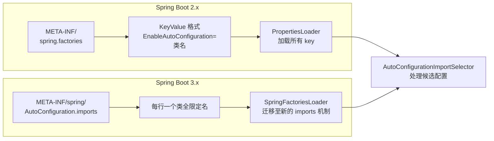

| 对比项 | Spring Boot 2.x | Spring Boot 3.x |
|--------|----------------|----------------|
| 文件位置 | `META-INF/spring.factories` | `META-INF/spring/AutoConfiguration.imports` |
| 文件格式 | key=value 多行 | 每行一个类名 |
| 加载器 | `SpringFactoriesLoader` | 标准 `ImportSelector` + `ImportCandidates` |
| JDK 基线 | JDK 8+ | JDK 17+ |
| 迁移方式 | - | 从 spring.factories 提取 `EnableAutoConfiguration` 行到 `.imports` 文件 |

### 1.6 SpringApplication 运行流程

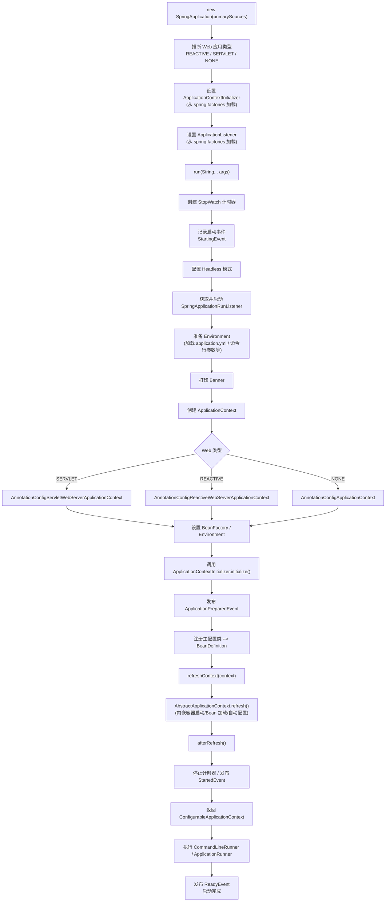

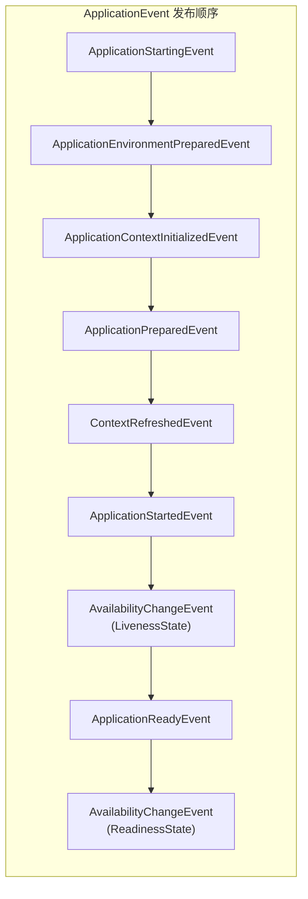

**生命周期钩子：**

```java
@Bean
public CommandLineRunner commandLineRunner() {
    return args -> System.out.println("应用启动完成，参数: " + Arrays.toString(args));
}

@Component
public class MyApplicationRunner implements ApplicationRunner {
    @Override
    public void run(ApplicationArguments args) {
        System.out.println("非选项参数: " + args.getNonOptionArgs());
        System.out.println("选项参数: " + args.getOptionNames());
    }
}
```

---

## 2. 配置管理

### 2.1 配置优先级（从高到低）

```mermaid
flowchart TB
    P01["1. @TestPropertySource 注解"]:::high
    P02["2. 命令行参数 --server.port=9090"]:::high
    P03["3. SPRING_APPLICATION_JSON 环境变量"]:::high
    P04["4. ServletConfig 初始化参数"]:::mid
    P05["5. ServletContext 初始化参数"]:::mid
    P06["6. JNDI 属性 java:comp/env"]:::mid
    P07["7. System.getProperties() JVM 系统属性"]:::mid
    P08["8. OS 环境变量"]:::mid
    P09["9. application-{profile}.properties/yml"]:::mid
    P10["10. application.properties/yml"]:::low
    P11["11. @PropertySource 加载的配置"]:::low
    P12["12. spring.config.import 导入配置"]:::low
    P13["13. 默认属性 SpringApplication.setDefaultProperties"]:::low
    P14["14. RandomValuePropertySource ${random.*}"]:::lowest

    classDef high fill:#f96,stroke:#333
    classDef mid fill:#fc9,stroke:#333
    classDef low fill:#ffc,stroke:#333
    classDef lowest fill:#eee,stroke:#333
```

> **规则：** 高优先级覆盖低优先级。命令行 `--server.port=9090` 的优先级高于 `application.yml` 中的 `server.port`。

### 2.2 多环境配置

```yaml
# application.yml — 通用配置
server:
  port: 8080

spring:
  profiles:
    active: dev  # 激活 dev 环境
---
# application-dev.yml — 开发环境
server:
  port: 8080

spring:
  datasource:
    url: jdbc:mysql://localhost:3306/dev_db
    username: dev_user
    password: dev_pass
---
# application-prod.yml — 生产环境
server:
  port: 80

spring:
  datasource:
    url: jdbc:mysql://prod-host:3306/prod_db
    username: prod_user
    password: ${DB_PASSWORD}  # 引用环境变量
```

**多环境激活方式：**

```bash
# 命令行
java -jar app.jar --spring.profiles.active=prod

# 环境变量
set SPRING_PROFILES_ACTIVE=prod

# application.yml 指定
spring:
  profiles:
    active: prod
```

### 2.3 @ConfigurationProperties + @EnableConfigurationProperties

**配置类绑定：**

```yaml
# application.yml
app:
  name: 我的应用
  version: 1.0.0
  contact:
    email: admin@example.com
    phone: "400-123-4567"
  features:
    - logging
    - monitoring
    - caching
```

```java
@ConfigurationProperties(prefix = "app")
public class AppProperties {
    private String name;
    private String version;
    private Contact contact = new Contact();
    private List<String> features = new ArrayList<>();

    // getters / setters
    public String getName() { return name; }
    public void setName(String name) { this.name = name; }
    public String getVersion() { return version; }
    public void setVersion(String version) { this.version = version; }
    public Contact getContact() { return contact; }
    public void setContact(Contact contact) { this.contact = contact; }
    public List<String> getFeatures() { return features; }
    public void setFeatures(List<String> features) { this.features = features; }

    public static class Contact {
        private String email;
        private String phone;
        // getters / setters
        public String getEmail() { return email; }
        public void setEmail(String email) { this.email = email; }
        public String getPhone() { return phone; }
        public void setPhone(String phone) { this.phone = phone; }
    }
}
```

**启用配置绑定：**

```java
@SpringBootApplication
@EnableConfigurationProperties(AppProperties.class)
public class Application {
    public static void main(String[] args) {
        SpringApplication.run(Application.class, args);
    }
}

// 或者在任意 @Configuration 类上
@Configuration
@EnableConfigurationProperties(AppProperties.class)
public class AppConfig {
}
```

```java
@Service
public class AppService {
    private final AppProperties appProperties;

    public AppService(AppProperties appProperties) {
        this.appProperties = appProperties;
    }

    public void printInfo() {
        System.out.println("应用名称: " + appProperties.getName());
        System.out.println("版本: " + appProperties.getVersion());
        System.out.println("联系邮箱: " + appProperties.getContact().getEmail());
        System.out.println("功能列表: " + String.join(", ", appProperties.getFeatures()));
    }
}
```

**@ConfigurationProperties 校验：**

```java
@ConfigurationProperties(prefix = "app")
@Validated
public class AppProperties {
    @NotBlank(message = "应用名称不能为空")
    private String name;

    @Pattern(regexp = "\\d+\\.\\d+\\.\\d+", message = "版本号格式 x.y.z")
    private String version;

    @Valid
    private Contact contact = new Contact();

    // ...
}
```

### 2.4 @Value 注入 + SpEL

```java
@Component
public class ConfigDemo {

    // 简单值注入
    @Value("${app.name}")
    private String appName;

    @Value("${app.version:1.0.0}")  // 带默认值
    private String version;

    // SpEL 表达式
    @Value("#{2 * T(java.lang.Math).PI * 10}")
    private double circumference;

    @Value("#{systemProperties['user.dir']}")
    private String userDir;

    @Value("#{systemEnvironment['JAVA_HOME']}")
    private String javaHome;

    @Value("#{'${app.features}'.split(',')}")
    private List<String> featureList;

    // 字面量
    @Value("Hello World")
    private String literalValue;

    // 随机值
    @Value("${random.int(1,100)}")
    private int randomInt;
}
```

### 2.5 @PropertySource 加载外部配置

```java
@Configuration
@PropertySource(
    value = {
        "classpath:config/db.properties",
        "file:${user.home}/app-config/custom.properties"  // 外部文件系统
    },
    encoding = "UTF-8",
    ignoreResourceNotFound = true
)
public class ExternalConfig {
    @Value("${db.custom.url}")
    private String dbUrl;
}
```

```properties
# config/db.properties
db.custom.url=jdbc:postgresql://localhost:5432/custom_db
db.custom.username=custom_user
db.custom.password=custom_pass
```

### 2.6 配置随机值

```yaml
# application.yml
app:
  secret:
    id: ${random.uuid}
    number: ${random.int}
    range: ${random.int(1000,9999)}
    long: ${random.long}
    string: ${random.alphanumeric(16)}
```

```java
@Component
public class RandomConfig {
    @Value("${app.secret.id}")
    private String uuid;

    @Value("${app.secret.range}")
    private int rangeNumber;

    @Value("${app.secret.string}")
    private String randomString;
}
```

### 2.7 配置加密 Jasypt

**引入依赖：**

```xml
<!-- pom.xml -->
<dependency>
    <groupId>com.github.ulisesbocchio</groupId>
    <artifactId>jasypt-spring-boot-starter</artifactId>
    <version>3.0.5</version>
</dependency>
```

**配置：**

```yaml
jasypt:
  encryptor:
    password: my-secret-key     # 加密密钥（不应硬编码，建议环境变量）
    algorithm: PBEWithMD5AndDES
    property:
      prefix: ENC(
      suffix: )

spring:
  datasource:
    password: ENC(encryptedPasswordHere)
```

**加密工具类：**

```java
import org.jasypt.util.text.BasicTextEncryptor;

public class JasyptEncryptor {
    public static void main(String[] args) {
        BasicTextEncryptor encryptor = new BasicTextEncryptor();
        encryptor.setPassword("my-secret-key");
        
        String plainText = "my-database-password";
        String encrypted = encryptor.encrypt(plainText);
        System.out.println("加密结果: " + encrypted);
    }
}
```

```yaml
# 生产环境推荐通过环境变量传入密钥（不写入配置文件）
jasypt:
  encryptor:
    password: ${JASYPT_ENCRYPTOR_PASSWORD}
```

### 2.8 bootstrap.yml vs application.yml

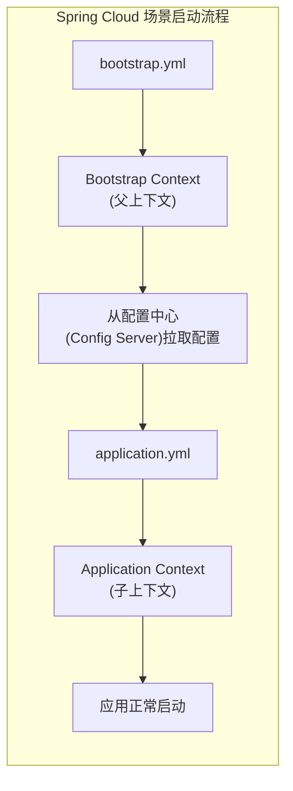

| 对比项 | bootstrap.yml | application.yml |
|--------|--------------|----------------|
| 加载时机 | 先加载（父上下文） | 后加载（主上下文） |
| 用途 | 拉取远程配置、配置中心地址 | 应用自身配置 |
| 典型配置 | `spring.cloud.config.uri` | `spring.datasource.*` |
| 引导上下文 | Bootstrap Context | Application Context |
| Spring Boot 3.x | 不再默认支持，需引入 `spring-cloud-starter-bootstrap` | 无变化 |

```yaml
# bootstrap.yml — 用于 Spring Cloud Config
spring:
  application:
    name: my-service
  cloud:
    config:
      uri: http://config-server:8888
      profile: prod
      label: main
---
# application.yml — 常规配置
server:
  port: 8080
```

---

## 3. 内嵌 Web 容器

### 3.1 Tomcat / Jetty / Undertow 切换

**默认 Tomcat（无需额外配置）：**

```xml
<dependency>
    <groupId>org.springframework.boot</groupId>
    <artifactId>spring-boot-starter-web</artifactId>
    <!-- 默认包含 spring-boot-starter-tomcat -->
</dependency>
```

**切换为 Jetty：**

```xml
<dependency>
    <groupId>org.springframework.boot</groupId>
    <artifactId>spring-boot-starter-web</artifactId>
    <exclusions>
        <exclusion>
            <groupId>org.springframework.boot</groupId>
            <artifactId>spring-boot-starter-tomcat</artifactId>
        </exclusion>
    </exclusions>
</dependency>
<dependency>
    <groupId>org.springframework.boot</groupId>
    <artifactId>spring-boot-starter-jetty</artifactId>
</dependency>
```

**切换为 Undertow：**

```xml
<dependency>
    <groupId>org.springframework.boot</groupId>
    <artifactId>spring-boot-starter-web</artifactId>
    <exclusions>
        <exclusion>
            <groupId>org.springframework.boot</groupId>
            <artifactId>spring-boot-starter-tomcat</artifactId>
        </exclusion>
    </exclusions>
</dependency>
<dependency>
    <groupId>org.springframework.boot</groupId>
    <artifactId>spring-boot-starter-undertow</artifactId>
</dependency>
```

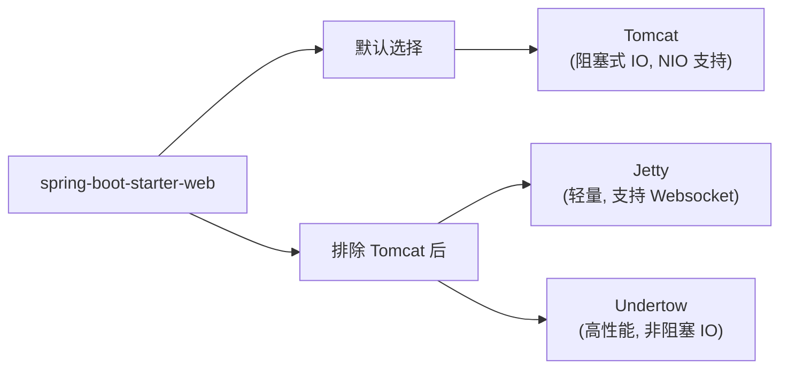

### 3.2 内嵌容器配置

**基础配置：**

```yaml
server:
  port: 8080
  address: 0.0.0.0
  servlet:
    context-path: /app
    session:
      timeout: 30m
  error:
    include-stacktrace: always
    path: /error
```

**SSL 配置：**

```yaml
server:
  port: 8443
  ssl:
    enabled: true
    key-store: classpath:keystore.p12
    key-store-password: changeit
    key-store-type: PKCS12
    key-alias: my-cert
    protocol: TLS
    enabled-protocols:
      - TLSv1.3
      - TLSv1.2
```

**HTTP → HTTPS 重定向：**

```java
@Configuration
public class HttpsRedirectConfig {

    @Bean
    public TomcatServletWebServerFactory servletContainer() {
        TomcatServletWebServerFactory factory = new TomcatServletWebServerFactory() {
            @Override
            protected void postProcessContext(Context context) {
                SecurityConstraint securityConstraint = new SecurityConstraint();
                securityConstraint.setUserConstraint("CONFIDENTIAL");
                SecurityCollection collection = new SecurityCollection();
                collection.addPattern("/*");
                securityConstraint.addCollection(collection);
                context.addConstraint(securityConstraint);
            }
        };
        factory.addAdditionalTomcatConnectors(createHttpConnector());
        return factory;
    }

    private Connector createHttpConnector() {
        Connector connector = new Connector(TomcatServletWebServerFactory.DEFAULT_PROTOCOL);
        connector.setScheme("http");
        connector.setPort(8080);
        connector.setSecure(false);
        connector.setRedirectPort(8443);
        return connector;
    }
}
```

**压缩配置：**

```yaml
server:
  compression:
    enabled: true
    mime-types: text/html,text/xml,text/plain,text/css,text/javascript,application/javascript,application/json
    min-response-size: 1024  # 仅压缩超过 1KB 的响应
```

**连接池 / 线程池配置（Tomcat）：**

```yaml
server:
  tomcat:
    # 连接池
    accept-count: 100              # 请求队列最大长度
    max-connections: 10000         # 最大连接数
    max-threads: 200               # 最大工作线程数
    min-spare-threads: 10          # 最小空闲工作线程数
    connection-timeout: 5000       # 连接超时（毫秒）
    max-swallow-size: 2MB          # 最大 swallow 大小
    max-http-form-post-size: 2MB   # POST 表单最大大小

    # URI 编码
    uri-encoding: UTF-8

    # 访问日志
    accesslog:
      enabled: true
      pattern: "%h %l %u %t \"%r\" %s %b %D"
      directory: logs/access
      file-date-format: ".yyyy-MM-dd"
```

**Undertow 配置示例：**

```yaml
server:
  undertow:
    buffer-size: 1024
    direct-buffers: true
    threads:
      io: 4          # IO 线程数（CPU 核心数）
      worker: 20     # 工作线程数
    accesslog:
      enabled: true
      pattern: "%h %l %u %t \"%r\" %s %b %D"
```

### 3.3 自定义 WebServerFactoryCustomizer

```java
@Component
public class MyWebServerFactoryCustomizer implements WebServerFactoryCustomizer<ConfigurableServletWebServerFactory> {

    @Override
    public void customize(ConfigurableServletWebServerFactory factory) {
        // 设置端口
        factory.setPort(9090);
        factory.setContextPath("/myapp");

        // 设置错误页面
        factory.addErrorPages(new ErrorPage(HttpStatus.NOT_FOUND, "/404.html"));
        factory.addErrorPages(new ErrorPage(HttpStatus.INTERNAL_SERVER_ERROR, "/500.html"));

        // 设置 Session
        factory.setSessionTimeout(Duration.ofMinutes(30));
    }
}
```

**针对特定容器的 Customizer：**

```java
@Component
public class TomcatCustomizer implements WebServerFactoryCustomizer<TomcatServletWebServerFactory> {

    @Override
    public void customize(TomcatServletWebServerFactory factory) {
        factory.addConnectorCustomizers(connector -> {
            connector.setProperty("maxKeepAliveRequests", "100");
            connector.setProperty("compression", "on");
            connector.setProperty("compressableMimeType", "text/html,text/xml,application/json");
        });

        factory.addContextCustomizers(context -> {
            context.setUseRelativeRedirects(false);
        });
    }
}
```

---

## 4. 数据访问

### 4.1 HikariCP 数据源配置与参数优化

```yaml
spring:
  datasource:
    url: jdbc:mysql://localhost:3306/my_db?useSSL=false&serverTimezone=Asia/Shanghai&allowPublicKeyRetrieval=true
    username: db_user
    password: db_pass
    driver-class-name: com.mysql.cj.jdbc.Driver

    # HikariCP 连接池
    hikari:
      pool-name: MyHikariPool
      minimum-idle: 5                  # 最小空闲连接
      maximum-pool-size: 20            # 最大连接数
      idle-timeout: 300000             # 空闲超时 5 分钟
      max-lifetime: 1200000            # 连接最大存活 20 分钟
      connection-timeout: 30000        # 获取连接超时 30 秒
      connection-test-query: SELECT 1  # 测试查询
      validation-timeout: 5000         # 验证超时
      leak-detection-threshold: 60000  # 连接泄漏检测阈值
      auto-commit: true
      read-only: false
```

**编程式配置：**

```java
@Configuration
public class DataSourceConfig {

    @Bean
    @ConfigurationProperties(prefix = "spring.datasource.hikari")
    public HikariConfig hikariConfig() {
        return new HikariConfig();
    }

    @Bean
    public DataSource dataSource(HikariConfig config) {
        return new HikariDataSource(config);
    }
}
```

**HikariCP 优化建议：**

| 参数 | 建议 |
|------|------|
| `maximum-pool-size` | CPU 核心数 × 2 + 有效磁盘数 |
| `minimum-idle` | 核心负载峰值时可用连接数 |
| `max-lifetime` | 比数据库连接超时少 30 秒 |
| `connection-timeout` | 不超过 30 秒 |
| `leak-detection-threshold` | 超过该时间未归还触发告警 |

### 4.2 多数据源配置

```yaml
spring:
  datasource:
    primary:
      url: jdbc:mysql://localhost:3306/primary_db
      username: primary_user
      password: primary_pass
      driver-class-name: com.mysql.cj.jdbc.Driver
    secondary:
      url: jdbc:postgresql://localhost:5432/secondary_db
      username: secondary_user
      password: secondary_pass
      driver-class-name: org.postgresql.Driver
```

```java
@Configuration
public class MultiDataSourceConfig {

    @Primary
    @Bean(name = "primaryDataSource")
    @ConfigurationProperties(prefix = "spring.datasource.primary")
    public DataSource primaryDataSource() {
        return DataSourceBuilder.create().build();
    }

    @Bean(name = "secondaryDataSource")
    @ConfigurationProperties(prefix = "spring.datasource.secondary")
    public DataSource secondaryDataSource() {
        return DataSourceBuilder.create().build();
    }

    @Primary
    @Bean(name = "primaryEntityManagerFactory")
    public LocalContainerEntityManagerFactoryBean primaryEntityManagerFactory(
            EntityManagerFactoryBuilder builder,
            @Qualifier("primaryDataSource") DataSource dataSource) {
        return builder
                .dataSource(dataSource)
                .packages("com.example.primary.entity")
                .persistenceUnit("primary")
                .build();
    }

    @Bean(name = "secondaryEntityManagerFactory")
    public LocalContainerEntityManagerFactoryBean secondaryEntityManagerFactory(
            EntityManagerFactoryBuilder builder,
            @Qualifier("secondaryDataSource") DataSource dataSource) {
        return builder
                .dataSource(dataSource)
                .packages("com.example.secondary.entity")
                .persistenceUnit("secondary")
                .build();
    }

    @Primary
    @Bean(name = "primaryTransactionManager")
    public PlatformTransactionManager primaryTransactionManager(
            @Qualifier("primaryEntityManagerFactory") EntityManagerFactory emf) {
        return new JpaTransactionManager(emf);
    }

    @Bean(name = "secondaryTransactionManager")
    public PlatformTransactionManager secondaryTransactionManager(
            @Qualifier("secondaryEntityManagerFactory") EntityManagerFactory emf) {
        return new JpaTransactionManager(emf);
    }
}
```

**使用 `@Qualifier` 区分：**

```java
@Service
public class UserService {

    private final UserRepository userRepository;
    private final LogRepository logRepository;

    public UserService(
            UserRepository userRepository,
            @Qualifier("secondaryLogRepository") LogRepository logRepository) {
        this.userRepository = userRepository;
        this.logRepository = logRepository;
    }
}
```

### 4.3 Spring Data JPA 整合

```xml
<dependency>
    <groupId>org.springframework.boot</groupId>
    <artifactId>spring-boot-starter-data-jpa</artifactId>
</dependency>
```

**Entity：**

```java
@Entity
@Table(name = "users")
public class User {

    @Id
    @GeneratedValue(strategy = GenerationType.IDENTITY)
    private Long id;

    @Column(nullable = false, length = 50)
    private String username;

    @Column(nullable = false, unique = true)
    private String email;

    @Column(name = "created_at")
    private LocalDateTime createdAt;

    @PrePersist
    protected void onCreate() {
        createdAt = LocalDateTime.now();
    }

    // getters / setters
}
```

**Repository：**

```java
public interface UserRepository extends JpaRepository<User, Long> {

    // 根据方法名自动生成查询
    User findByUsername(String username);

    List<User> findByEmailContaining(String emailPart);

    long countByCreatedAtAfter(LocalDateTime date);

    // JPQL 自定义查询
    @Query("SELECT u FROM User u WHERE u.email = :email AND u.username = :username")
    Optional<User> findByEmailAndUsername(@Param("email") String email, @Param("username") String username);

    // 原生 SQL 查询
    @Query(value = "SELECT * FROM users WHERE DATE(created_at) = CURRENT_DATE", nativeQuery = true)
    List<User> findTodayCreatedUsers();

    // 分页
    Page<User> findAll(Pageable pageable);

    // 更新操作
    @Modifying
    @Transactional
    @Query("UPDATE User u SET u.email = :email WHERE u.username = :username")
    int updateEmailByUsername(@Param("email") String email, @Param("username") String username);
}
```

**Service：**

```java
@Service
public class UserService {

    private final UserRepository userRepository;

    public UserService(UserRepository userRepository) {
        this.userRepository = userRepository;
    }

    public User createUser(String username, String email) {
        User user = new User();
        user.setUsername(username);
        user.setEmail(email);
        return userRepository.save(user);
    }

    public Page<User> listUsers(int page, int size) {
        return userRepository.findAll(PageRequest.of(page, size, Sort.by("createdAt").descending()));
    }
}
```

**application.yml JPA 配置：**

```yaml
spring:
  jpa:
    hibernate:
      ddl-auto: validate      # none / validate / update / create / create-drop
    show-sql: true
    properties:
      hibernate:
        format_sql: true
        dialect: org.hibernate.dialect.MySQLDialect
        jdbc:
          batch_size: 50       # 批量插入优化
        order_inserts: true
        order_updates: true
    open-in-view: false         # 关闭 OSIV（生产环境推荐）
```

### 4.4 MyBatis + MyBatis-Plus 整合

**MyBatis 基础整合：**

```xml
<dependency>
    <groupId>org.mybatis.spring.boot</groupId>
    <artifactId>mybatis-spring-boot-starter</artifactId>
    <version>3.0.3</version>
</dependency>
<dependency>
    <groupId>com.mysql</groupId>
    <artifactId>mysql-connector-j</artifactId>
</dependency>
```

```yaml
mybatis:
  mapper-locations: classpath:mapper/*.xml
  type-aliases-package: com.example.entity
  configuration:
    map-underscore-to-camel-case: true
    log-impl: org.apache.ibatis.logging.stdout.StdOutImpl
    cache-enabled: true
    lazy-loading-enabled: true
```

```java
@Mapper
public interface UserMapper {
    User selectById(@Param("id") Long id);
    List<User> selectAll();
    int insert(User user);
    int update(User user);
    int deleteById(@Param("id") Long id);
}
```

```xml
<!-- src/main/resources/mapper/UserMapper.xml -->
<?xml version="1.0" encoding="UTF-8" ?>
<!DOCTYPE mapper PUBLIC "-//mybatis.org//DTD Mapper 3.0//EN" "http://mybatis.org/dtd/mybatis-3-mapper.dtd">
<mapper namespace="com.example.mapper.UserMapper">

    <resultMap id="userMap" type="User">
        <id property="id" column="id"/>
        <result property="username" column="username"/>
        <result property="email" column="email"/>
        <result property="createdAt" column="created_at"/>
    </resultMap>

    <select id="selectById" resultMap="userMap">
        SELECT * FROM users WHERE id = #{id}
    </select>

    <select id="selectAll" resultMap="userMap">
        SELECT * FROM users
    </select>

    <insert id="insert" useGeneratedKeys="true" keyProperty="id">
        INSERT INTO users(username, email, created_at)
        VALUES(#{username}, #{email}, NOW())
    </insert>

    <update id="update">
        UPDATE users
        SET username = #{username}, email = #{email}
        WHERE id = #{id}
    </update>

    <delete id="deleteById">
        DELETE FROM users WHERE id = #{id}
    </delete>
</mapper>
```

**MyBatis-Plus 整合：**

```xml
<dependency>
    <groupId>com.baomidou</groupId>
    <artifactId>mybatis-plus-spring-boot3-starter</artifactId>
    <version>3.5.7</version>
</dependency>
```

```yaml
mybatis-plus:
  global-config:
    banner: false
    db-config:
      id-type: auto                  # 主键自增
      logic-delete-field: deleted    # 逻辑删除字段
      logic-delete-value: 1
      logic-not-delete-value: 0
  configuration:
    map-underscore-to-camel-case: true
    log-impl: org.apache.ibatis.logging.stdout.StdOutImpl
```

```java
// Entity
@Data
@TableName("users")
public class User {
    @TableId(type = IdType.AUTO)
    private Long id;
    private String username;
    private String email;
    @TableField(fill = FieldFill.INSERT)
    private LocalDateTime createdAt;
}

// Mapper（继承 BaseMapper 后自带 CRUD）
@Mapper
public interface UserMapper extends BaseMapper<User> {
    // 自定义复杂查询
    @Select("SELECT * FROM users WHERE email LIKE CONCAT('%', #{keyword}, '%')")
    List<User> searchByEmail(@Param("keyword") String keyword);
}

// Service（继承 IService 含业务层封装）
@Service
public class UserService extends ServiceImpl<UserMapper, User> {
    public Page<User> pageUsers(int page, int size) {
        return page(Page.of(page, size),
                Wrapper.<User>lambdaQuery().orderByDesc(User::getCreatedAt));
    }

    // 条件构造器查询
    public List<User> search(String username, String email) {
        return lambdaQuery()
                .like(StringUtils.hasText(username), User::getUsername, username)
                .like(StringUtils.hasText(email), User::getEmail, email)
                .list();
    }
}

// Controller
@RestController
@RequestMapping("/users")
public class UserController {
    @Autowired
    private UserService userService;

    @GetMapping
    public Result<Page<User>> list(@RequestParam int page, @RequestParam int size) {
        return Result.success(userService.pageUsers(page, size));
    }

    @PostMapping
    public Result<User> create(@RequestBody User user) {
        userService.save(user);
        return Result.success(user);
    }
}
```

### 4.5 事务管理 @Transactional

```java
@Service
public class OrderService {

    @Autowired
    private OrderRepository orderRepository;

    @Autowired
    private InventoryService inventoryService;

    @Transactional(rollbackFor = Exception.class)
    public Order createOrder(Order order) {
        // 1. 保存订单
        Order saved = orderRepository.save(order);

        // 2. 扣减库存（如果失败，整个事务回滚）
        inventoryService.deduct(order.getProductId(), order.getQuantity());

        // 3. 发送消息（MQ 事务消息建议使用本地消息表）
        return saved;
    }
}
```

**@Transactional 属性详解：**

```java
@Transactional(
    propagation = Propagation.REQUIRED,      // 事务传播行为
    isolation = Isolation.READ_COMMITTED,    // 隔离级别
    timeout = 30,                            // 超时秒数
    readOnly = false,                        // 是否只读
    rollbackFor = Exception.class,           // 回滚异常
    noRollbackFor = IllegalArgumentException.class  // 不回滚异常
)
public void businessMethod() {
    // ...
}
```

**事务传播行为：**

| 传播行为 | 说明 |
|----------|------|
| `REQUIRED` | 支持当前事务，不存在则新建（默认） |
| `REQUIRES_NEW` | 挂起当前事务，新建独立事务 |
| `SUPPORTS` | 支持当前事务，不存在则以非事务执行 |
| `NOT_SUPPORTED` | 以非事务方式执行 |
| `MANDATORY` | 必须在事务中执行，否则抛异常 |
| `NEVER` | 以非事务方式执行，存在事务则抛异常 |
| `NESTED` | 嵌套事务（JDBC Savepoint） |

**多数据源事务（ChainedTransactionManager）：**

```java
@Configuration
public class ChainedTransactionConfig {

    @Bean
    public PlatformTransactionManager chainedTransactionManager(
            @Qualifier("primaryTransactionManager") PlatformTransactionManager primary,
            @Qualifier("secondaryTransactionManager") PlatformTransactionManager secondary) {
        return new ChainedTransactionManager(primary, secondary);
    }
}

@Service
public class MultiDataSourceService {

    @Transactional(transactionManager = "chainedTransactionManager", rollbackFor = Exception.class)
    public void crossDataSourceOperation() {
        // 操作主库
        primaryRepository.save(entity1);
        // 操作从库
        secondaryRepository.save(entity2);
    }
}
```

### 4.6 读写分离实现思路

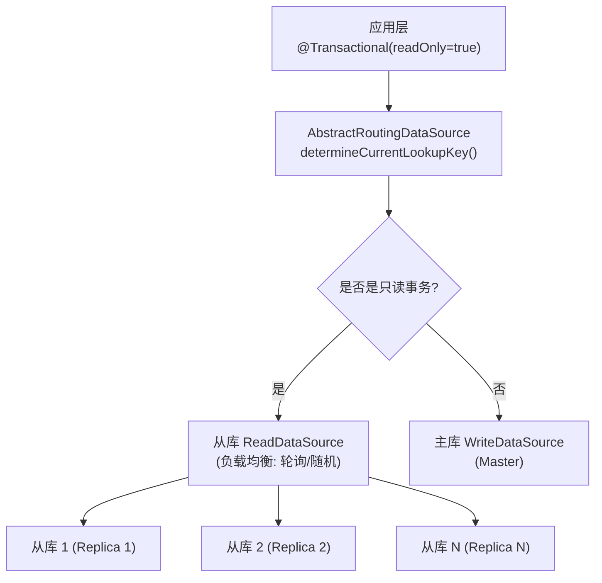

**1. 定义数据源路由注解：**

```java
@Target({ElementType.METHOD, ElementType.TYPE})
@Retention(RetentionPolicy.RUNTIME)
public @interface DataSource {
    String value() default "master";
}
```

**2. 实现 AbstractRoutingDataSource：**

```java
@Component
public class DynamicDataSource extends AbstractRoutingDataSource {

    private static final ThreadLocal<String> CONTEXT_HOLDER = ThreadLocal.withInitial(() -> "master");

    @Override
    protected Object determineCurrentLookupKey() {
        String key = CONTEXT_HOLDER.get();
        // 从库可简单轮询
        if ("slave".equals(key)) {
            List<String> slaves = getSlaveKeys();
            if (!slaves.isEmpty()) {
                key = slaves.get(ThreadLocalRandom.current().nextInt(slaves.size()));
            }
        }
        return key;
    }

    public static void setDataSource(String dataSource) {
        CONTEXT_HOLDER.set(dataSource);
    }

    public static void clear() {
        CONTEXT_HOLDER.remove();
    }

    private List<String> getSlaveKeys() {
        return getResolvedDataSources().keySet().stream()
                .filter(k -> k.toString().startsWith("slave"))
                .map(Object::toString)
                .toList();
    }
}
```

**3. AOP 切面自动切换：**

```java
@Aspect
@Component
@Order(-1)
public class DataSourceAspect {

    @Around("@annotation(dataSource)")
    public Object around(ProceedingJoinPoint point, DataSource dataSource) throws Throwable {
        try {
            DynamicDataSource.setDataSource(dataSource.value());
            return point.proceed();
        } finally {
            DynamicDataSource.clear();
        }
    }
}
```

**4. 配置：**

```java
@Configuration
public class DataSourceRoutingConfig {

    @Bean
    @ConfigurationProperties(prefix = "spring.datasource.master")
    public DataSource masterDataSource() {
        return DataSourceBuilder.create().build();
    }

    @Bean
    @ConfigurationProperties(prefix = "spring.datasource.slave1")
    public DataSource slave1DataSource() {
        return DataSourceBuilder.create().build();
    }

    @Bean
    @ConfigurationProperties(prefix = "spring.datasource.slave2")
    public DataSource slave2DataSource() {
        return DataSourceBuilder.create().build();
    }

    @Bean
    public DataSource routingDataSource(
            @Qualifier("masterDataSource") DataSource master,
            @Qualifier("slave1DataSource") DataSource slave1,
            @Qualifier("slave2DataSource") DataSource slave2) {
        Map<Object, Object> targetDataSources = new HashMap<>();
        targetDataSources.put("master", master);
        targetDataSources.put("slave1", slave1);
        targetDataSources.put("slave2", slave2);

        DynamicDataSource routing = new DynamicDataSource();
        routing.setDefaultTargetDataSource(master);
        routing.setTargetDataSources(targetDataSources);
        return routing;
    }
}
```

```yaml
spring:
  datasource:
    master:
      url: jdbc:mysql://master-host:3306/db
      username: root
      password: password
    slave1:
      url: jdbc:mysql://slave1-host:3306/db
      username: root
      password: password
    slave2:
      url: jdbc:mysql://slave2-host:3306/db
      username: root
      password: password
```

**使用：**

```java
@Service
public class UserService {

    @DataSource("slave")
    public List<User> findAll() {
        // 走从库
    }

    @DataSource("master")
    public void save(User user) {
        // 走主库
    }
}
```

---

## 5. 监控与运维（Actuator）

### 5.1 常用端点

```xml
<dependency>
    <groupId>org.springframework.boot</groupId>
    <artifactId>spring-boot-starter-actuator</artifactId>
</dependency>
```

```yaml
management:
  endpoints:
    web:
      exposure:
        include: health,metrics,info,env,beans,mappings,loggers,threaddump,heapdump
      base-path: /actuator
  endpoint:
    health:
      show-details: always
    env:
      show-values: always
    configprops:
      show-values: always
```

| 端点路径 | 说明 |
|----------|------|
| `/actuator/health` | 健康检查 |
| `/actuator/metrics` | 指标度量 |
| `/actuator/info` | 应用信息 |
| `/actuator/env` | 环境属性 |
| `/actuator/beans` | 所有 Bean |
| `/actuator/mappings` | URL 映射 |
| `/actuator/loggers` | 日志级别 |
| `/actuator/threaddump` | 线程 dump |
| `/actuator/heapdump` | 堆 dump |
| `/actuator/scheduledtasks` | 定时任务 |
| `/actuator/httpexchanges` | HTTP 调用记录 |
| `/actuator/shutdown` | 优雅关闭（需显式启用） |

```yaml
# 启用 shutdown
management:
  endpoint:
    shutdown:
      enabled: true
  endpoints:
    web:
      exposure:
        include: shutdown
```

### 5.2 自定义健康检查

```java
@Component
public class CustomHealthIndicator implements HealthIndicator {

    private final ExternalService externalService;

    public CustomHealthIndicator(ExternalService externalService) {
        this.externalService = externalService;
    }

    @Override
    public Health health() {
        try {
            boolean up = externalService.check();
            if (up) {
                return Health.up()
                        .withDetail("service", externalService.getName())
                        .withDetail("latencyMs", externalService.latencyMs())
                        .build();
            } else {
                return Health.down()
                        .withDetail("service", externalService.getName())
                        .withDetail("reason", "Service returned unhealthy status")
                        .build();
            }
        } catch (Exception e) {
            return Health.down(e)
                    .withDetail("service", externalService.getName())
                    .build();
        }
    }
}
```

**数据库连接健康检查（自定义 SQL）：**

```yaml
spring:
  datasource:
    hikari:
      connection-test-query: SELECT 1

management:
  health:
    db:
      enabled: true
    diskspace:
      enabled: true
      threshold: 10GB
    redis:
      enabled: true
    elasticsearch:
      enabled: true
```

**自定义 HealthIndicator 分组：**

```yaml
management:
  endpoint:
    health:
      group:
        custom:
          include: db,diskSpace,custom
          show-details: always
```

```java
@Component
@ConditionalOnProperty(name = "app.health.include-custom", havingValue = "true", matchIfMissing = false)
public class OptionalHealthIndicator implements HealthIndicator {
    @Override
    public Health health() {
        return Health.up().withDetail("custom", "OK").build();
    }
}
```

### 5.3 /metrics + Micrometer + Prometheus + Grafana

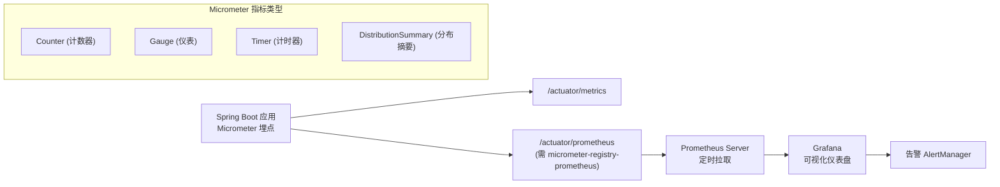

**引入 Prometheus：**

```xml
<dependency>
    <groupId>io.micrometer</groupId>
    <artifactId>micrometer-registry-prometheus</artifactId>
</dependency>
```

```yaml
management:
  endpoints:
    web:
      exposure:
        include: prometheus,metrics
  metrics:
    export:
      prometheus:
        enabled: true
    tags:
      application: ${spring.application.name}
```

**自定义 Micrometer 指标：**

```java
@Service
public class OrderMetricsService {

    private final MeterRegistry meterRegistry;
    private final Counter orderCreateCounter;
    private final Timer orderProcessTimer;

    public OrderMetricsService(MeterRegistry meterRegistry) {
        this.meterRegistry = meterRegistry;

        // 计数器
        this.orderCreateCounter = Counter.builder("order.created.total")
                .description("订单创建总数")
                .tag("type", "all")
                .register(meterRegistry);

        // 计时器
        this.orderProcessTimer = Timer.builder("order.process.duration")
                .description("订单处理耗时")
                .publishPercentileHistogram()
                .sla(Duration.ofMillis(100), Duration.ofMillis(500), Duration.ofSeconds(1))
                .register(meterRegistry);
    }

    public void recordOrderCreated() {
        orderCreateCounter.increment();
    }

    public void recordOrderProcess(Runnable task) {
        orderProcessTimer.record(task);
    }

    // Gauge 示例：监控队列大小
    @PostConstruct
    public void registerQueueGauge() {
        meterRegistry.gauge("order.queue.size", Tags.of("queue", "pending"),
                pendingOrderQueue, Collection::size);
    }
}
```

**可观察性（Spring Boot 3.x + Micrometer Tracing）：**

```xml
<dependency>
    <groupId>io.micrometer</groupId>
    <artifactId>micrometer-tracing-bridge-brave</artifactId>
</dependency>
<dependency>
    <groupId>io.zipkin.reporter2</groupId>
    <artifactId>zipkin-reporter-brave</artifactId>
</dependency>
```

### 5.4 自定义 Actuator Endpoint

```java
@Component
@Endpoint(id = "custom")
public class CustomEndpoint {

    @ReadOperation
    public Map<String, Object> health() {
        return Map.of(
            "status", "running",
            "timestamp", Instant.now().toString(),
            "version", "1.0.0"
        );
    }

    @ReadOperation
    public String getDetail(@Selector String name) {
        return "Detail for: " + name;
    }

    @WriteOperation
    public Map<String, Object> update(@Selector String name, String value) {
        return Map.of(
            "action", "update",
            "name", name,
            "value", value,
            "result", "success"
        );
    }

    @DeleteOperation
    public Map<String, Object> delete(@Selector String name) {
        return Map.of("action", "delete", "name", name, "result", "deleted");
    }
}
```

**访问：**

```bash
# GET
curl http://localhost:8080/actuator/custom

# GET with selector
curl http://localhost:8080/actuator/custom/some-name

# POST (WriteOperation)
curl -X POST http://localhost:8080/actuator/custom/some-name \
  -H "Content-Type: application/json" \
  -d '{"value": "new-value"}'

# DELETE
curl -X DELETE http://localhost:8080/actuator/custom/some-name
```

**注解式自定义端点（`@Endpoint` vs `@WebEndpoint` vs `@JmxEndpoint`）：**

| 注解 | 描述 |
|------|------|
| `@Endpoint` | 同时暴露 JMX + Web |
| `@WebEndpoint` | 仅 Web |
| `@JmxEndpoint` | 仅 JMX |
| `@ServletEndpoint` | 自定义 Web 端点（低级别 Servlet） |
| `@ControllerEndpoint` | 自定义 MVC 控制器端点 |

### 5.5 Spring Boot Admin 监控

**Server 端：**

```xml
<dependency>
    <groupId>de.codecentric</groupId>
    <artifactId>spring-boot-admin-starter-server</artifactId>
    <version>3.2.1</version>
</dependency>
```

```java
@EnableAdminServer
@SpringBootApplication
public class AdminServerApplication {
    public static void main(String[] args) {
        SpringApplication.run(AdminServerApplication.class, args);
    }
}
```

```yaml
server:
  port: 9090
spring:
  application:
    name: admin-server
```

**Client 端：**

```xml
<dependency>
    <groupId>de.codecentric</groupId>
    <artifactId>spring-boot-admin-starter-client</artifactId>
    <version>3.2.1</version>
</dependency>
```

```yaml
spring:
  boot:
    admin:
      client:
        url: http://localhost:9090
        instance:
          prefer-ip: true
  application:
    name: my-client-app

management:
  endpoints:
    web:
      exposure:
        include: "*"
```

### 5.6 Logback / Log4j2 配置 + 动态修改日志级别

**Logback 配置（默认）：**

```xml
<!-- src/main/resources/logback-spring.xml -->
<?xml version="1.0" encoding="UTF-8"?>
<configuration scan="true" scanPeriod="30 seconds">

    <springProperty scope="context" name="APP_NAME" source="spring.application.name" defaultValue="app"/>
    <springProperty scope="context" name="LOG_PATH" source="logging.file.path" defaultValue="logs"/>

    <!-- 控制台输出 -->
    <appender name="CONSOLE" class="ch.qos.logback.core.ConsoleAppender">
        <encoder>
            <pattern>%d{yyyy-MM-dd HH:mm:ss.SSS} [%thread] %-5level %logger{36} - %msg%n</pattern>
            <charset>UTF-8</charset>
        </encoder>
    </appender>

    <!-- 滚动文件 -->
    <appender name="FILE" class="ch.qos.logback.core.rolling.RollingFileAppender">
        <file>${LOG_PATH}/${APP_NAME}.log</file>
        <rollingPolicy class="ch.qos.logback.core.rolling.TimeBasedRollingPolicy">
            <fileNamePattern>${LOG_PATH}/${APP_NAME}.%d{yyyy-MM-dd}.%i.log</fileNamePattern>
            <maxHistory>30</maxHistory>
            <totalSizeCap>10GB</totalSizeCap>
            <timeBasedFileNamingAndTriggeringPolicy class="ch.qos.logback.core.rolling.SizeAndTimeBasedFNATP">
                <maxFileSize>500MB</maxFileSize>
            </timeBasedFileNamingAndTriggeringPolicy>
        </rollingPolicy>
        <encoder>
            <pattern>%d{yyyy-MM-dd HH:mm:ss.SSS} [%thread] %-5level %logger{36} - %msg%n</pattern>
        </encoder>
    </appender>

    <!-- JSON 格式（用于 ELK） -->
    <appender name="JSON" class="ch.qos.logback.core.rolling.RollingFileAppender">
        <file>${LOG_PATH}/${APP_NAME}.json</file>
        <rollingPolicy class="ch.qos.logback.core.rolling.TimeBasedRollingPolicy">
            <fileNamePattern>${LOG_PATH}/${APP_NAME}.%d{yyyy-MM-dd}.%i.json</fileNamePattern>
            <maxHistory>7</maxHistory>
        </rollingPolicy>
        <encoder class="net.logstash.logback.encoder.LogstashEncoder"/>
    </appender>

    <!-- 异步写入 -->
    <appender name="ASYNC" class="ch.qos.logback.classic.AsyncAppender">
        <queueSize>1024</queueSize>
        <discardingThreshold>0</discardingThreshold>
        <appender-ref ref="FILE"/>
    </appender>

    <root level="INFO">
        <appender-ref ref="CONSOLE"/>
        <appender-ref ref="ASYNC"/>
    </root>

    <!-- 包级别配置 -->
    <logger name="com.example" level="DEBUG"/>
    <logger name="org.springframework.web" level="INFO"/>
    <logger name="org.springframework.security" level="WARN"/>
</configuration>
```

**切换 Log4j2：**

```xml
<dependency>
    <groupId>org.springframework.boot</groupId>
    <artifactId>spring-boot-starter-web</artifactId>
    <exclusions>
        <exclusion>
            <groupId>org.springframework.boot</groupId>
            <artifactId>spring-boot-starter-logging</artifactId>
        </exclusion>
    </exclusions>
</dependency>
<dependency>
    <groupId>org.springframework.boot</groupId>
    <artifactId>spring-boot-starter-log4j2</artifactId>
</dependency>
```

```xml
<!-- log4j2-spring.xml -->
<?xml version="1.0" encoding="UTF-8"?>
<Configuration status="WARN">
    <Properties>
        <Property name="APP_NAME">my-app</Property>
        <Property name="LOG_PATH">logs</Property>
    </Properties>

    <Appenders>
        <Console name="Console" target="SYSTEM_OUT">
            <PatternLayout pattern="%d{HH:mm:ss.SSS} [%t] %-5level %logger{36} - %msg%n"/>
        </Console>
        <RollingFile name="File" fileName="${LOG_PATH}/${APP_NAME}.log"
                     filePattern="${LOG_PATH}/${APP_NAME}.%d{yyyy-MM-dd}.%i.log">
            <PatternLayout pattern="%d{yyyy-MM-dd HH:mm:ss.SSS} [%t] %-5level %logger{36} - %msg%n"/>
            <Policies>
                <TimeBasedTriggeringPolicy/>
                <SizeBasedTriggeringPolicy size="500MB"/>
            </Policies>
            <DefaultRolloverStrategy max="30"/>
        </RollingFile>
    </Appenders>

    <Loggers>
        <Root level="info">
            <AppenderRef ref="Console"/>
            <AppenderRef ref="File"/>
        </Root>
        <Logger name="com.example" level="debug" additivity="false">
            <AppenderRef ref="Console"/>
            <AppenderRef ref="File"/>
        </Logger>
    </Loggers>
</Configuration>
```

**动态修改日志级别：**

```bash
# 查看所有 Logger 级别
curl http://localhost:8080/actuator/loggers

# 查看指定 Logger
curl http://localhost:8080/actuator/loggers/com.example

# 动态修改（无需重启）
curl -X POST http://localhost:8080/actuator/loggers/com.example \
  -H "Content-Type: application/json" \
  -d '{"configuredLevel": "DEBUG"}'
```

---

## 6. 测试

### 6.1 @SpringBootTest 集成测试

```java
@SpringBootTest(webEnvironment = SpringBootTest.WebEnvironment.RANDOM_PORT)
class ApplicationIntegrationTest {

    @Autowired
    private TestRestTemplate restTemplate;

    @Autowired
    private UserRepository userRepository;

    @BeforeEach
    void setUp() {
        userRepository.deleteAll();
    }

    @Test
    void shouldCreateUser() {
        Map<String, String> request = Map.of(
            "username", "testuser",
            "email", "test@example.com"
        );

        ResponseEntity<User> response = restTemplate.postForEntity(
            "/api/users", request, User.class);

        assertThat(response.getStatusCode()).isEqualTo(HttpStatus.CREATED);
        assertThat(response.getBody().getUsername()).isEqualTo("testuser");
    }

    @Test
    void shouldReturn404WhenUserNotFound() {
        ResponseEntity<String> response = restTemplate.getForEntity(
            "/api/users/999", String.class);

        assertThat(response.getStatusCode()).isEqualTo(HttpStatus.NOT_FOUND);
    }
}
```

**测试配置隔离：**

```java
// src/test/resources/application-test.yml
spring:
  datasource:
    url: jdbc:h2:mem:testdb;DB_CLOSE_DELAY=-1
    driver-class-name: org.h2.Driver
  jpa:
    hibernate:
      ddl-auto: create-drop
    database-platform: org.hibernate.dialect.H2Dialect

// 指定 profile
@SpringBootTest
@ActiveProfiles("test")
class ApplicationTest {
    // ...
}
```

### 6.2 切片测试

**@WebMvcTest — Controller 层：**

```java
@WebMvcTest(UserController.class)
class UserControllerTest {

    @Autowired
    private MockMvc mockMvc;

    @MockBean
    private UserService userService;

    @Test
    void shouldReturnUserList() throws Exception {
        List<User> users = List.of(
            new User(1L, "user1", "user1@example.com"),
            new User(2L, "user2", "user2@example.com")
        );
        given(userService.findAll()).willReturn(users);

        mockMvc.perform(get("/api/users")
                .accept(MediaType.APPLICATION_JSON))
            .andExpect(status().isOk())
            .andExpect(jsonPath("$.size()").value(2))
            .andExpect(jsonPath("$[0].username").value("user1"));
    }

    @Test
    void shouldCreateUser() throws Exception {
        User user = new User(null, "newuser", "new@example.com");
        User saved = new User(1L, "newuser", "new@example.com");
        given(userService.create(any(User.class))).willReturn(saved);

        mockMvc.perform(post("/api/users")
                .contentType(MediaType.APPLICATION_JSON)
                .content("""
                    {"username":"newuser","email":"new@example.com"}
                    """))
            .andExpect(status().isCreated())
            .andExpect(jsonPath("$.id").value(1));
    }
}
```

**@DataJpaTest — Repository 层：**

```java
@DataJpaTest
@AutoConfigureTestDatabase(replace = AutoConfigureTestDatabase.Replace.NONE)
class UserRepositoryTest {

    @Autowired
    private UserRepository userRepository;

    @Test
    void shouldFindByUsername() {
        User user = new User("johndoe", "john@example.com");
        userRepository.save(user);

        User found = userRepository.findByUsername("johndoe");

        assertThat(found).isNotNull();
        assertThat(found.getEmail()).isEqualTo("john@example.com");
    }

    @Test
    void shouldReturnEmptyWhenUsernameNotFound() {
        User found = userRepository.findByUsername("nonexistent");
        assertThat(found).isNull();
    }
}
```

**@RestClientTest — REST 客户端：**

```java
@RestClientTest(UserServiceClient.class)
class UserServiceClientTest {

    @Autowired
    private MockRestServiceServer server;

    @Autowired
    private UserServiceClient client;

    @Test
    void shouldFetchUser() {
        String json = """
            {"id":1,"username":"test","email":"test@example.com"}
            """;

        server.expect(once(), requestTo("/api/users/1"))
            .andRespond(withSuccess(json, MediaType.APPLICATION_JSON));

        User user = client.getUser(1L);

        assertThat(user.getId()).isEqualTo(1L);
        assertThat(user.getUsername()).isEqualTo("test");
    }

    @Test
    void shouldHandleNotFound() {
        server.expect(once(), requestTo("/api/users/999"))
            .andRespond(withStatus(HttpStatus.NOT_FOUND));

        assertThatThrownBy(() -> client.getUser(999L))
            .isInstanceOf(HttpClientErrorException.NotFound.class);
    }
}
```

### 6.3 TestRestTemplate / WebTestClient

**TestRestTemplate：**

```java
@SpringBootTest(webEnvironment = SpringBootTest.WebEnvironment.RANDOM_PORT)
class UserApiTest {

    @Autowired
    private TestRestTemplate restTemplate;

    @Test
    void crudOperations() {
        // Create
        User request = new User(null, "crud", "crud@test.com");
        ResponseEntity<User> createResponse = restTemplate.postForEntity(
            "/api/users", request, User.class);
        assertThat(createResponse.getStatusCode()).isEqualTo(HttpStatus.CREATED);
        Long id = createResponse.getBody().getId();

        // Read
        ResponseEntity<User> getResponse = restTemplate.getForEntity(
            "/api/users/{id}", User.class, id);
        assertThat(getResponse.getBody().getUsername()).isEqualTo("crud");

        // Update
        restTemplate.put("/api/users/{id}", new User(id, "updated", "updated@test.com"), id);

        // Delete
        restTemplate.delete("/api/users/{id}", id);

        // Verify deleted
        ResponseEntity<String> afterDelete = restTemplate.getForEntity(
            "/api/users/{id}", String.class, id);
        assertThat(afterDelete.getStatusCode()).isEqualTo(HttpStatus.NOT_FOUND);
    }
}
```

**WebTestClient（WebFlux / WebMVC）：**

```java
@SpringBootTest(webEnvironment = SpringBootTest.WebEnvironment.RANDOM_PORT)
class UserWebClientTest {

    @Autowired
    private WebTestClient webClient;

    @Test
    void shouldReturnUsers() {
        webClient.get().uri("/api/users")
            .accept(MediaType.APPLICATION_JSON)
            .exchange()
            .expectStatus().isOk()
            .expectBodyList(User.class)
            .hasSize(3);
    }

    @Test
    void shouldValidateInput() {
        String invalidJson = """
            {"username":"","email":"invalid-email"}
            """;

        webClient.post().uri("/api/users")
            .contentType(MediaType.APPLICATION_JSON)
            .bodyValue(invalidJson)
            .exchange()
            .expectStatus().isBadRequest()
            .expectBody()
            .jsonPath("$.errors").isNotEmpty();
    }

    @Test
    void shouldCreateAndReturn() {
        String request = """
            {"username":"webclient","email":"web@test.com"}
            """;

        webClient.post().uri("/api/users")
            .contentType(MediaType.APPLICATION_JSON)
            .bodyValue(request)
            .exchange()
            .expectStatus().isCreated()
            .expectBody()
            .jsonPath("$.id").isNotEmpty()
            .jsonPath("$.username").isEqualTo("webclient");
    }
}
```

### 6.4 @MockBean / @SpyBean 打桩

**@MockBean：**

```java
@SpringBootTest
class OrderServiceTest {

    @MockBean
    private InventoryService inventoryService;

    @MockBean
    private PaymentGateway paymentGateway;

    @Autowired
    private OrderService orderService;

    @Test
    void shouldCreateOrderWhenInventorySufficient() {
        // Arrange
        given(inventoryService.checkStock(1L, 5))
            .willReturn(true);
        given(paymentGateway.charge(anyString(), any(BigDecimal.class)))
            .willReturn(new PaymentResult("txn-001", PaymentStatus.SUCCESS));

        // Act
        Order order = orderService.placeOrder(1L, 5, "token_123");

        // Assert
        assertThat(order.getStatus()).isEqualTo(OrderStatus.CONFIRMED);
        assertThat(order.getTransactionId()).isEqualTo("txn-001");
        verify(inventoryService).deduct(1L, 5);
    }

    @Test
    void shouldThrowWhenInventoryInsufficient() {
        given(inventoryService.checkStock(1L, 100))
            .willReturn(false);

        assertThatThrownBy(() -> orderService.placeOrder(1L, 100, "token"))
            .isInstanceOf(InsufficientStockException.class);

        verify(inventoryService, never()).deduct(anyLong(), anyInt());
        verifyNoInteractions(paymentGateway);
    }
}
```

**@SpyBean：**

```java
@SpringBootTest
class AuditServiceTest {

    @SpyBean
    private AuditLogRepository auditLogRepository;

    @Autowired
    private AuditService auditService;

    @Test
    void shouldAuditWithTimestamp() {
        // Spy 保留真实行为，只覆盖部分方法
        doAnswer(invocation -> {
            AuditLog log = invocation.getArgument(0);
            log.setId(1L);
            return log;
        }).when(auditLogRepository).save(any(AuditLog.class));

        auditService.recordAction("user-1", "LOGIN");

        verify(auditLogRepository).save(argThat(log ->
            log.getAction().equals("LOGIN") &&
            log.getUserId().equals("user-1") &&
            log.getCreatedAt() != null
        ));
    }
}
```

### 6.5 @Sql 测试数据准备

```java
@SpringBootTest
@Sql(scripts = "/sql/init-users.sql", executionPhase = Sql.ExecutionPhase.BEFORE_TEST_METHOD)
@Sql(scripts = "/sql/cleanup.sql", executionPhase = Sql.ExecutionPhase.AFTER_TEST_METHOD)
class UserRepositorySqlTest {

    @Autowired
    private UserRepository userRepository;

    @Test
    void shouldFindActiveUsers() {
        List<User> activeUsers = userRepository.findByStatus(UserStatus.ACTIVE);
        assertThat(activeUsers).hasSize(3);
    }

    @Test
    @Sql("/sql/additional-data.sql")  // 额外数据
    void shouldReturnFilteredResults() {
        List<User> result = userRepository.searchByEmail("@example.com");
        assertThat(result).hasSize(5);
    }
}
```

```sql
-- src/test/resources/sql/init-users.sql
INSERT INTO users (id, username, email, status, created_at) VALUES
(1, 'alice', 'alice@example.com', 'ACTIVE', NOW()),
(2, 'bob', 'bob@example.com', 'ACTIVE', NOW()),
(3, 'charlie', 'charlie@example.com', 'INACTIVE', NOW()),
(4, 'dave', 'dave@test.com', 'ACTIVE', NOW());

-- src/test/resources/sql/cleanup.sql
TRUNCATE TABLE users;

-- src/test/resources/sql/additional-data.sql
INSERT INTO users (id, username, email, status, created_at) VALUES
(5, 'eve', 'eve@example.com', 'ACTIVE', NOW());
```

**多数据源 + @Sql：**

```java
@SpringBootTest
@Sql(scripts = "/sql/primary-data.sql", dataSource = "primaryDataSource")
@Sql(scripts = "/sql/secondary-data.sql", dataSource = "secondaryDataSource")
class MultiDataSourceTest {
    // ...
}
```

---

## 7. 部署与高级特性

### 7.1 可执行 Fat JAR 打包

```xml
<!-- pom.xml -->
<build>
    <plugins>
        <plugin>
            <groupId>org.springframework.boot</groupId>
            <artifactId>spring-boot-maven-plugin</artifactId>
            <configuration>
                <!-- 指定主类 -->
                <mainClass>com.example.Application</mainClass>
                <!-- 包含 provided 依赖（如内嵌容器） -->
                <excludes>
                    <exclude>
                        <groupId>org.projectlombok</groupId>
                        <artifactId>lombok</artifactId>
                    </exclude>
                </excludes>
                <!-- 分层 JAR（用于 Docker 构建优化） -->
                <layers>
                    <enabled>true</enabled>
                </layers>
            </configuration>
        </plugin>
    </plugins>
</build>
```

```bash
# 打包
mvn clean package -DskipTests

# 运行
java -jar target/my-app-1.0.0.jar

# 带参数
java -jar target/my-app-1.0.0.jar \
  --server.port=8081 \
  --spring.profiles.active=prod \
  --app.secret="${APP_SECRET}"

# JVM 调优参数
java -Xms512m -Xmx2g \
  -XX:+UseZGC \
  -XX:MaxMetaspaceSize=256m \
  -Djava.security.egd=file:/dev/./urandom \
  -jar target/my-app-1.0.0.jar
```

**Fat JAR 结构：**

```
my-app-1.0.0.jar
├── META-INF/
│   └── MANIFEST.MF     # Main-Class: org.springframework.boot.loader.JarLauncher
├── BOOT-INF/
│   ├── classes/        # 应用 class 文件
│   ├── lib/            # 所有依赖 JAR
│   └── classpath.idx   # 类路径索引
├── org/
│   └── springframework/
│       └── boot/
│           └── loader/ # Spring Boot 自定义类加载器
└── layer.idx           # 分层索引（启用多层后）
```

### 7.2 WAR 包传统部署

```xml
<packaging>war</packaging>

<dependency>
    <groupId>org.springframework.boot</groupId>
    <artifactId>spring-boot-starter-tomcat</artifactId>
    <scope>provided</scope>
</dependency>
```

```java
@SpringBootApplication
public class Application extends SpringBootServletInitializer {

    @Override
    protected SpringApplicationBuilder configure(SpringApplicationBuilder application) {
        return application.sources(Application.class);
    }

    public static void main(String[] args) {
        SpringApplication.run(Application.class, args);
    }
}
```

```bash
mvn clean package -DskipTests
# 将 target/*.war 部署到 Tomcat webapps/
```

### 7.3 Docker 容器化

**Dockerfile 最佳实践：**

```dockerfile
# ===== 构建阶段 =====
FROM eclipse-temurin:17-jdk-alpine AS builder
WORKDIR /build
COPY pom.xml .
COPY src ./src
RUN --mount=type=cache,target=/root/.m2 \
    mvn clean package -DskipTests -B

# ===== 运行阶段（多阶段构建） =====
FROM eclipse-temurin:17-jre-alpine AS runtime
WORKDIR /app

# 创建非 root 用户
RUN addgroup -S appgroup && adduser -S appuser -G appgroup

# Spring Boot 分层 JAR 提取
COPY --from=builder /build/target/*.jar app.jar
RUN java -Djarmode=layertools -jar app.jar extract

# 分层复制（利用 Docker 缓存）
COPY --from=builder /build/dependencies/ ./
COPY --from=builder /build/spring-boot-loader/ ./
COPY --from=builder /build/snapshot-dependencies/ ./
COPY --from=builder /build/application/ ./

# 安全实践
USER appuser
EXPOSE 8080
HEALTHCHECK --interval=10s --timeout=5s --start-period=30s --retries=3 \
    CMD wget -qO- http://localhost:8080/actuator/health || exit 1

ENTRYPOINT ["java", \
    "-XX:+UseZGC", \
    "-XX:MaxMetaspaceSize=256m", \
    "-XX:+ExitOnOutOfMemoryError", \
    "-jar", "app.jar"]
```

**精简版 Dockerfile：**

```dockerfile
FROM eclipse-temurin:17-jre-alpine
WORKDIR /app
COPY target/*.jar app.jar
EXPOSE 8080
HEALTHCHECK CMD wget -qO- http://localhost:8080/actuator/health || exit 1
ENTRYPOINT ["java", "-jar", "app.jar"]
```

**docker-compose.yml：**

```yaml
version: "3.9"
services:
  app:
    build: .
    container_name: my-app
    ports:
      - "8080:8080"
    environment:
      - SPRING_PROFILES_ACTIVE=prod
      - DB_URL=jdbc:postgresql://db:5432/myapp
      - DB_USERNAME=app
      - DB_PASSWORD=${DB_PASSWORD}
      - JASYPT_ENCRYPTOR_PASSWORD=${JASYPT_KEY}
    depends_on:
      db:
        condition: service_healthy
    healthcheck:
      test: ["CMD", "wget", "-qO-", "http://localhost:8080/actuator/health"]
      interval: 15s
      timeout: 5s
      retries: 3
    deploy:
      resources:
        limits:
          memory: 512m
          cpus: "0.5"

  db:
    image: postgres:16-alpine
    container_name: my-app-db
    environment:
      POSTGRES_DB: myapp
      POSTGRES_USER: app
      POSTGRES_PASSWORD: ${DB_PASSWORD}
    volumes:
      - pgdata:/var/lib/postgresql/data
    healthcheck:
      test: ["CMD-SHELL", "pg_isready -U app -d myapp"]
      interval: 5s
      timeout: 5s
      retries: 5
    deploy:
      resources:
        limits:
          memory: 1g
          cpus: "1.0"

volumes:
  pgdata:
```

### 7.4 GraalVM Native Image + Spring Boot 3.x（AOT 编译）

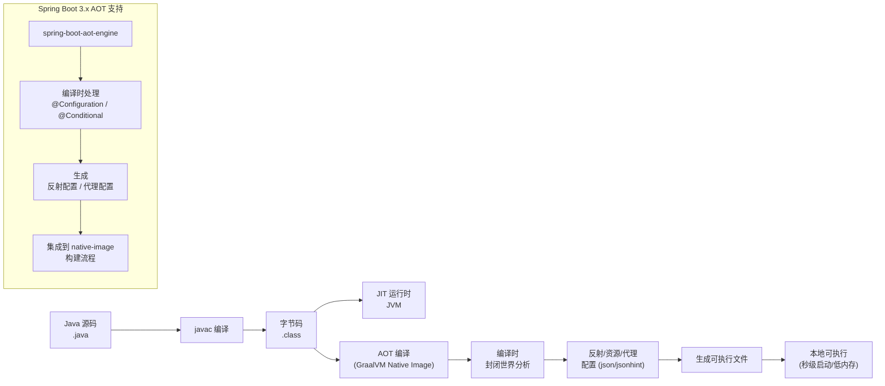

**引入 GraalVM：**

```xml
<dependency>
    <groupId>org.springframework.boot</groupId>
    <artifactId>spring-boot-starter-parent</artifactId>
    <version>3.3.0</version>
    <type>pom</type>
</dependency>

<!-- AOT 引擎 -->
<dependency>
    <groupId>org.springframework.boot</groupId>
    <artifactId>spring-boot-starter-aot</artifactId>
</dependency>
```

```xml
<plugin>
    <groupId>org.graalvm.buildtools</groupId>
    <artifactId>native-maven-plugin</artifactId>
    <configuration>
        <imageName>my-app-native</imageName>
        <buildArgs>
            <buildArg>--enable-http</buildArg>
            <buildArg>--enable-https</buildArg>
            <buildArg>--no-fallback</buildArg>
            <buildArg>--report-unsupported-elements-at-runtime</buildArg>
        </buildArgs>
    </configuration>
</plugin>
```

```bash
# 安装 GraalVM + native-image CLI
# 使用 SDKMAN:
# sdk install java 21-graalce

# 构建 Native Image
mvn native:compile -Pnative -DskipTests

# 运行
./target/my-app-native

# 查看启动时间
# 通常 < 0.1 秒
```

**AOT 提示与限制：**

```java
// 注册需要反射的类
@RegisterReflectionForBinding({User.class, Order.class})
public class ReflectionConfig {
}

// runtime-hints.xml（替代方案）
// src/main/resources/META-INF/native-image/my-app/reflect-config.json
```

```json
[
  {
    "name": "com.example.User",
    "allDeclaredFields": true,
    "allDeclaredMethods": true,
    "allDeclaredConstructors": true
  }
]
```

### 7.5 虚拟线程（Virtual Threads）

```yaml
# Spring Boot 3.2+ 启用虚拟线程
spring:
  threads:
    virtual:
      enabled: true
```

**编程方式：**

```java
@SpringBootApplication
public class Application {

    public static void main(String[] args) {
        SpringApplication.run(Application.class, args);
    }

    // 自定义虚拟线程 TaskExecutor
    @Bean
    public TaskExecutor taskExecutor() {
        SimpleAsyncTaskExecutor executor = new SimpleAsyncTaskExecutor();
        executor.setVirtualThreads(true);
        return executor;
    }

    // 虚拟线程的 @Async
    @Bean
    public AsyncTaskExecutor asyncTaskExecutor() {
        return new SimpleAsyncTaskExecutor("virtual-");
    }
}
```

```java
@Service
public class VirtualThreadService {

    @Async
    public CompletableFuture<String> processAsync() {
        System.out.println("线程: " + Thread.currentThread() + " (虚拟? " + Thread.currentThread().isVirtual() + ")");
        return CompletableFuture.completedFuture("Done");
    }

    // 手动创建虚拟线程
    public void handleRequest() {
        Thread.startVirtualThread(() -> {
            System.out.println("虚拟线程执行: " + Thread.currentThread());
        });
    }
}
```

```java
@RestController
public class VirtualThreadController {

    @GetMapping("/block")
    public String blockingOperation() throws InterruptedException {
        // 传统平台线程会被阻塞；虚拟线程挂起不阻塞
        Thread.sleep(Duration.ofSeconds(2));
        return "OK - 当前线程: " + Thread.currentThread().isVirtual();
    }
}
```

### 7.6 Spring Boot 2.x vs 3.x 升级要点

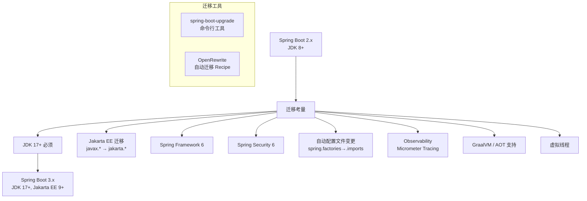

**关键变更对照表：**

| 对比项 | Spring Boot 2.x | Spring Boot 3.x |
|--------|----------------|----------------|
| **JDK 基线** | JDK 8+ | JDK 17+ |
| **Jakarta EE** | `javax.*` | `jakarta.*` |
| **Spring Framework** | 5.x | 6.x |
| **Spring Security** | 5.x | 6.x |
| **Hibernate** | 5.x | 6.x（`jakarta.persistence`） |
| **自动配置 SPI** | `spring.factories` | `AutoConfiguration.imports` |
| **@SpringBootTest** | 保持兼容 | 不再支持 `@ActiveProfiles` 某些用法 |
| **Web 容器** | Tomcat 9 | Tomcat 10（Jakarta Servlet 5） |
| **Micrometer** | 1.x | 1.12+（自带 Tracing） |
| **HttpClient** | RestTemplate（维护模式） | RestClient / WebClient |
| **CSRF** | 默认启用 | 默认启用但配置方式变化 |
| **CORS** | WebMvcConfigurer | 同左（API 微调） |
| **路径匹配** | AntPathMatcher（默认） | PathPatternParser（默认） |
| **内嵌容器** | Tomcat 9 | Tomcat 10 |
| **HttpStatusCode** | `HttpStatus` 枚举 | `HttpStatusCode` 接口 |

**代码迁移示例：**

```java
// Spring Boot 2.x
import javax.persistence.Entity;
import javax.persistence.Table;
import javax.validation.constraints.NotBlank;
import org.springframework.http.HttpStatus;

// Spring Boot 3.x
import jakarta.persistence.Entity;
import jakarta.persistence.Table;
import jakarta.validation.constraints.NotBlank;
import org.springframework.http.HttpStatusCode;
```

```yaml
# Spring Boot 2.x
spring:
  redis:
    host: localhost
  session:
    store-type: redis

# Spring Boot 3.x（部分配置变化）
spring:
  data:
    redis:
      host: localhost
# spring.session.store-type → 自动配置
```

**OpenRewrite 自动迁移：**

```xml
<plugin>
    <groupId>org.openrewrite.maven</groupId>
    <artifactId>rewrite-maven-plugin</artifactId>
    <version>5.35.0</version>
    <configuration>
        <activeRecipes>
            <recipe>org.openrewrite.java.spring.boot3.UpgradeSpringBoot_3_3</recipe>
        </activeRecipes>
    </configuration>
</plugin>
```

```bash
mvn rewrite:run
```

---

> **参考资源：**
>
> - [Spring Boot 官方文档](https://docs.spring.io/spring-boot/docs/current/reference/htmlsingle/)
> - [Spring Initializr](https://start.spring.io/)
> - [Spring Boot Admin](https://github.com/codecentric/spring-boot-admin)
> - [GraalVM Native Image 文档](https://www.graalvm.org/latest/reference-manual/native-image/)
> - [Micrometer 文档](https://micrometer.io/docs)
