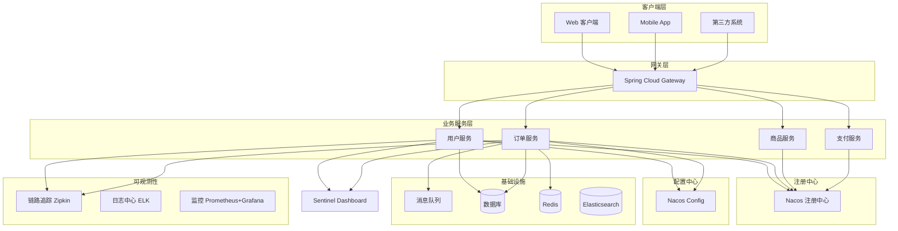
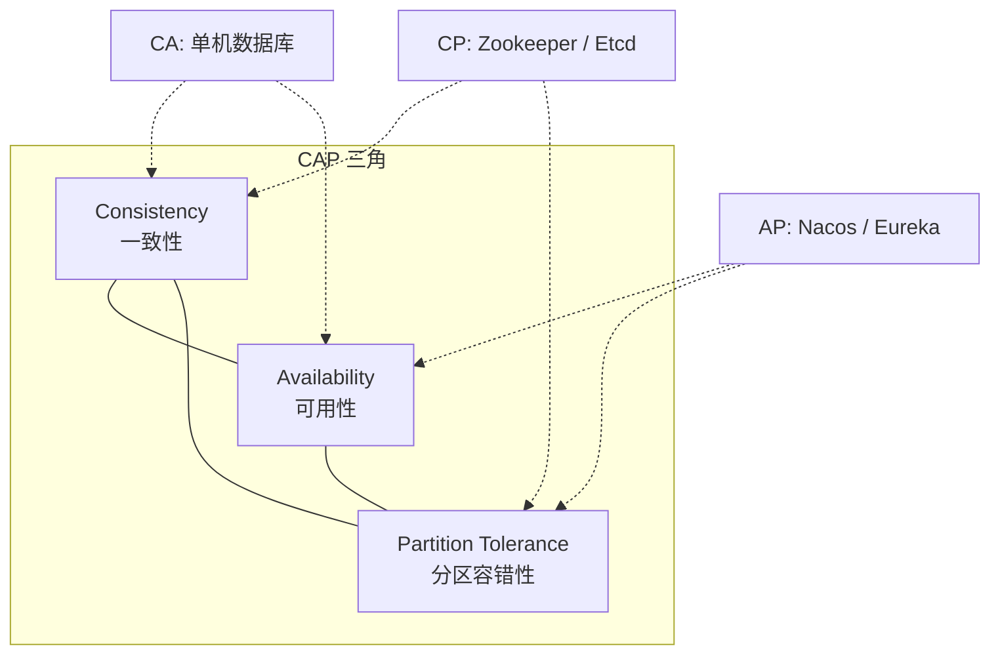
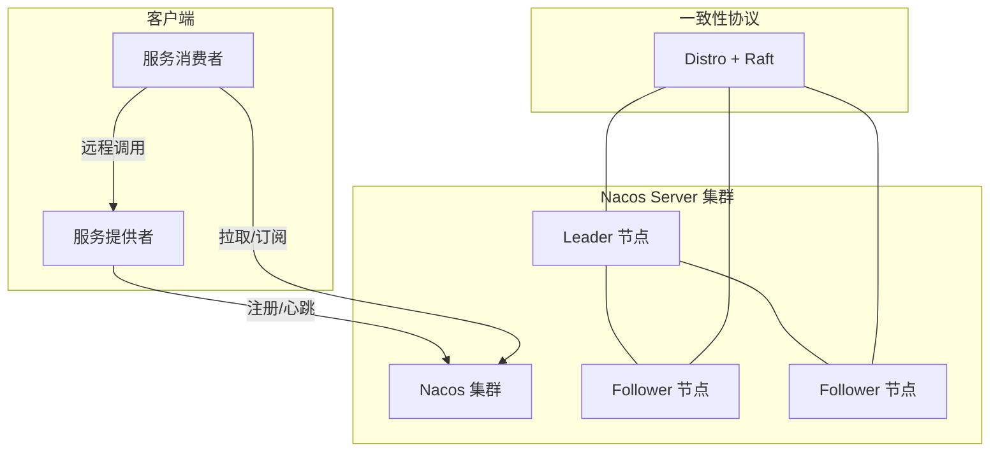
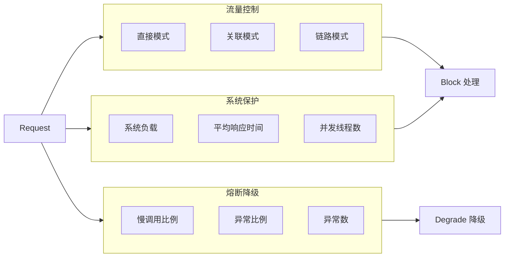
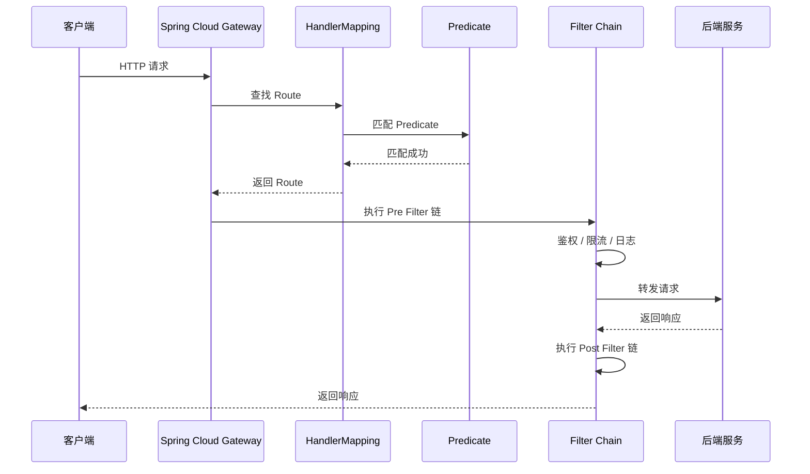
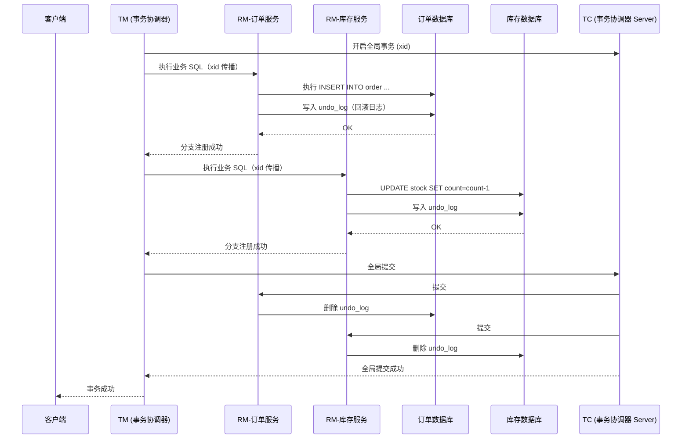
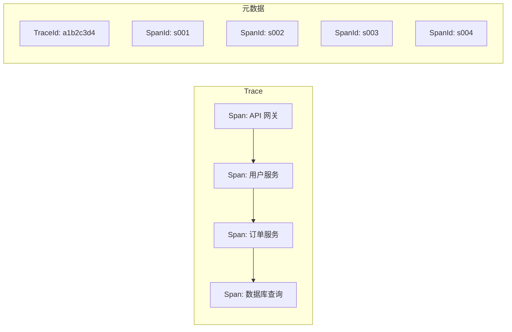
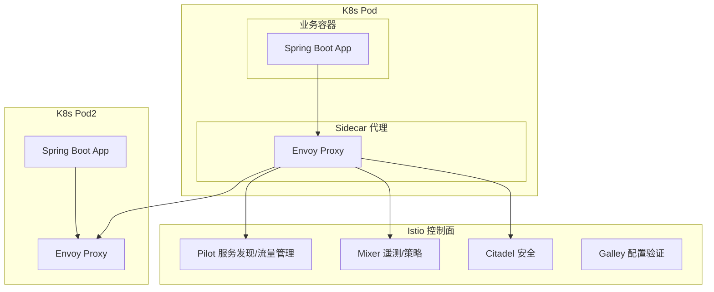

# Spring Cloud 微服务知识体系

---

## 目录

1. [微服务架构基础](#1-微服务架构基础)
2. [服务注册与发现（Nacos）](#2-服务注册与发现nacos)
3. [服务调用（OpenFeign）](#3-服务调用openfeign)
4. [负载均衡（LoadBalancer）](#4-负载均衡loadbalancer)
5. [熔断限流（Sentinel）](#5-熔断限流sentinel)
6. [网关（Spring Cloud Gateway）](#6-网关spring-cloud-gateway)
7. [配置中心（Nacos Config）](#7-配置中心nacos-config)
8. [分布式事务（Seata）](#8-分布式事务seata)
9. [链路追踪（Sleuth/Micrometer + Zipkin）](#9-链路追踪sleuthmicrometer--zipkin)
10. [服务网格（Istio）](#10-服务网格istio)
11. [微服务其他](#11-微服务其他)

---

## 1. 微服务架构基础

### 1.1 微服务设计原则

| 原则 | 说明 |
|------|------|
| **单一职责** | 每个服务只负责一个业务领域，高内聚低耦合 |
| **自治性** | 每个服务独立开发、部署、扩缩容，互不影响 |
| **去中心化** | 去中心化数据管理（每个服务独享数据库）、去中心化治理（技术栈自选） |
| **基础设施自动化** | CI/CD、容器化、自动化测试 |
| **容错设计** | 熔断、降级、限流、重试 |

### 微服务架构图



### 1.2 服务拆分原则

| 原则 | 描述 |
|------|------|
| **DDD 限界上下文** | 按 DDD 的 Bounded Context 拆分，每个上下文对应一个微服务 |
| **业务能力拆分** | 按组织架构的业务能力域拆分（如用户、订单、支付） |
| **拆分粒度** | 不宜过细（通信成本高），不宜过粗（失去微服务优势） |
| **数据独立** | 每个服务拥有独立数据库，禁止跨服务直接访问数据库 |

### 1.3 CAP 理论

分布式系统最多只能同时满足 **一致性（Consistency）**、**可用性（Availability）**、**分区容错性（Partition Tolerance）** 中的两项。



| 组合 | 典型系统 | 说明 |
|------|----------|------|
| **CP** | Zookeeper、Etcd | 强一致但可能短暂不可用（选举期间） |
| **AP** | Nacos（AP 模式）、Eureka | 高可用但数据可能不一致 |
| **CA** | 单机数据库 | 无分区时保证一致性和可用性 |

---

## 2. 服务注册与发现（Nacos）

### 2.1 Nacos 架构



### 2.2 服务注册与心跳

- **服务注册**：启动时向 Nacos Server 发送注册请求（service name、IP、port、元数据）
- **心跳机制**：每 5 秒发送一次心跳，15 秒未收到则标记为不健康，30 秒未收到则剔除
- **健康检查**：Nacos Server 主动探测 + Client 心跳上报
- **保护阈值**：当健康实例数 / 总实例数 < 阈值时，触发保护模式，将不健康实例也返回给调用方，防止雪崩

### 2.3 Nacos AP/CP 切换

```yaml
# application.yml
spring:
  cloud:
    nacos:
      discovery:
        server-addr: 127.0.0.1:8848
        # AP 模式（默认）：AP 优先，保证可用性
        # CP 模式：ephemeral=false 时使用 CP（持久化实例）
        ephemeral: true
```

| 模式 | 一致性协议 | 场景 |
|------|-----------|------|
| **AP**（默认） | Distro 协议 | 临时实例，追求高可用，允许短暂不一致 |
| **CP** | JRaft（Raft 实现） | 持久化实例，追求强一致，如配置中心场景 |

### 2.4 Nacos 控制台

- 地址：`http://localhost:8848/nacos`
- 默认账号：`nacos` / `nacos`
- 功能：服务列表、健康检查、权重调整、配置管理、命名空间管理

### 2.5 Spring Boot 整合 Nacos

**依赖（pom.xml）：**

```xml
<dependency>
    <groupId>com.alibaba.cloud</groupId>
    <artifactId>spring-cloud-starter-alibaba-nacos-discovery</artifactId>
</dependency>
```

**YAML 配置：**

```yaml
spring:
  application:
    name: user-service
  cloud:
    nacos:
      discovery:
        server-addr: 127.0.0.1:8848
        namespace: dev
        group: DEFAULT_GROUP
        cluster-name: BJ
        weight: 1
        ephemeral: true
        # 保护阈值
        protect-threshold: 0.8
```

**启动类：**

```java
import org.springframework.boot.SpringApplication;
import org.springframework.boot.autoconfigure.SpringBootApplication;
import org.springframework.cloud.client.discovery.EnableDiscoveryClient;

@SpringBootApplication
@EnableDiscoveryClient
public class UserServiceApplication {
    public static void main(String[] args) {
        SpringApplication.run(UserServiceApplication.class, args);
    }
}
```

---

## 3. 服务调用（OpenFeign）

### 3.1 Feign 声明式调用

**依赖：**

```xml
<dependency>
    <groupId>org.springframework.cloud</groupId>
    <artifactId>spring-cloud-starter-openfeign</artifactId>
</dependency>
```

**启动类：**

```java
import org.springframework.boot.SpringApplication;
import org.springframework.boot.autoconfigure.SpringBootApplication;
import org.springframework.cloud.openfeign.EnableFeignClients;

@SpringBootApplication
@EnableFeignClients
public class OrderServiceApplication {
    public static void main(String[] args) {
        SpringApplication.run(OrderServiceApplication.class, args);
    }
}
```

**Feign 客户端接口：**

```java
import org.springframework.cloud.openfeign.FeignClient;
import org.springframework.web.bind.annotation.GetMapping;
import org.springframework.web.bind.annotation.PathVariable;
import org.springframework.web.bind.annotation.PostMapping;
import org.springframework.web.bind.annotation.RequestBody;

@FeignClient(
    name = "user-service",
    path = "/api/users",
    fallbackFactory = UserClientFallbackFactory.class
)
public interface UserClient {

    @GetMapping("/{id}")
    UserDTO getUserById(@PathVariable("id") Long id);

    @PostMapping("/batch")
    List<UserDTO> getUsersByIds(@RequestBody List<Long> ids);
}
```

**Fallback 工厂：**

```java
import org.springframework.cloud.openfeign.FallbackFactory;
import org.springframework.stereotype.Component;

@Component
public class UserClientFallbackFactory implements FallbackFactory<UserClient> {

    @Override
    public UserClient create(Throwable cause) {
        return new UserClient() {
            @Override
            public UserDTO getUserById(Long id) {
                log.error("getUserById 熔断降级, id={}, cause={}", id, cause.getMessage());
                return new UserDTO(id, "默认用户", null);
            }

            @Override
            public List<UserDTO> getUsersByIds(List<Long> ids) {
                return Collections.emptyList();
            }
        };
    }
}
```

### 3.2 Feign 拦截器（传递 Token/JWT）

```java
import feign.RequestInterceptor;
import feign.RequestTemplate;
import jakarta.servlet.http.HttpServletRequest;
import org.springframework.context.annotation.Bean;
import org.springframework.context.annotation.Configuration;
import org.springframework.web.context.request.RequestContextHolder;
import org.springframework.web.context.request.ServletRequestAttributes;

@Configuration
public class FeignConfig {

    @Bean
    public RequestInterceptor tokenInterceptor() {
        return (RequestTemplate template) -> {
            ServletRequestAttributes attributes =
                (ServletRequestAttributes) RequestContextHolder.getRequestAttributes();
            if (attributes != null) {
                HttpServletRequest request = attributes.getRequest();
                String token = request.getHeader("Authorization");
                if (token != null) {
                    template.header("Authorization", token);
                }
            }
            // 传递 TraceId
            template.header("TraceId", TraceContext.getTraceId());
        };
    }
}
```

### 3.3 Feign 日志配置

```yaml
logging:
  level:
    com.example.order.client.UserClient: DEBUG
```

```java
import feign.Logger;
import org.springframework.context.annotation.Bean;
import org.springframework.context.annotation.Configuration;

@Configuration
public class FeignLogConfig {

    @Bean
    Logger.Level feignLoggerLevel() {
        // NONE: 不记录（默认）
        // BASIC: 仅记录请求方法、URL、响应状态码、执行时间
        // HEADERS: 在 BASIC 基础上记录请求/响应头
        // FULL: 记录请求/响应的 headers、body、元数据
        return Logger.Level.FULL;
    }
}
```

### 3.4 Feign 超时/重试配置

```yaml
spring:
  cloud:
    openfeign:
      client:
        config:
          default:
            connect-timeout: 5000
            read-timeout: 10000
            logger-level: FULL
          user-service:
            connect-timeout: 3000
            read-timeout: 5000
      compression:
        request:
          enabled: true
          mime-types: application/json
          min-request-size: 2048
        response:
          enabled: true
```

**自定义重试：**

```java
import feign.RetryableException;
import feign.Retryer;
import org.springframework.context.annotation.Bean;
import org.springframework.context.annotation.Configuration;

@Configuration
public class FeignRetryConfig {

    @Bean
    public Retryer feignRetryer() {
        // period=100ms, maxPeriod=1000ms, maxAttempts=3
        return new Retryer.Default(100, 1000, 3);
    }
}
```

---

## 4. 负载均衡（LoadBalancer）

### 4.1 Spring Cloud LoadBalancer 配置

Spring Cloud 2020+ 已移除 Ribbon，默认使用 **Spring Cloud LoadBalancer**。

```yaml
spring:
  cloud:
    loadbalancer:
      enabled: true
      # 开启缓存
      cache:
        enabled: true
        ttl: 5s
      # 重试
      retry:
        enabled: true
        max-retries-on-same-service-instance: 1
        max-retries-on-next-service-instance: 1
```

### 4.2 自定义负载均衡策略

```java
import org.springframework.cloud.client.ServiceInstance;
import org.springframework.cloud.loadbalancer.core.ReactorLoadBalancer;
import org.springframework.cloud.loadbalancer.core.RoundRobinLoadBalancer;
import org.springframework.cloud.loadbalancer.core.ServiceInstanceListSupplier;
import org.springframework.cloud.loadbalancer.support.LoadBalancerClientFactory;
import org.springframework.context.annotation.Bean;
import org.springframework.context.annotation.Configuration;
import org.springframework.core.env.Environment;
import reactor.core.publisher.Flux;
import reactor.core.publisher.Mono;

import java.util.List;
import java.util.Random;

/**
 * 自定义权重随机负载均衡策略
 */
public class WeightedRandomLoadBalancer implements ReactorServiceInstanceLoadBalancer {

    private final String serviceId;
    private final Random random = new Random();

    public WeightedRandomLoadBalancer(String serviceId) {
        this.serviceId = serviceId;
    }

    @Override
    public Mono<Response<ServiceInstance>> choose(Request request) {
        ServiceInstanceListSupplier supplier = ServiceInstanceListSupplier
                .getInstance(serviceId, LoadBalancerClientFactory.INSTANCE);
        return supplier.get(request).next().map(this::getInstanceResponse);
    }

    private Response<ServiceInstance> getInstanceResponse(List<ServiceInstance> instances) {
        if (instances.isEmpty()) {
            return new EmptyResponse();
        }
        // 按权重随机选择
        int totalWeight = instances.stream()
                .mapToInt(inst -> inst.getMetadata().containsKey("weight")
                        ? Integer.parseInt(inst.getMetadata().get("weight")) : 1)
                .sum();
        int randomWeight = new java.util.Random().nextInt(totalWeight);
        int cumulative = 0;
        for (ServiceInstance instance : instances) {
            int weight = instance.getMetadata().containsKey("weight")
                    ? Integer.parseInt(instance.getMetadata().get("weight")) : 1;
            cumulative += weight;
            if (randomWeight < cumulative) {
                return new Response<>(instance);
            }
        }
        return new Response<>(instances.get(0));
    }
}
```

**注册自定义策略：**

```java
import org.springframework.cloud.loadbalancer.annotation.LoadBalancerClient;
import org.springframework.cloud.loadbalancer.annotation.LoadBalancerClients;
import org.springframework.context.annotation.Bean;
import org.springframework.context.annotation.Configuration;

@Configuration
@LoadBalancerClients({
    @LoadBalancerClient(name = "order-service", configuration = OrderLoadBalancerConfig.class)
})
public class LoadBalancerConfig {
}

class OrderLoadBalancerConfig {
    @Bean
    public ReactorLoadBalancer<ServiceInstance> reactorLoadBalancer(
            Environment environment, ServiceInstanceListSupplier supplier) {
        String serviceId = environment.getProperty("spring.application.name");
        return new WeightedRandomLoadBalancer(serviceId, supplier);
    }
}
```

---

## 5. 熔断限流（Sentinel）

### 5.1 Sentinel 核心功能



### 5.2 流控模式与效果

| 流控模式 | 说明 |
|---------|------|
| **直接** | 直接对当前资源限流 |
| **关联** | 当关联资源达到阈值时，限流当前资源 |
| **链路** | 只记录指定链路上的流量 |

| 流控效果 | 说明 |
|---------|------|
| **快速失败** | 直接抛出 `BlockException` |
| **Warm Up** | 预热模式，阈值从 `coldFactor` 逐渐升至设定值 |
| **排队等待** | 匀速通过，超出排队时间的请求被拒绝 |

### 5.3 熔断策略

| 策略 | 说明 |
|------|------|
| **慢调用比例** | RT > 阈值 的请求比例超过设定比例时熔断 |
| **异常比例** | 异常数 / 总请求数 超过比例时熔断 |
| **异常数** | 一分钟内异常数超过阈值时熔断 |

### 5.4 @SentinelResource 注解

```java
import com.alibaba.csp.sentinel.annotation.SentinelResource;
import com.alibaba.csp.sentinel.slots.block.BlockException;
import org.springframework.web.bind.annotation.GetMapping;
import org.springframework.web.bind.annotation.RestController;

@RestController
public class OrderController {

    @GetMapping("/order/create")
    @SentinelResource(
        value = "createOrder",
        blockHandler = "createOrderBlockHandler",
        fallback = "createOrderFallback"
    )
    public Result createOrder(Long userId, Long productId) {
        // 业务逻辑
        return Result.success(orderService.create(userId, productId));
    }

    /**
     * blockHandler：流控/熔断触发时调用（参数需包含 BlockException）
     */
    public Result createOrderBlockHandler(Long userId, Long productId, BlockException e) {
        log.warn("createOrder 被限流: {}", e.getRule());
        return Result.error(429, "请求过于频繁，请稍后重试");
    }

    /**
     * fallback：业务异常时调用
     */
    public Result createOrderFallback(Long userId, Long productId, Throwable t) {
        log.error("createOrder 异常降级: {}", t.getMessage());
        return Result.error(500, "服务异常，请稍后重试");
    }
}
```

### 5.5 Sentinel 规则持久化（Nacos Push 模式）

```yaml
spring:
  cloud:
    sentinel:
      enabled: true
      transport:
        dashboard: localhost:8080
        port: 8719
      datasource:
        ds-flow:
          nacos:
            server-addr: ${spring.cloud.nacos.discovery.server-addr}
            namespace: sentinel-rules
            data-id: ${spring.application.name}-flow-rules
            group-id: SENTINEL_GROUP
            data-type: json
            rule-type: flow
        ds-degrade:
          nacos:
            server-addr: ${spring.cloud.nacos.discovery.server-addr}
            namespace: sentinel-rules
            data-id: ${spring.application.name}-degrade-rules
            group-id: SENTINEL_GROUP
            data-type: json
            rule-type: degrade
```

**Nacos 中配置流控规则（JSON）：**

```json
[
    {
        "resource": "createOrder",
        "limitApp": "default",
        "grade": 1,
        "count": 100,
        "strategy": 0,
        "controlBehavior": 0,
        "clusterMode": false
    }
]
```

### 5.6 Sentinel Dashboard 配置

```yaml
spring:
  cloud:
    sentinel:
      transport:
        dashboard: localhost:8080   # Sentinel Dashboard 地址
        port: 8719                  # 客户端与 Dashboard 通信端口
      eager: true                   # 取消懒加载，启动即注册
```

---

## 6. 网关（Spring Cloud Gateway）

### 6.1 Gateway 工作原理



### 6.2 路由配置 YAML

```yaml
spring:
  cloud:
    gateway:
      routes:
        - id: user-service
          uri: lb://user-service
          predicates:
            - Path=/api/users/**
          filters:
            - StripPrefix=1
            - AddRequestHeader=X-Request-Source, gateway
            - name: RequestRateLimiter
              args:
                redis-rate-limiter:
                  replenishRate: 10
                  burstCapacity: 20
                  requestedTokens: 1

        - id: order-service
          uri: lb://order-service
          predicates:
            - Path=/api/orders/**
            - Header=X-Region, cn-*
          filters:
            - StripPrefix=1
            - name: CircuitBreaker
              args:
                name: orderCircuitBreaker
                fallbackUri: forward:/fallback/order

        - id: product-service
          uri: lb://product-service
          predicates:
            - Path=/api/products/**
            - Weight=group1, 80   # 灰度发布：80% 流量
          filters:
            - StripPrefix=1

        - id: product-service-canary
          uri: lb://product-service
          predicates:
            - Path=/api/products/**
            - Weight=group1, 20   # 灰度发布：20% 流量
            - Header=X-Canary, true
          filters:
            - StripPrefix=1
```

### 6.3 自定义 GlobalFilter / GatewayFilter

**鉴权 GlobalFilter：**

```java
import org.springframework.cloud.gateway.filter.GatewayFilterChain;
import org.springframework.cloud.gateway.filter.GlobalFilter;
import org.springframework.core.Ordered;
import org.springframework.http.HttpStatus;
import org.springframework.stereotype.Component;
import org.springframework.web.server.ServerWebExchange;
import reactor.core.publisher.Mono;

import java.util.List;

@Component
public class AuthGlobalFilter implements GlobalFilter, Ordered {

    private static final List<String> WHITE_LIST = List.of(
        "/api/user/login", "/api/user/register"
    );

    @Override
    public Mono<Void> filter(ServerWebExchange exchange, GatewayFilterChain chain) {
        String path = exchange.getRequest().getURI().getPath();

        // 白名单放行
        if (WHITE_LIST.contains(path)) {
            return chain.filter(exchange);
        }

        String token = exchange.getRequest().getHeaders().getFirst("Authorization");
        if (token == null || !token.startsWith("Bearer ")) {
            exchange.getResponse().setStatusCode(HttpStatus.UNAUTHORIZED);
            return exchange.getResponse().setComplete();
        }

        // 解析 JWT 并传递用户信息到下游
        Claims claims = JwtUtil.parseToken(token.replace("Bearer ", ""));
        exchange.getRequest().mutate()
                .header("X-User-Id", claims.get("userId").toString())
                .header("X-User-Name", claims.get("userName").toString());

        return chain.filter(exchange);
    }

    @Override
    public int getOrder() {
        return -100; // 高优先级
    }
}
```

**自定义 GatewayFilter：**

```java
import org.springframework.cloud.gateway.filter.GatewayFilter;
import org.springframework.cloud.gateway.filter.GatewayFilterChain;
import org.springframework.cloud.gateway.filter.factory.AbstractGatewayFilterFactory;
import org.springframework.http.server.reactive.ServerHttpRequest;
import org.springframework.stereotype.Component;
import org.springframework.web.server.ServerWebExchange;
import reactor.core.publisher.Mono;

@Component
public class RequestTimeGatewayFilterFactory
        extends AbstractGatewayFilterFactory<RequestTimeGatewayFilterFactory.Config> {

    public RequestTimeGatewayFilterFactory() {
        super(Config.class);
    }

    @Override
    public GatewayFilter apply(Config config) {
        return (ServerWebExchange exchange, GatewayFilterChain chain) -> {
            long start = System.currentTimeMillis();
            return chain.filter(exchange).then(Mono.fromRunnable(() -> {
                long elapsed = System.currentTimeMillis() - start;
                String path = exchange.getRequest().getURI().getPath();
                if (elapsed > config.getThresholdMs()) {
                    log.warn("慢请求: {} 耗时 {}ms", path, elapsed);
                }
            }));
        };
    }

    @Data
    public static class Config {
        private int thresholdMs = 1000;
    }
}
```

### 6.4 网关跨域配置

```yaml
spring:
  cloud:
    gateway:
      globalcors:
        cors-configurations:
          '[/**]':
            allowed-origin-patterns: "*"
            allowed-methods: "*"
            allowed-headers: "*"
            allow-credentials: true
            max-age: 3600
```

### 6.5 RequestRateLimiter + Redis 限流

```yaml
spring:
  cloud:
    gateway:
      routes:
        - id: order-service
          uri: lb://order-service
          predicates:
            - Path=/api/orders/**
          filters:
            - name: RequestRateLimiter
              args:
                key-resolver: "#{@userKeyResolver}"
                redis-rate-limiter:
                  replenishRate: 10    # 每秒令牌数
                  burstCapacity: 20    # 最大突发容量
                  requestedTokens: 1    # 每次请求消耗令牌数
```

**自定义 KeyResolver：**

```java
import org.springframework.cloud.gateway.filter.ratelimit.KeyResolver;
import org.springframework.context.annotation.Bean;
import org.springframework.context.annotation.Configuration;
import reactor.core.publisher.Mono;

@Configuration
public class RateLimiterConfig {

    @Bean
    public KeyResolver userKeyResolver() {
        return exchange -> {
            String userId = exchange.getRequest().getHeaders()
                    .getFirst("X-User-Id");
            if (userId == null) {
                userId = exchange.getRequest().getRemoteAddress().getAddress().getHostAddress();
            }
            return Mono.just(userId);
        };
    }

    @Bean
    public KeyResolver apiKeyResolver() {
        return exchange -> Mono.just(
            exchange.getRequest().getURI().getPath()
        );
    }
}
```

---

## 7. 配置中心（Nacos Config）

### 7.1 配置动态刷新

**依赖：**

```xml
<dependency>
    <groupId>com.alibaba.cloud</groupId>
    <artifactId>spring-cloud-starter-alibaba-nacos-config</artifactId>
</dependency>
```

**bootstrap.yml：**

```yaml
spring:
  application:
    name: user-service
  cloud:
    nacos:
      config:
        server-addr: 127.0.0.1:8848
        namespace: dev
        group: DEFAULT_GROUP
        file-extension: yaml
        refresh-enabled: true
        # 共享配置
        shared-configs:
          - data-id: common.yaml
            group: COMMON_GROUP
            refresh: true
        # 扩展配置
        extension-configs:
          - data-id: datasource.yaml
            group: DB_GROUP
            refresh: true
```

**动态刷新：**

```java
import org.springframework.cloud.context.config.annotation.RefreshScope;
import org.springframework.web.bind.annotation.GetMapping;
import org.springframework.web.bind.annotation.RestController;

@RestController
@RefreshScope  // 配置变更时自动刷新 Bean
public class ConfigController {

    @Value("${order.timeout:5000}")
    private int orderTimeout;

    @Value("${order.max-count:100}")
    private int maxCount;

    @GetMapping("/config")
    public Map<String, Object> getConfig() {
        return Map.of(
            "orderTimeout", orderTimeout,
            "maxCount", maxCount
        );
    }
}
```

### 7.2 配置优先级

```
启动参数 > 环境变量 > 应用配置(application.yml)
  > 扩展配置(extension-configs)
  > 共享配置(shared-configs)
  > Nacos 上的 ${spring.application.name}.${file-extension}
```

### 7.3 多环境配置管理

```
Nacos 命名空间：
├── dev     (开发环境)
│   ├── user-service-dev.yaml
│   └── common.yaml
├── test    (测试环境)
│   ├── user-service-test.yaml
│   └── common.yaml
├── prod    (生产环境)
│   ├── user-service-prod.yaml
│   └── common.yaml
```

```yaml
# bootstrap.yml
spring:
  cloud:
    nacos:
      config:
        namespace: ${spring.profiles.active:dev}
```

---

## 8. 分布式事务（Seata）

### 8.1 Seata AT 模式原理



### 8.2 Seata TCC 模式

```java
import io.seata.rm.tcc.api.BusinessActionContext;
import io.seata.rm.tcc.api.BusinessActionContextParameter;
import io.seata.rm.tcc.api.LocalTCC;
import io.seata.rm.tcc.api.TwoPhaseBusinessAction;

/**
 * TCC 接口定义
 */
@LocalTCC
public interface AccountTccService {

    /**
     * Try 阶段：预留资源
     */
    @TwoPhaseBusinessAction(
        name = "deductAccount",
        commitMethod = "confirm",
        rollbackMethod = "cancel"
    )
    void deduct(
        @BusinessActionContextParameter(paramName = "userId") Long userId,
        @BusinessActionContextParameter(paramName = "amount") BigDecimal amount
    );

    /**
     * Confirm 阶段：确认扣减
     */
    boolean confirm(BusinessActionContext context);

    /**
     * Cancel 阶段：回滚
     */
    boolean cancel(BusinessActionContext context);
}
```

**TCC 实现：**

```java
import io.seata.rm.tcc.api.BusinessActionContext;
import org.springframework.stereotype.Service;
import org.springframework.transaction.annotation.Transactional;

@Service
public class AccountTccServiceImpl implements AccountTccService {

    @Autowired
    private AccountMapper accountMapper;

    @Override
    @Transactional
    public void deduct(Long userId, BigDecimal amount) {
        // Try：冻结金额
        accountMapper.freezeAmount(userId, amount);
    }

    @Override
    @Transactional
    public boolean confirm(BusinessActionContext context) {
        Long userId = (Long) context.getActionContext("userId");
        BigDecimal amount = (BigDecimal) context.getActionContext("amount");
        // Confirm：扣除冻结金额
        accountMapper.confirmDeduct(userId, amount);
        return true;
    }

    @Override
    @Transactional
    public boolean cancel(BusinessActionContext context) {
        Long userId = (Long) context.getActionContext("userId");
        BigDecimal amount = (BigDecimal) context.getActionContext("amount");
        // Cancel：解冻金额
        accountMapper.unfreezeAmount(userId, amount);
        return true;
    }
}
```

### 8.4 AT vs TCC vs Saga vs XA 对比

| 特性 | AT | TCC | Saga | XA |
|------|----|-----|------|----|
| **一致性** | 最终一致 | 最终一致 | 最终一致 | 强一致 |
| **侵入性** | 低（自动生成回滚 SQL） | 高（需实现 Try/Confirm/Cancel） | 中（需实现补偿逻辑） | 低 |
| **性能** | 中 | 高 | 高 | 低（锁资源） |
| **隔离性** | 全局锁（写隔离） | 业务保证 | 无隔离（需业务补偿） | 全局锁 |
| **适用场景** | 简单事务、高并发 | 对性能要求极高 | 长事务、流程编排 | 短事务、强一致 |
| **典型框架** | Seata AT | Seata TCC | Seata Saga | Atomikos |

---

## 9. 链路追踪（Sleuth/Micrometer + Zipkin）

### 9.1 Trace / Span / 采样率



| 概念 | 说明 |
|------|------|
| **Trace** | 一次完整的请求链路，由唯一 TraceId 标识 |
| **Span** | 链路中的每个调用单元，包含 SpanId、ParentSpanId |
| **采样率** | 控制收集比例，生产环境通常设为 0.1 ~ 1.0 |

### 9.2 Spring Cloud Sleuth 整合

**依赖：**

```xml
<!-- Spring Cloud Sleuth（传统方式） -->
<dependency>
    <groupId>org.springframework.cloud</groupId>
    <artifactId>spring-cloud-starter-sleuth</artifactId>
</dependency>

<!-- Micrometer Tracing（新版推荐） -->
<dependency>
    <groupId>io.micrometer</groupId>
    <artifactId>micrometer-tracing-bridge-brave</artifactId>
</dependency>
<dependency>
    <groupId>io.zipkin.reporter2</groupId>
    <artifactId>zipkin-reporter-brave</artifactId>
</dependency>
<dependency>
    <groupId>org.springframework.boot</groupId>
    <artifactId>spring-boot-starter-actuator</artifactId>
</dependency>
```

**YAML 配置：**

```yaml
spring:
  sleuth:
    enabled: true
    sampler:
      probability: 0.1   # 采样率 10%，生产环境建议 0.01~0.1
  zipkin:
    base-url: http://localhost:9411
    sender:
      type: web          # 可选 web / kafka / rabbit
    service:
      name: ${spring.application.name}
```

**Micrometer Tracing 配置（Spring Boot 3.x）：**

```yaml
management:
  tracing:
    sampling:
      probability: 0.1
    propagation:
      type: w3c
  zipkin:
    tracing:
      endpoint: http://localhost:9411/api/v2/spans
```

### 9.3 Zipkin 展示

Zipkin UI 地址：`http://localhost:9411`

- **查找 Trace**：按服务名、标签、时间范围搜索
- **依赖图**：展示服务间调用拓扑
- **Span 详情**：每个 Span 的耗时、标签、异常信息

---

## 10. 服务网格（Istio）

### 10.1 Sidecar 代理模式



### 10.2 Istio vs Spring Cloud 对比

| 维度 | Spring Cloud | Istio |
|------|-------------|-------|
| **语言绑定** | Java 生态 | 语言无关 |
| **治理层** | 应用内 SDK（侵入式） | Sidecar 代理（非侵入式） |
| **负载均衡** | Ribbon / LoadBalancer | Envoy 内置 |
| **熔断限流** | Sentinel / Hystrix | Envoy 流量策略 |
| **服务发现** | Nacos / Eureka | Kubernetes Service + Istio |
| **配置中心** | Nacos Config | Istio Config（CRD） |
| **安全** | Spring Security | mTLS 自动加密 |
| **升级成本** | 需修改代码 | 只需修改 K8s CRD |
| **运维复杂度** | 低（纯 Java 团队） | 高（需 K8s 运维能力） |

---

## 11. 微服务其他

### 11.1 分布式 ID：雪花算法

```java
import java.net.NetworkInterface;
import java.security.SecureRandom;
import java.time.Instant;
import java.util.Enumeration;

/**
 * 雪花算法 ID 生成器
 * 结构：1bit符号位 + 41bit时间戳 + 10bit工作节点 + 12bit序列号
 */
public class SnowflakeIdGenerator {

    private static final long EPOCH = 1700000000000L; // 起始时间戳

    private static final long WORKER_ID_BITS = 10L;
    private static final long SEQUENCE_BITS = 12L;

    private static final long MAX_WORKER_ID = ~(-1L << WORKER_ID_BITS);
    private static final long MAX_SEQUENCE = ~(-1L << SEQUENCE_BITS);

    private static final long WORKER_ID_SHIFT = SEQUENCE_BITS;
    private static final long TIMESTAMP_SHIFT = SEQUENCE_BITS + WORKER_ID_BITS;

    private final long workerId;
    private long sequence = 0L;
    private long lastTimestamp = -1L;

    public SnowflakeIdGenerator() {
        this.workerId = initWorkerId();
    }

    public SnowflakeIdGenerator(long workerId) {
        if (workerId < 0 || workerId > MAX_WORKER_ID) {
            throw new IllegalArgumentException("workerId out of range");
        }
        this.workerId = workerId;
    }

    public synchronized long nextId() {
        long timestamp = System.currentTimeMillis();

        if (timestamp < lastTimestamp) {
            throw new RuntimeException("时钟回拨，拒绝生成 ID");
        }

        if (timestamp == lastTimestamp) {
            sequence = (sequence + 1) & MAX_SEQUENCE;
            if (sequence == 0) {
                timestamp = waitNextMillis(timestamp);
            }
        } else {
            sequence = 0L;
        }

        lastTimestamp = timestamp;

        return ((timestamp - EPOCH) << TIMESTAMP_SHIFT)
             | (workerId << WORKER_ID_SHIFT)
             | sequence;
    }

    private long waitNextMillis(long lastTimestamp) {
        long timestamp = System.currentTimeMillis();
        while (timestamp <= lastTimestamp) {
            timestamp = System.currentTimeMillis();
        }
        return timestamp;
    }

    private long initWorkerId() {
        try {
            Enumeration<NetworkInterface> interfaces = NetworkInterface.getNetworkInterfaces();
            while (interfaces.hasMoreElements()) {
                NetworkInterface ni = interfaces.nextElement();
                byte[] mac = ni.getHardwareAddress();
                if (mac != null) {
                    return (mac[mac.length - 1] & 0xFF)
                         | ((mac[mac.length - 2] & 0xFF) << 8) % (MAX_WORKER_ID + 1);
                }
            }
        } catch (Exception e) {
            // fallback to random
        }
        return new java.util.Random().nextInt((int) MAX_WORKER_ID + 1);
    }
}
```

### 11.2 分布式锁：Redis SET NX EX + Lua

```java
import org.springframework.data.redis.core.StringRedisTemplate;
import org.springframework.data.redis.core.script.DefaultRedisScript;
import org.springframework.stereotype.Component;

import java.util.Collections;
import java.util.UUID;
import java.util.concurrent.TimeUnit;

@Component
public class RedisDistributedLock {

    @Autowired
    private StringRedisTemplate redisTemplate;

    private static final String LOCK_PREFIX = "lock:";
    private static final String UNLOCK_SCRIPT =
        "if redis.call('get', KEYS[1]) == ARGV[1] then " +
        "  return redis.call('del', KEYS[1]) " +
        "else " +
        "  return 0 " +
        "end";

    /**
     * 获取锁（SET NX EX）
     */
    public boolean tryLock(String key, String value, long timeoutMs) {
        Boolean result = redisTemplate.opsForValue()
                .setIfAbsent(LOCK_PREFIX + key, value, timeoutMs, TimeUnit.MILLISECONDS);
        return Boolean.TRUE.equals(result);
    }

    /**
     * 释放锁（Lua 脚本保证原子性）
     */
    public boolean unlock(String key, String value) {
        Long result = redisTemplate.execute(
            new DefaultRedisScript<>(UNLOCK_SCRIPT, Long.class),
            Collections.singletonList(LOCK_PREFIX + key),
            value
        );
        return Long.valueOf(1L).equals(result);
    }
}
```

### 11.3 接口幂等性

**方案一：Token 机制**

```java
import org.springframework.web.bind.annotation.*;

import java.util.UUID;
import java.util.concurrent.TimeUnit;

@RestController
@RequestMapping("/api/order")
public class IdempotentController {

    @Autowired
    private StringRedisTemplate redisTemplate;

    /**
     * 获取幂等 Token
     */
    @GetMapping("/idempotent-token")
    public Result<String> getIdempotentToken() {
        String token = UUID.randomUUID().toString();
        redisTemplate.opsForValue().set(
            "idempotent:" + token, "1", 30, TimeUnit.MINUTES
        );
        return Result.success(token);
    }

    /**
     * 创建订单（幂等）
     */
    @PostMapping("/create")
    public Result createOrder(@RequestBody OrderCreateRequest request,
                              @RequestHeader("Idempotent-Token") String token) {
        // 1. 校验 Token（原子操作）
        Boolean deleted = redisTemplate.delete("idempotent:" + token);
        if (Boolean.FALSE.equals(deleted)) {
            return Result.error("重复请求，请勿重复提交");
        }

        // 2. 执行业务
        return Result.success(orderService.create(request));
    }
}
```

**方案二：唯一键约束**

```java
@Service
public class PaymentService {

    @Autowired
    private PaymentMapper paymentMapper;

    /**
     * 支付接口幂等：利用业务唯一键 + DB 唯一索引
     */
    @Transactional
    public Result pay(String orderNo, BigDecimal amount) {
        try {
            Payment payment = new Payment();
            payment.setOrderNo(orderNo);  // order_no 有唯一索引
            payment.setAmount(amount);
            paymentMapper.insert(payment);
            return Result.success();
        } catch (DuplicateKeyException e) {
            return Result.error("该订单已支付，请勿重复操作");
        }
    }
}
```

**方案三：状态机幂等**

```java
@Service
public class OrderStateMachineService {

    @Transactional
    public boolean updateOrderStatus(Long orderId, OrderStatus from, OrderStatus to) {
        // UPDATE orders SET status = #{to} WHERE id = #{orderId} AND status = #{from}
        int rows = orderMapper.updateStatus(orderId, from, to);
        if (rows == 0) {
            throw new BusinessException("订单状态已变更，请刷新后重试");
        }
        return true;
    }
}
```

### 11.4 灰度发布（Spring Cloud Gateway 权重路由）

```yaml
spring:
  cloud:
    gateway:
      routes:
        # 稳定版本 - 80% 流量
        - id: user-service-stable
          uri: lb://user-service
          predicates:
            - Path=/api/users/**
            - Weight=user-group, 80
          filters:
            - StripPrefix=1

        # 灰度版本 - 20% 流量
        - id: user-service-canary
          uri: lb://user-service-canary
          predicates:
            - Path=/api/users/**
            - Weight=user-group, 20
            - Header=X-Canary, true
          filters:
            - StripPrefix=1
```

**Nacos 元数据灰度：**

```yaml
spring:
  cloud:
    nacos:
      discovery:
        metadata:
          version: v2.0.0-canary
          region: cn-beijing
```

**自定义负载均衡灰度策略：**

```java
import org.springframework.cloud.client.ServiceInstance;
import org.springframework.cloud.loadbalancer.core.ReactorLoadBalancer;
import org.springframework.cloud.loadbalancer.core.ServiceInstanceListSupplier;
import org.springframework.cloud.loadbalancer.support.LoadBalancerClientFactory;
import org.springframework.context.annotation.Bean;
import org.springframework.context.annotation.Configuration;
import org.springframework.core.env.Environment;
import reactor.core.publisher.Mono;

import java.util.List;
import java.util.stream.Collectors;

/**
 * 灰度发布负载均衡：根据请求头 X-Version 选择对应版本实例
 */
public class CanaryLoadBalancer implements ReactorServiceInstanceLoadBalancer {

    private final String serviceId;

    public CanaryLoadBalancer(String serviceId) {
        this.serviceId = serviceId;
    }

    @Override
    public Mono<Response<ServiceInstance>> choose(Request request) {
        ServiceInstanceListSupplier supplier = ServiceInstanceListSupplier
                .getInstance(serviceId, LoadBalancerClientFactory.INSTANCE);

        return supplier.get(request).next().map(instances -> {
            // 从请求中获取灰度版本标识
            String version = request.getHeaders().getFirst("X-Version");

            if (version != null) {
                List<ServiceInstance> matched = instances.stream()
                    .filter(inst -> version.equals(inst.getMetadata().get("version")))
                    .collect(Collectors.toList());
                if (!matched.isEmpty()) {
                    return new Response<>(matched.get(0));
                }
            }

            // 默认返回稳定版本
            List<ServiceInstance> stable = instances.stream()
                .filter(inst -> !"canary".equals(inst.getMetadata().get("version")))
                .collect(Collectors.toList());
            if (!stable.isEmpty()) {
                return new Response<>(stable.get(0));
            }
            return new Response<>(instances.get(0));
        });
    }
}
```

---

## 总结

Spring Cloud Alibaba 生态提供了从 **服务注册发现 → 配置管理 → 远程调用 → 负载均衡 → 熔断限流 → 网关路由 → 分布式事务 → 链路追踪** 的一站式微服务解决方案。结合 Kubernetes + Istio 服务网格，可以实现更完善的云原生微服务架构。
