# MySQL 知识全面详解

---

## 目录

1. [存储引擎](#1-存储引擎)
2. [索引](#2-索引)
3. [SQL 优化](#3-sql-优化)
4. [事务与锁](#4-事务与锁)
5. [日志](#5-日志)
6. [主从复制与高可用](#6-主从复制与高可用)
7. [分库分表](#7-分库分表)
8. [数据库设计](#8-数据库设计)

---

## 1. 存储引擎

### InnoDB vs MyISAM vs Memory 对比

| 特性 | InnoDB | MyISAM | Memory |
|------|--------|--------|--------|
| **事务支持** | ✅ 支持（ACID） | ❌ 不支持 | ❌ 不支持 |
| **锁粒度** | 行锁（MVCC） | 表锁 | 表锁 |
| **外键** | ✅ 支持 | ❌ 不支持 | ❌ 不支持 |
| **崩溃恢复** | ✅ 通过 redo log 恢复 | ❌ 依赖修复表 | ❌ 数据易丢失 |
| **全文索引** | ✅ MySQL 5.6+ 支持 | ✅ 原生支持 | ❌ 不支持 |
| **存储限制** | 64TB（文件系统限制） | 256TB | 内存限制 |
| **索引实现** | 聚簇索引（数据和索引在一起） | 非聚簇索引 | 哈希索引/非聚簇 |
| **数据缓存** | 缓冲池（Buffer Pool） | 操作系统缓存 | 内存 |
| **适用场景** | OLTP、事务系统 | 只读/读多写少、日志 | 临时表、内存缓存 |

### InnoDB 逻辑存储结构

```
┌─────────────────────────────────────────────┐
│                  表空间 (Tablespace)          │
│  ┌────────────────────────────────────────┐  │
│  │       段 (Segment)                     │  │
│  │  ┌─────────────────────────────────┐  │  │
│  │  │     区 (Extent) = 1MB = 64页     │  │  │
│  │  │  ┌──────────────────────────┐   │  │  │
│  │  │  │   页 (Page) = 16KB       │   │  │  │
│  │  │  │  ┌───────────────────┐   │   │  │  │
│  │  │  │  │   行 (Row)        │   │   │  │  │
│  │  │  │  │  ┌─────────────┐ │   │   │  │  │
│  │  │  │  │  │ 行格式/数据  │ │   │   │  │  │
│  │  │  │  │  └─────────────┘ │   │   │  │  │
│  │  │  │  └───────────────────┘   │   │  │  │
│  │  │  └──────────────────────────┘   │  │  │
│  │  └─────────────────────────────────┘  │  │
│  └────────────────────────────────────────┘  │
└─────────────────────────────────────────────┘
```

**InnoDB 存储层次：** 表空间（`.ibd` 文件）→ 段（索引段/数据段/回滚段）→ 区（1MB，连续 64 个页）→ 页（16KB，最小 IO 单位）→ 行（记录数据，行格式包含变长字段列表、NULL 标志位、行头信息等）。

### 引擎选择场景

- **InnoDB**：绝大多数 OLTP 场景，需要事务、行锁、外键 —— 首选。
- **MyISAM**：日志表、只读数据仓库、全文索引（MySQL 5.6 前），现已被 InnoDB 替代。
- **Memory**：临时表、中间结果缓存、字典数据，但表级锁且重启数据丢失。

```sql
-- 查看当前引擎状态
SHOW ENGINES;

-- 查看表引擎
SHOW TABLE STATUS LIKE 'user';

-- 创建时指定引擎
CREATE TABLE t1 (
    id INT PRIMARY KEY,
    name VARCHAR(50)
) ENGINE=InnoDB;

-- 修改引擎
ALTER TABLE t1 ENGINE=MyISAM;
```

---

## 2. 索引

### B+Tree 数据结构详解

B+Tree 是 MySQL InnoDB 默认的索引结构，核心特征：

| 特性 | 说明 |
|------|------|
| **非叶子节点只存键** | 不存数据，可容纳更多键值，降低树高 |
| **叶子节点存数据/主键** | 聚簇索引叶子存完整行，二级索引存主键值 |
| **叶子节点链表连接** | 形成有序双向链表，支持范围扫描 |
| **扇出（Fan-out）** | 通常 > 500，3 层 B+Tree 可存数千万条记录 |

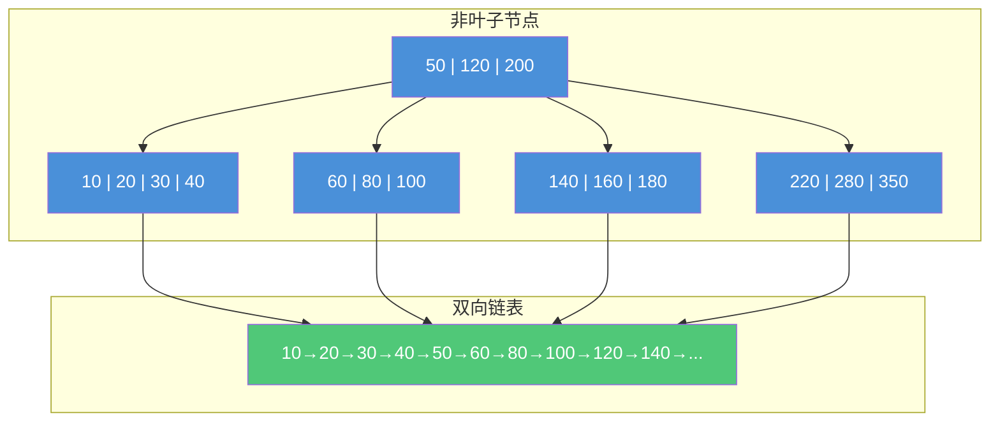

**B+Tree 优势：**

- **树高稳定**：通常 2~4 层，每次查询 2~4 次 IO（根节点常驻内存）
- **范围查询高效**：叶子节点链表可直接遍历，无须中序遍历
- **全表扫描快**：叶子节点形成全链表，顺序 IO

### B+Tree vs B-Tree vs 红黑树 vs 哈希索引

| 对比维度 | B+Tree | B-Tree | 红黑树 | 哈希索引 |
|---------|--------|--------|--------|---------|
| **IO 次数** | ~3 次（稳定） | ~3 次（数据在内部节点） | 树高 logN，深度 > 20 | 1 次（理想） |
| **范围查询** | ✅ 叶子链表 | ❌ 需中序遍历 | ❌ 中序遍历 | ❌ 不支持 |
| **磁盘友好** | ✅ 页大小=磁盘块 | ✅ | ❌ 节点分散 | ✅ 但冲突链连续 |
| **排序支持** | ✅ 已排序 | ✅ 已排序 | ✅ 已排序 | ❌ 无序 |
| **精确查询** | O(logN) | O(logN) | O(logN) | O(1) |

### 聚簇索引 vs 非聚簇索引（回表）

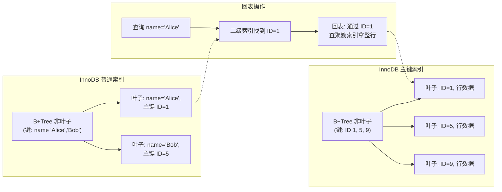

- **聚簇索引**（Clustered Index）：数据和索引存储在一起，叶子节点存完整行。每表只能有一个。
- **非聚簇索引**（Secondary Index）：叶子节点存主键值，查询数据需 **回表**（通过主键再查聚簇索引）。
- **覆盖索引**：当二级索引包含了查询所需全部列时，无需回表。

### 联合索引（复合索引）与最左前缀原则

```sql
-- 创建联合索引：idx_a_b_c (a, b, c)
ALTER TABLE t ADD INDEX idx_a_b_c (a, b, c);

-- ✅ 走索引：匹配最左前缀
SELECT * FROM t WHERE a = 1;
SELECT * FROM t WHERE a = 1 AND b = 2;
SELECT * FROM t WHERE a = 1 AND b = 2 AND c = 3;
SELECT * FROM t WHERE a = 1 AND c = 3;  -- 只用到 a，c 部分无法用索引（b 被跳过）
SELECT * FROM t WHERE a = 1 ORDER BY b; -- 用到 (a,b)

-- ❌ 不走索引：未从最左列开始
SELECT * FROM t WHERE b = 2;
SELECT * FROM t WHERE c = 3;
SELECT * FROM t WHERE b = 2 AND c = 3;

-- 范围查询后面的列索引失效
-- 以下 sql 中 a = 1 和 b > 5 用索引，c 无法用索引
SELECT * FROM t WHERE a = 1 AND b > 5 AND c = 3;
```

**最左前缀原则：** MySQL 联合索引按定义顺序构建 B+Tree，先按 `a` 排序，`a` 相同按 `b`，`b` 相同按 `c`。查询条件必须从最左列开始匹配，跳过中间的列会导致后续列无法使用索引。

### 索引下推（ICP）


**示例：** 联合索引 `(name, age)`，查询 `WHERE name LIKE '张%' AND age = 20`

```sql
-- 无 ICP：遍历所有姓张的记录 → 回表 → 过滤 age
-- 有 ICP：遍历姓张的记录时直接判断 age，跳过不匹配的，减少回表次数

-- 查看 ICP 是否启用
SHOW VARIABLES LIKE 'optimizer_switch'\G
-- 找到 index_condition_pushdown=on
```

### 覆盖索引优化查询

```sql
-- 有索引 idx_name_age (name, age)
-- 覆盖索引：查询列全部在索引中，无需回表
EXPLAIN SELECT name, age FROM t WHERE name = '张三';
-- Extra: Using index  ✅

-- 非覆盖索引：需要回表拿其他列
EXPLAIN SELECT name, age, address FROM t WHERE name = '张三';
-- Extra: NULL（需回表）
```

### 索引失效场景

```sql
-- 1. 联合索引违反最左前缀
CREATE INDEX idx_a_b ON t (a, b);
WHERE b = 1;           -- ❌ 不走索引

-- 2. 对索引列使用函数
WHERE DATE(create_time) = '2024-01-01';  -- ❌
WHERE create_time >= '2024-01-01' AND create_time < '2024-01-02'; -- ✅

-- 3. 隐式类型转换（字符串列传数字）
-- name 是 VARCHAR
WHERE name = 123;      -- ❌ MySQL 对 name 做 CAST 函数操作

-- 4. 索引列参与运算
WHERE id + 1 = 5;      -- ❌
WHERE id = 4;          -- ✅

-- 5. LIKE 以通配符开头
WHERE name LIKE '%张%'; -- ❌
WHERE name LIKE '张%';  -- ✅（前缀匹配可用索引）

-- 6. OR 条件中有非索引列
-- 索引 idx_a
WHERE a = 1 OR b = 2;  -- ❌ b 无索引则全表扫描
-- 可改为 UNION：
SELECT * FROM t WHERE a = 1
UNION
SELECT * FROM t WHERE b = 2 AND a IS NULL;

-- 7. NOT IN / <> / NOT EXISTS
WHERE status <> 1;     -- ❌ 一般不走索引
WHERE status IN (2,3); -- ✅

-- 8. 数据分布不均匀（优化器认为全表扫描更快）
-- 如果 status 大部分是 1，查询 status=1 可能不走索引
```

### 索引创建原则

| 原则 | 说明 |
|------|------|
| **高区分度** | 选区分度高的列（如 `COUNT(DISTINCT col)/COUNT(*)` 接近 1） |
| **查询条件** | 为 `WHERE`、`JOIN ON` 中的列创建索引 |
| **排序分组** | `ORDER BY`、`GROUP BY`、`DISTINCT` 涉及的列可考虑索引 |
| **覆盖索引** | 查询频繁的字段尽量覆盖在索引中 |
| **小表不建索引** | 表记录 < 1000 条，全表扫描更快 |
| **避免过多索引** | 写性能会下降，一个表索引建议不超过 5~6 个 |
| **长字段前缀索引** | 长字符串（如 `VARCHAR(255)`）可建前缀索引 `INDEX(name(20))` |

---

## 3. SQL 优化

### EXPLAIN 执行计划

```sql
EXPLAIN SELECT u.name, o.order_no
FROM user u
JOIN orders o ON u.id = o.user_id
WHERE u.age > 18
ORDER BY o.create_time DESC
LIMIT 10;
```

| 列名 | 示例值 | 说明 |
|------|--------|------|
| **id** | 1, 2 | 查询序号，id 越大越先执行，相同则从上到下 |
| **select_type** | `SIMPLE` / `PRIMARY` / `SUBQUERY` / `DERIVED` / `UNION` | 查询类型 |
| **table** | `u`, `o` | 表名 |
| **partitions** | NULL | 分区匹配情况 |
| **type** | `ALL`, `ref`, `eq_ref`, `range` | **访问类型**（SQL 优化核心关注点） |
| **possible_keys** | `idx_age` | 可能使用的索引 |
| **key** | `idx_age` | **实际使用的索引** |
| **key_len** | 4 | 索引使用长度（越短越好） |
| **ref** | `const` | 索引匹配的列或常量 |
| **rows** | 1000 | **预估扫描行数**（越小越好） |
| **filtered** | 50.0 | 满足条件百分比 |
| **Extra** | `Using index` | **额外信息** |

#### type 详解（性能从高到低）

```
system → const → eq_ref → ref → range → index → ALL
```

| type | 说明 | 示例 |
|------|------|------|
| **system** | 表只有一行（系统表） | 极罕见 |
| **const** | 主键/唯一索引等值匹配，最多一条 | `WHERE id = 1` |
| **eq_ref** | JOIN 时被驱动表主键/唯一索引等值匹配 | `ON u.id = o.user_id`（o 表 user_id 唯一） |
| **ref** | 普通索引等值匹配 | `WHERE name = '张三'` |
| **range** | 索引范围扫描 | `WHERE age > 18`，`BETWEEN`，`IN` |
| **index** | 扫描整个索引树（比 ALL 略好） | `SELECT COUNT(*)` 在二级索引上 |
| **ALL** | 全表扫描（性能最差） | 无合适索引 |

#### Extra 详解

| Extra | 说明 | 好坏 |
|-------|------|------|
| **Using index** | 覆盖索引，无需回表 | ✅ 好 |
| **Using where** | Server 层过滤数据 | 一般 |
| **Using index condition** | 索引下推（ICP） | ✅ 好 |
| **Using filesort** | 需要额外排序（无法利用索引排序） | ❌ 需优化 |
| **Using temporary** | 使用临时表（通常 GROUP BY/ORDER BY 不同列） | ❌ 需优化 |
| **Using index for group-by** | 松散索引扫描，GROUP BY 被索引覆盖 | ✅ 好 |

### 分页优化

#### 延迟关联（延迟 join）

```sql
-- ❌ 传统分页：OFFSET 大时扫描大量无用行
SELECT * FROM orders ORDER BY id LIMIT 100000, 20;

-- ✅ 延迟关联：先查主键再关联
SELECT o.*
FROM orders o
JOIN (SELECT id FROM orders ORDER BY id LIMIT 100000, 20) tmp
  ON o.id = tmp.id;
```

#### 游标分页（基于排序值）

```sql
-- ✅ 游标分页：记住上一页最后一条的 id
-- 第一页
SELECT * FROM orders ORDER BY id LIMIT 20;
-- 第二页（传入上一页最大 id）
SELECT * FROM orders WHERE id > 10020 ORDER BY id LIMIT 20;

-- 适用于按排序字段翻页，避免 OFFSET 偏移
-- 注意：排序字段必须唯一且递增
```

### JOIN 优化

```sql
-- ✅ 小表驱动大表：用小表的结果集驱动大表
-- 假设 orders 10万条，users 1000条
-- 以下写法 users 驱动 orders（用 users 的 id 去 orders 里匹配）
SELECT * FROM users u JOIN orders o ON u.id = o.user_id;

-- ✅ JOIN 关联列必须建索引
-- orders.user_id 建索引可以加速 JOIN
ALTER TABLE orders ADD INDEX idx_user_id (user_id);

-- ❌ 避免使用 JOIN 关联太多表（建议 ≤ 3 个表）
```

### COUNT 查询

```sql
-- COUNT(*) 与 COUNT(1) 性能基本完全一致
-- InnoDB 下 COUNT(*) 不取具体值，取行数

-- COUNT(列名) 会判断该列是否为 NULL，忽略 NULL 行
-- 如果该列允许 NULL，COUNT(col) < COUNT(*)

-- ⚡ 优化大表计数
-- 1. 使用近似值：SHOW TABLE STATUS LIKE 'orders'; 中的 rows
-- 2. 独立计数表维护（Redis / 额外表）
-- 3. 二级索引计数更快（MySQL 自动选择最小索引树）
```

### 大表 DDL

| 工具 | 特点 | 原理 |
|------|------|------|
| **pt-osc**（Percona Toolkit） | 不锁表、可监控进度 | 创建影子表 → 触发器同步 → 切换 |
| **gh-ost**（GitHub） | 无触发器、基于 Binlog | 创建影子表 → Binlog 同步 → 切换 |

```bash
# pt-online-schema-change
pt-online-schema-change --alter "ADD COLUMN age INT" D=db,t=table --execute

# gh-ost
gh-ost --alter "ADD COLUMN age INT" --database=db --table=table --execute
```

---

## 4. 事务与锁

### ACID 实现原理

| 特性 | 含义 | 实现机制 |
|------|------|---------|
| **A**（原子性 Atomicity） | 事务不可分割，要么全做要么全不做 | **Undo Log**：回滚时利用 undo 消除变更 |
| **C**（一致性 Consistency） | 数据满足完整性约束 | **Redo + Undo + 锁 + 约束**共同保证 |
| **I**（隔离性 Isolation） | 并发事务互不干扰 | **锁机制** + **MVCC** |
| **D**（持久性 Durability） | 提交后数据永久保存 | **Redo Log**：WAL 机制，保证崩溃恢复 |

### 事务隔离级别

| 隔离级别 | 脏读 | 不可重复读 | 幻读 | 实现方式 |
|---------|:---:|:---------:|:---:|---------|
| **READ UNCOMMITTED**（读未提交） | ✅ 可能 | ✅ 可能 | ✅ 可能 | 直接读最新版本 |
| **READ COMMITTED**（读已提交） | ❌ 避免 | ✅ 可能 | ✅ 可能 | 每次读生成新 ReadView |
| **REPEATABLE READ**（可重复读）⭐ 默认 | ❌ 避免 | ❌ 避免 | ✅ 可能（InnoDB 通过间隙锁避免） | 事务开始时生成 ReadView |
| **SERIALIZABLE**（串行化） | ❌ 避免 | ❌ 避免 | ❌ 避免 | 所有读自动加锁 |

```sql
-- 查看当前隔离级别
SELECT @@transaction_isolation;
-- 或: SHOW VARIABLES LIKE 'transaction_isolation';

-- 设置隔离级别
SET SESSION TRANSACTION ISOLATION LEVEL READ COMMITTED;
SET GLOBAL TRANSACTION ISOLATION LEVEL REPEATABLE READ;
```

### MVCC 实现原理

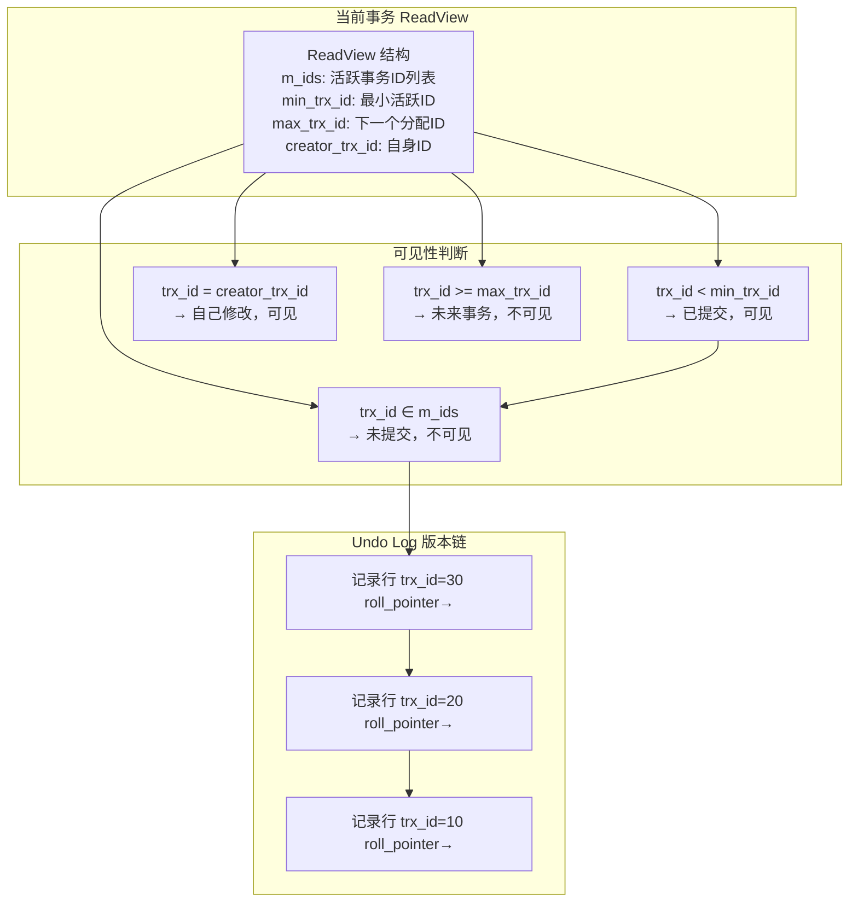

**快照读 vs 当前读：**

| 类型 | 操作 | 是否加锁 | 读取版本 |
|------|------|---------|---------|
| **快照读**（Snapshot Read） | `SELECT` | ❌ 无锁 | 从 ReadView + undo 版本链读取可见版本 |
| **当前读**（Current Read） | `SELECT ... FOR UPDATE` / `SELECT ... LOCK IN SHARE MODE` / `INSERT` / `UPDATE` / `DELETE` | ✅ 加锁 | 读取最新已提交版本 |

**MVCC 只在 READ COMMITTED 和 REPEATABLE READ 下生效：**

- **RC**：每次 `SELECT` 都生成新的 ReadView
- **RR**：事务第一次 `SELECT` 时生成 ReadView，整个事务复用

### Next-Key Lock（临键锁）

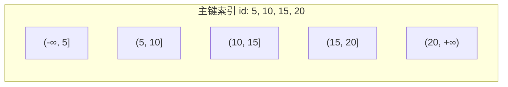

**Next-Key Lock = Record Lock（行锁）+ Gap Lock（间隙锁）**

- **Record Lock**：锁定索引记录本身
- **Gap Lock**：锁定记录之间的间隙，防止幻读
- **Next-Key Lock**：锁定一个左开右闭区间 `(a, b]`

```sql
-- RR 隔离级别下示例：
-- id = 10 有记录，锁定 (5,10] 和 (10,15]
SELECT * FROM t WHERE id = 10 FOR UPDATE;

-- 范围查询触发 Next-Key Lock
SELECT * FROM t WHERE id > 10 AND id < 20 FOR UPDATE;
-- 锁定区间 (10,15] 和 (15,20]
```

**意向锁（Intention Lock）：**

- **意向共享锁（IS）**：事务想给表中某些行加共享锁
- **意向排他锁（IX）**：事务想给表中某些行加排他锁
- MySQL 先判断意向锁是否兼容，避免逐行检查，提高表锁/行锁冲突判断效率

### 行锁 / 表锁 / 意向锁

```sql
-- 行锁（InnoDB 默认）：锁定索引记录
UPDATE t SET name = 'a' WHERE id = 1;  -- 锁 id=1 的行

-- 表锁
LOCK TABLES t READ;   -- 读锁
LOCK TABLES t WRITE;  -- 写锁
UNLOCK TABLES;

-- 元数据锁（MDL）：自动加，防止 DDL 与 DML 冲突
-- 不需要手动管理
```

### 死锁排查

```sql
-- 查看死锁信息
SHOW ENGINE INNODB STATUS\G
-- 关注 LATEST DETECTED DEADLOCK 部分

-- 查看当前正在执行的事务
SELECT * FROM information_schema.INNODB_TRX\G

-- 查看当前锁等待
SELECT * FROM information_schema.INNODB_LOCK_WAITS;

-- 查看具体锁
SELECT * FROM performance_schema.data_locks;

-- 死锁产生条件
-- 1. 事务 A 锁住资源 R1，请求 R2
-- 2. 事务 B 锁住资源 R2，请求 R1
-- 3. 互相等待 → InnoDB 回滚其中一个（回滚 undo 量更少的事务）

-- 预防建议
-- 1. 固定访问顺序（如按 id 升序更新）
-- 2. 事务尽量短小
-- 3. 设置合理的锁超时：innodb_lock_wait_timeout=50
```

---

## 5. 日志

### Redo Log

| 特性 | 说明 |
|------|------|
| **类型** | 物理日志（记录"对哪个页的哪个偏移做了什么修改"） |
| **作用** | 崩溃恢复（Crash Recovery），保证事务持久性（D） |
| **写入方式** | WAL（Write-Ahead Logging）：事务提交时先写 redo log，再刷数据页 |
| **存储** | 循环写，固定大小（`ib_logfile0`, `ib_logfile1`） |
| **内容** | 记录页级别的物理修改，顺序写，性能高 |

```sql
SHOW VARIABLES LIKE 'innodb_log_file_size'; -- redo 文件大小
SHOW VARIABLES LIKE 'innodb_log_files_in_group'; -- redo 文件数量
SHOW VARIABLES LIKE 'innodb_flush_log_at_trx_commit';
-- 0: 每秒刷盘（性能最优，崩溃丢 1s 数据）
-- 1: 每次提交刷盘（最安全，默认）
-- 2: 每次提交写 OS cache，每秒刷盘（性能与安全的平衡）
```

### Undo Log

| 特性 | 说明 |
|------|------|
| **类型** | 逻辑日志（记录"如何撤销"的操作） |
| **作用** | 事务回滚 + MVCC 版本链 |
| **内容** | `INSERT` 对应 `DELETE` undo；`UPDATE` 对应反向 `UPDATE`；`DELETE` 对应 `INSERT` undo |
| **生命周期** | 事务提交后，当没有更早的事务需要访问该版本时，purge 线程清理 |
| **存储** | 存储在 undo 表空间（`undo_001`, `undo_002`） |

### Binlog（二进制日志）

| 特性 | 说明 |
|------|------|
| **类型** | 逻辑日志（记录 SQL 语句或行变更） |
| **作用** | 主从复制、数据恢复、审计 |
| **格式** | `STATEMENT`（SQL 语句）、**`ROW`**（推荐，记录行变更）、`MIXED` |
| **写入时机** | 事务提交后写入 |
| **存储** | 追加写，归档，可设置过期时间 |

```sql
SHOW VARIABLES LIKE 'log_bin'; -- 是否开启
SHOW VARIABLES LIKE 'binlog_format'; -- 格式
SHOW VARIABLES LIKE 'expire_logs_days'; -- 过期天数（MySQL 8.4+ 用 binlog_expire_logs_seconds）

-- 查看 binlog 文件列表
SHOW BINARY LOGS;

-- 查看 binlog 内容
SHOW BINLOG EVENTS IN 'mysql-bin.000001';

-- 使用 mysqlbinlog 工具恢复
-- mysqlbinlog --start-datetime="2024-01-01 10:00:00" --stop-datetime="2024-01-01 11:00:00" mysql-bin.000001 | mysql -u root -p
```

### Redo Log vs Binlog 区别 + 两阶段提交

| 对比维度 | Redo Log | Binlog |
|---------|----------|--------|
| **所属层** | InnoDB 存储引擎层 | MySQL Server 层 |
| **日志类型** | 物理日志（页修改） | 逻辑日志（ROW 行变更） |
| **写入方式** | 循环写（固定大小） | 追加写（归档） |
| **用途** | 崩溃恢复 | 主从复制、数据恢复 |
| **刷盘策略** | `innodb_flush_log_at_trx_commit` | `sync_binlog` |

#### 两阶段提交

```mermaid
sequenceDiagram
    participant Client
    participant Server as MySQL Server
    participant InnoDB as InnoDB 引擎
    participant Binlog as Binlog
    participant Redo as Redo Log

    Client->>Server: BEGIN; UPDATE t SET x=1 WHERE id=1;
    Server->>InnoDB: 更新内存中的行
    InnoDB->>Redo: 写入 Redo Log（Prepare 阶段）
    Note over Redo: Redo Log 状态: PREPARE
    Server->>Binlog: 写入 Binlog（事务提交）
    Note over Binlog: Binlog 写入成功
    InnoDB->>Redo: 更新 Redo Log（Commit 阶段）
    Note over Redo: Redo Log 状态: COMMIT
    Server->>Client: OK, 事务提交成功
```

**两阶段提交为什么必要？**

如果没有两阶段提交，崩溃时可能出现 Redo Log 和 Binlog 不一致：

| 场景 | 问题 |
|------|------|
| 先写 Redo Log 再写 Binlog → Redo 写完崩溃 | 主库恢复后有数据，从库无数据（主从不一致） |
| 先写 Binlog 再写 Redo Log → Binlog 写完崩溃 | 从库有数据，主库恢复后无数据 |

两阶段提交保证 Redo Log 与 Binlog 逻辑一致，崩溃恢复时：

- 若 Redo Log 是 PREPARE 状态且 Binlog 写入成功 → 事务提交
- 若 Redo Log 是 PREPARE 状态且 Binlog 未写入 → 事务回滚

---

## 6. 主从复制与高可用

### 主从复制原理

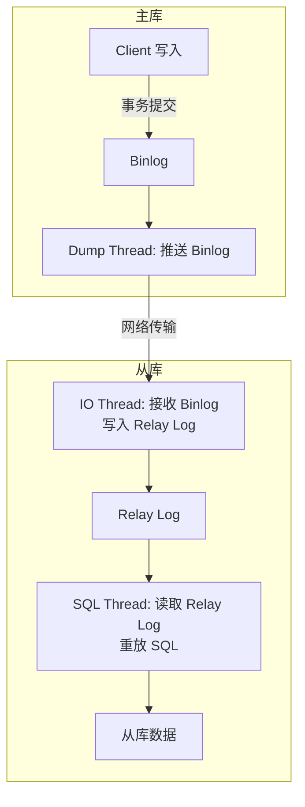

**复制步骤：**

1. 主库事务提交时写入 Binlog
2. 主库 `Dump Thread` 将 Binlog 推送给从库
3. 从库 `IO Thread` 接收 Binlog 并写入 `Relay Log`（中继日志）
4. 从库 `SQL Thread` 读取 Relay Log 并回放执行

### 复制模式对比

| 模式 | 写入确认 | 性能影响 | 数据安全性 |
|------|---------|---------|-----------|
| **异步复制**（默认） | 主库提交即返回，不等待从库 | 最小 | 主库宕机可能丢数据 |
| **半同步复制**（Semisync） | 至少一个从库写入 Relay Log 后才提交 | 中等 | 不丢数据（至少一个从库有） |
| **全同步复制（MGR）** | 多数节点写入后返回 | 较大 | 强一致性 |

```sql
-- 查看复制状态
SHOW SLAVE STATUS\G
-- 关注: Slave_IO_Running/Slave_SQL_Running/Seconds_Behind_Master

-- 半同步复制安装
INSTALL PLUGIN rpl_semi_sync_master SONAME 'semisync_master.so';
INSTALL PLUGIN rpl_semi_sync_slave SONAME 'semisync_slave.so';
SET GLOBAL rpl_semi_sync_master_enabled = 1;
SET GLOBAL rpl_semi_sync_slave_enabled = 1;
```

### 主从延迟原因与解决方案

| 延迟原因 | 解决方案 |
|---------|---------|
| 从库单线程 SQL Thread 重放慢 | MySQL 8.0 并行复制（`slave_parallel_workers > 0`） |
| 主库大事务（如 `DELETE` 千万行） | 拆分大事务，分批操作 |
| 从库硬件性能差 | 从库配置不低于主库 |
| 主库写入压力过大 | 读写分离 + 一主多从 |
| 从库执行了长时间查询 | 使用从库专门处理 `SELECT` |

```sql
-- MySQL 8.0 开启并行复制
STOP SLAVE;
SET GLOBAL slave_parallel_workers = 4;
SET GLOBAL slave_parallel_type = 'LOGICAL_CLOCK';
START SLAVE;
```

### 读写分离

```sql
-- 应用层读写分离：主库写，从库读
-- 强制走主库（避免刚写入就查询从库出现延迟）
-- 场景：用户注册后立即登录

-- 方案 1：在业务代码中标记强制走主库
-- 方案 2：从库 SHOW SLAVE STATUS 判断延迟
-- 方案 3：中间件层（MySQL Router / ProxySQL / ShardingSphere）
```

### 高可用方案

| 方案 | 说明 | 切换方式 |
|------|------|---------|
| **MHA**（Master High Availability） | 经典主从切换，自动选新主 | 自动故障检测 + VIP 漂移 |
| **MGR**（MySQL Group Replication） | 基于 Paxos 的组复制，多节点写入 | 自动切换，强一致性 |
| **InnoDB Cluster** | MySQL Shell + MGR + MySQL Router | 完整集群方案，自动切换 |

---

## 7. 分库分表

### 水平分片 vs 垂直分片

| 分片类型 | 说明 | 示例 |
|---------|------|------|
| **水平分片（Sharding）** | 按行切分，每张表结构相同，数据不同 | `user_0`, `user_1`, `user_2` |
| **垂直分片（拆分）** | 按列切分，将大表拆成多个小表 | 用户基础信息表 + 用户扩展信息表 |

### 分片策略

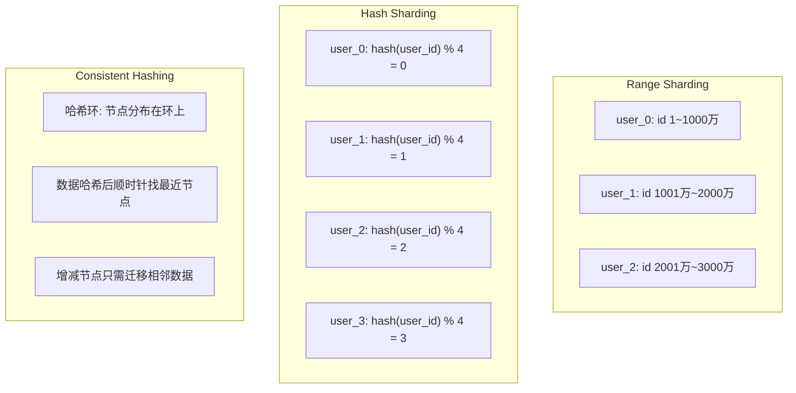

**各策略对比：**

| 策略 | 优点 | 缺点 | 适用场景 |
|------|------|------|---------|
| **范围分片** | 范围查询友好，扩展简单 | 数据倾斜（热点区间） | 按时间分片（按月/年） |
| **哈希分片** | 数据分布均匀 | 扩缩容需 rehash，范围查询跨库 | 用户 ID 分片 |
| **一致性哈希** | 扩缩容影响小 | 实现复杂，少量数据倾斜 | 缓存集群、需动态扩缩容 |

### 分库分表后难题

| 难题 | 解决方案 |
|------|---------|
| **跨库 JOIN** | 1. 应用层组装 2. 全局表冗余 3. 使用 ShardingSphere 聚合 |
| **全局聚合** | 所有分片并行查询后合并（ShardingSphere 自动处理） |
| **跨分片分页** | 取所有分片数据后在内存中重排序（深分页性能差） |
| **分布式事务** | 1. Seata AT/TCC 2. 可靠消息最终一致性 3. BASE 柔性事务 |
| **唯一主键** | 雪花算法（Snowflake）、分段号段、UUID、Redis INCR |

### ShardingSphere-JDBC 配置

```yaml
# application.yaml
spring:
  shardingsphere:
    datasource:
      names: ds0, ds1
      ds0:
        url: jdbc:mysql://localhost:3306/db0
        username: root
        password: root
      ds1:
        url: jdbc:mysql://localhost:3306/db1
        username: root
        password: root

    rules:
      sharding:
        tables:
          t_order:
            actual-data-nodes: ds$->{0..1}.t_order_$->{0..1}
            database-strategy:
              standard:
                sharding-column: user_id
                sharding-algorithm-name: db-hash
            table-strategy:
              standard:
                sharding-column: order_id
                sharding-algorithm-name: table-hash

        sharding-algorithms:
          db-hash:
            type: HASH_MOD
            props:
              sharding-count: 2
          table-hash:
            type: HASH_MOD
            props:
              sharding-count: 2
```

```java
// Java 配置方式
@Configuration
public class ShardingConfig {

    @Bean
    public ShardingSphereDataSource shardingSphereDataSource() {
        ShardingSphereDataSource dataSource = ShardingSphereDataSourceFactory
            .createDataSource(createDataSourceMap(), createRules(), new Properties());
        return dataSource;
    }
}
```

### 全局主键 ID 方案

| 方案 | ID 长度 | 性能 | 优缺点 |
|------|--------|------|--------|
| **雪花算法（Snowflake）** | 64bit（Long） | 高 | 时间戳 + 机器 + 序列号，趋势递增，不依赖 DB |
| **号段模式（Leaf Segment）** | 64bit（Long） | 高 | 从 DB 取一段号，内存分配，依赖 DB 但批量获取 |
| **UUID** | 128bit（String） | 中 | 无序、占用空间大、索引性能差 |
| **Redis INCR** | Long | 高 | 依赖 Redis 可用性，但可做缓存持久化 |
| **数据库自增** | Long | 低 | 单点、不可做分库唯一主键 |

**推荐：雪花算法变体 / Leaf-Segment 方案。**

```java
// 雪花算法核心结构
// | 1bit 符号位 | 41bit 时间戳 | 10bit 机器码 | 12bit 序列号 |
public class SnowflakeIdWorker {
    private long workerId;
    private long sequence = 0L;
    private long lastTimestamp = -1L;

    public synchronized long nextId() {
        long timestamp = System.currentTimeMillis();
        if (timestamp < lastTimestamp) { /* 时钟回拨处理 */ }
        if (timestamp == lastTimestamp) {
            sequence = (sequence + 1) & 4095;
            if (sequence == 0) timestamp = waitNextMillis(timestamp);
        } else {
            sequence = 0;
        }
        lastTimestamp = timestamp;
        return ((timestamp - 1288834974657L) << 22)
             | (workerId << 12)
             | sequence;
    }
}
```

---

## 8. 数据库设计

### 三大范式与反范式

| 范式 | 定义 | 示例违反 |
|------|------|---------|
| **1NF**（第一范式） | 列不可再分，每个列是原子值 | `address: "北京市海淀区"` 应拆为 `city`, `district` |
| **2NF**（第二范式） | 满足 1NF + 非主键列完全依赖于主键 | `(order_id, product_id) → quantity`，price 只依赖 product_id，应拆表 |
| **3NF**（第三范式） | 满足 2NF + 非主键列直接依赖主键（非传递依赖） | `student_id → dept_id → dept_name`，dept_name 应放部门表 |

**反范式（Denormalization）：** 适当引入冗余以提升查询性能。如 `order` 表冗余 `user_name` 避免 JOIN。

### 字段类型选择

| 类别 | 推荐 | 说明 |
|------|------|------|
| **整数** | `TINYINT` / `INT` / `BIGINT` | 够用就好，`INT UNSIGNED` 范围 0~42 亿 |
| **小数** | `DECIMAL(18,2)` | 精确小数用 DECIMAL，避免 FLOAT/DOUBLE 精度丢失 |
| **字符串** | `VARCHAR(N)` | 不固定长度用 VARCHAR，固定长度如手机号用 CHAR |
| **大文本** | `TEXT` / `MEDIUMTEXT` | 尽量避免，或从主表拆出（垂直拆分） |
| **日期时间** | `DATETIME` / `TIMESTAMP` | TIMESTAMP 占用 4B，范围 1970~2038；DATETIME 占用 5B |
| **JSON** | `JSON`（MySQL 5.7+） | 支持索引（虚拟列 + 函数索引） |
| **布尔** | `TINYINT(1)` | MySQL 无原生 BOOLEAN，用 `TINYINT(1)` |

```sql
-- 字段类型选择示例
CREATE TABLE user (
    id         BIGINT UNSIGNED  NOT NULL  COMMENT '主键',
    name       VARCHAR(50)      NOT NULL  COMMENT '用户名建议50以内',
    age        TINYINT UNSIGNED NOT NULL  COMMENT '年龄0~255',
    email      VARCHAR(100)              COMMENT '邮箱',
    balance    DECIMAL(18,2)   NOT NULL DEFAULT 0.00 COMMENT '余额',
    status     TINYINT(1)      NOT NULL DEFAULT 1  COMMENT '状态 1正常 0禁用',
    create_time DATETIME       NOT NULL DEFAULT CURRENT_TIMESTAMP COMMENT '创建时间',
    extra_info JSON                     COMMENT '扩展字段',
    PRIMARY KEY (id)
) ENGINE=InnoDB DEFAULT CHARSET=utf8mb4;
```

### 主键设计

| 方案 | 优点 | 缺点 |
|------|------|------|
| **自增 INT/BIGINT** | 简单、索引写入顺序好（B+Tree 页分裂少） | 分库分表冲突、分布式不可用 |
| **雪花 ID** | 全局唯一、趋势递增、分布式友好 | 时钟回拨问题、较长（19位数字） |
| **UUID** | 本地生成、唯一 | 无序、16B 占空间、索引性能差 |
| **业务主键**（如订单号） | 有业务含义 | 变更困难 |

**推荐：单库用自增 BIGINT，分布式用雪花 ID 或号段模式。**

### 索引设计规范

```sql
-- 1. 主键索引使用自增 BIGINT（避免 UUID 导致的页分裂）
CREATE TABLE t (
    id BIGINT AUTO_INCREMENT PRIMARY KEY
);

-- 2. 联合索引将高区分度列放前面
CREATE INDEX idx_status_create ON t (status, create_time);

-- 3. 避免冗余索引
-- ❌ idx_a 和 idx_a_b 可被 idx_a_b_c 覆盖
-- ✅ 只建最常用的组合

-- 4. 外键不使用物理外键，用逻辑关联
-- ❌ FOREIGN KEY (dept_id) REFERENCES dept(id)
-- ✅ 程序中保证数据一致性

-- 5. 用覆盖索引优化高频查询
CREATE INDEX idx_name_age ON user (name, age);
-- SELECT name, age FROM user WHERE name = '张三';  -- Using index

-- 6. 大字段 TEXT/BLOB 不参与索引
-- ❌ INDEX on description (TEXT)
-- ✅ 全文本搜索使用全文索引

-- 7. 索引命名规范
-- idx_表名_列名：idx_user_name
-- uk_表名_列名：uk_user_email（唯一索引）
-- fk_表名_列名：fk_order_user_id
```

---

---

## 9. PostgreSQL 核心知识

### 9.1 PostgreSQL 概述

PostgreSQL 是一个功能强大的开源对象关系型数据库，以其高度兼容 SQL 标准、丰富的扩展能力和可靠性著称。

### 9.2 PostgreSQL vs MySQL 核心对比

| 特性 | MySQL | PostgreSQL |
|------|-------|------------|
| **ACID 支持** | InnoDB 支持 | 原生完整支持 |
| **SQL 标准兼容** | 部分（如不支持 FULL OUTER JOIN 早期版本、窗口函数晚于 PG） | 高度兼容（CTE/窗口函数/递归查询原生支持） |
| **索引类型** | B+Tree、Hash、Full-Text、R-Tree(MyISAM) | B+Tree、Hash、GiST、GIN、SP-GiST、BRIN、Bloom |
| **JSON 支持** | JSON（5.7+）/ JSON 类型优化索引 | JSONB（二进制存储、支持 GIN 索引）、JSON |
| **全文搜索** | InnoDB/MyISAM 全文索引 | tsvector/tsquery、词典配置、排名 |
| **复制方式** | 异步/半同步/组复制（MGR） | 流复制（同步/异步）、逻辑复制 |
| **并发控制** | MVCC（undo log 版本链） | MVCC（多版本存储于堆，每个元组多个版本） |
| **扩展机制** | 插件（如审计插件） | 扩展（Extension，如 PostGIS、pg_stat_statements） |
| **存储过程** | SQL/PSM | PL/pgSQL（类似 Oracle PL/SQL）、支持 Python/Perl/Tcl |
| **表继承** | 不支持 | 支持表继承 |
| **分区表** | 支持（RANGE/LIST/HASH/KEY） | 支持（RANGE/LIST/HASH）、声明式分区 |
| **物化视图** | 不支持（仅视图） | 原生支持（REFRESH MATERIALIZED VIEW） |
| **GUC 参数热加载** | 部分支持（SET PERSIST） | pg_reload_conf() |
| **许可证** | GPL 双协议 | PostgreSQL 开源协议（类似 MIT） |

### 9.3 PostgreSQL 核心特性详解

#### MVCC 实现机制

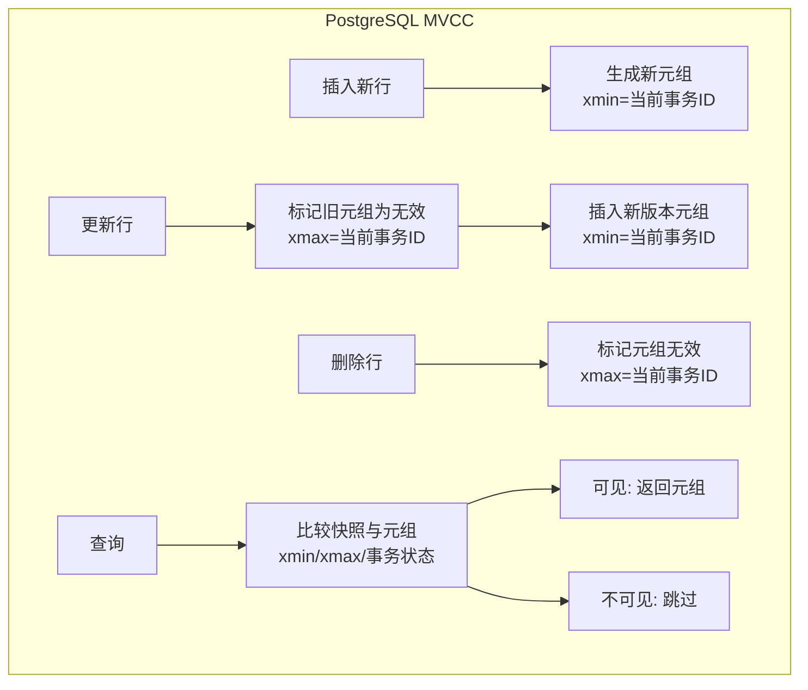

PostgreSQL 的 MVCC 将元组（Tuple）的多个版本直接存储在堆表中，通过 `xmin`（创建事务 ID）和 `xmax`（删除/过期事务 ID）两个隐藏字段控制可见性。VACUUM 进程清理不再需要的旧版本元组。

#### 索引类型详解

```sql
-- B-Tree（默认，支持 = / > / < / >= / <= / BETWEEN / IN / LIKE 'abc%' / IS NULL）
CREATE INDEX idx_name ON users (name);

-- Hash（仅支持 = 等值查询）
CREATE INDEX idx_hash_id ON users USING hash (id);

-- GiST（通用搜索树，支持全文搜索、几何类型、范围类型）
CREATE INDEX idx_gist_geo ON locations USING gist (geo_point);

-- GIN（倒排索引，适合 JSONB、全文搜索、数组）
CREATE INDEX idx_gin_tags ON articles USING gin (tags);
CREATE INDEX idx_gin_json ON products USING gin (data jsonb_path_ops);

-- BRIN（块范围索引，适合时序数据、天然有序的大数据量）
CREATE INDEX idx_brin_created ON orders USING brin (created_at) WITH (pages_per_range = 32);

-- 部分索引（Partial Index）
CREATE INDEX idx_active_users ON users (email) WHERE status = 'active';

-- 覆盖索引（Included Columns, PG 11+）
CREATE INDEX idx_covering ON orders (user_id) INCLUDE (amount, status);
```

#### 流复制架构

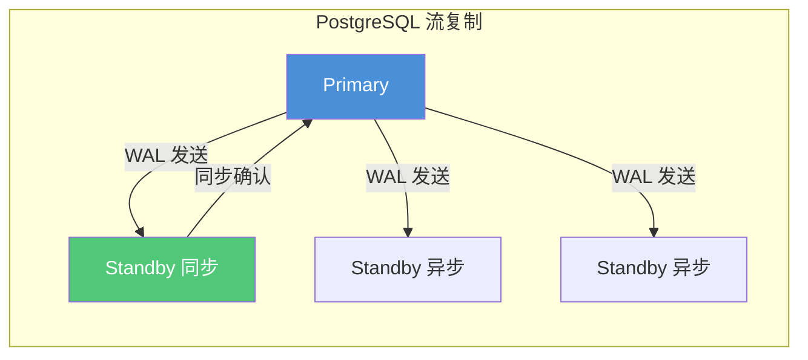

```sql
-- 主库配置 postgresql.conf
wal_level = replica            -- 或 logical（逻辑复制）
max_wal_senders = 10           -- 最大 WAL 发送进程数
wal_keep_size = 1024           -- WAL 保留大小（MB）

-- 同步/异步配置
synchronous_standby_names = 'FIRST 1 (s1)'  -- 同步复制节点

-- 从库配置
primary_conninfo = 'host=192.168.1.10 port=5432 user=repl password=xxx'
hot_standby = on               -- 允许只读查询
```

#### 逻辑复制（Logical Replication，PG 10+）

```sql
-- 发布端（Publisher）
CREATE PUBLICATION my_pub FOR TABLE users, orders;
CREATE PUBLICATION all_pub FOR ALL TABLES;

-- 订阅端（Subscriber）
CREATE SUBSCRIPTION my_sub
CONNECTION 'host=192.168.1.20 port=5432 dbname=mydb user=repl'
PUBLICATION my_pub;
```

### 9.4 PostgreSQL 核心扩展

| 扩展 | 用途 | 示例 |
|------|------|------|
| **PostGIS** | 地理空间数据处理 | `CREATE EXTENSION postgis;` |
| **pg_stat_statements** | SQL 性能统计 | 查询 Top N 慢 SQL |
| **pg_partman** | 分区表自动管理 | 按时间自动创建分区 |
| **pg_repack** | 在线重建表 | 替代 VACUUM FULL |
| **pg_bouncer** | 连接池（独立进程） | 轻量级连接池 |
| **uuid-ossp** | UUID 生成 | `gen_random_uuid()` |
| **pg_trgm** | 模糊查询索引支持 | LIKE '%xxx%' 走索引 |
| **hstore** | KV 存储（PG 9.x 之前，JSONB 替代） | 键值对操作 |

---

## 10. TiDB 核心知识

### 10.1 TiDB 概述

TiDB 是 PingCAP 开发的分布式 NewSQL 数据库，兼容 MySQL 协议，支持水平弹性扩展、强一致性和高可用。核心设计思想：**计算与存储分离**。

### 10.2 TiDB 架构

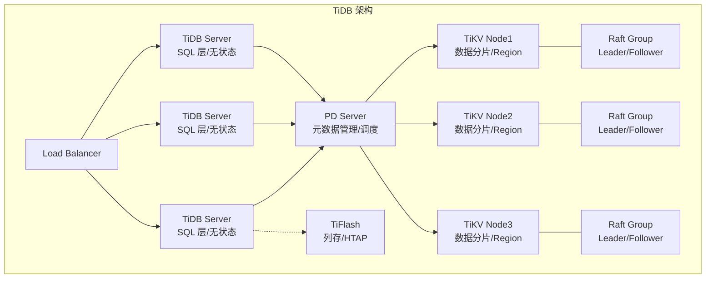

### 10.3 核心组件

| 组件 | 功能 | 说明 |
|------|------|------|
| **TiDB Server** | 无状态 SQL 层 | 解析 SQL、生成执行计划、兼容 MySQL 协议 |
| **PD Server** | 元数据管理与调度 | 集群元数据存储（etcd）、Region 调度、TSO 时间戳分配 |
| **TiKV** | 分布式 KV 存储 | 行式存储、Raft 一致性协议、Region（默认 96MB）分片 |
| **TiFlash** | 列式存储引擎 | HTAP 场景、异步复制 TiKV 数据、MPP 计算 |
| **TiCDC** | 变更数据捕获 | 实时同步到下游（Kafka、MySQL 等） |

### 10.4 TiDB 核心特性

#### 水平扩展

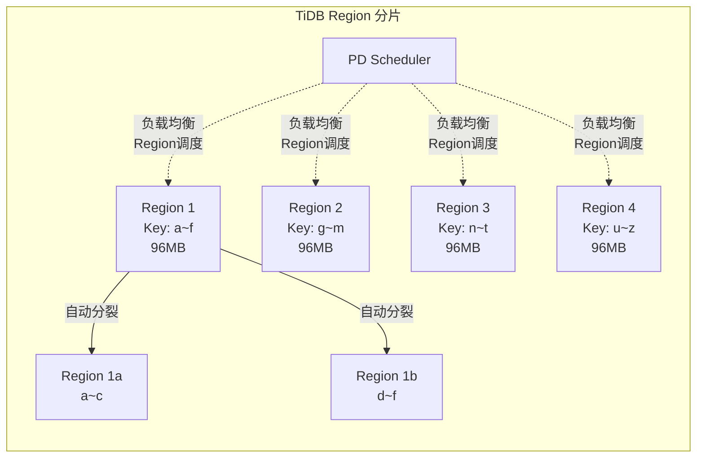

- 数据按 Key 范围自动划分为 Region（默认 96MB）
- Region 达到大小阈值自动分裂（Split）
- PD 根据节点负载自动迁移 Region（Schedule）
- 新增节点自动实现数据再平衡

#### 分布式事务

```sql
-- TiDB 支持完整的分布式事务（ACID），兼容 MySQL 事务语法
BEGIN;
UPDATE accounts SET balance = balance - 100 WHERE id = 1;
UPDATE accounts SET balance = balance + 100 WHERE id = 2;
COMMIT;
```

TiDB 使用 **Percolator** 事务模型（Google 论文实现），通过 PD 获取全局单调递增的 TSO（Timestamp Oracle）时间戳作为事务版本号，结合 MVCC 实现快照隔离（SI）级别。

#### Raft 一致性协议

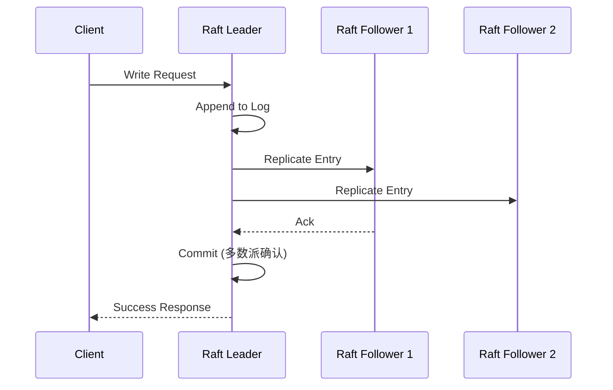

每个 Region 默认 3 副本，基于 Raft 协议保证强一致性。Leader 处理读写，Follower 同步数据。节点故障时自动选举新 Leader，RPO = 0，RTO < 30s。

#### HTAP（混合事务/分析处理）

```sql
-- 创建 TiFlash 副本
ALTER TABLE orders SET TIFLASH REPLICA 1;

-- 查询自动路由到 TiFlash（行存→列存转换）
SELECT /*+ read_from_storage(tiflash[o]) */ 
       DATE(created_at), SUM(amount)
FROM orders o
WHERE created_at >= '2024-01-01'
GROUP BY DATE(created_at);
```

### 10.5 TiDB vs MySQL 对比

| 特性 | MySQL | TiDB |
|------|-------|------|
| **存储上限** | 单机 TB 级（受硬件限制） | PB 级（水平扩展） |
| **扩展方式** | 读写分离（主从） | 节点水平扩展（在线） |
| **一致性** | 异步复制有延迟，可能丢失数据 | Raft 强一致性，RPO=0 |
| **分库分表** | 需中间件（ShardingSphere/MyCat） | 原生分片，对应用透明 |
| **DDL 影响** | 大表 DDL 阻塞（pt-osc/gh-ost 缓解） | 在线 DDL，不阻塞读写 |
| **分布式事务** | 不支持跨节点事务 | Percolator 模型，跨节点 ACID |
| **SQL 兼容** | - | MySQL 协议兼容（>95%） |
| **部署复杂度** | 低 | 较高（至少 3 节点起） |
| **硬件需求** | 低 | 较高（推荐 SSD 万兆网络） |
| **适用场景** | 中小规模 OLTP | 大规模 OLTP + HTAP |

### 10.6 TiDB 适用场景

| 场景 | 说明 |
|------|------|
| **海量数据 OLTP** | 单表百亿级、水平扩展无需分库分表 |
| **高并发写入** | 分布式架构，写入能力随节点线性扩展 |
| **HTAP 混合负载** | TiFlash 列存加速分析查询 |
| **MySQL 弹性升级** | 从 MySQL 无缝迁移，代码零修改 |
| **金融级高可用** | Raft 多副本，RPO=0，RTO<30s |

---

## 11. OceanBase 核心知识

### 11.1 OceanBase 概述

OceanBase 是蚂蚁集团自主研发的分布式关系数据库，支持 MySQL 和 Oracle 两种兼容模式，具备金融级高可用、水平扩展和高性能特性。

### 11.2 OceanBase 架构

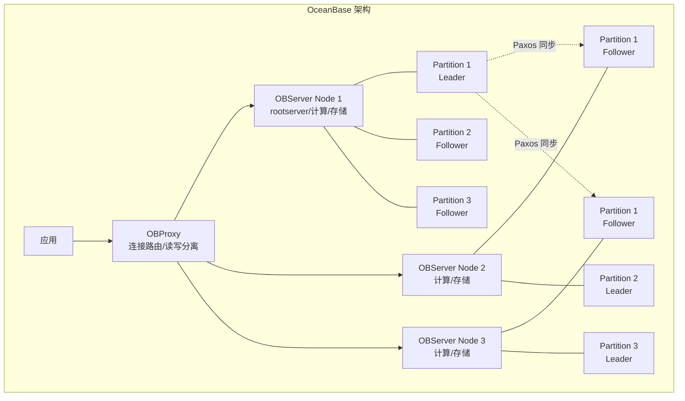

### 11.3 核心特性

#### 存储引擎 — LSM-Tree

```
内存写入:
写入请求 → MemTable（内存表，可读写）
           ↓ (转储)
          Mini SSTable → Minor SSTable → Major SSTable
                                           ↑
                                       基线数据（基线合并）
```

OceanBase 采用 LSM-Tree（Log Structured Merge Tree）存储引擎，写入先写 MemTable（内存），达到阈值后冻结转储（Minor Freeze），定期合并（Major Merge）形成基线数据。相比 B+Tree，写入吞吐更高、空间放大更可控。

#### 多副本与 Paxos 协议

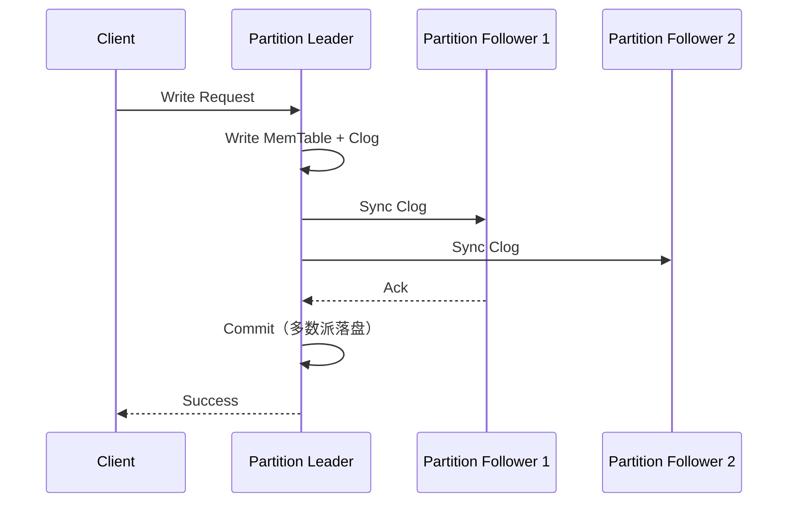

- 默认 3 副本，采用自研 Paxos 协议保证强一致性
- 日志（Clog）多数派落盘后返回成功，RPO=0
- 自动故障检测 + 日志流 Leader 切换

#### 资源隔离与多租户

```sql
-- 创建资源单元（Unit）
CREATE RESOURCE UNIT unit_1 
    MAX_CPU 4, MEMORY_SIZE '8G', MAX_IOPS 10000;

-- 创建资源池
CREATE RESOURCE POOL pool_1 
    UNIT = unit_1, UNIT_NUM = 2;

-- 创建租户（相当于一个独立的数据库实例）
CREATE TENANT tenant_mysql 
    RESOURCE_POOL_LIST = (pool_1), 
    PRIMARY_ZONE = 'zone1,zone2',
    locality = 'F@zone1,F@zone2,F@zone3';
```

#### 分区与二级分区

```sql
-- Range 分区
CREATE TABLE orders (
    id BIGINT NOT NULL,
    user_id BIGINT,
    created_at DATETIME,
    amount DECIMAL(10,2)
) PARTITION BY RANGE (TO_DAYS(created_at)) (
    PARTITION p2024q1 VALUES LESS THAN (TO_DAYS('2024-04-01')),
    PARTITION p2024q2 VALUES LESS THAN (TO_DAYS('2024-07-01')),
    PARTITION p2024q3 VALUES LESS THAN (TO_DAYS('2024-10-01')),
    PARTITION p2024q4 VALUES LESS THAN (TO_DAYS('2025-01-01'))
);

-- Hash + Range 二级分区
CREATE TABLE user_log (
    id BIGINT NOT NULL,
    user_id BIGINT,
    log_time DATETIME,
    content TEXT
) PARTITION BY HASH(user_id) PARTITIONS 16
SUBPARTITION BY RANGE (TO_DAYS(log_time))
SUBPARTITION TEMPLATE (
    SUBPARTITION sp2024q1 VALUES LESS THAN (TO_DAYS('2024-04-01')),
    SUBPARTITION sp2024q2 VALUES LESS THAN (TO_DAYS('2024-07-01')),
    SUBPARTITION sp2024q3 VALUES LESS THAN (TO_DAYS('2024-10-01')),
    SUBPARTITION sp2024q4 VALUES LESS THAN (TO_DAYS('2025-01-01'))
);
```

### 11.4 OceanBase vs MySQL vs TiDB 对比

| 特性 | MySQL | TiDB | OceanBase |
|------|-------|------|-----------|
| **存储引擎** | InnoDB（B+Tree） | TiKV（RocksDB/LSM） | 自研 LSM-Tree |
| **分布式** | 主从/集群（共享存储） | 原生分布式 | 原生分布式 |
| **一致性协议** | 异步/半同步复制 | Raft | 自研 Paxos |
| **SQL 兼容** | - | MySQL >95% | MySQL + Oracle 双模式 |
| **多租户** | 不支持（Schema 隔离） | 不支持 | 原生多租户（资源隔离） |
| **HTAP** | 不支持 | ✅ TiFlash | ✅ 自研列存 |
| **最小部署** | 1 节点 | 3 节点 | 3 节点 |
| **数据压缩** | 页压缩（透明） | Snappy/zstd | 自研编码压缩（5-10倍） |
| **金融场景** | 少量 | 中度 | 重度（蚂蚁/网商银行等） |
| **开源协议** | GPL | Apache 2.0 | Apache 2.0（3.x 社区版） |

### 11.5 OceanBase 适用场景

| 场景 | 说明 |
|------|------|
| **金融级核心系统** | 分布式架构、RPO=0、异地多活、TCC 审计 |
| **超大规模 OLTP** | PB 级数据，水平扩展至数千节点 |
| **MySQL/Oracle 兼容迁移** | 兼容两种语法，降低迁移成本 |
| **混合负载 HTAP** | 同一数据源支持 TP 与 AP 查询 |
| **高压缩比需求** | 编码压缩减少存储成本（5~10 倍压缩率） |

---

## 12. 数据库综合对比

### 12.1 MySQL vs PostgreSQL vs TiDB vs OceanBase 全景对比

| 维度 | MySQL | PostgreSQL | TiDB | OceanBase |
|------|-------|------------|------|-----------|
| **定位** | 单机/主从关系数据库 | 单机/流复制关系数据库 | 分布式 NewSQL | 分布式关系数据库 |
| **架构** | 单机 + 主从复制 | 单机 + 流复制 | 计算存储分离 + Raft | 对等架构 + 自研 Paxos |
| **事务** | ACID（InnoDB） | ACID（原生） | ACID（Percolator） | ACID（两阶段提交） |
| **SQL 标准** | 部分兼容 | 高度兼容（最接近 SQL 标准） | MySQL 协议兼容 | MySQL/Oracle 兼容 |
| **索引类型** | B+Tree/Hash/Full-Text/R-Tree | B+Tree/Hash/GiST/GIN/SP-GiST/BRIN/Bloom | TiKV KV 索引 + 二级索引 | LSM-Tree + 局部/全局索引 |
| **水平扩展** | ❌ 需分库分表中间件 | ❌ 需中间件或 PG-XL | ✅ 原生，自动 Region 分裂 | ✅ 原生，自动分区平衡 |
| **数据分片** | 分库分表（应用/中间件） | 分表 + 继承 + 分区表 | Region 自动分片 | 分区自动分布 |
| **高可用** | 主从切换（MHA/MGR） | 流复制 + Patroni/PGPOOL | Raft 自动切换 | Poxos 自动切换 |
| **DDL 在线** | pt-osc/gh-ost | ✅ 部分 DDL 不阻塞 | ✅ 在线 DDL | ✅ 在线 DDL |
| **HTAP** | 不支持 | 较弱（fdw 联邦查询） | ✅ TiFlash MPP | ✅ 原生列存 |
| **多租户** | 不支持 | 不支持 | 不支持 | ✅ 原生资源隔离 |
| **许可证** | GPL | PostgreSQL 协议 | Apache 2.0 | Apache 2.0（社区版） |
| **学习曲线** | 低 | 中等 | 中等偏高 | 中等偏高 |
| **社区生态** | 最丰富 | 丰富 | 快速增长 | 快速增长（蚂蚁开源） |

### 12.2 选型建议

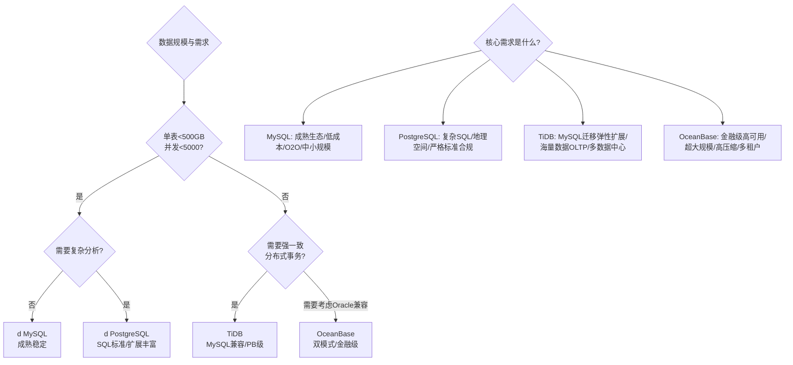

### 12.3 共性与差异总结

**共性：**
- 全部支持 ACID 事务（实现方式不同）
- 全部支持 SQL 标准查询（兼容程度不同）
- 全部支持 B+Tree 或等效索引（TiDB/OceanBase 基于 KV 构建二级索引）
- 全部支持主备高可用（实现协议不同）
- 全部支持 JDBC/ODBC 标准驱动连接

**核心差异点：**

| 差异维度 | 说明 |
|----------|------|
| **扩展架构** | MySQL/PG 是单机→主从→集群(共享存储)；TiDB/OB 是原生分布式 |
| **一致性** | MySQL/PG 最终一致（异步复制）；TiDB/OB 强一致（Raft/Paxos） |
| **分片方式** | MySQL/PG 需应用或中间件；TiDB/OB 对应用透明 |
| **存储引擎** | MySQL(B+Tree)、PostgreSQL(堆表)、TiDB(LSM-RocksDB)、OB(LSM-自研) |
| **SQL 兼容** | MySQL/PG 各自语法；TiDB 兼容 MySQL；OB 兼容 MySQL+Oracle |
| **运维复杂度** | MySQL/PG 低；TiDB/OB 较高 |

---

## 13. MySQL 切换不同数据库的数据源方案

### 13.1 切换场景概述

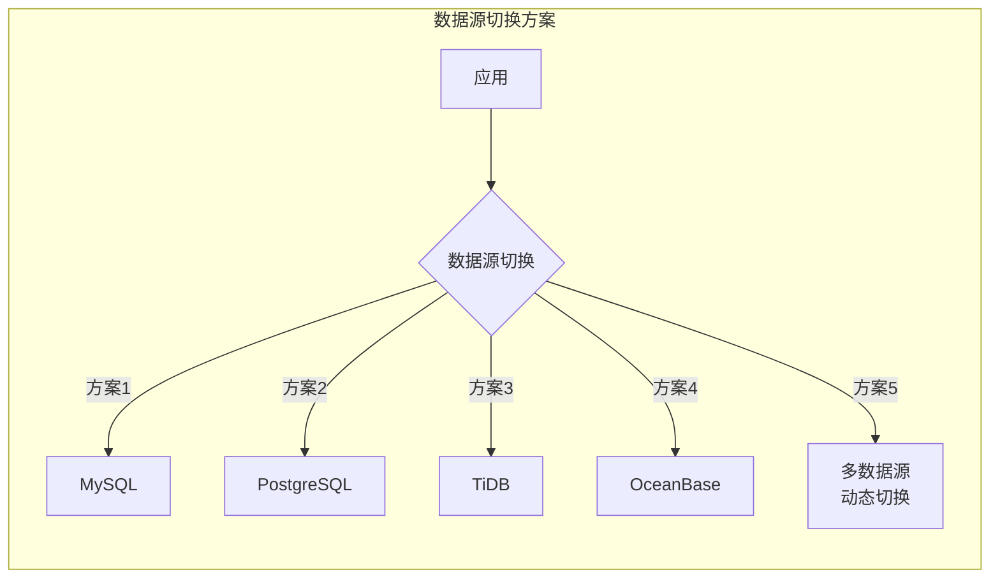

### 13.2 MySQL → TiDB 迁移方案

TiDB 兼容 MySQL 协议，迁移成本最低。

```xml
<!-- 方案一：直接替换数据源（JDBC 连接修改） -->
<!-- 原 MySQL -->
<property name="jdbcUrl" value="jdbc:mysql://localhost:3306/mydb"/>
<!-- 改 TiDB（TiDB 兼容 MySQL 协议，驱动无需更换） -->
<property name="jdbcUrl" value="jdbc:mysql://tidb-server:4000/mydb"/>
```

```java
// Spring Boot 多数据源配置 - TiDB 作为新数据源
@Configuration
public class DataSourceConfig {
    
    @Bean
    @ConfigurationProperties(prefix = "spring.datasource.mysql")
    public DataSource mysqlDataSource() {
        return DataSourceBuilder.create()
                .type(HikariDataSource.class)
                .build();
    }
    
    @Bean
    @ConfigurationProperties(prefix = "spring.datasource.tidb")
    public DataSource tidbDataSource() {
        return DataSourceBuilder.create()
                .type(HikariDataSource.class)
                .build();
    }
    
    @Bean
    @Primary
    public DynamicDataSource dynamicDataSource(
            @Qualifier("mysqlDataSource") DataSource mysql,
            @Qualifier("tidbDataSource") DataSource tidb) {
        DynamicDataSource ds = new DynamicDataSource();
        ds.setDefaultTargetDataSource(mysql);
        Map<Object, Object> map = new HashMap<>();
        map.put("mysql", mysql);
        map.put("tidb", tidb);
        ds.setTargetDataSources(map);
        return ds;
    }
}
```

```yaml
# application.yml - TiDB 连接配置
spring:
  datasource:
    mysql:
      jdbc-url: jdbc:mysql://mysql-host:3306/mydb?useSSL=false
      username: root
      password: mysql123
    tidb:
      jdbc-url: jdbc:mysql://tidb-host:4000/mydb?useSSL=false&rewriteBatchedStatements=true
      username: root
      password: tidb123
```

### 13.3 MySQL → PostgreSQL 迁移方案

```yaml
# application.yml - PostgreSQL 连接
spring:
  datasource:
    postgresql:
      jdbc-url: jdbc:postgresql://pg-host:5432/mydb
      username: postgres
      password: pg123
      driver-class-name: org.postgresql.Driver
```

**迁移注意事项：**

| 差异项 | MySQL | PostgreSQL | 迁移方案 |
|--------|-------|------------|----------|
| **自增 ID** | `AUTO_INCREMENT` | `SERIAL` / `IDENTITY` | DDL 修改 `INT AUTO_INCREMENT` → `SERIAL` |
| **字符串引号** | 反引号 `` ` `` | 双引号 `"` | 语句/配置转义 |
| **LIMIT/OFFSET** | `LIMIT 10 OFFSET 20` | 相同 | 兼容 |
| **UPSERT** | `ON DUPLICATE KEY UPDATE` | `ON CONFLICT DO UPDATE` | SQL 改造 |
| **分页** | `LIMIT ? OFFSET ?` | 相同 + `FETCH NEXT ROWS ONLY` | 兼容 |
| **日期函数** | `NOW()` / `CURDATE()` | `NOW()` / `CURRENT_DATE` | 函数映射 |
| **分组聚合** | `GROUP BY` 可省略非聚合列（宽松） | `GROUP BY` 必须包含所有非聚合列（严格） | SQL 改造 |
| **类型映射** | `TINYINT` / `DATETIME` / `JSON` | `SMALLINT` / `TIMESTAMP` / `JSONB` | 类型转换 |

```sql
-- MySQL SQL
INSERT INTO users (id, name) VALUES (1, 'Alice')
ON DUPLICATE KEY UPDATE name = VALUES(name);

-- 改写成 PostgreSQL
INSERT INTO users (id, name) VALUES (1, 'Alice')
ON CONFLICT (id) DO UPDATE SET name = EXCLUDED.name;
```

### 13.4 MySQL → OceanBase 迁移方案

OceanBase 兼容 MySQL 协议，可使用 MySQL JDBC 驱动连接。

```yaml
# OceanBase 连接（MySQL 兼容模式）
spring:
  datasource:
    oceanbase:
      jdbc-url: jdbc:mysql://obproxy-host:2883/mydb?useSSL=false
      username: root@tenant#cluster
      password: ob123
      driver-class-name: com.mysql.cj.jdbc.Driver
```

```java
// 使用 DynamicDataSource 动态切换
// 或使用 AbstractRoutingDataSource 实现读写分离 + 多数据源
public class ObRoutingDataSource extends AbstractRoutingDataSource {
    @Override
    protected Object determineCurrentLookupKey() {
        return DataSourceContextHolder.getDataSourceType();
    }
}
```

**OceanBase 迁移注意事项：**
- OBProxy 作为连接路由层，无需修改应用连接方式
- 租户名作为用户名一部分（`user@tenant#cluster`）
- 分区表语法兼容 MySQL，可利用二级分区优化
- 事务模型完全不同（两阶段提交），需关注长事务超时

### 13.5 基于 AbstractRoutingDataSource 的动态切换框架

```java
// 1. 定义数据源上下文持有者
public class DataSourceContextHolder {
    private static final ThreadLocal<String> CONTEXT = new ThreadLocal<>();
    
    public static void setDataSource(String type) {
        CONTEXT.set(type);
    }
    
    public static String getDataSource() {
        return CONTEXT.get();
    }
    
    public static void clear() {
        CONTEXT.remove();
    }
}

// 2. 动态数据源实现
public class DynamicDataSource extends AbstractRoutingDataSource {
    @Override
    protected Object determineCurrentLookupKey() {
        return DataSourceContextHolder.getDataSource();
    }
}

// 3. 自定义注解 + AOP 切换
@Target({ElementType.METHOD, ElementType.TYPE})
@Retention(RetentionPolicy.RUNTIME)
public @interface DataSource {
    String value() default "mysql";
}

@Aspect
@Component
public class DataSourceAspect {
    @Around("@annotation(dataSource)")
    public Object around(ProceedingJoinPoint point, DataSource dataSource) throws Throwable {
        try {
            DataSourceContextHolder.setDataSource(dataSource.value());
            return point.proceed();
        } finally {
            DataSourceContextHolder.clear();
        }
    }
}

// 4. 使用示例
@Service
public class OrderService {
    
    @DataSource("mysql")
    public Order getFromMySQL(Long id) {
        // 查询 MySQL
    }
    
    @DataSource("tidb")
    public Order getFromTiDB(Long id) {
        // 查询 TiDB
    }
    
    @DataSource("postgresql")
    public Order getFromPG(Long id) {
        // 查询 PostgreSQL
    }
}
```

### 13.6 使用 ShardingSphere 实现异构数据源切换

```yaml
# ShardingSphere 5.x 多数据源配置
spring:
  shardingsphere:
    datasource:
      names: mysql,pg,tidb,ob
      
      mysql:
        type: com.zaxxer.hikari.HikariDataSource
        driver-class-name: com.mysql.cj.jdbc.Driver
        jdbc-url: jdbc:mysql://mysql-host:3306/mydb
        username: root
        password: pass
        
      pg:
        type: com.zaxxer.hikari.HikariDataSource
        driver-class-name: org.postgresql.Driver
        jdbc-url: jdbc:postgresql://pg-host:5432/mydb
        username: postgres
        password: pass
        
      tidb:
        type: com.zaxxer.hikari.HikariDataSource
        driver-class-name: com.mysql.cj.jdbc.Driver
        jdbc-url: jdbc:mysql://tidb-host:4000/mydb
        username: root
        password: pass
      
      ob:
        type: com.zaxxer.hikari.HikariDataSource
        driver-class-name: com.mysql.cj.jdbc.Driver
        jdbc-url: jdbc:mysql://obproxy-host:2883/mydb
        username: user@tenant#cluster
        password: pass
```

### 13.7 迁移数据同步方案

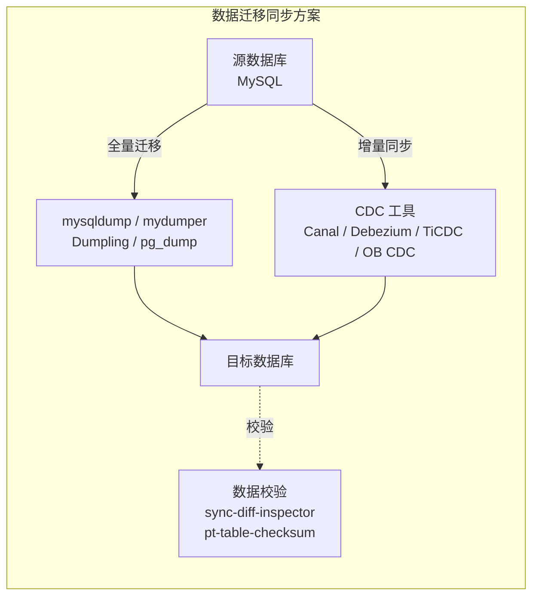

| 迁移方向 | 全量工具 | 增量工具 | 校验工具 |
|----------|----------|----------|----------|
| MySQL → TiDB | dumpling / mydumper | TiCDC / Canal | sync-diff-inspector |
| MySQL → PostgreSQL | pg_dump / mysqldump + 转换 | Debezium | pt-table-checksum |
| MySQL → OceanBase | OMS（OceanBase Migration Service） | OMS 实时同步 | OMS 校验 |
| PostgreSQL → TiDB | dumpling | TiCDC（PG 版） | sync-diff-inspector |

---

## 14. 数据库分库分表规则详解

### 14.1 MySQL 分库分表

#### 分片策略

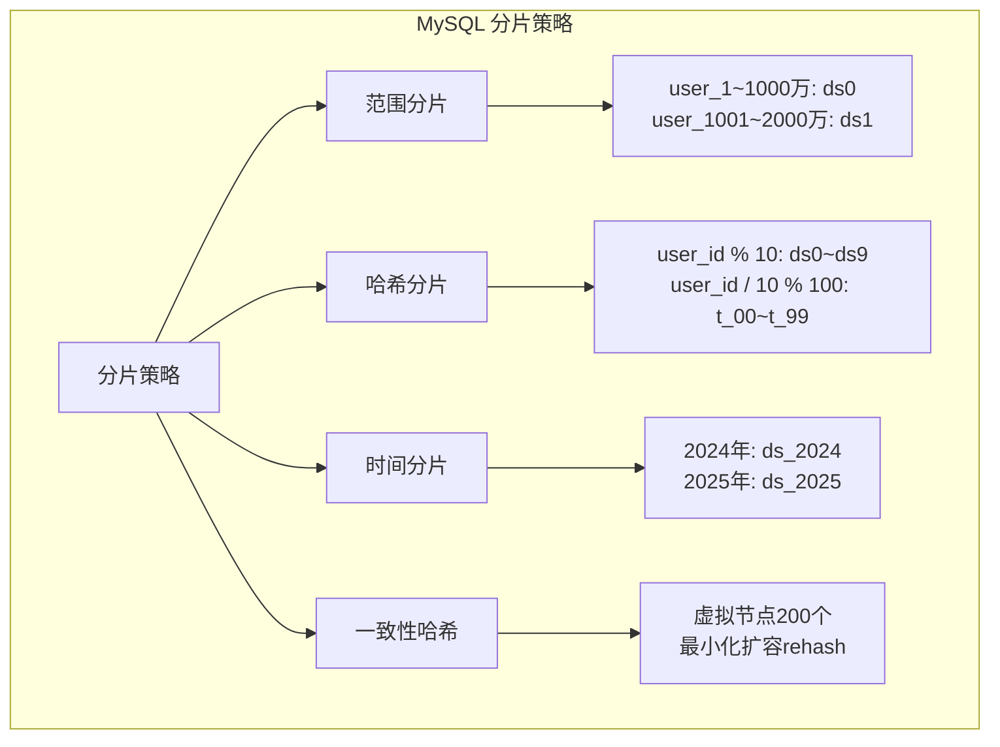

#### ShardingSphere-JDBC 配置

```yaml
# ShardingSphere 5.x 分库分表
spring:
  shardingsphere:
    datasource:
      names: ds0,ds1,ds2
      ds0:
        type: com.zaxxer.hikari.HikariDataSource
        driver-class-name: com.mysql.cj.jdbc.Driver
        jdbc-url: jdbc:mysql://192.168.1.10:3306/order_db_0
        username: root
        password: pass
      ds1:
        type: com.zaxxer.hikari.HikariDataSource
        jdbc-url: jdbc:mysql://192.168.1.11:3306/order_db_1
        username: root
        password: pass
      ds2:
        type: com.zaxxer.hikari.HikariDataSource
        jdbc-url: jdbc:mysql://192.168.1.12:3306/order_db_2
        username: root
        password: pass
    
    rules:
      sharding:
        tables:
          t_order:
            actual-data-nodes: ds$->{0..2}.t_order_$->{0..9}
            database-strategy:
              standard:
                sharding-column: user_id
                sharding-algorithm-name: database_hash
            table-strategy:
              standard:
                sharding-column: order_id
                sharding-algorithm-name: table_hash
            key-generate-strategy:
              column: order_id
              key-generator-name: snowflake
        
        sharding-algorithms:
          database_hash:
            type: HASH_MOD
            props:
              sharding-count: 3
          table_hash:
            type: HASH_MOD
            props:
              sharding-count: 10
        
        key-generators:
          snowflake:
            type: SNOWFLAKE
            props:
              worker-id: 1
    
    props:
      sql-show: true
```

#### MyCat 分片配置

```xml
<!-- schema.xml -->
<schema name="order_db" checkSQLschema="true" sqlMaxLimit="100">
    <table name="t_order" primaryKey="id" 
           dataNode="dn_$0-2" 
           rule="order_rule"/>
</schema>

<dataNode name="dn_0" dataHost="host_0" database="order_db_0"/>
<dataNode name="dn_1" dataHost="host_0" database="order_db_1"/>
<dataNode name="dn_2" dataHost="host_1" database="order_db_2"/>

<!-- rule.xml -->
<tableRule name="order_rule">
    <rule>
        <columns>user_id</columns>
        <algorithm>hash_mod</algorithm>
    </rule>
</tableRule>
```

### 14.2 PostgreSQL 分区方案

PostgreSQL 原生支持声明式分区（10+），也支持表继承（8+ 兼容）。

```sql
-- 声明式分区（PostgreSQL 10+）

-- 范围分区（按时间）
CREATE TABLE orders (
    id BIGSERIAL,
    user_id BIGINT NOT NULL,
    created_at TIMESTAMPTZ NOT NULL,
    amount DECIMAL(12,2)
) PARTITION BY RANGE (created_at);

CREATE TABLE orders_2024q1 PARTITION OF orders
    FOR VALUES FROM ('2024-01-01') TO ('2024-04-01');
CREATE TABLE orders_2024q2 PARTITION OF orders
    FOR VALUES FROM ('2024-04-01') TO ('2024-07-01');
CREATE TABLE orders_2024q3 PARTITION OF orders
    FOR VALUES FROM ('2024-07-01') TO ('2024-10-01');

-- 列表分区（按地域）
CREATE TABLE users (
    id BIGSERIAL,
    name TEXT,
    region TEXT
) PARTITION BY LIST (region);

CREATE TABLE users_north PARTITION OF users
    FOR VALUES IN ('Beijing', 'Tianjin', 'Hebei');
CREATE TABLE users_south PARTITION OF users
    FOR VALUES IN ('Guangdong', 'Shenzhen', 'Hainan');

-- 哈希分区（均匀分布）
CREATE TABLE logs (
    id BIGSERIAL,
    content TEXT
) PARTITION BY HASH (id);

CREATE TABLE logs_0 PARTITION OF logs
    FOR VALUES WITH (MODULUS 4, REMAINDER 0);
CREATE TABLE logs_1 PARTITION OF logs
    FOR VALUES WITH (MODULUS 4, REMAINDER 1);
CREATE TABLE logs_2 PARTITION OF logs
    FOR VALUES WITH (MODULUS 4, REMAINDER 2);
CREATE TABLE logs_3 PARTITION OF logs
    FOR VALUES WITH (MODULUS 4, REMAINDER 3);
```

**PostgreSQL 分表扩展方案：**
- **pg_partman**：定时自动创建/管理分区表
- **PostgreSQL 水平扩展**：Citus（分布式扩展）、PgPool-II（读写分离）、PgBouncer（连接池）
- **PostgreSQL-XL/XN**：分布式集群（已由 Citus 取代）

```sql
-- 使用 pg_partman 自动管理分区
CREATE SCHEMA partman;
CREATE EXTENSION pg_partman WITH SCHEMA partman;

-- 创建按天分区的父表
SELECT partman.create_parent(
    p_parent_table := 'public.orders',
    p_control := 'created_at',
    p_type := 'native',
    p_interval := '1 day',
    p_premake := 30
);
```

### 14.3 TiDB 分区规则

TiDB 分区语法兼容 MySQL，但实际上层透明，底层通过 Region 自动分片。

```sql
-- 范围分区（兼容 MySQL）
CREATE TABLE orders (
    id BIGINT PRIMARY KEY,
    user_id BIGINT,
    created_at DATETIME,
    amount DECIMAL(10,2)
) PARTITION BY RANGE (YEAR(created_at)) (
    PARTITION p2023 VALUES LESS THAN (2024),
    PARTITION p2024 VALUES LESS THAN (2025),
    PARTITION p2025 VALUES LESS THAN (2026)
);

-- 哈希分区
CREATE TABLE logs (
    id BIGINT PRIMARY KEY,
    content TEXT
) PARTITION BY HASH (id) PARTITIONS 16;

-- 列表分区
CREATE TABLE users (
    id BIGINT PRIMARY KEY,
    region VARCHAR(20)
) PARTITION BY LIST COLUMNS(region) (
    PARTITION p_north VALUES IN ('BJ', 'TJ', 'HE'),
    PARTITION p_east VALUES IN ('SH', 'JS', 'ZJ')
);

-- TiDB 特有的分区剪枝优化
EXPLAIN SELECT * FROM orders WHERE created_at >= '2024-06-01' AND created_at < '2024-07-01';
-- 执行计划会显示只扫描 p2024 分区（Partition Pruning）
```

**TiDB 核心分片机制（对应用透明）：**

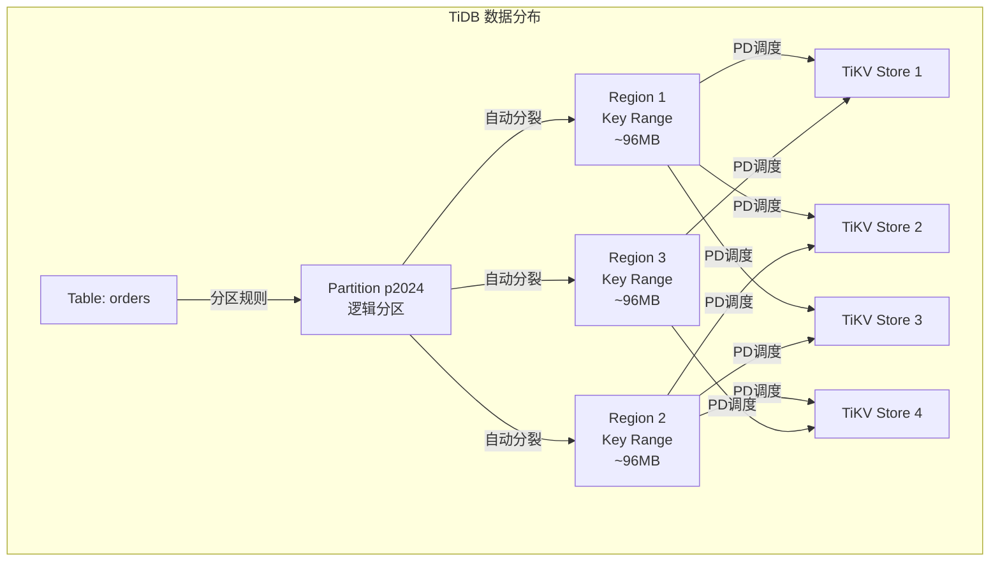

TiDB 分区规则要点：
1. 每个 Partition 是一个逻辑单元，底层自动映射到多个 Region
2. Region 自动分裂（96MB 阈值）、自动合并（小 Region 合并）
3. PD 根据节点存储/访问负载自动调度 Region
4. 对应用完全透明，不需要手动管理分片

### 14.4 OceanBase 分区规则

```sql
-- 范围分区
CREATE TABLE orders (
    id BIGINT NOT NULL,
    user_id BIGINT,
    created_at DATETIME NOT NULL,
    amount DECIMAL(10,2)
) PARTITION BY RANGE (TO_DAYS(created_at)) (
    PARTITION p2024q1 VALUES LESS THAN (TO_DAYS('2024-04-01')),
    PARTITION p2024q2 VALUES LESS THAN (TO_DAYS('2024-07-01')),
    PARTITION p2024q3 VALUES LESS THAN (TO_DAYS('2024-10-01')),
    PARTITION p2024q4 VALUES LESS THAN (TO_DAYS('2025-01-01'))
);

-- 哈希分区
CREATE TABLE user_log (
    id BIGINT NOT NULL,
    user_id BIGINT NOT NULL,
    log_content TEXT
) PARTITION BY HASH(user_id) PARTITIONS 16;

-- 列表分区
CREATE TABLE region_data (
    id BIGINT NOT NULL,
    region VARCHAR(20),
    data TEXT
) PARTITION BY LIST COLUMNS(region) (
    PARTITION p_north VALUES ('Beijing','Tianjin'),
    PARTITION p_east VALUES ('Shanghai','Nanjing'),
    PARTITION p_south VALUES ('Guangzhou','Shenzhen')
);

-- 二级分区（Range + Hash）
CREATE TABLE orders_range_hash (
    id BIGINT NOT NULL,
    user_id BIGINT,
    created_at DATETIME NOT NULL,
    amount DECIMAL(10,2)
) PARTITION BY RANGE (TO_DAYS(created_at))
SUBPARTITION BY HASH(user_id) SUBPARTITIONS 4 (
    PARTITION p2024q1 VALUES LESS THAN (TO_DAYS('2024-04-01')),
    PARTITION p2024q2 VALUES LESS THAN (TO_DAYS('2024-07-01')),
    PARTITION p2024q3 VALUES LESS THAN (TO_DAYS('2024-10-01')),
    PARTITION p2024q4 VALUES LESS THAN (TO_DAYS('2025-01-01'))
);
```

**OceanBase 分区策略选择：**

| 分区类型 | 业务场景 | 分区键选择 |
|----------|----------|------------|
| Range | 时间序数据、历史归档 | `created_at`、`DATE` 列 |
| Hash | 均匀分布、高并发写入 | `user_id`、`order_id` |
| List | 地域/类别隔离、分区裁剪 | `region`、`category` |
| Range+Hash | 时间衰减 + 均匀分布 | 时间为主、Hash 为副 |
| Range+List | 时间 + 地域交叉 | 时间为主、地域为副 |

### 14.5 分库分表规则对比总结

| 维度 | MySQL（中间件） | PostgreSQL | TiDB | OceanBase |
|------|----------------|------------|------|-----------|
| **分片方式** | 应用层/中间件 | 原生分区 + Citus 扩展 | 原生 Region 自动分片 | 原生分区 + 自动分布 |
| **分片透明性** | 需中间件配置 | 部分透明（分区表） | 完全透明 | 完全透明 |
| **水平扩缩容** | 需规划分片数，扩缩容需 rebalance | 分区表管理 + Citus | 自动分裂/调度 | 自动分区均衡 |
| **跨分片事务** | 需分布式事务（Seata/ShardingSphere） | Citus 跨节点事务 | ✅ 原生支持 | ✅ 原生支持 |
| **跨分片查询** | 中间件聚合结果 | 分区裁剪 + 并行扫描 | ✅ MPP 并行执行 | ✅ 并行执行 |
| **全局唯一 ID** | 雪花算法/号段 | SERIAL/BIGSERIAL + 合并 | 隐式 _tidb_rowid | 自增 + 分区 |
| **DDL 影响** | 影响所有分片 | 主表加列自动传播 | ✅ 在线 DDL | ✅ 在线 DDL |
| **适用分片规模** | 数十~数百节点 | 数十节点 + 分区 | 数百~数千节点 | 数千节点 |

### 14.6 分库分表设计最佳实践

```java
// 分片键选择原则
// 1. 高频查询条件字段作为分片键
// 2. 分片键应具备均匀分布特性
// 3. 避免跨分片 JOIN

// 示例：订单表分片
// 分片键：user_id（高频查询 by 用户）
// 辅助查询：order_id（通过 order_id → user_id 映射表）

// order_id → user_id 映射表
CREATE TABLE order_user_mapping (
    order_id BIGINT PRIMARY KEY,
    user_id BIGINT NOT NULL,
    INDEX idx_user_id (user_id)
);
```

**分片规则配置参考：**

| 业务类型 | 推荐分片键 | 分片策略 | 分片数估算 |
|----------|-----------|----------|------------|
| 订单系统 | user_id | Hash | 未来3年数据量 / 单节点容量 |
| 用户系统 | user_id | Hash | 用户总量 / 500万（单表阈值） |
| 日志系统 | created_at | Range | 按天/月，保留周期 |
| 消息系统 | 时间+ID | Range+Hash | 每日消息量 * 保留天数 |
| 地理位置 | region | List | 按区域划分数据 |
| IoT 时序 | device_id+time | 一致性 Hash | 设备数 + 采集频率 |

> **核心原则：** 分片键一旦确定，尽量不要更改。如果业务查询方式多样化，可以考虑建立全局索引表或通过异构数据源（ES）辅助查询。

---

> **参考：** MySQL 官方文档、PostgreSQL 官方文档、TiDB 官方文档、OceanBase 官方文档、高性能 MySQL（第 4 版）、数据密集型应用系统设计（DDIA）
