# Redis 知识体系详解

---

## 1. 数据结构

### 1.1 String — SDS

Redis 的 String 底层使用 **SDS（Simple Dynamic String）** 结构，相比 C 字符串优势：

- O(1) 获取长度
- 预分配空间，减少内存分配次数
- 二进制安全（可存任意二进制数据）

```
struct sdshdr {
    int len;    // 已用长度
    int free;   // 剩余空间
    char buf[]; // 字节数组
};
```

**应用场景：** 缓存、计数器、分布式锁

**命令示例：**

```bash
SET name "Redis"
GET name
INCR counter
INCRBY counter 10
SETEX cache 60 "data"    # 带过期时间
SETNX lock 1             # 不存在才设置
```

**Java 代码示例（Jedis）：**

```java
Jedis jedis = new Jedis("localhost", 6379);
jedis.set("user:1:name", "Alice");
String name = jedis.get("user:1:name");
jedis.incr("page_view");
jedis.setex("session:xyz", 3600, "data");
```

---

### 1.2 List — quicklist

Redis 3.2+ 使用 **quicklist**（双向链表 + ziplist 节点），兼顾内存与性能。

**应用场景：** 消息队列、最新列表（LPUSH + LTRIM）

**命令示例：**

```bash
LPUSH queue task1 task2
RPUSH queue task3
LPOP queue
LINDEX queue 0
LRANGE queue 0 -1
LTRIM queue 0 99    # 保留前100个
BLPOP queue 5       # 阻塞弹出
```

---

### 1.3 Hash

- 数据量小时用 **ziplist**（节省内存）
- 达到阈值后转为 **hashtable**

**应用场景：** 对象缓存（如用户信息）

**命令示例：**

```bash
HSET user:1001 name "Tom" age 25
HGET user:1001 name
HGETALL user:1001
HMSET user:1002 name "Jerry" age 30 city "NY"
```

**Java 代码示例（Spring Data Redis）：**

```java
redisTemplate.opsForHash().put("user:1001", "name", "Tom");
String name = (String) redisTemplate.opsForHash().get("user:1001", "name");
Map<Object, Object> map = redisTemplate.opsForHash().entries("user:1001");
```

---

### 1.4 Set

- 元素全为整数且数量少时用 **intset**
- 否则用 **hashtable**

**应用场景：** 标签系统、共同关注、抽奖

**命令示例：**

```bash
SADD user:1:tags java redis
SADD user:2:tags redis go
SINTER user:1:tags user:2:tags    # 共同标签
SISMEMBER user:1:tags redis
SCARD user:1:tags
SPOP lottery 1                     # 随机抽奖
```

---

### 1.5 ZSet — 跳表原理

**底层结构：** skiplist + hashtable

- **跳表** 实现有序链表 + 多级索引，平均 O(log N) 查询
- **哈希表** 保存 value→score 映射，提供 O(1) 查分

**跳表结构 Mermaid 图：**

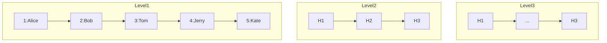

**应用场景：** 排行榜、延时队列

**命令示例：**

```bash
ZADD leaderboard 100 "Alice"
ZADD leaderboard 90 "Bob"
ZRANGE leaderboard 0 -1 WITHSCORES    # 正序
ZREVRANGE leaderboard 0 -1            # 倒序（排行榜）
ZRANK leaderboard "Alice"             # 排名
ZSCORE leaderboard "Alice"
ZREM leaderboard "Bob"
```

**Java 代码示例：**

```java
redisTemplate.opsForZSet().add("leaderboard", "Alice", 100);
Double score = redisTemplate.opsForZSet().score("leaderboard", "Alice");
Long rank = redisTemplate.opsForZSet().reverseRank("leaderboard", "Alice");
Set<String> top10 = redisTemplate.opsForZSet().reverseRange("leaderboard", 0, 9);
```

---

### 1.6 BitMap

基于 String 的位操作，一个字节存 8 个状态。

**应用场景：** 用户签到、布隆过滤器底层

**命令示例：**

```bash
SETBIT sign:2024:user:1 0 1    # 第1天签到
SETBIT sign:2024:user:1 1 1    # 第2天签到
GETBIT sign:2024:user:1 0      # 查第1天
BITCOUNT sign:2024:user:1      # 当月签到总数
BITFIELD sign:2024:user:1 GET u8 0  # 取8位
```

**Java 代码示例：**

```java
redisTemplate.opsForValue().setBit("sign:2024:01:1001", 0, true);
boolean day1 = redisTemplate.opsForValue().getBit("sign:2024:01:1001", 0);
Long count = (Long) redisTemplate.execute(
    connection -> connection.bitCount("sign:2024:01:1001".getBytes()), true);
```

---

### 1.7 HyperLogLog

使用概率算法，固定 12KB 内存统计 ≈ 2^64 个不同元素，误差 0.81%。

**应用场景：** UV 统计

**命令示例：**

```bash
PFADD uv:2024:01:01 user1 user2 user3
PFADD uv:2024:01:01 user1           # 重复不计
PFCOUNT uv:2024:01:01               # ≈ 3
PFMERGE uv:2024:01 uv:2024:01:01 uv:2024:01:02
```

---

### 1.8 Geo

基于 ZSet 实现，将经纬度编码为 52 位整数。

**应用场景：** 附近的人、位置服务

**命令示例：**

```bash
GEOADD cities 116.39 39.91 "Beijing"
GEOADD cities 121.47 31.23 "Shanghai"
GEODIST cities Beijing Shanghai km
GEORADIUS cities 116.39 39.91 100 km WITHDIST
GEORADIUSBYMEMBER cities Beijing 100 km
```

---

### 1.9 Stream — 消息队列

Redis 5.0+ 引入，支持消费者组、ACK、阻塞读取。

**核心概念：** 消息 ID | 条目 | 消费者组 | 消费者 | Pending List

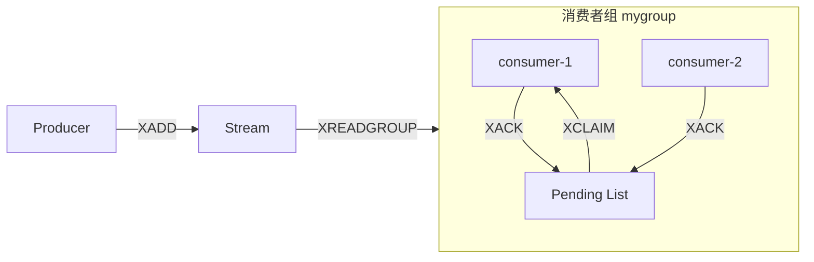

**命令示例：**

```bash
# 生产消息
XADD mystream * sensor-id 1234 temperature 19.8
XADD mystream MAXLEN 1000 * field value

# 消费消息
XREAD COUNT 10 STREAMS mystream 0
XREAD GROUP mygroup consumer1 COUNT 1 STREAMS mystream >

# 消费者组
XGROUP CREATE mystream mygroup $
XREADGROUP GROUP mygroup consumer1 COUNT 10 STREAMS mystream >

# 确认
XACK mystream mygroup message-id
XPENDING mystream mygroup
```

---

## 2. 核心机制

### 2.1 过期策略

**惰性删除 + 定期删除：**

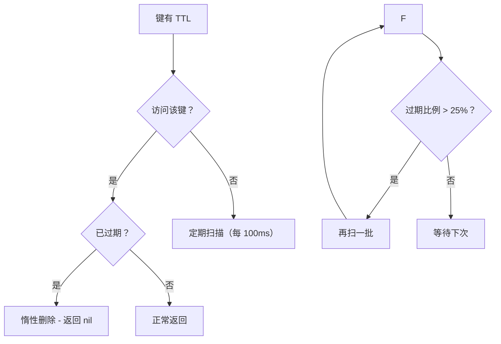

---

### 2.2 内存淘汰策略（8 种）

| 策略 | 说明 |
|------|------|
| `noeviction` | 不淘汰，写返回 OOM 错误 |
| `allkeys-lru` | 所有键中淘汰最近最少使用 |
| `volatile-lru` | 仅设了过期时间的键中 LRU |
| `allkeys-random` | 所有键中随机淘汰 |
| `volatile-random` | 仅过期键中随机淘汰 |
| `volatile-ttl` | 淘汰 TTL 最小的 |
| `allkeys-lfu` | 所有键中淘汰最不经常使用（4.0+） |
| `volatile-lfu` | 仅过期键中 LFU（4.0+） |

```bash
CONFIG SET maxmemory-policy allkeys-lru
```

---

### 2.3 持久化

#### RDB（快照）

- `SAVE`：阻塞式
- `BGSAVE`：子进程 COW（Copy on Write）写快照

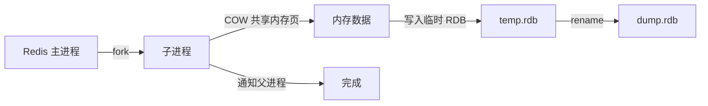

#### AOF（追加文件）

三种 `appendfsync` 策略：

| 策略 | 说明 | 安全性 |
|------|------|--------|
| `always` | 每条命令写入 | 最安全，最慢 |
| `everysec` | 每秒刷盘（默认） | 最多丢 1s 数据 |
| `no` | 由 OS 决定 | 最快，可能丢多 |

**AOF 重写：** 合并冗余命令（`BGREWRITEAOF`），子进程将内存数据转为最小命令集。

#### 混合持久化（Redis 4.0+）

```
aof-use-rdb-preamble yes
```

AOF 文件开头是 RDB 格式全量数据 + 增量 AOF 日志，**重启时先加载 RDB 再回放 AOF**，结合 RDB 加载快 + AOF 丢数据少的优点。

---

### 2.4 事务

**命令：** `MULTI` / `EXEC` / `DISCARD` / `WATCH`

- `WATCH` 实现 **CAS（乐观锁）**
- 事务不保证原子性（语法错全不执行，运行时错不影响其他）

```bash
WATCH stock:1001
val = GET stock:1001
if val > 0
    MULTI
    DECR stock:1001
    EXEC
end
```

```lua
-- 用 Lua 替代可实现真正的原子性
local stock = redis.call("GET", KEYS[1])
if tonumber(stock) > 0 then
    redis.call("DECR", KEYS[1])
    return 1
end
return 0
```

---

### 2.5 Pipeline

批量发送命令，减少 RTT。

```java
Jedis jedis = new Jedis("localhost", 6379);
Pipeline pipeline = jedis.pipelined();
pipeline.set("key1", "val1");
pipeline.set("key2", "val2");
pipeline.incr("counter");
List<Object> results = pipeline.syncAndReturnAll();
```

```java
// Spring Data Redis
List<Object> results = redisTemplate.executePipelined(
    (RedisCallback<String>) connection -> {
        connection.set("key1".getBytes(), "val1".getBytes());
        connection.set("key2".getBytes(), "val2".getBytes());
        connection.incr("counter".getBytes());
        return null;
    });
```

---

### 2.6 Lua 脚本

**原子执行 + 减少网络开销**

```lua
-- 扣库存脚本
local key = KEYS[1]
local qty = tonumber(ARGV[1])
local stock = tonumber(redis.call("GET", key) or "0")
if stock >= qty then
    redis.call("DECRBY", key, qty)
    return 1
else
    return 0
end
```

```bash
# 加载脚本
SCRIPT LOAD "local k=KEYS[1] local q=tonumber(ARGV[1]) local s=tonumber(redis.call('GET',k) or '0') if s>=q then redis.call('DECRBY',k,q) return 1 else return 0 end"
# 返回 sha: e123...
# 执行
EVALSHA e123... 1 stock:1001 5
```

**Java 代码示例：**

```java
String lua = "if redis.call('GET',KEYS[1]) == ARGV[1] then return redis.call('DEL',KEYS[1]) else return 0 end";
redisTemplate.execute(new DefaultRedisScript<>(lua, Long.class),
    Arrays.asList("lock:key"), "my-uuid");
```

---

### 2.7 Redis 6.0 多线程 IO 模型

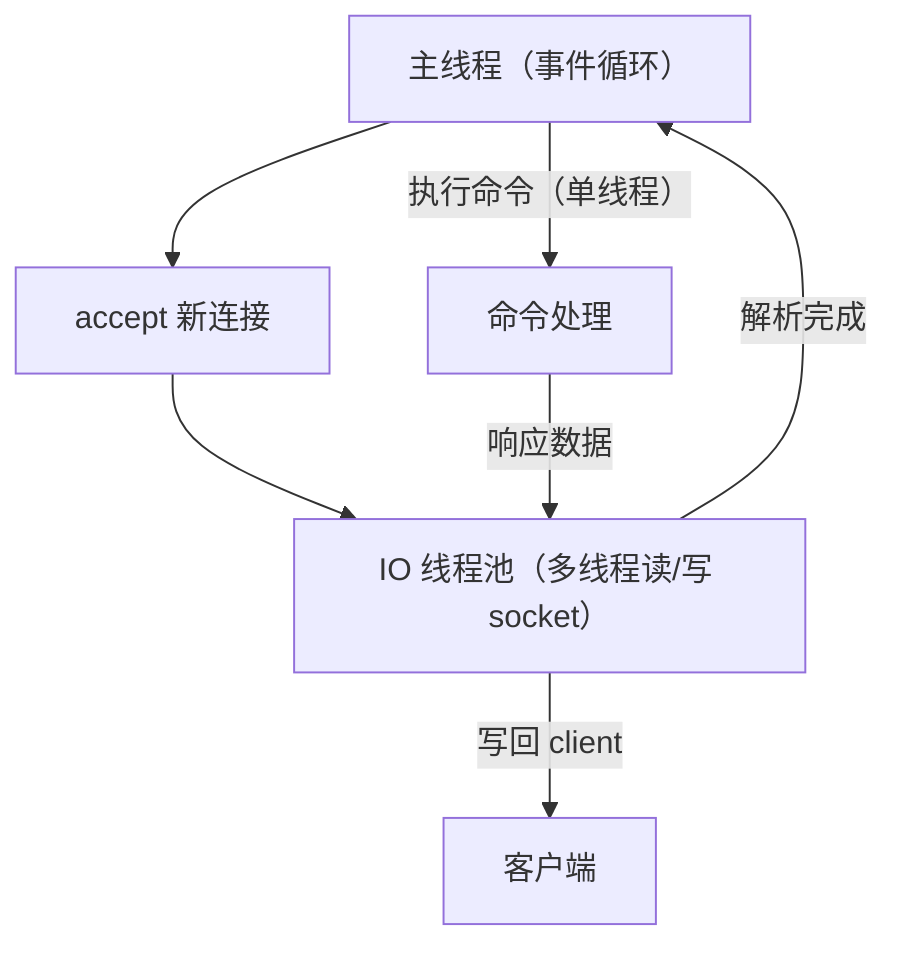

- IO 读取/写入多线程，**命令执行仍然是单线程**
- 默认 16 个 IO 线程，`io-threads 4`

---

## 3. 缓存设计

### 3.1 缓存穿透

请求不存在的数据穿透缓存打到 DB。

**解决方案：布隆过滤器**

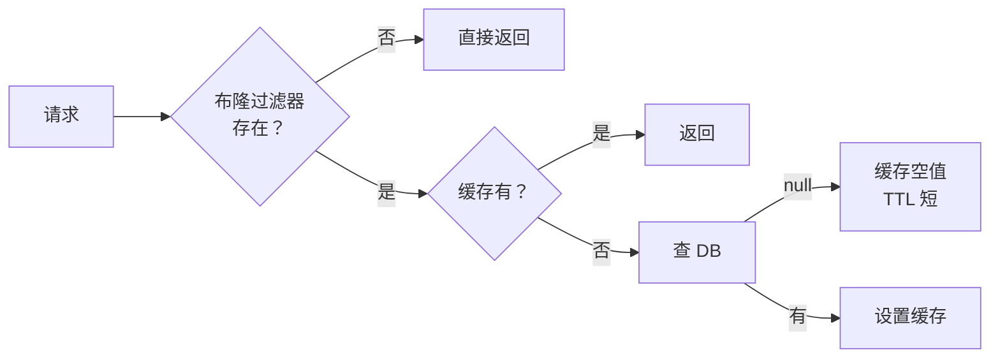

**布隆过滤器原理：**

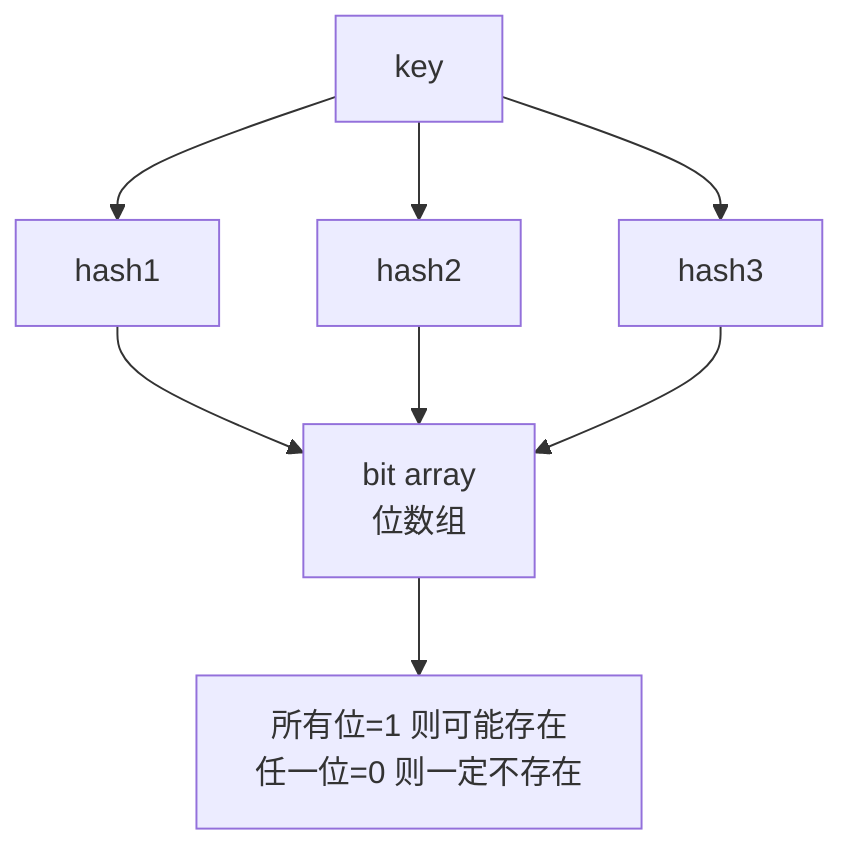

**Java 代码示例（Redisson）：**

```java
Config config = new Config();
config.useSingleServer().setAddress("redis://localhost:6379");
RedissonClient redisson = Redisson.create(config);

RBloomFilter<String> bloom = redisson.getBloomFilter("user:bloom");
bloom.tryInit(1000000L, 0.01);  // 容量 100 万，误判率 1%
bloom.add("user:1001");
bloom.add("user:1002");

boolean exists = bloom.contains("user:9999");  // false
```

---

### 3.2 缓存击穿

热点 key 过期瞬间，高并发直击 DB。

**方案一：互斥锁（SETNX）**

```java
public String getData(String key) {
    String value = redis.get(key);
    if (value == null) {
        // 加锁
        if (redis.setnx("lock:" + key, "1", 10)) {
            value = db.query(key);
            redis.set(key, value, 3600);
            redis.del("lock:" + key);
        } else {
            Thread.sleep(50);
            return getData(key);  // 重试
        }
    }
    return value;
}
```

**方案二：逻辑过期**

缓存永不过期，存数据时额外存逻辑过期时间，获取时检查，过期后异步更新。

---

### 3.3 缓存雪崩

大量 key 同时过期或 Redis 宕机，请求直击 DB。

**解决措施：**

| 措施 | 说明 |
|------|------|
| 随机过期时间 | `setex key 3600+random(600)` |
| 多级缓存 | 本地缓存 Caffeine + Redis |
| 集群部署 | Redis 高可用 |
| 限流降级 | 入口限流，保护 DB |
| 提前预热 | 错峰过期 |

**代码示例：**

```java
// 随机过期时间
int baseTtl = 3600;
int randomTtl = baseTtl + ThreadLocalRandom.current().nextInt(600);
redisTemplate.opsForValue().set(key, value, randomTtl, TimeUnit.SECONDS);
```

---

### 3.4 缓存一致性

**策略：先更新 DB，后删除缓存**

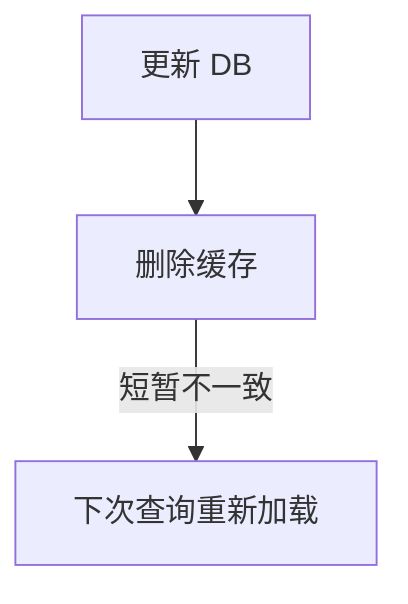

**延迟双删：**

```java
public void updateData(String key, String value) {
    redis.del(key);              // 先删缓存
    db.update(key, value);       // 更新 DB
    Thread.sleep(500);           // 延迟
    redis.del(key);              // 再次删除
}
```

**Canal 同步方案：**

```text
MySQL binlog → Canal → MQ → Consumer → 删除/更新缓存
```

---

### 3.5 热 Key / 大 Key 排查

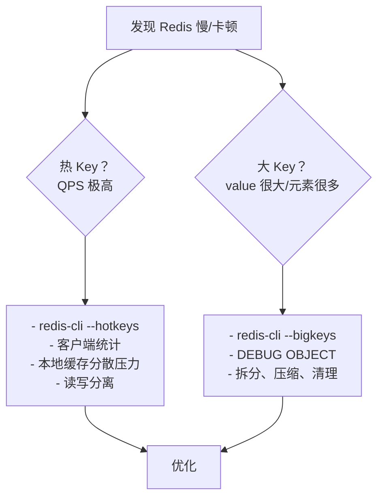

---

## 4. 分布式锁

### 4.1 基础实现（SET NX EX）

```bash
SET lock:resource uuid NX EX 30
```

**原子性：** NX 保证不存在时设置，EX 和 NX 同时设保证原子。

```java
// 加锁
Boolean locked = redisTemplate.opsForValue()
    .setIfAbsent("lock:resource", uuid, 30, TimeUnit.SECONDS);
if (Boolean.TRUE.equals(locked)) {
    try {
        // 执行业务
    } finally {
        // 解锁
    }
}
```

---

### 4.2 Lua 原子解锁

```lua
-- unlock.lua
if redis.call("GET", KEYS[1]) == ARGV[1] then
    return redis.call("DEL", KEYS[1])
else
    return 0
end
```

```java
public boolean unlock(String key, String value) {
    String lua = "if redis.call('GET', KEYS[1]) == ARGV[1] then " +
                 "return redis.call('DEL', KEYS[1]) else return 0 end";
    DefaultRedisScript<Long> script = new DefaultRedisScript<>(lua, Long.class);
    Long result = redisTemplate.execute(script, Arrays.asList(key), value);
    return Long.valueOf(1).equals(result);
}
```

---

### 4.3 Redisson Watch Dog 自动续期

```java
Config config = new Config();
config.useSingleServer().setAddress("redis://localhost:6379");
RedissonClient redisson = Redisson.create(config);

RLock lock = redisson.getLock("myLock");
// 默认锁过期 30s，Watch Dog 每 10s 续期一次
lock.lock(10, TimeUnit.SECONDS);  // leaseTime > 0 不启动看门狗
// 或
lock.lock();  // 不传参数，看门狗自动续期

try {
    // 业务逻辑
} finally {
    lock.unlock();
}
```

**Watch Dog 原理：** 锁过期前 2/3 时间（即 20s）检查是否未释放，若未释放则通过 Lua 续期到 30s。

---

### 4.4 RedLock 算法

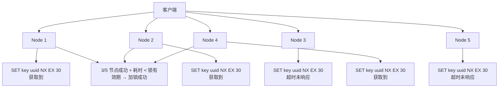

**争议：** RedLock 存在时钟漂移和性能问题，业内普遍认为 **单节点 + 主从 + Watch Dog 已足够**，多数场景不推荐 RedLock。

---

## 5. 集群

### 5.1 主从复制

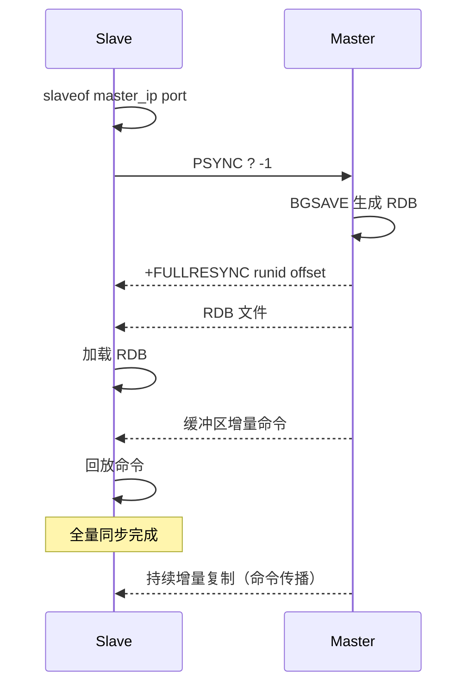

**psync2（Redis 4.0+）：** 重启后利用复制 ID 尝试部分同步，减少全量同步。

---

### 5.2 Sentinel 哨兵

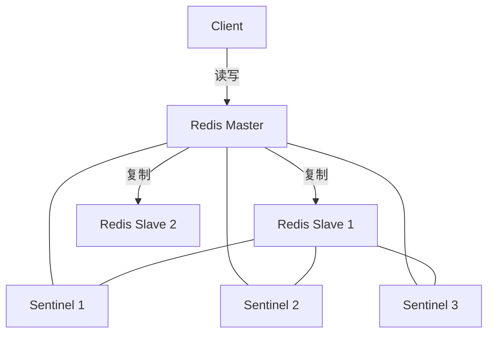

**故障转移流程：**

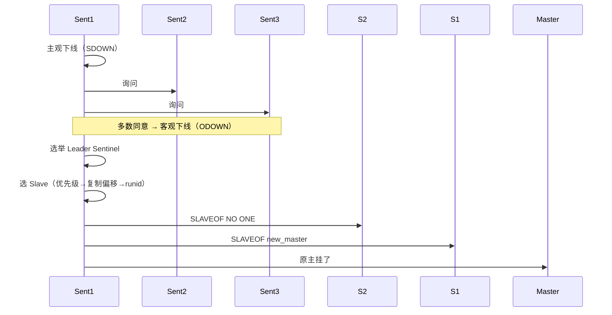

**脑裂问题：** 主被隔离但客户端写入，恢复后数据丢失。解决：

```bash
min-slaves-to-write 1
min-slaves-max-lag 10
```

---

### 5.3 Cluster 集群

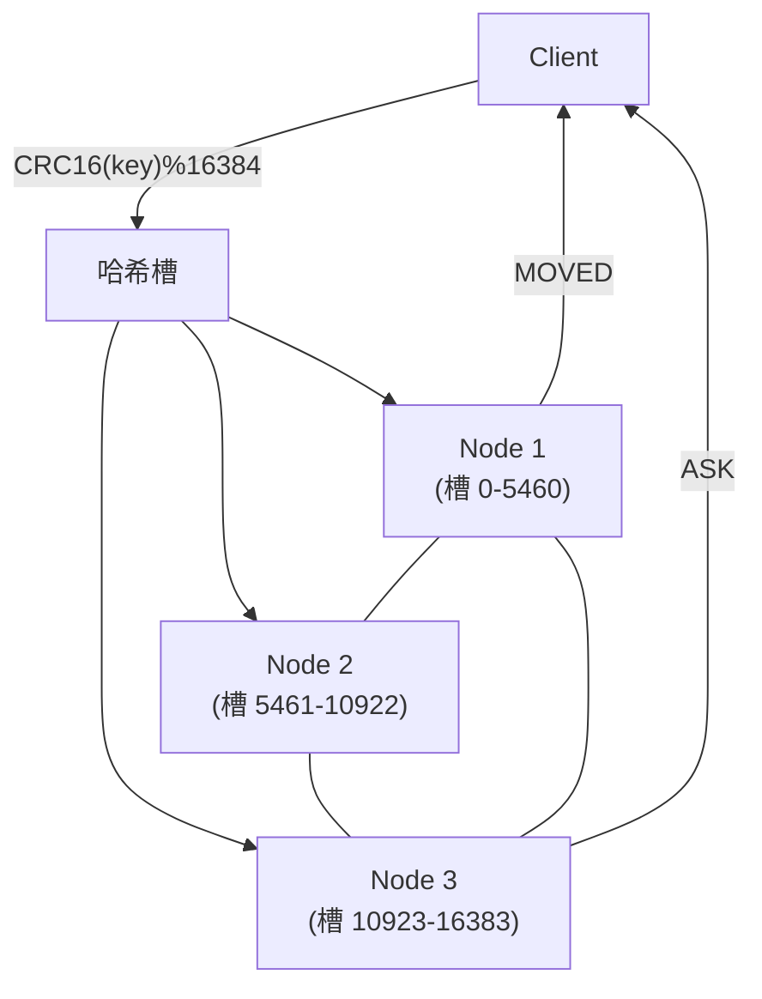

**核心机制：**

| 机制 | 说明 |
|------|------|
| 哈希槽 | `CRC16(key) % 16384` 定位槽 |
| Gossip | 节点间交换状态（PING/PONG） |
| MOVED | 槽迁移后，返回正确节点 |
| ASK | 迁移中，引导客户端重试 |
| 去中心化 | 无中心节点，每个节点知道全量槽分配 |

```bash
# 创建集群（3主3从）
redis-cli --cluster create 127.0.0.1:7001 127.0.0.1:7002 127.0.0.1:7003 \
    127.0.0.1:7004 127.0.0.1:7005 127.0.0.1:7006 --cluster-replicas 1
```

**Handling MOVED in Java（Jedis）：**

```java
Set<HostAndPort> nodes = new HashSet<>();
nodes.add(new HostAndPort("127.0.0.1", 7001));
JedisCluster cluster = new JedisCluster(nodes);
cluster.set("foo", "bar");     // 自动处理 MOVED/ASK
```

---

### 5.4 部署模式选择

| 模式 | 节点数 | 自动故障转移 | 读写分离 | 数据分片 | 适用场景 |
|------|--------|-------------|---------|---------|---------|
| 单机 | 1 | 否 | 否 | 否 | 开发测试、小应用 |
| 主从 | 2+ | 否（手动切换） | 是 | 否 | 数据备份 |
| Sentinel | 3+ | 是 | 是 | 否 | 高可用、中小规模 |
| Cluster | 6+ | 是 | 是 | 是 | 大规模数据（>10G） |

---

## 6. Redis 变慢排查

### 6.1 慢查询日志

```bash
# 设置阈值（微秒）
CONFIG SET slowlog-log-slower-than 10000
# 最大记录数
CONFIG SET slowlog-max-len 128

# 查看
SLOWLOG GET 10
SLOWLOG LEN
SLOWLOG RESET
```

### 6.2 BigKey 扫描

```bash
redis-cli --bigkeys
# 或
redis-cli --memkeys
```

输出每个类型最大 key 及大小。

### 6.3 内存碎片

```bash
INFO memory
# 查看 used_memory_rss / used_memory
# 比值 > 1.5 说明碎片严重
```

```bash
# 自动碎片整理（Redis 4.0+）
CONFIG SET activedefrag yes
```

### 6.4 Fork 耗时

```bash
INFO latest_fork_usec
```

`fork` 耗时长通常因内存大或物理机负载高。单个实例建议 < 10GB。

### 6.5 AOF 写磁盘阻塞

```bash
INFO persistence
# 检查 aof_pending_bio_fsync / aof_delayed_fsync
```

若 `aof_delayed_fsync` 递增，说明 AOF 刷盘慢于写入。

**排查流程总结：**

```text
Redis 变慢
  ├─ 外部：机器 CPU/内存/网络 → top/sar/iftop
  ├─ Redis 内部：
  │   ├─ SLOWLOG → 优化命令
  │   ├─ --bigkeys → 拆分/清理
  │   ├─ INFO memory → 碎片/内存超用
  │   ├─ INFO persistence → fork 耗时 / AOF 阻塞
  │   └─ 连接数过多 → 排查客户端
  └─ 解决方案：限流、本地缓存、扩容集群
```
