# RocketMQ 知识体系详解

---

## 1. 消息队列基础

### 1.1 什么是消息队列

消息队列（Message Queue，MQ）是一种使用队列作为消息中间件的通信方式，生产者将消息发送到队列，消费者从队列中拉取消息进行处理，实现生产者和消费者之间的解耦。

### 1.2 应用场景

| 场景 | 说明 | 示例 |
|------|------|------|
| **异步解耦** | 将同步调用改为异步消息，降低服务间耦合 | 订单创建后异步发送短信/邮件通知 |
| **削峰填谷** | 将瞬时高并发请求缓冲到队列，让消费端按能力拉取 | 秒杀系统将下单请求先入队再慢慢处理 |
| **日志收集** | 多个应用将日志发送到统一 Topic，由日志系统集中消费 | 业务日志、访问日志统一采集到 ELK |
| **最终一致性** | 基于消息的可靠投递实现分布式系统最终一致 | 跨库转账：扣款成功后发消息，收款方收到消息后加款 |

### 1.3 MQ 选型对比

| 特性 | RocketMQ | Kafka | RabbitMQ | Pulsar |
|------|----------|-------|----------|--------|
| **语言** | Java | Scala/Java | Erlang | Java |
| **吞吐量** | 10万级/s | 百万级/s | 万级/s | 百万级/s |
| **消息可靠性** | 很高（同步刷盘+同步复制） | 高（ISR 机制） | 高 | 很高（BookKeeper） |
| **消息顺序** | 分区顺序 | 分区顺序 | 全局/顺序队列 | 分区顺序 |
| **延时消息** | 原生支持 18 个级别 | 不支持（需第三方） | 插件支持 | 原生支持 |
| **事务消息** | 原生支持（半消息+回查） | 不支持原生 | 需插件 | 原生支持 |
| **消息过滤** | Tag + SQL92 | Broker 端不支持 | Header/RoutingKey | 支持 |
| **死信队列** | 原生支持 DLQ | 原生支持 DLQ | 原生支持 DLQ | 原生支持 DLQ |
| **存储方式** | 本地磁盘 CommitLog | 本地磁盘 Segment | 内存/磁盘 | 计算存储分离（BookKeeper） |
| **客户端语言** | Java 为主，多语言扩展 | 多语言官方支持 | 多语言官方支持 | 多语言官方支持 |
| **运维复杂度** | 中等 | 较高（依赖 ZooKeeper） | 简单 | 较高 |
| **典型场景** | 业务消息、事务、顺序 | 日志、流处理 | 企业应用、路由复杂 | 云原生、海量分区 |

---

## 2. RocketMQ 核心架构

### 2.1 整体架构

RocketMQ 采用四层架构：**Producer → NameServer → Broker → Consumer**，NameServer 作为路由注册中心，Broker 负责消息存储，Producer 和 Consumer 通过 NameServer 发现 Broker 地址。

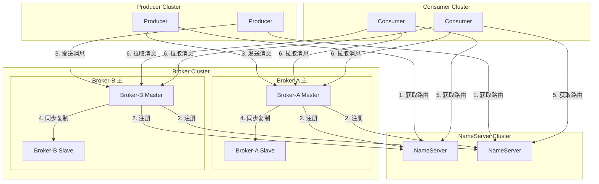

### 2.2 NameServer — 无状态路由中心

- **无状态设计**：NameServer 之间不互相通信，各节点独立保存全量路由信息
- **路由注册**：Broker 启动时向所有 NameServer 注册 Topic/Queue 信息
- **心跳检测**：Broker 每 30 秒发送心跳，NameServer 每 10 秒扫描一次，120 秒无心跳则剔除
- **路由发现**：Producer/Consumer 从 NameServer 获取 Broker 地址列表并缓存

### 2.3 Broker — 消息存储与服务节点

**主从架构**：

```
Broker 组 = 1 个 Master + N 个 Slave
- Master：处理读写请求
- Slave：从 Master 同步数据，提供读服务（SlaveReadEnable=true）
```

**同步复制 vs 异步复制**：

| 模式 | 配置 | 特点 |
|------|------|------|
| 同步复制 | `brokerRole=SYNC_MASTER` | Master 等待 Slave 确认后才返回成功，可靠性最高，延迟略高 |
| 异步复制 | `brokerRole=ASYNC_MASTER` | Master 不等待 Slave 确认直接返回，吞吐量高，主切从可能丢少量消息 |

### 2.4 Topic 与 Queue

- **Topic**：消息的逻辑分类
- **Queue（队列）**：Topic 下的物理分区，一个 Topic 可配置多个 Queue
- **读写队列**：
  - `writeQueueNums`：生产者可发送的队列数（扩缩容时可设少写多读）
  - `readQueueNums`：消费者可消费的队列数
- **扩缩容**：增加 Queue 可提升并发；减少 Queue 建议先调小写队列等积压消费完再调整

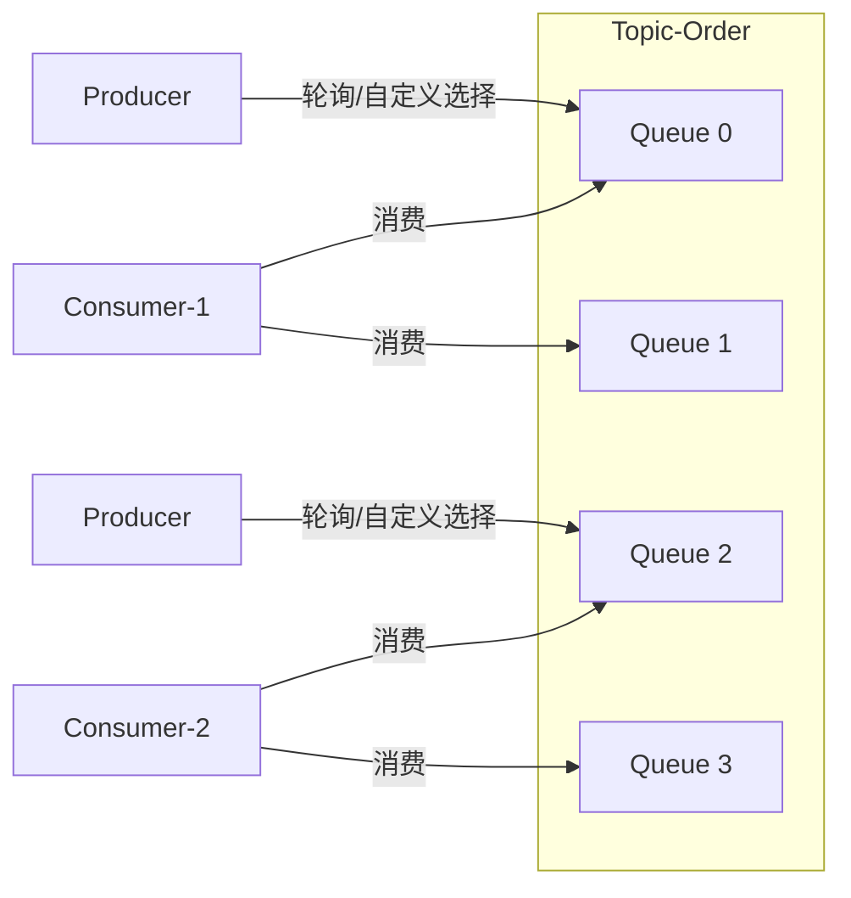

### 2.5 消息存储 — CommitLog + ConsumeQueue + IndexFile

RocketMQ 使用**混合存储模型**：所有消息顺序写入 CommitLog，异步构建 ConsumeQueue 和 IndexFile。

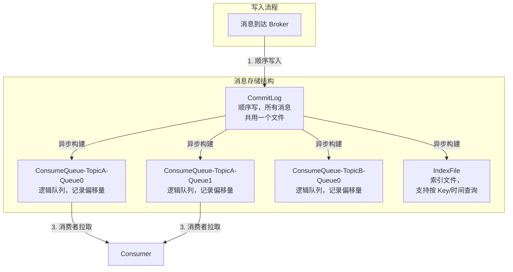

| 组件 | 说明 |
|------|------|
| **CommitLog** | 所有消息按到达顺序写入的单一文件，**顺序写**磁盘性能极高。文件大小默认 1GB，写满后创建新文件 |
| **ConsumeQueue** | 逻辑队列文件，每个 ConsumeQueue 对应一个 Topic 下的一个 Queue。每项 20 字节（CommitLog 偏移量 8B + 消息长度 4B + Tag Hash 8B），定长设计支持 mmap 高效读取 |
| **IndexFile** | 索引文件，通过 `Keys` 或时间区间快速查找消息。底层使用哈希索引 + 时间轮 |

### 2.6 零拷贝技术

RocketMQ 通过 **mmap + write**（MappedByteBuffer）和 **FileChannel.transferTo**（NIO）两种方式实现零拷贝，大幅减少数据在用户态和内核态之间的复制次数。

**消息写入（mmap）**：

```
应用程序 → 内核 PageCache ←（异步刷盘）→ 磁盘
           ↕ (mmap 映射，零拷贝)
        MappedByteBuffer
```

**消息读取（FileChannel.transferTo）**：

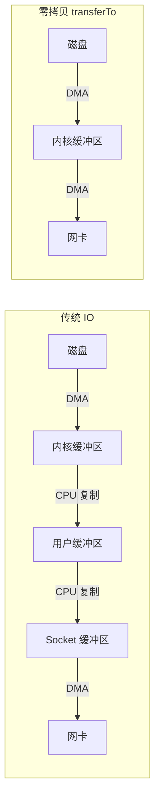

```java
// RocketMQ 中 FileChannel 的 transferTo 示例
FileChannel fileChannel = new RandomAccessFile(file, "r").getChannel();
// 零拷贝传输：直接将文件数据从内核缓冲区发送到网卡
long position = commitLogOffset;
long count = messageLength;
// 避免用户态和内核态之间的数据复制
fileChannel.transferTo(position, count, socketChannel);
```

---

## 3. 消息发送与消费

### 3.1 发送方式

#### 同步发送（最可靠，返回 SendResult）

```java
import org.apache.rocketmq.client.producer.DefaultMQProducer;
import org.apache.rocketmq.common.message.Message;
import org.apache.rocketmq.client.producer.SendResult;

// 同步发送——等待 Broker 确认
DefaultMQProducer producer = new DefaultMQProducer("producer_group");
producer.setNamesrvAddr("127.0.0.1:9876");
producer.start();

Message msg = new Message("TopicTest", "TagA", "Hello RocketMQ".getBytes());
// 同步发送，阻塞等待 Broker 返回结果
SendResult result = producer.send(msg);
System.out.printf("发送状态: %s, MsgId: %s%n", result.getSendStatus(), result.getMsgId());
producer.shutdown();
```

#### 异步发送（高吞吐，回调通知）

```java
import org.apache.rocketmq.client.producer.SendCallback;

producer.send(msg, new SendCallback() {
    @Override
    public void onSuccess(SendResult sendResult) {
        System.out.println("发送成功: " + sendResult.getMsgId());
    }
    @Override
    public void onException(Throwable e) {
        System.out.println("发送失败: " + e.getMessage());
    }
});
```

#### 单向发送（不关心结果，最高吞吐）

```java
// 无需等待 Broker 确认，适用于日志、监控等场景
producer.sendOneway(msg);
```

#### Spring Cloud Stream / RocketMQTemplate

```java
import org.apache.rocketmq.spring.core.RocketMQTemplate;
import org.springframework.beans.factory.annotation.Autowired;
import org.springframework.stereotype.Service;

@Service
public class MQService {

    @Autowired
    private RocketMQTemplate rocketMQTemplate;

    // 同步发送
    public void sendSync(String topic, String msg) {
        rocketMQTemplate.convertAndSend(topic, msg);
    }

    // 异步发送
    public void sendAsync(String topic, String msg) {
        rocketMQTemplate.asyncSend(topic, msg, new SendCallback() {
            @Override public void onSuccess(SendResult var1) {
                System.out.println("async success");
            }
            @Override public void onException(Throwable var1) {
                System.out.println("async failed");
            }
        });
    }

    // 单向发送
    public void sendOneway(String topic, String msg) {
        rocketMQTemplate.sendOneWay(topic, msg);
    }
}
```

### 3.2 消费模式

#### 集群消费（默认，一条消息只被一个消费者消费）

```java
import org.apache.rocketmq.spring.annotation.RocketMQMessageListener;
import org.apache.rocketmq.spring.core.RocketMQListener;
import org.springframework.stereotype.Service;

@Service
@RocketMQMessageListener(
    topic = "TopicTest",
    consumerGroup = "consumer_group_a",
    messageModel = MessageModel.CLUSTERING   // 集群模式（默认）
)
public class ClusterConsumer implements RocketMQListener<String> {
    @Override
    public void onMessage(String message) {
        System.out.println("集群消费收到: " + message);
    }
}
```

```java
import org.apache.rocketmq.client.consumer.DefaultMQPushConsumer;
import org.apache.rocketmq.client.consumer.listener.ConsumeConcurrentlyStatus;
import org.apache.rocketmq.client.consumer.listener.MessageListenerConcurrently;

DefaultMQPushConsumer consumer = new DefaultMQPushConsumer("consumer_group_a");
consumer.setNamesrvAddr("127.0.0.1:9876");
consumer.subscribe("TopicTest", "*");
// 集群模式（默认）
consumer.setMessageModel(MessageModel.CLUSTERING);
consumer.registerMessageListener((MessageListenerConcurrently) (msgs, context) -> {
    msgs.forEach(msg -> System.out.println("收到消息: " + new String(msg.getBody())));
    return ConsumeConcurrentlyStatus.CONSUME_SUCCESS;
});
consumer.start();
```

#### 广播消费（每条消息被所有消费者消费一次）

```java
@Service
@RocketMQMessageListener(
    topic = "TopicTest",
    consumerGroup = "consumer_group_b",
    messageModel = MessageModel.BROADCASTING  // 广播模式
)
public class BroadcastConsumer implements RocketMQListener<String> {
    @Override
    public void onMessage(String message) {
        System.out.println("广播消费收到: " + message);
    }
}
```

```java
// DefaultMQPushConsumer 设置广播模式
consumer.setMessageModel(MessageModel.BROADCASTING);
```

### 3.3 Push vs Pull

| 模式 | 实现方式 | 特点 |
|------|----------|------|
| **Push（DefaultMQPushConsumer）** | 客户端长轮询 Broker | 封装了拉取和长轮询逻辑，用户只需注册 Listener。Broker 有消息时立即返回，无消息则**挂起 15 秒**（长轮询），达到超时或新消息到达时再响应 |
| **Pull（DefaultMQPullConsumer）** | 客户端主动拉取 | 用户自行控制拉取频率和位点管理，灵活性更高，适合特殊定制场景 |

**长轮询机制（挂起）**：

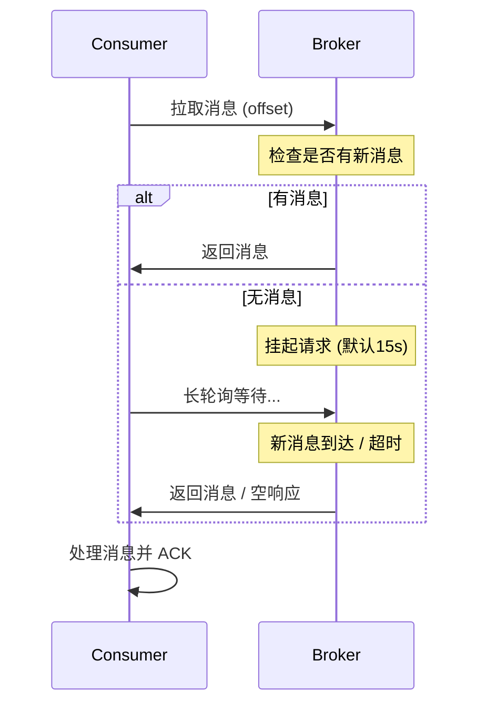

### 3.4 消费负载均衡

当消费者数量变化或 Queue 数量变化时，RocketMQ 自动触发 Rebalance 重新分配队列。

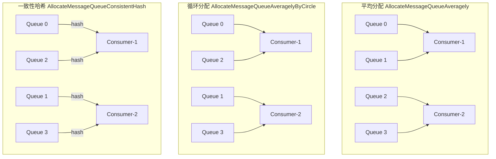

| 分配策略 | 类名 | 说明 |
|----------|------|------|
| **平均分配** | `AllocateMessageQueueAveragely` | 默认策略，按 Queue 数量平均分给每个消费者，余数逐个分配 |
| **循环分配** | `AllocateMessageQueueAveragelyByCircle` | 类似轮询，每个消费者依次分配一个 Queue |
| **一致性哈希** | `AllocateMessageQueueConsistentHash` | 使用一致性哈希环，扩容/缩容影响最小，但可能分配不均 |

```java
// 自定义负载均衡策略
consumer.setAllocateMessageQueueStrategy(new AllocateMessageQueueAveragely());
```

---

## 4. 消息特性

### 4.1 顺序消息

RocketMQ 保证**队列级别**的顺序：同一 Queue 内的消息严格 FIFO，不同 Queue 之间不保证顺序。

- **全局顺序**：Topic 只设置 1 个 Queue（不推荐，无并发）
- **分区顺序**：根据业务 Key（如订单 ID）将消息路由到同一 Queue

```java
import org.apache.rocketmq.client.producer.MessageQueueSelector;
import org.apache.rocketmq.common.message.MessageQueue;

// 生产者：确保同一订单的消息发到同一 Queue
DefaultMQProducer producer = new DefaultMQProducer("order_producer");
producer.setNamesrvAddr("127.0.0.1:9876");
producer.start();

String orderId = "ORDER_001";
for (int i = 0; i < 5; i++) {
    Message msg = new Message("OrderTopic", "TagA",
        ("订单 " + orderId + " 步骤 " + i).getBytes());
    // 根据 orderId 选择固定 Queue
    producer.send(msg, new MessageQueueSelector() {
        @Override
        public MessageQueue select(List<MessageQueue> mqs, Message msg, Object arg) {
            String orderId = (String) arg;
            int index = orderId.hashCode() % mqs.size();
            return mqs.get(index);
        }
    }, orderId);
}
```

```java
// 消费者：使用 MessageListenerOrderly 保证并发安全
import org.apache.rocketmq.client.consumer.listener.MessageListenerOrderly;
import org.apache.rocketmq.client.consumer.listener.ConsumeOrderlyStatus;

DefaultMQPushConsumer consumer = new DefaultMQPushConsumer("order_consumer");
consumer.setNamesrvAddr("127.0.0.1:9876");
consumer.subscribe("OrderTopic", "*");
// 顺序消费必须使用 MessageListenerOrderly
consumer.registerMessageListener((MessageListenerOrderly) (msgs, context) -> {
    msgs.forEach(msg -> {
        System.out.println("顺序消费: " + new String(msg.getBody()));
    });
    return ConsumeOrderlyStatus.SUCCESS;
});
consumer.start();
```

### 4.2 事务消息

RocketMQ 事务消息通过**半消息 + 本地事务 + 事务回查**机制实现分布式事务最终一致性。

**流程**：

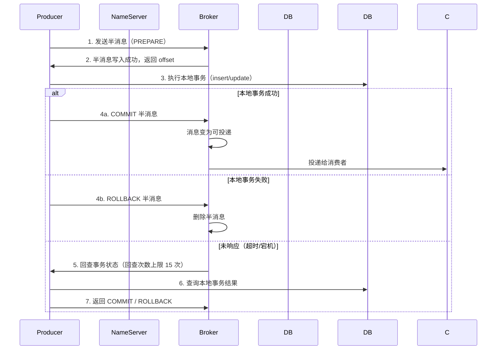

```java
import org.apache.rocketmq.client.producer.TransactionListener;
import org.apache.rocketmq.client.producer.TransactionMQProducer;
import org.apache.rocketmq.common.message.Message;
import org.apache.rocketmq.common.message.MessageExt;

// 1. 实现 TransactionListener
TransactionListener transactionListener = new TransactionListener() {

    // 执行本地事务
    @Override
    public LocalTransactionState executeLocalTransaction(Message msg, Object arg) {
        String orderId = arg.toString();
        try {
            // 执行本地数据库操作（扣库存、创建订单等）
            // orderService.createOrder(orderId);
            System.out.println("本地事务执行成功: " + orderId);
            return LocalTransactionState.COMMIT_MESSAGE;
        } catch (Exception e) {
            return LocalTransactionState.ROLLBACK_MESSAGE;
        }
    }

    // 事务回查（Broker 未收到 COMMIT/ROLLBACK 时调用）
    @Override
    public LocalTransactionState checkLocalTransaction(MessageExt msg) {
        String orderId = msg.getKeys();
        // 查询本地事务是否已提交
        // boolean success = orderService.checkOrderExists(orderId);
        boolean success = true;
        return success ? LocalTransactionState.COMMIT_MESSAGE
                       : LocalTransactionState.ROLLBACK_MESSAGE;
    }
};

// 2. 创建事务生产者
TransactionMQProducer producer = new TransactionMQProducer("tx_producer_group");
producer.setNamesrvAddr("127.0.0.1:9876");
producer.setTransactionListener(transactionListener);
producer.start();

// 3. 发送事务消息
Message msg = new Message("TxTopic", "TagA", "ORDER_123", "创建订单".getBytes());
// sendMessageInTransaction 会先发半消息，再回调 executeLocalTransaction
producer.sendMessageInTransaction(msg, "ORDER_123");
```

### 4.3 延时消息

RocketMQ 原生支持 18 个延时级别，不支持自定义时间。

```java
// 设置延时级别：3 对应 10s
Message msg = new Message("DelayTopic", "TagA", "延时消息".getBytes());
// 1s/5s/10s/30s/1m/2m/3m/4m/5m/6m/7m/8m/9m/10m/20m/30m/1h/2h
msg.setDelayTimeLevel(3);  // 3 = 10s
producer.send(msg);
```

| Level | 1 | 2 | 3 | 4 | 5 | 6 | 7 | 8 | 9 |
|-------|---|---|---|---|---|---|---|---|---|
| 延迟 | 1s | 5s | 10s | 30s | 1m | 2m | 3m | 4m | 5m |
| **Level** | **10** | **11** | **12** | **13** | **14** | **15** | **16** | **17** | **18** |
| **延迟** | 6m | 7m | 8m | 9m | 10m | 20m | 30m | 1h | 2h |

### 4.4 批量消息

```java
List<Message> messages = new ArrayList<>();
messages.add(new Message("BatchTopic", "TagA", "Msg 1".getBytes()));
messages.add(new Message("BatchTopic", "TagA", "Msg 2".getBytes()));
messages.add(new Message("BatchTopic", "TagA", "Msg 3".getBytes()));

// 批量发送（总大小默认不超过 4MB）
producer.send(messages);
```

> 注意：批量消息的总大小不能超过 `maxMessageSize`（默认 4MB）。如需发送大消息需拆分或修改配置。

### 4.5 消息过滤

#### Tag 过滤（简单高效）

```java
// 生产者：指定 Tag
Message msg = new Message("FilterTopic", "TagA", "内容".getBytes());

// 消费者：订阅特定 Tag
consumer.subscribe("FilterTopic", "TagA || TagB");  // 支持 || 多 Tag
consumer.subscribe("FilterTopic", "*");              // 匹配所有 Tag
```

#### SQL92 过滤（属性表达式过滤）

Broker 需开启配置：`enablePropertyFilter=true`

```java
// 生产者：设置消息属性
Message msg = new Message("SQLFilterTopic", "TagA", "内容".getBytes());
msg.putUserProperty("age", "25");
msg.putUserProperty("gender", "male");

// 消费者：使用 SQL92 表达式过滤
consumer.subscribe("SQLFilterTopic", MessageSelector.bySql(
    "age > 18 AND gender = 'male'"
));
```

支持的 SQL92 语法：`>`, `<`, `=`, `!=`, `AND`, `OR`, `NOT`, `IS NULL`, `IS NOT NULL`, `IN`, `BETWEEN`, `LIKE`。

### 4.6 消息重试

RocketMQ 在消费失败时自动重试。

**重试间隔**：集群模式下重试时间随次数递增。

| 重试次数 | 1 | 2 | 3 | 4 | 5 | 6 | 7 | 8 | 9 | 10+ |
|----------|---|---|---|---|---|---|---|---|---|---|
| 间隔 | 10s | 30s | 1m | 2m | 3m | 4m | 5m | 6m | 7m | 8m |

```java
// 消费者消费失败——触发重试
consumer.registerMessageListener((MessageListenerConcurrently) (msgs, context) -> {
    try {
        // 业务处理
        process(msgs);
        return ConsumeConcurrentlyStatus.CONSUME_SUCCESS;
    } catch (Exception e) {
        // 返回 RECONSUME_LATER 触发重试
        return ConsumeConcurrentlyStatus.RECONSUME_LATER;
    }
});
```

**重试次数配置**：

```java
// 设置最大重试次数（-1 表示无限重试，默认 16 次）
consumer.setMaxReconsumeTimes(16);
```

### 4.7 死信队列 DLQ

**产生原因**：消息重试超过最大次数后仍未消费成功，自动进入死信队列。

**DLQ 命名规则**：`%DLQ%<ConsumerGroupName>`，如 `%DLQ%my_consumer_group`

**处理方式**：

```java
// 专门订阅死信队列进行人工处理
DefaultMQPushConsumer dlqConsumer = new DefaultMQPushConsumer("dlq_handler_group");
dlqConsumer.setNamesrvAddr("127.0.0.1:9876");
// 订阅死信队列
dlqConsumer.subscribe("%DLQ%order_consumer_group", "*");
dlqConsumer.registerMessageListener((MessageListenerConcurrently) (msgs, context) -> {
    for (MessageExt msg : msgs) {
        System.out.println("死信消息: MsgId=" + msg.getMsgId()
            + ", ReconsumeTimes=" + msg.getReconsumeTimes()
            + ", Body=" + new String(msg.getBody()));
        // 人工处理：告警、补偿、记录到数据库
    }
    return ConsumeConcurrentlyStatus.CONSUME_SUCCESS;
});
dlqConsumer.start();
```

---

## 5. 消息可靠性

### 5.1 生产端可靠性

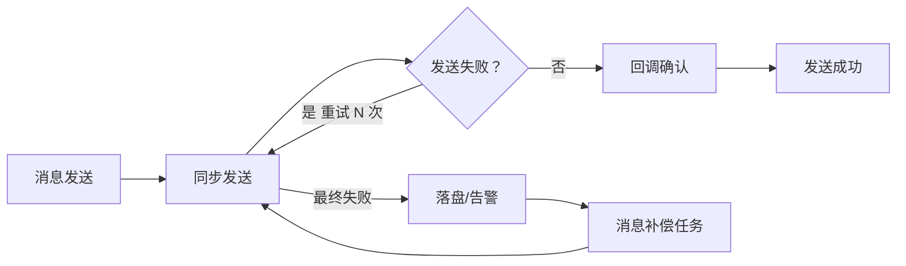

**同步发送 + 重试**：

```java
// 生产者配置重试
producer.setRetryTimesWhenSendFailed(3);       // 同步重试次数（默认 2）
producer.setRetryTimesWhenSendAsyncFailed(3);  // 异步重试次数（默认 2）
producer.setSendMsgTimeout(3000);              // 发送超时时间

// 同步发送本身会返回 SendResult，可判断状态
SendResult result = producer.send(msg);
if (result.getSendStatus() == SendStatus.SEND_OK) {
    // 发送成功
}
```

### 5.2 Broker 端可靠性

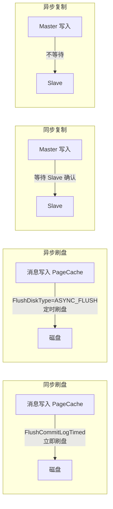

**Broker 配置（`broker.conf`）**：

```properties
# 刷盘方式：SYNC_FLUSH（同步）/ ASYNC_FLUSH（异步，默认）
flushDiskType = SYNC_FLUSH

# Broker 角色：SYNC_MASTER / ASYNC_MASTER / SLAVE
brokerRole = SYNC_MASTER
```

### 5.3 消费端可靠性

**ACK 确认机制**：

```java
// 消费成功——确认消费
return ConsumeConcurrentlyStatus.CONSUME_SUCCESS;
// 消费失败——稍后重试
return ConsumeConcurrentlyStatus.RECONSUME_LATER;
```

**幂等处理（防止重复消费）**：

```java
import java.util.concurrent.ConcurrentHashMap;

@Service
@RocketMQMessageListener(topic = "OrderTopic", consumerGroup = "order_consumer")
public class IdempotentConsumer implements RocketMQListener<MessageExt> {

    // 已处理的唯一键集合（生产环境建议用 Redis/数据库）
    private final ConcurrentHashMap<String, Boolean> processedKeys = new ConcurrentHashMap<>();

    @Override
    public void onMessage(MessageExt msg) {
        String businessKey = msg.getKeys(); // 消息 Key 作为业务唯一键

        // 1. 唯一键去重
        if (processedKeys.containsKey(businessKey)) {
            System.out.println("消息已处理，跳过: " + businessKey);
            return;
        }

        // 2. 或者查数据库判断
        // if (orderService.existsByOrderId(businessKey)) { return; }

        try {
            // 3. 业务处理（保证幂等性）
            processBusiness(msg);
            // 4. 标记已处理
            processedKeys.put(businessKey, true);
        } catch (Exception e) {
            // 处理失败，触发重试
            throw new RuntimeException(e);
        }
    }

    private void processBusiness(MessageExt msg) {
        String body = new String(msg.getBody());
        System.out.println("处理消息: " + body);
    }
}
```

```java
// DefaultMQPushConsumer 方式：手动 ACK + 幂等
consumer.registerMessageListener((MessageListenerConcurrently) (msgs, context) -> {
    for (MessageExt msg : msgs) {
        String dedupKey = msg.getKeys();
        // 基于数据库唯一索引去重
        // if (dedupDao.exists(dedupKey)) { continue; }
        // dedupDao.insert(dedupKey);  // 捕获主键冲突异常
        process(msg);
    }
    return ConsumeConcurrentlyStatus.CONSUME_SUCCESS;
});
```

### 5.4 消息补偿机制

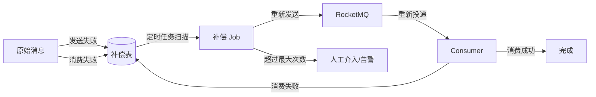

---

## 6. 运维与调优

### 6.1 Broker 关键配置参数

```properties
# ========== 消息大小 ==========
# 消息体最大字节数（默认 4MB = 4194304）
maxMessageSize = 4194304

# ========== 文件保留 ==========
# 消息保留天数（默认 72 小时），过期文件会被自动删除
fileReservedTime = 72

# ========== 存储性能 ==========
# 启用 transientStorePool（堆外内存缓冲池），提升写入性能
transientStorePoolEnable = true
# 临时缓冲池大小（默认 5 个文件，每个 1GB）
transientStorePoolSize = 5
# 异步刷盘间隔毫秒（默认 500ms）
flushInterval = 500
# CommitLog 刷盘提交间隔（默认 500ms）
flushCommitLogTimedInterval = 500

# ========== 主从复制 ==========
# 同步复制模式下等待 Slave 确认超时时间（毫秒）
waitTimeMillsInSyncQueue = 5000

# ========== 消费 ==========
# 消费者拉取消息线程数
pullMessageThreadPoolNums = 24
# 消息拉取大小（默认 32）
pullBatchSize = 32
# 消费线程数
consumeThreadMin = 20
consumeThreadMax = 64

# ========== 清理 ==========
# 磁盘空间使用率达到多少时清理过期文件（默认 75%）
diskMaxUsedSpaceRatio = 75
# 文件删除预留时间（毫秒），避免频繁删除
deleteWhen = 04
```

### 6.2 消息堆积处理

**堆积原因**：消费速度 < 生产速度，消费者异常或宕机。

**处理方法**：

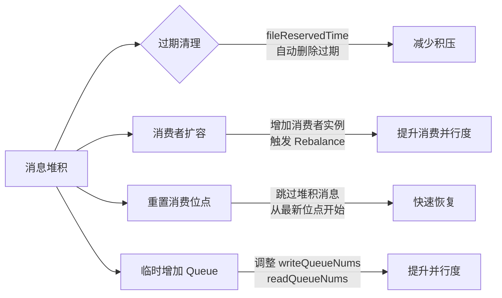

```java
// 重置消费者位点（跳过积压消息，从最新位点消费）
// 方式 1：客户端 API 重置
consumer.setConsumeFromWhere(ConsumeFromWhere.CONSUME_FROM_LAST_OFFSET);
consumer.start();

// 方式 2：使用 mqadmin 命令行
// mqadmin resetOffsetByTime -n 127.0.0.1:9876 -g consumer_group -t TopicTest -s now
```

### 6.3 回溯消费

支持按时间回溯消费，重新处理历史消息：

```bash
# 回溯到指定时间戳（毫秒）
mqadmin resetOffsetByTime -n 127.0.0.1:9876 -g consumer_group -t TopicTest -s 1609459200000
```

```java
// API 方式：从指定时间开始消费
consumer.setConsumeFromWhere(ConsumeFromWhere.CONSUME_FROM_TIMESTAMP);
consumer.setConsumeTimestamp("20250101000000"); // yyyyMMddHHmmss
```

### 6.4 RocketMQ Dashboard

RocketMQ 提供 Web 管理控制台，基于 Spring Boot 构建。

**主要功能**：

| 模块 | 功能 |
|------|------|
| **Dashboard** | 集群概览、Broker 状态、消息 TPS/吞吐量 |
| **Topic** | 创建/删除/更新 Topic，调整 Queue 数，查看消费进度 |
| **Consumer** | 查看消费者组、消费位点、堆积情况 |
| **Message** | 按 Key/MsgId/时间查询消息，查看消息轨迹 |
| **集群** | NameServer/Broker 状态监控、配置查看 |

**部署方式**：

```bash
git clone https://github.com/apache/rocketmq-dashboard.git
cd rocketmq-dashboard
mvn clean package -DskipTests
java -jar target/rocketmq-dashboard.jar --rocketmq.config.namesrvAddr=127.0.0.1:9876
```

### 6.5 双主双从部署

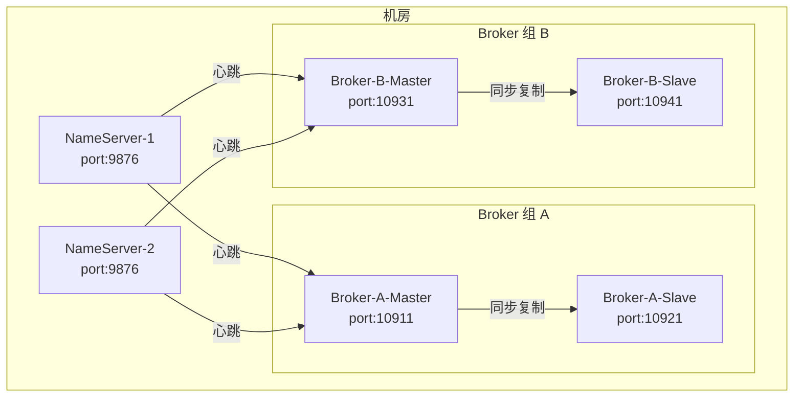

**双主双从配置要点**：

| 配置项 | Broker-A-Master | Broker-A-Slave | Broker-B-Master | Broker-B-Slave |
|--------|----------------|----------------|----------------|----------------|
| `brokerClusterName` | DefaultCluster | DefaultCluster | DefaultCluster | DefaultCluster |
| `brokerName` | broker-a | broker-a | broker-b | broker-b |
| `brokerId` | 0 | 1 | 0 | 1 |
| `brokerRole` | SYNC_MASTER | SLAVE | SYNC_MASTER | SLAVE |
| `listenPort` | 10911 | 10921 | 10931 | 10941 |
| `namesrvAddr` | 127.0.0.1:9876 | 127.0.0.1:9876 | 127.0.0.1:9876 | 127.0.0.1:9876 |
| `storePathRootDir` | /data/a-master | /data/a-slave | /data/b-master | /data/b-slave |

```properties
# broker-a-master.conf
brokerClusterName = DefaultCluster
brokerName = broker-a
brokerId = 0
brokerRole = SYNC_MASTER
listenPort = 10911
namesrvAddr = 127.0.0.1:9876
storePathRootDir = /data/rocketmq/a-master
flushDiskType = SYNC_FLUSH
```

### 6.6 RocketMQ 5.x 新特性

| 特性 | 说明 |
|------|------|
| **轻量级架构** | 支持无状态 Proxy 模式，Broker 仅负责存储，计算层独立 |
| **gRPC 协议** | 新增基于 gRPC 的客户端协议，支持多语言 SDK（Java/C++/Go/Python/Node.js） |
| **Pop 消费模式** | 替代 Pull/Rebalance 机制，由 Broker 主动 Pop 消息给消费者，解决 Rebalance 抖动问题 |
| **轻量 Topic** | 无需提前创建 Topic，支持动态自动创建，适合海量 Topic 场景 |
| **可观测性增强** | OpenTelemetry 集成，Prometheus 指标暴露，分布式追踪 |
| **事务消息增强** | 支持 JDBC 事务日志存储，无需依赖本地文件 |
| **安全增强** | 支持 TLS 加密传输，ACL 权限控制增强 |
| **与云原生集成** | 更好的 Kubernetes/容器化支持，Operator 自动化运维 |

**5.x Pop 消费示例**：

```java
// RocketMQ 5.x 新增的 SimpleConsumer（Pop 模式）
import org.apache.rocketmq.client.consumer.SimpleConsumer;
import org.apache.rocketmq.client.consumer.ReceiveMessageResult;
import org.apache.rocketmq.client.consumer.SimpleConsumerBuilder;
import org.apache.rocketmq.common.message.MessageExt;

SimpleConsumer consumer = SimpleConsumerBuilder.newBuilder()
    .setClientConfiguration(clientConfiguration)
    .setConsumerGroup("pop_consumer_group")
    .build();

// Pop 模式：主动从 Broker 拉取消息，自动负载均衡
ReceiveMessageResult result = consumer.receive("TopicTest", FilterExpression.SUB_ALL, 1000);
for (MessageExt msg : result) {
    System.out.println("Pop 消费: " + new String(msg.getBody()));
    consumer.ack(msg);  // 确认消费
}
```

---

## 总结

RocketMQ 作为阿里巴巴开源的分布式消息中间件，以**高可靠、高吞吐、功能丰富**著称，特别适合对事务、顺序、延时有强要求的业务场景。

| 维度 | RocketMQ 优势 |
|------|--------------|
| 可靠性 | 同步刷盘 + 主从同步复制 + 事务消息 + ACK 确认 + 死信队列 |
| 功能 | 顺序消息、事务消息、延时消息、Tag/SQL92 过滤、消息轨迹 |
| 性能 | CommitLog 顺序写 + 零拷贝 mmap/transferTo + 堆外内存池 |
| 运维 | Dashboard 控制台、重置位点、回溯消费、命令行管理工具 |
| 生态 | Spring Cloud Stream 集成、多语言 SDK（5.x gRPC）、云原生支持 |

---

# 第二部分：Kafka 知识体系详解

---

## 1. Kafka 概述

Apache Kafka 是由 LinkedIn 开发，后捐献给 Apache 基金会的分布式流处理平台。核心设计目标：高吞吐、可持久化、可水平扩展、容错。

### 1.1 核心概念

| 概念 | 说明 |
|------|------|
| **Topic（主题）** | 消息的逻辑分类，类似 RocketMQ 的 Topic |
| **Partition（分区）** | Topic 的物理分片，每个 Partition 是顺序写日志（不可变） |
| **Offset（偏移量）** | Partition 内消息的唯一序号，单调递增 |
| **Producer（生产者）** | 发布消息到 Topic |
| **Consumer（消费者）** | 订阅 Topic 消费消息 |
| **Consumer Group（消费组）** | 一组消费者共同消费一个 Topic，每个 Partition 在同一组内只有一个消费者 |
| **Broker（代理节点）** | Kafka 集群的服务节点，一个集群由一个或多个 Broker 组成 |
| **Controller（控制器）** | Broker 中的主节点，负责分区 Leader 选举和元数据管理 |
| **ISR（In-Sync Replica）** | 与 Leader 保持同步的副本集合 |
| **ZooKeeper（3.x 前）/ KRaft（3.x+）** | 元数据存储和集群协调 |

### 1.2 Kafka 架构

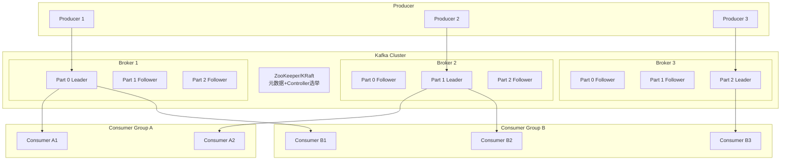

### 1.3 消息存储结构

```
Topic: orders
  ├── Partition 0
  │     ├── 00000000000000000000.log    # 消息数据文件
  │     ├── 00000000000000000000.index   # 偏移量索引
  │     └── 00000000000000000000.timeindex # 时间戳索引
  ├── Partition 1
  │     ├── 00000000000000000000.log
  │     ├── 00000000000000000000.index
  │     └── 00000000000000000000.timeindex
  └── Partition 2
        ├── 00000000000000000000.log
        ├── 00000000000000000000.index
        └── 00000000000000000000.timeindex
```

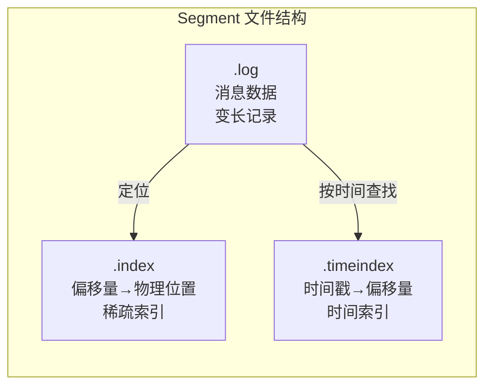

- 每个 Partition 由多个 **Segment** 组成（按大小/时间滚动）
- Segment 包含：`.log`（消息体）、`.index`（偏移量索引，稀疏）、`.timeindex`（时间戳索引）
- 消息写入：**顺序追加**到当前活跃 Segment，磁盘顺序写性能极高

---

## 2. Kafka 核心机制

### 2.1 生产端

```java
// Kafka Producer 示例
Properties props = new Properties();
props.put(ProducerConfig.BOOTSTRAP_SERVERS_CONFIG, "localhost:9092");
props.put(ProducerConfig.KEY_SERIALIZER_CLASS_CONFIG, 
          "org.apache.kafka.common.serialization.StringSerializer");
props.put(ProducerConfig.VALUE_SERIALIZER_CLASS_CONFIG,
          "org.apache.kafka.common.serialization.StringSerializer");

// 核心参数
props.put(ProducerConfig.ACKS_CONFIG, "all");           // 0/1/all 确认级别
props.put(ProducerConfig.RETRIES_CONFIG, 3);             // 重试次数
props.put(ProducerConfig.BATCH_SIZE_CONFIG, 16384);      // 批量发送大小（16KB）
props.put(ProducerConfig.LINGER_MS_CONFIG, 5);           // 等待时间（5ms）
props.put(ProducerConfig.COMPRESSION_TYPE_CONFIG, "snappy"); // 压缩算法
props.put(ProducerConfig.BUFFER_MEMORY_CONFIG, 33554432); // 缓冲区大小（32MB）
props.put(ProducerConfig.ENABLE_IDEMPOTENCE_CONFIG, true); // 幂等（3.x+ 默认开启）

KafkaProducer<String, String> producer = new KafkaProducer<>(props);

// 异步发送
producer.send(new ProducerRecord<>("orders", "order_001", "{...}"), (metadata, exception) -> {
    if (exception != null) {
        log.error("发送失败", exception);
    } else {
        log.info("发送成功: partition={}, offset={}", 
                 metadata.partition(), metadata.offset());
    }
});

producer.close();
```

**生产端核心流程：**

```mermaid
sequenceDiagram
    participant "Application" as App
    participant "Producer<br/>Interceptor/Serializer" as PP
    participant "Accumulator<br/>(Batch Buffer)" as ACC
    participant "Sender Thread" as SN
    participant "Broker" as BK
    
    App->>PP: send(msg)
    PP->>PP: 拦截器链→序列化→分区器
    PP->>ACC: 加入批次队列
    Note over ACC: 批次满 / ling.ms 到期
    
    SN->>ACC: 拉取就绪批次
    SN->>BK: ProduceRequest(batch)
    BK->>BK: 写入 Partition<br/>检查 ACK 级别
    BK-->>SN: Response
    SN-->>App: Callback
```

**ACK 级别对比：**

| ACK 配置 | 可靠性 | 延迟 | 说明 |
|----------|--------|------|------|
| `acks=0` | 最低 | 最低 | 不等待确认，可能丢消息 |
| `acks=1` | 中等 | 中等 | Leader 写入即返回，Leader 宕机可能丢 |
| `acks=all`(-1) | 最高 | 最高 | 等待 ISR 全部确认，不丢消息 |

### 2.2 消费端

```java
// Kafka Consumer 示例
Properties props = new Properties();
props.put(ConsumerConfig.BOOTSTRAP_SERVERS_CONFIG, "localhost:9092");
props.put(ConsumerConfig.GROUP_ID_CONFIG, "order_consumer_group");
props.put(ConsumerConfig.KEY_DESERIALIZER_CLASS_CONFIG,
          "org.apache.kafka.common.serialization.StringDeserializer");
props.put(ConsumerConfig.VALUE_DESERIALIZER_CLASS_CONFIG,
          "org.apache.kafka.common.serialization.StringDeserializer");

// 核心消费参数
props.put(ConsumerConfig.ENABLE_AUTO_COMMIT_CONFIG, "false"); // 手动提交
props.put(ConsumerConfig.AUTO_OFFSET_RESET_CONFIG, "earliest"); // earliest/latest/none
props.put(ConsumerConfig.MAX_POLL_RECORDS_CONFIG, 500);    // 每次拉取最大条数
props.put(ConsumerConfig.MAX_POLL_INTERVAL_MS_CONFIG, 300000); // 最大处理超时（5min）
props.put(ConsumerConfig.HEARTBEAT_INTERVAL_MS_CONFIG, 3000);  // 心跳间隔

KafkaConsumer<String, String> consumer = new KafkaConsumer<>(props);
consumer.subscribe(Arrays.asList("orders"));

try {
    while (true) {
        ConsumerRecords<String, String> records = consumer.poll(Duration.ofMillis(1000));
        for (ConsumerRecord<String, String> record : records) {
            System.out.printf("partition=%d, offset=%d, key=%s, value=%s%n",
                record.partition(), record.offset(), record.key(), record.value());
        }
        // 手动提交偏移量
        consumer.commitSync();  // or commitAsync()
    }
} finally {
    consumer.close();
}
```

**消费端再均衡（Rebalance）监听器：**

```java
consumer.subscribe(Arrays.asList("orders"), new ConsumerRebalanceListener() {
    @Override
    public void onPartitionsRevoked(Collection<TopicPartition> partitions) {
        // 分区被回收前提交偏移量
        consumer.commitSync();
        log.warn("分区被回收: {}", partitions);
    }
    
    @Override
    public void onPartitionsAssigned(Collection<TopicPartition> partitions) {
        log.info("分配分区: {}", partitions);
    }
});
```

### 2.3 分区分配策略

| 策略 | 类名 | 说明 |
|------|------|------|
| **Range（范围）** | `RangeAssignor` | 按 Topic 分区数 / 消费者数 平均分配（默认） |
| **RoundRobin（轮询）** | `RoundRobinAssignor` | 所有分区轮询分配给消费者 |
| **Sticky（粘性）** | `StickyAssignor` | 尽量保持上次分配不变，减少 Rebalance 移动 |
| **Cooperative（协作）** | `CooperativeStickyAssignor` | 渐进式 Rebalance，不中断全量消费（2.4+） |

### 2.4 消息可靠性保证

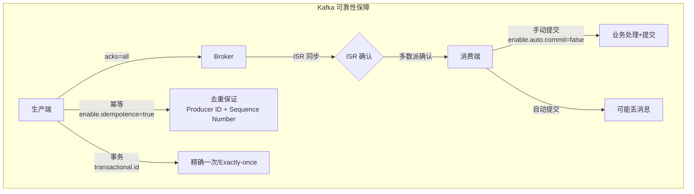

**精确一次语义（Exactly-Once Semantics, EOS）：**

```java
// 幂等生产者（去重）
props.put(ProducerConfig.ENABLE_IDEMPOTENCE_CONFIG, true);

// 事务生产者
props.put(ProducerConfig.TRANSACTIONAL_ID_CONFIG, "order-txn-001");
producer.initTransactions();

try {
    producer.beginTransaction();
    producer.send(new ProducerRecord<>("orders", "order1", "{...}"));
    producer.send(new ProducerRecord<>("payments", "pay1", "{...}"));
    producer.commitTransaction();
} catch (Exception e) {
    producer.abortTransaction();
}

// 事务消费者（读已提交）
props.put(ConsumerConfig.ISOLATION_LEVEL_CONFIG, "read_committed");
```

### 2.5 日志清理策略

| 策略 | 配置 | 说明 |
|------|------|------|
| **删除（delete）** | `cleanup.policy=delete` | 超过保留时间/大小后删除（默认） |
| **压缩（compact）** | `cleanup.policy=compact` | 保留每个 Key 的最新消息，合并历史 |

```sql
-- 日志压缩（Log Compaction）示意图
-- Key=user_001 的更新历史
offset 0: user_001, {name: "Alice", email: "alice@old.com"}
offset 5: user_001, {name: "Alice", email: "alice@new.com"}
offset 8: user_001, {name: "Alice", email: "alice@latest.com"}
-- 压缩后只保留 offset 8 的最新记录
```

---

## 3. Kafka 高阶特性

### 3.1 Kafka Streams

```java
// Kafka Streams 实时流处理
Properties props = new Properties();
props.put(StreamsConfig.APPLICATION_ID_CONFIG, "order-streams-app");
props.put(StreamsConfig.BOOTSTRAP_SERVERS_CONFIG, "localhost:9092");

StreamsBuilder builder = new StreamsBuilder();
KStream<String, String> orders = builder.stream("orders");

// 转换与聚合
orders
    .mapValues(value -> {
        Order order = Json.parse(value, Order.class);
        order.setStatus("PROCESSED");
        return Json.toJson(order);
    })
    .filter((key, value) -> value.contains("amount"))
    .to("processed_orders");

KafkaStreams streams = new KafkaStreams(builder.build(), props);
streams.start();
```

### 3.2 Kafka Connect

```json
// Kafka Connect - MySQL 到 Kafka 数据同步
{
  "name": "mysql-orders-connector",
  "config": {
    "connector.class": "io.confluent.connect.jdbc.JdbcSourceConnector",
    "connection.url": "jdbc:mysql://localhost:3306/mydb",
    "mode": "incrementing",
    "incrementing.column.name": "id",
    "topic.prefix": "mysql-",
    "table.whitelist": "orders",
    "poll.interval.ms": "5000"
  }
}
```

### 3.3 集群扩容与分区重分配

```bash
# 生成分区重分配计划
bin/kafka-reassign-partitions.sh --bootstrap-server localhost:9092 \
  --generate --topics-to-move-json-file topics-to-move.json \
  --broker-list "1,2,3,4"

# 执行分区重分配
bin/kafka-reassign-partitions.sh --bootstrap-server localhost:9092 \
  --execute --reassignment-json-file reassign.json

# 验证重分配状态
bin/kafka-reassign-partitions.sh --bootstrap-server localhost:9092 \
  --verify --reassignment-json-file reassign.json
```

### 3.4 Kafka 监控指标

| 指标 | 监控对象 | 关键值 |
|------|----------|--------|
| **BytesIn/BytesOut** | Broker/Topic | 入/出流量 |
| **MessagesInPerSec** | Broker/Topic | 消息入速率 |
| **TotalTimeMs** | 生产/消费 | 请求处理耗时 |
| **UnderReplicatedPartitions** | Broker | 副本不同步数（>0 需排查） |
| **IsrExpands/IsrShrinks** | Broker | ISR 变动次数 |
| **OfflinePartitionsCount** | 集群 | 离线分区数 |
| **RequestsPerSec** | Broker | 各类请求速率 |
| **RequestQueueSize** | Broker | 请求堆积情况 |
| **ConsumerLag** | 消费组 | 消费延迟（关键监控指标） |

---

## 4. Kafka 与 RocketMQ 对比

### 4.1 架构对比

| 维度 | Kafka | RocketMQ |
|------|-------|----------|
| **存储模型** | Partition 顺序日志文件 | CommitLog + ConsumeQueue 双存储 |
| **路由发现** | Broker 直连 + 元数据缓存 | NameServer 独立路由中心 |
| **消息确认** | ISR + HW（High Watermark） | 同步刷盘 + 主从复制 + ACK |
| **消费模式** | 纯 Pull（poll 拉取） | Pull + Push（长轮询模拟 Push） |
| **顺序消息** | 分区内顺序 | 分区顺序（MessageQueueSelector） |
| **事务消息** | 3.x 事务 API | 半消息 + 回查机制 |
| **延时消息** | 不支持原生 | 18 个级别（可自定义） |
| **死信队列** | DLQ（$group-DQL） | DLQ（%DLQ%ConsumerGroup） |
| **消息过滤** | 服务端不支持，客户端过滤 | Tag + SQL92 服务端过滤 |
| **消费重试** | 通过 seek 手动管理 | 内置重试队列 + 16 次重试 |
| **精确一次** | 幂等 + 事务（EOS） | 事务消息 + 幂等消费 |
| **存储计算** | 耦合 | 耦合 |

### 4.2 性能对比

| 指标 | Kafka | RocketMQ |
|------|-------|----------|
| **单机吞吐** | 百万级/s（日志场景） | 10万级/s（业务场景） |
| **延迟（P99）** | 2-5ms | 1-5ms |
| **批量能力** | 极强（批量压缩/分段） | 支持批量 |
| **存储效率** | 零拷贝 + 页缓存 | 零拷贝 + 堆外内存池 |
| **海量分区** | 支持数万分区 | 支持数千分区 |
| **消息堆积** | 强（Page Cache 友好） | 强（CommitLog 顺序写） |

### 4.3 选型建议

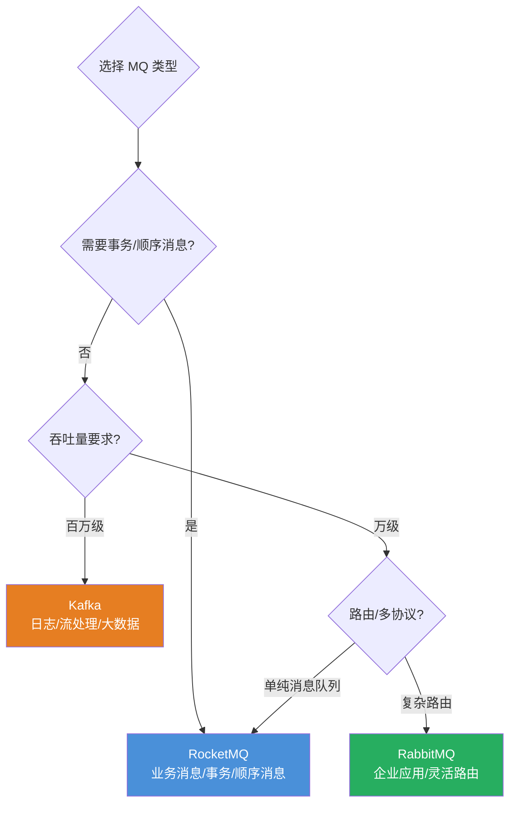

**场景推荐：**
- **业务消息 / 订单 / 支付** → RocketMQ（事务/顺序/延时/重试机制完善）
- **日志收集 / 埋点 / 大数据 / 流处理** → Kafka（高吞吐/海量分区/Streams 生态）
- **企业应用 / 多渠道路由** → RabbitMQ（灵活交换机/多协议/管理界面友好）

---

## 5. RocketMQ → Kafka 迁移方案

### 5.1 消息模型映射

| RocketMQ 概念 | Kafka 对应 | 迁移要点 |
|---------------|------------|----------|
| Topic | Topic | 1:1 映射 |
| Queue（读写队列） | Partition | 默认 RocketMQ 一个 Queue→一个 Partition |
| Consumer Group | Consumer Group | 1:1 映射 |
| Tag | 分区策略 / Header | Kafka 无服务端 Tag 过滤 |
| Message ID | offset + 元数据 | Kafka 通过 offset 唯一标识 |
| 事务消息 | 事务 API | API 不同，需改造 |
| 延时消息 | 无原生支持 | 需用时间轮/Kafka Streams 模拟 |

### 5.2 连接方式切换

```yaml
# RocketMQ 配置（Spring Boot）
rocketmq:
  name-server: 192.168.1.10:9876
  producer:
    group: order-producer-group

# 替换为 Kafka 配置
spring:
  kafka:
    bootstrap-servers: 192.168.1.20:9092,192.168.1.21:9092
    producer:
      acks: all
      retries: 3
      compression-type: snappy
      key-serializer: org.apache.kafka.common.serialization.StringSerializer
      value-serializer: org.apache.kafka.common.serialization.StringSerializer
    consumer:
      group-id: order-consumer-group
      enable-auto-commit: false
      auto-offset-reset: earliest
```

### 5.3 代码迁移示例

```java
// RocketMQ 发送
RocketMQTemplate template = new RocketMQTemplate();
template.setProducer(producer);
template.syncSend("order-topic:order-tag", message);

// 替换为 Kafka 发送
@Autowired
private KafkaTemplate<String, String> kafkaTemplate;

public void sendMessage(String topic, String key, String message) {
    ListenableFuture<SendResult<String, String>> future = 
        kafkaTemplate.send(topic, key, message);
    future.addCallback(result -> {
        log.info("发送成功: offset={}", result.getRecordMetadata().offset());
    }, ex -> {
        log.error("发送失败", ex);
    });
}
```

---

# 第三部分：RabbitMQ 知识体系详解

---

## 1. RabbitMQ 概述

RabbitMQ 是基于 **AMQP 0-9-1** 协议的开源消息中间件，使用 Erlang 语言开发，以**灵活的路由能力**和**易用的管理界面**著称。

### 1.1 核心概念

| 概念 | 说明 |
|------|------|
| **Producer（生产者）** | 消息发送方 |
| **Consumer（消费者）** | 消息接收方 |
| **Exchange（交换机）** | 接收消息并按照路由规则转发到队列 |
| **Queue（队列）** | 消息的缓冲区，最终存储消息的地方 |
| **Binding（绑定）** | Exchange 与 Queue 之间的路由规则 |
| **Routing Key（路由键）** | 消息携带的标签，Exchange 根据它与 Binding Key 匹配 |
| **VHost（虚拟主机）** | 逻辑隔离空间，类似命名空间 |
| **Channel（信道）** | 在 TCP 连接上建立的虚拟连接，复用 TCP 连接 |

### 1.2 RabbitMQ 架构

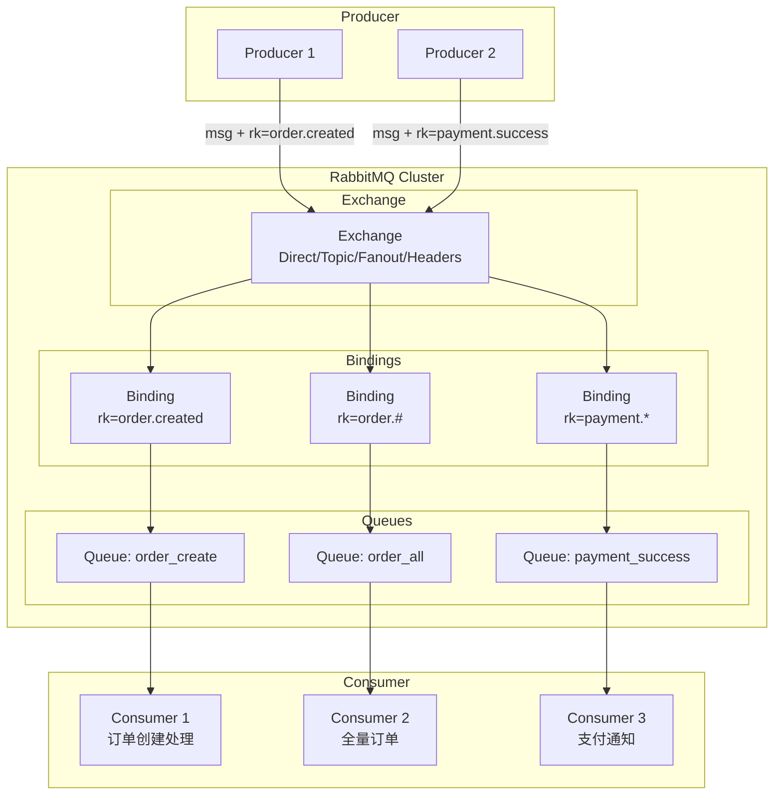

### 1.3 交换机类型

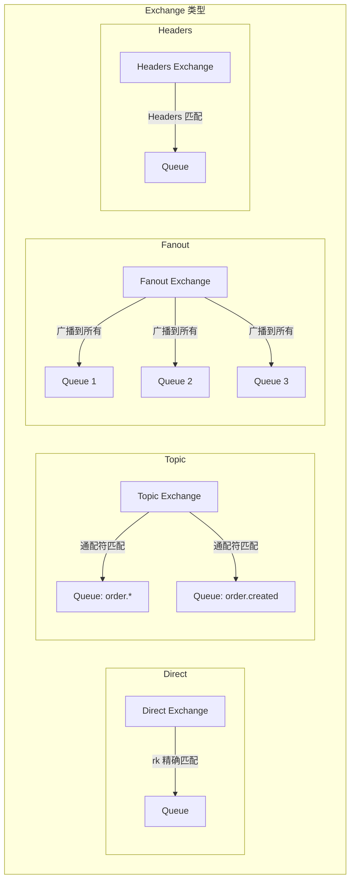

**交换机类型对比：**

| 类型 | 路由规则 | 使用场景 |
|------|----------|----------|
| **Direct** | Routing Key 精确匹配 | 点对点、任务分发 |
| **Topic** | Routing Key 通配符匹配（`*` 匹配一个词、`#` 匹配零或多个词） | 按业务类型分发 |
| **Fanout** | 转发到所有绑定的队列，忽略 Routing Key | 广播通知 |
| **Headers** | 根据消息 Header 属性匹配（忽略 Routing Key） | 复杂路由条件 |

```java
// 四种交换机使用示例
@Configuration
public class RabbitMQConfig {
    
    // 1. Direct Exchange
    @Bean
    public DirectExchange directExchange() {
        return new DirectExchange("order.direct");
    }
    @Bean
    public Queue directQueue() {
        return new Queue("order.paid");
    }
    @Bean
    public Binding directBinding() {
        return BindingBuilder.bind(directQueue())
                .to(directExchange()).with("order.paid");
    }
    
    // 2. Topic Exchange
    @Bean
    public TopicExchange topicExchange() {
        return new TopicExchange("order.topic");
    }
    @Bean
    public Queue topicQueue() {
        return new Queue("order.all");
    }
    @Bean
    public Binding topicBinding() {
        return BindingBuilder.bind(topicQueue())
                .to(topicExchange()).with("order.#");
    }
    
    // 3. Fanout Exchange（广播）
    @Bean
    public FanoutExchange fanoutExchange() {
        return new FanoutExchange("notification.fanout");
    }
    @Bean
    public Queue fanoutQueueA() { return new Queue("notify.sms"); }
    @Bean
    public Queue fanoutQueueB() { return new Queue("notify.email"); }
    @Bean
    public Binding bindingA() {
        return BindingBuilder.bind(fanoutQueueA()).to(fanoutExchange());
    }
    @Bean
    public Binding bindingB() {
        return BindingBuilder.bind(fanoutQueueB()).to(fanoutExchange());
    }
}
```

---

## 2. RabbitMQ 核心机制

### 2.1 消息投递保障

```java
// 生产者确认机制（Publisher Confirm）
@Bean
public RabbitTemplate rabbitTemplate(ConnectionFactory connectionFactory) {
    RabbitTemplate template = new RabbitTemplate(connectionFactory);
    // 开启发布者确认
    template.setConfirmCallback((correlationData, ack, cause) -> {
        if (ack) {
            log.info("消息确认成功: {}", correlationData.getId());
        } else {
            log.error("消息确认失败: {}", cause);
        }
    });
    // 开启 return 回调（消息不可到达时触发）
    template.setMandatory(true);
    template.setReturnsCallback(returned -> {
        log.warn("消息未到达队列: exchange={}, routingKey={}, replyCode={}",
                returned.getExchange(), returned.getRoutingKey(),
                returned.getReplyCode());
    });
    return template;
}
```

```yaml
# 生产者确认配置
spring:
  rabbitmq:
    publisher-confirm-type: correlated  # 开启确认回调
    publisher-returns: true              # 开启不可达回调
```

### 2.2 死信队列（DLX）

```java
// 死信队列配置
@Bean
public Queue orderQueue() {
    Map<String, Object> args = new HashMap<>();
    // 死信消息转发到死信交换机
    args.put("x-dead-letter-exchange", "order.dlx.exchange");
    // 死信消息的路由键
    args.put("x-dead-letter-routing-key", "order.dead");
    // 队列消息的 TTL（毫秒）
    args.put("x-message-ttl", 60000);
    // 队列长度限制
    args.put("x-max-length", 10000);
    return new Queue("order.queue", true, false, false, args);
}

// 死信交换机 + 死信队列
@Bean
public DirectExchange dlxExchange() {
    return new DirectExchange("order.dlx.exchange");
}
@Bean
public Queue dlxQueue() {
    return new Queue("order.dlx.queue");
}
@Bean
public Binding dlxBinding() {
    return BindingBuilder.bind(dlxQueue())
            .to(dlxExchange()).with("order.dead");
}
```

### 2.3 消费端确认与重试

```java
@Component
public class OrderConsumer {
    
    // 手动 ACK
    @RabbitListener(queues = "order.queue")
    public void handleOrder(Order order, 
                           @Header(AmqpHeaders.DELIVERY_TAG) long deliveryTag,
                           Channel channel) throws IOException {
        try {
            // 业务处理
            processOrder(order);
            // 手动确认
            channel.basicAck(deliveryTag, false);
        } catch (BusinessException e) {
            // 重试（重新入队）
            channel.basicNack(deliveryTag, false, true);
        } catch (Exception e) {
            // 拒收（入死信队列）
            channel.basicNack(deliveryTag, false, false);
        }
    }
}
```

```yaml
# 消费重试配置
spring:
  rabbitmq:
    listener:
      simple:
        acknowledge-mode: manual          # 手动 ACK
        retry:
          enabled: true                   # 开启重试
          max-attempts: 3                 # 最大重试次数
          initial-interval: 1000          # 初始间隔
          multiplier: 2.0                 # 间隔倍数
          max-interval: 10000             # 最大间隔
```

### 2.4 延迟消息实现

RabbitMQ 本身不支持延时消息，通过 **死信交换机（DLX）+ TTL** 或 **延时插件** 实现。

```java
// 方式一：死信交换机 + TTL 实现延时
@Component
public class DelayedMessageProducer {
    @Autowired
    private RabbitTemplate rabbitTemplate;
    
    public void sendDelayed(String exchange, String routingKey, 
                           Object message, long delayMs) {
        MessageProperties props = MessagePropertiesBuilder.newInstance()
                .setExpiration(String.valueOf(delayMs))  // TTL = 延迟时间
                .build();
        rabbitTemplate.send(exchange, routingKey,
                MessageBuilder.withBody(serialize(message))
                    .andProperties(props).build());
    }
}

// 方式二：延时插件（需要安装 rabbitmq_delayed_message_exchange）
@Bean
public CustomExchange delayedExchange() {
    Map<String, Object> args = new HashMap<>();
    args.put("x-delayed-type", "direct");
    return new CustomExchange("delayed.exchange", "x-delayed-message", true, false, args);
}

// 发送延时消息
rabbitTemplate.convertAndSend("delayed.exchange", "order.delay",
        message, msg -> {
    msg.getMessageProperties().setDelay(60000); // 延迟 60 秒
    return msg;
});
```

### 2.5 集群模式

| 模式 | 说明 | 特点 |
|------|------|------|
| **单机** | 单个节点 | 开发测试环境 |
| **普通集群（Clustering）** | 多个节点共享元数据，队列数据在单个节点 | 高可用低，节点宕机丢失队列 |
| **镜像队列（Mirrored Queues）** | 队列数据在多个节点同步 | 高可用，性能损失 |
| **仲裁队列（Quorum Queues, 3.8+）** | 基于 Raft 的复制队列 | 数据一致性高，推荐生产使用 |
| **惰性队列（Lazy Queues）** | 消息尽可能保存在磁盘 | 减少内存占用，适合海量堆积 |

---

## 3. RabbitMQ 与 RocketMQ / Kafka 对比

### 3.1 全面对比表

| 维度 | RabbitMQ | RocketMQ | Kafka |
|------|----------|----------|-------|
| **协议** | AMQP 0-9-1 / STOMP / MQTT | 自研协议（二进制） | 自研协议（二进制） |
| **开发语言** | Erlang | Java | Scala/Java |
| **消息模型** | Exchange → Binding → Queue | Topic → Queue | Topic → Partition |
| **路由灵活性** | ⭐⭐⭐⭐⭐（4种交换机） | ⭐⭐⭐（Tag + SQL92） | ⭐⭐（分区无路由） |
| **吞吐量** | 万级/s | 10万级/s | 百万级/s |
| **延迟** | 微秒级 | 毫秒级 | 毫秒级 |
| **消息顺序** | 单队列内顺序 | 分区顺序 | 分区顺序 |
| **事务消息** | 需插件 | ✅ 原生支持 | ✅ 3.x 事务 API |
| **延时消息** | TTL+DLX / 延时插件 | ✅ 原生 18 级 | 不支持原生 |
| **死信队列** | ✅ DLX + DLQ | ✅ DLQ | ✅ DLQ |
| **消费模式** | Push（推荐）+ Pull | Push + Pull（长轮询） | Pull |
| **管理界面** | ⭐⭐⭐⭐⭐（非常完善） | ⭐⭐⭐（Dashboard） | ⭐⭐（需第三方） |
| **运维复杂度** | 低 | 中等 | 较高 |
| **多语言 SDK** | 非常丰富 | 以 Java 为主 | 丰富 |
| **流处理** | 不支持 | 不支持 | ✅ Kafka Streams / ksqlDB |
| **云原生** | 一般 | 一般 | 强（Confluent + K8s Operator） |
| **主要场景** | 企业应用/灵活路由/多协议 | 业务消息/事务/顺序 | 日志/流处理/大数据 |

### 3.2 消息模型差异详解

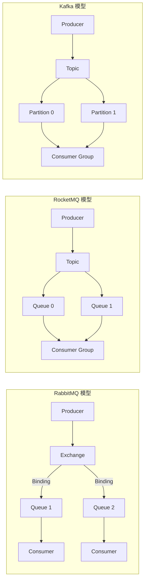

**核心差异：**
1. **RabbitMQ**：Exchange 是路由核心，消息先到 Exchange，根据 Binding 规则转发到队列，消费者从队列消费。路由最灵活。
2. **RocketMQ**：消息直接写入 Topic 的 Queue，消费者通过 Consumer Group 消费。Queue 是负载均衡的最小单位。
3. **Kafka**：消息写入 Topic 的 Partition，同一 Consumer Group 内每个 Partition 只能被一个消费者消费。

### 3.3 三种消息模型的拓扑结构对比

| 特性 | RabbitMQ | RocketMQ | Kafka |
|------|----------|----------|-------|
| **消息推送** | Exchange 推送到队列 | Producer 指定 Queue | Producer 指定 Partition |
| **消息拉取** | 消费者从队列拉取 | 消费者从 Queue 拉取 | 消费者从 Partition 拉取 |
| **广播模式** | Fanout Exchange | 广播消费 | 不同 Group 独立消费 |
| **负载均衡** | 队列竞争消费 | Queue 级别分配 | Partition 级别分配 |
| **消费进度** | 队列内自动/BasicAck | 偏移量管理 | Offset 管理 |
| **消息重试** | DLX + 重新入队 | 重试队列 | seek 重新消费 |

### 3.4 选型决策树

```mermaid
graph TD
    Q{选型决策} --> A{需要复杂路由?<br/>交换机/绑定/多协议}
    A -->|是| RB[RabbitMQ]
    
    A -->|否| B{需要事务消息<br/>顺序消息?}
    B -->|是| RM[RocketMQ]
    
    B -->|否| C{吞吐量要求?}
    C -->|百万级/s| KF[Kafka]
    C -->|万级~十万级| D{功能丰富度}
    
    D -->|需要延时/事务| RM
    D -->|简单消息队列| RB
    
    style RB fill:#27ae60,color:#fff
    style RM fill:#4a90d9,color:#fff
    style KF fill:#e67e22,color:#fff
```

### 3.5 消息队列共性与总结

**共性：**
- ✅ 全部支持 **异步解耦、削峰填谷** 核心场景
- ✅ 全部支持 **生产-消费** 模型、**消费组** 概念
- ✅ 全部支持 **持久化** 存储，消息不丢
- ✅ 全部支持 **集群部署** 和高可用
- ✅ 全部支持 **死信队列** 处理失败消息
- ✅ 全部支持 **消息确认** 机制（ACK）
- ✅ 全部支持 **多语言 SDK**
- ✅ 全部支持 **Spring Boot 集成（Spring Cloud Stream）**

**差异总结：**

| 差异维度 | RabbitMQ | RocketMQ | Kafka |
|----------|----------|----------|-------|
| **定位** | 通用消息中间件 | 业务消息中间件 | 流处理平台 |
| **路由能力** | 最灵活 | 中等 | 最弱 |
| **吞吐量** | 万级 | 十万级 | 百万级 |
| **功能丰富度** | 中等 | 最丰富 | 原生较少 |
| **使用门槛** | 低 | 中等 | 较高 |
| **运维管理** | 最简单 | 中等 | 较复杂 |

### 3.6 消息可靠性三级保障对比

```mermaid
graph LR
    subgraph "生产端保障"
        RMQ_R[RabbitMQ: Publisher Confirm + Return]
        ROCK_R[RocketMQ: 同步发送 + 重试 + 回调]
        KFK_R[Kafka: acks=all + 幂等 + 事务]
    end
    
    subgraph "服务端保障"
        RMQ_B[RabbitMQ: 镜像/仲裁队列 + 持久化]
        ROCK_B[RocketMQ: 同步刷盘 + 同步复制]
        KFK_B[Kafka: ISR + 副本 + log.flush]
    end
    
    subgraph "消费端保障"
        RMQ_C[RabbitMQ: 手动ACK + 重试 + DLX]
        ROCK_C[RocketMQ: 手动ACK + 重试队列 + DLQ]
        KFK_C[Kafka: 手动commit + seek + DLQ]
    end
```

---

## 总结：消息队列选型一览

| 场景 | 推荐 MQ | 理由 |
|------|---------|------|
| **企业应用/ERP/OA** | RabbitMQ | 灵活路由、管理方便、多协议支持 |
| **订单/交易/支付** | RocketMQ | 事务/顺序/延时消息成熟，高可靠 |
| **日志/埋点/追踪** | Kafka | 高吞吐、海量分区、日志保留能力强 |
| **IoT/移动端** | RabbitMQ + MQTT | MQTT 插件，轻量级协议 |
| **实时流处理** | Kafka Streams / ksqlDB | 原生流处理能力 |
| **数据同步/管道** | Kafka Connect | 连接器生态丰富 |
| **云原生/容器化** | Kafka + K8s Operator | 生态完整（Strimzi/Confluent） |
| **多协议混合** | RabbitMQ | AMQP/STOMP/MQTT/HTTP 统一 |
