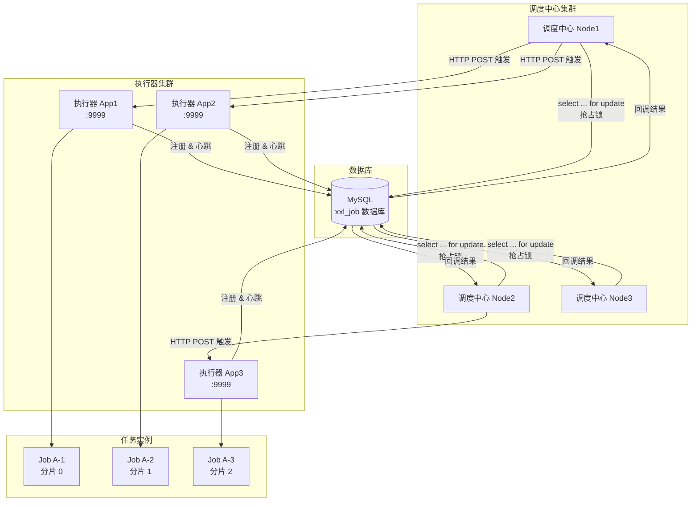
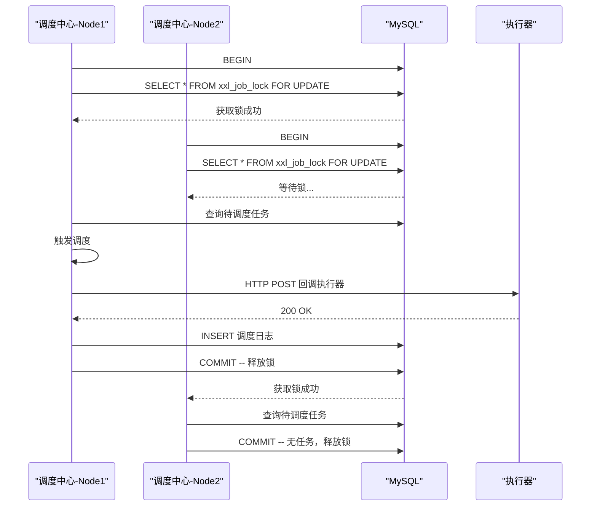
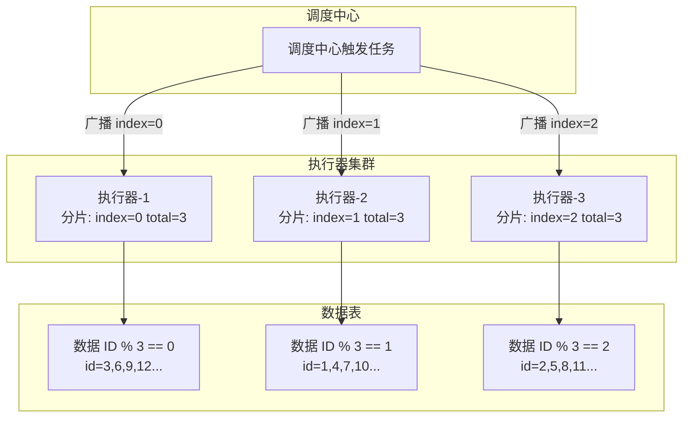
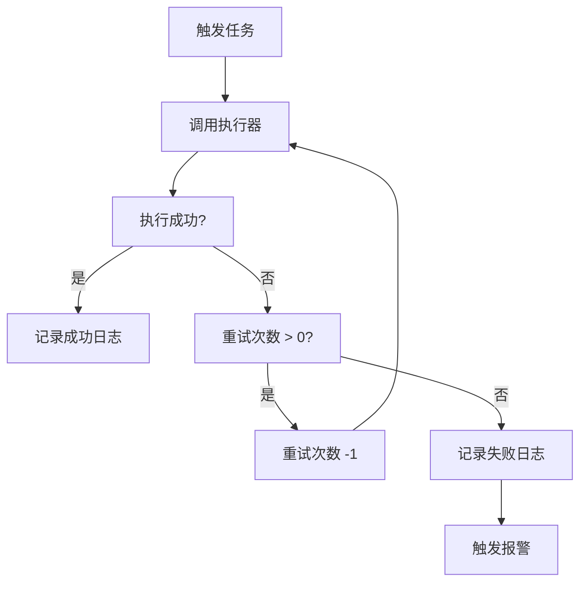
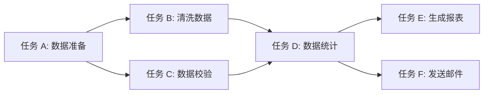

# XXL-Job 分布式任务调度平台 — 知识体系

> XXL-Job 是一款轻量级、开源的分布式任务调度平台，由大众点评工程师许雪里（xuxueli）开发。核心设计目标：**学习简单、部署简单、操作简单、扩展简单**。

---

## 目录

1. [架构原理](#1-架构原理)
2. [任务类型](#2-任务类型)
3. [路由策略与分片](#3-路由策略与分片)
4. [任务调度](#4-任务调度)
5. [Spring Boot 集成](#5-spring-boot-集成)
6. [运维](#6-运维)

---

## 1. 架构原理

### 1.1 整体架构

XXL-Job 由三大组件构成：

| 组件 | 角色 | 说明 |
|------|------|------|
| **调度中心** (Admin) | 调度端 | 负责任务调度触发、日志管理、报警 |
| **执行器** (Executor) | 执行端 | 负责任务的实际执行逻辑 |
| **数据库** (MySQL) | 存储端 | 存储任务信息、调度记录、执行器注册等 |



### 1.2 调度中心集群 — 数据库行锁保证调度一致性

调度中心以集群方式部署，通过 **MySQL 行级锁** (`SELECT ... FOR UPDATE`) 实现分布式互斥：

```sql
-- XXL-Job 调度锁核心 SQL（简化）
SELECT * FROM xxl_job_lock WHERE lock_name = 'schedule_lock' FOR UPDATE;
```

- 每次触发调度时，所有调度中心节点同时抢锁
- 只有抢到锁的节点执行本次调度触发，其他节点等待
- 锁在事务提交后自动释放
- 保证了**同一时刻只有一个调度中心在调度同一个任务**



### 1.3 执行器注册与发现

执行器通过**心跳**机制向调度中心注册：

| 机制 | 说明 |
|------|------|
| **注册** | 执行器启动时向调度中心发送注册请求，写入 `xxl_job_registry` 表 |
| **心跳** | 每 30 秒向调度中心发送心跳续约 |
| **摘除** | 调度中心检测到超过 90 秒未收到心跳的执行器，自动将其标记为下线 |

注册表核心结构：

```sql
CREATE TABLE `xxl_job_registry` (
  `id`            int(11) NOT NULL AUTO_INCREMENT,
  `registry_group` varchar(50)  NOT NULL,  -- EXECUTOR / ADMIN
  `registry_key`  varchar(255) NOT NULL,  -- 执行器 AppName
  `registry_value` varchar(255) NOT NULL, -- 执行器地址 IP:PORT
  `update_time`   datetime NOT NULL,
  PRIMARY KEY (`id`)
);
```

### 1.4 HTTP 回调通信机制

调度中心与执行器之间通过 **HTTP 回调** 通信：

```
触发流程:

调度中心                    执行器
    │                         │
    │  POST /run              │
    │  参数: jobId, glueType, │
    │        executorParams,  │
    │        shardIndex/Total │
    │────────────────────────>│
    │                         ├── 执行任务逻辑
    │                         │
    │  POST /callback         │
    │  参数: logId, logDateTim│
    │        handleCode/handle│
    │<────────────────────────│
    │                         │
    └── 更新调度日志           └── 返回执行结果
```

核心回调模型 (`ReturnT`):

```java
public class ReturnT<T> {
    public static final int SUCCESS_CODE = 200;
    public static final int FAIL_CODE = 500;
    public static final ReturnT<String> SUCCESS = new ReturnT<>(null);
    public static final ReturnT<String> FAIL = new ReturnT<>(FAIL_CODE, null);

    private int code;    // 200:成功, 500:失败
    private String msg;  // 消息
    private T content;   // 返回内容
}
```

### 1.5 XXL-Job vs Quartz 对比

| 维度 | Quartz | XXL-Job |
|------|--------|---------|
| **任务管理** | 无管理界面，需编码管理 | 自带 Web 管理界面，可视化 CRUD |
| **调度方式** | API 方式调度 | 调度中心统一触发 |
| **分布式支持** | 基于数据库锁，集群需手动配置 | 原生支持集群，自动注册发现 |
| **路由策略** | 不支持 | 10 种内置路由策略 |
| **分片任务** | 不支持 | 原生分片广播 |
| **动态编译** | 不支持 | GLUE 模式在线编辑动态编译 |
| **日志管理** | 无 | 完整的调度与执行日志 |
| **报警机制** | 无 | 邮件/企微/钉钉/飞书 |
| **失败重试** | 需自行实现 | 内置失败重试策略 |
| **部署复杂度** | 中等（需配置 JDBC JobStore） | 简单（开箱即用） |
| **学习成本** | 较高 | 较低 |

---

## 2. 任务类型

XXL-Job 支持三种任务类型：**Bean 模式**、**GLUE 模式**、**脚本任务**。

### 2.1 Bean 模式 — @XxlJob 注解（推荐）

推荐方式，使用 `@XxlJob` 注解标记方法：

```java
import com.xxl.job.core.handler.annotation.XxlJob;
import org.springframework.stereotype.Component;

@Component
public class DemoTask {

    /**
     * 简单定时任务示例
     * 任务名称: demoTask
     * 调度中心配置 JobHandler = "demoTask"
     */
    @XxlJob("demoTask")
    public ReturnT<String> demoTask(String param) throws Exception {
        XxlJobLogger.log("任务开始执行，参数: {}", param);

        // 业务逻辑
        System.out.println("执行 Demo 任务，参数: " + param);

        XxlJobLogger.log("任务执行完毕");
        return ReturnT.SUCCESS;
    }

    /**
     * 带分片参数的任务
     * 任务名称: shardingTask
     */
    @XxlJob("shardingTask")
    public ReturnT<String> shardingTask(String param) throws Exception {
        // 获取分片信息
        ShardingUtil.ShardingVO shardingVO = ShardingUtil.getShardingVo();
        int shardIndex = shardingVO.getIndex(); // 当前分片序号 (0 开始)
        int shardTotal = shardingVO.getTotal();  // 总分片数

        XxlJobLogger.log("分片信息: index={}, total={}", shardIndex, shardTotal);

        // 按分片处理数据
        List<Long> ids = queryAllIds();
        for (Long id : ids) {
            if (id % shardTotal == shardIndex) {
                processId(id);
            }
        }

        return ReturnT.SUCCESS;
    }
}
```

### 2.2 Bean 模式 — 继承 IJobHandler（旧方式）

传统方式，继承 `IJobHandler` 抽象类：

```java
import com.xxl.job.core.handler.IJobHandler;
import com.xxl.job.core.biz.model.ReturnT;
import com.xxl.job.core.log.XxlJobLogger;

public class OldStyleHandler extends IJobHandler {

    @Override
    public ReturnT<String> execute(String param) throws Exception {
        XxlJobLogger.log("旧风格任务执行，参数: {}", param);

        try {
            // 模拟业务处理
            for (int i = 0; i < 10; i++) {
                XxlJobLogger.log("处理第 {} 条数据", i);
                Thread.sleep(100);
            }
        } catch (Exception e) {
            XxlJobLogger.log(e);
            return ReturnT.FAIL;
        }

        return ReturnT.SUCCESS;
    }
}
```

注册方式（需在配置中注册 Handler）：

```java
@Configuration
public class JobHandlerConfig {

    @Bean
    public OldStyleHandler oldStyleHandler() {
        return new OldStyleHandler();
    }
}
```

### 2.3 GLUE 模式 — 在线编辑 / 动态编译 / 热加载

GLUE 模式允许用户在调度中心 Web 界面**在线编写代码**，调度中心会**动态编译并推送到执行器**执行。


**核心原理：**

1. 用户在调度中心 Web 页面编辑 Java 代码
2. 保存时，代码存入 `xxl_job_glue` 表（版本化管理）
3. 触发任务时，调度中心将源码推送给执行器
4. 执行器使用 **Groovy ClassLoader** 动态编译并加载
5. 反射调用 `execute` 方法执行任务
6. 无需重启执行器，支持热加载

**GLUE Java 示例（在线编辑）：**

```java
package com.xxl.job.service.handler;

import com.xxl.job.core.handler.IJobHandler;
import com.xxl.job.core.biz.model.ReturnT;
import com.xxl.job.core.log.XxlJobLogger;

public class DemoGlueHandler extends IJobHandler {

    @Override
    public ReturnT<String> execute(String param) throws Exception {
        XxlJobLogger.log("GLUE 模式任务开始");

        // 这里可以任意编写业务逻辑
        String result = "处理参数: " + param;

        XxlJobLogger.log("GLUE 模式任务结束");
        return ReturnT.SUCCESS;
    }
}
```

**版本管理：** 每次保存生成新版本，支持版本回滚。

### 2.4 脚本任务

支持运行 Shell、Python、NodeJS、PHP、PowerShell 等脚本。

**Shell 脚本示例：**

```shell
#!/bin/bash
echo "XXL-Job Shell 任务开始"
echo "当前时间: $(date)"
echo "参数: $1"

# 模拟数据处理
for i in {1..5}; do
    echo "处理第 ${i} 条数据"
    sleep 1
done

echo "任务完成"
exit 0
```

**Python 脚本示例：**

```python
#!/usr/bin/env python3
import sys
import time

print("XXL-Job Python 任务开始")
print(f"参数: {sys.argv[1] if len(sys.argv) > 1 else '无'}")

for i in range(1, 6):
    print(f"处理第 {i} 条数据")
    time.sleep(1)

print("任务完成")
sys.exit(0)
```

---

## 3. 路由策略与分片

### 3.1 10 种路由策略详解

| # | 策略 | 说明 | 适用场景 |
|---|------|------|----------|
| 1 | **First** | 固定选择第一个注册的机器 | 调试、测试环境 |
| 2 | **Last** | 固定选择最后一个注册的机器 | 调试、测试环境 |
| 3 | **Round** | 轮询选择执行器 | 任务量均衡的场景 |
| 4 | **Random** | 随机选择一台执行器 | 简单负载均衡 |
| 5 | **Consistent Hash** | 一致性哈希，相同参数路由到同一机器 | 需要本地缓存的任务 |
| 6 | **LFU** | 最不经常使用，优先选调用次数最少的机器 | 追求冷热均衡 |
| 7 | **LRU** | 最近最少使用，优先选最近使用最少的机器 | 缓存友好场景 |
| 8 | **Failover** | 故障转移，失败后自动切换到下一台 | 高可用敏感任务 |
| 9 | **Busy Over** | 忙碌转移，检测机器忙碌则切换到其他机器 | 机器负载不均的场景 |
| 10 | **Sharding Broadcast** | 分片广播，向所有机器同时发送任务 | 批量数据处理 |

### 3.2 分片广播原理



**分片广播触发流程：**

1. 调度中心查询 `xxl_job_group` 获取该执行器的所有在线节点
2. 计算总分片数 `shardTotal = 节点数量`
3. 为每个节点分配 `shardIndex` (0, 1, 2, ...)
4. 同时向所有节点发送触发请求，携带 `shardIndex` 和 `shardTotal`

### 3.3 分片任务设计 — 数据按 ID 取模

最经典的分片策略：**数据 ID % 总分片数 == 当前分片序号**，则该数据由当前节点处理。

```java
import com.xxl.job.core.handler.annotation.XxlJob;
import com.xxl.job.core.log.XxlJobLogger;
import org.springframework.stereotype.Component;

@Component
public class BatchDataTask {

    @XxlJob("batchDataJob")
    public ReturnT<String> batchDataJob(String param) throws Exception {
        // 1. 获取分片信息
        ShardingUtil.ShardingVO shardingVO = ShardingUtil.getShardingVo();
        int shardIndex = shardingVO.getIndex();
        int shardTotal = shardingVO.getTotal();

        XxlJobLogger.log("分片信息: index={}, total={}", shardIndex, shardTotal);

        // 2. 查询待处理数据
        int pageSize = 1000;
        int pageNum = 0;
        boolean hasMore = true;

        while (hasMore) {
            // 分页查询数据库
            List<Order> orders = orderMapper.selectPage(pageNum * pageSize, pageSize);
            if (orders == null || orders.isEmpty()) {
                hasMore = false;
                break;
            }

            // 3. 按分片过滤数据
            for (Order order : orders) {
                // 核心分片逻辑：ID 取模
                if (order.getId() % shardTotal == shardIndex) {
                    processOrder(order);
                }
            }

            pageNum++;
        }

        XxlJobLogger.log("分片 {} 任务执行完毕", shardIndex);
        return ReturnT.SUCCESS;
    }

    private void processOrder(Order order) {
        // 处理单个订单
        XxlJobLogger.log("处理订单: id={}, amount={}", order.getId(), order.getAmount());
    }
}
```

### 3.4 动态分片与扩容缩容

分片广播的节点数量是**动态计算**的：

```
扩缩容过程:
                               注册中心
                                  │
                   ┌──────────────┼──────────────┐
                   │              │              │
              [执行器 A]    [执行器 B]    [执行器 C]
              index:0        index:1        index:2
              total:3        total:3        total:3
                                  │
                 ── 宕机/下线 ────┘
                   │              │
              [执行器 A]    [执行器 C]
              index:0        index:1
              total:2        total:2
```

- 当新的执行器节点上线时，自动注册到调度中心
- 下次调度触发时，调度中心重新计算分片总数
- 数据重新分配，无需人工干预
- 任务设计时需要**幂等处理**（同一个数据可能被不同节点处理过渡期）

---

## 4. 任务调度

### 4.1 调度策略

| 策略 | 说明 | Cron 表达式示例 |
|------|------|-----------------|
| **Cron** | 按 Cron 表达式触发 | `0 0 2 * * ?`（每天凌晨 2 点） |
| **固定速度** | 以固定时间间隔执行，不受单次执行时长影响 | `300`（每 300 秒） |
| **固定延迟** | 上次执行完 + 指定延迟后开始下一次 | `60`（延迟 60 秒） |

**Cron 表达式示例：**

```yaml
# 常用 Cron 表达式
0 0 2 * * ?         # 每天 02:00 执行
0 0/5 * * * ?       # 每 5 分钟执行
0 0 0 * * ?         # 每天 00:00 执行
0 0 9-18 * * ?      # 每天 9 点到 18 点每整点执行
0 0 0 1 * ?         # 每月 1 号执行
0 0 0 ? * 1         # 每周日凌晨执行
0 0 0 1 1 ?         # 每年 1 月 1 日执行
```

### 4.2 阻塞处理策略

当任务调度触发时，如果上一次任务还在运行中，采取的阻塞策略：

| 策略 | 行为 | 适用场景 |
|------|------|----------|
| **串行**（默认） | 排队等待，上一次执行完后立即执行下一次 | 大部分常规任务 |
| **丢弃后续** | 丢弃本次触发，等待下一次 | 短周期高频任务（如每 10 秒） |
| **覆盖之前** | 中断正在执行的任务，重新开始 | 数据同步等需保证最新数据的任务 |
| **单机串行** | 单机内串行执行（仅对该机器生效） | 需避免单机并发的场景 |

### 4.3 任务超时控制

在调度中心配置任务时设置**超时时间**（单位：秒）：

- 当任务执行时间超过设定值时，调度中心自动**中断**任务（调用 `Thread.interrupt()`）
- 执行端检测到中断信号后，应尽快退出

```java
@XxlJob("timeoutTask")
public ReturnT<String> timeoutTask(String param) throws Exception {
    // 如果任务设置了超时 10 秒，执行器会在超时时收到中断信号
    try {
        for (int i = 0; i < 100; i++) {
            // 每次循环检查中断状态
            if (Thread.currentThread().isInterrupted()) {
                XxlJobLogger.log("任务被中断");
                return ReturnT.FAIL;
            }
            Thread.sleep(1000);
        }
    } catch (InterruptedException e) {
        XxlJobLogger.log("任务超时中断: {}", e.getMessage());
        Thread.currentThread().interrupt();
        return ReturnT.FAIL;
    }
    return ReturnT.SUCCESS;
}
```

### 4.4 失败重试机制

| 参数 | 说明 | 默认值 |
|------|------|--------|
| **重试次数** | 任务执行失败后的重试次数 | 0（不重试） |
| **重试间隔** | 每次重试的间隔时间（调度中心内部处理） | 无（立即重试） |

重试流程：



### 4.5 任务依赖（DAG 父子任务）

XXL-Job 支持任务间的依赖关系——**子任务**（DAG 有向无环图）：



**配置方式：**

1. 在任务 A 的配置中设置**子任务 ID**，指向任务 B 和 C
2. 任务 A 执行成功后，自动触发任务 B 和 C
3. 任务 B 和 C 执行成功后，触发任务 D
4. 以此类推，形成 DAG 依赖链

**注意：**
- 子任务在父任务**成功后**触发
- 父任务失败不会触发子任务
- 子任务触发后，继承父任务的阻塞处理策略
- 同一个任务可作为多个任务的子任务

### 4.6 调度日志与执行日志

XXL-Job 提供两层日志体系：

| 日志类型 | 存储位置 | 内容 |
|----------|----------|------|
| **调度日志** | `xxl_job_log` 表 | 调度时间、执行器地址、耗时、状态 |
| **执行日志** | 执行器本地文件 | 业务代码中 `XxlJobLogger.log(...)` 的输出 |

`XxlJobLogger` 使用方法：

```java
import com.xxl.job.core.log.XxlJobLogger;

@XxlJob("logDemo")
public ReturnT<String> logDemo(String param) throws Exception {
    // 1. 基础日志（支持 SLF4J 格式占位符）
    XxlJobLogger.log("任务开始执行");
    XxlJobLogger.log("当前参数: {}", param);

    // 2. 异常日志
    try {
        int result = 1 / 0;
    } catch (Exception e) {
        XxlJobLogger.log("发生异常: {}", e.getMessage());
        // 或直接传入异常
        XxlJobLogger.log(e);
    }

    // 3. 在调度中心 Web 界面可实时查看执行日志
    // 在线日志查看: 任务管理 → 调度日志 → 查看执行日志
    return ReturnT.SUCCESS;
}
```

---

## 5. Spring Boot 集成

### 5.1 pom.xml 依赖

```xml
<?xml version="1.0" encoding="UTF-8"?>
<project xmlns="http://maven.apache.org/POM/4.0.0"
         xmlns:xsi="http://www.w3.org/2001/XMLSchema-instance"
         xsi:schemaLocation="http://maven.apache.org/POM/4.0.0
         http://maven.apache.org/xsd/maven-4.0.0.xsd">
    <modelVersion>4.0.0</modelVersion>

    <parent>
        <groupId>org.springframework.boot</groupId>
        <artifactId>spring-boot-starter-parent</artifactId>
        <version>2.7.18</version>
    </parent>

    <groupId>com.example</groupId>
    <artifactId>xxljob-demo</artifactId>
    <version>1.0.0</version>

    <properties>
        <java.version>1.8</java.version>
        <xxl-job.version>2.4.1</xxl-job.version>
    </properties>

    <dependencies>
        <!-- Spring Boot Web -->
        <dependency>
            <groupId>org.springframework.boot</groupId>
            <artifactId>spring-boot-starter-web</artifactId>
        </dependency>

        <!-- XXL-Job Core -->
        <dependency>
            <groupId>com.xuxueli</groupId>
            <artifactId>xxl-job-core</artifactId>
            <version>${xxl-job.version}</version>
        </dependency>

        <!-- MySQL -->
        <dependency>
            <groupId>com.mysql</groupId>
            <artifactId>mysql-connector-j</artifactId>
            <scope>runtime</scope>
        </dependency>

        <!-- JDBC (执行器也需要连接数据库) -->
        <dependency>
            <groupId>org.springframework.boot</groupId>
            <artifactId>spring-boot-starter-jdbc</artifactId>
        </dependency>
    </dependencies>

    <build>
        <plugins>
            <plugin>
                <groupId>org.springframework.boot</groupId>
                <artifactId>spring-boot-maven-plugin</artifactId>
            </plugin>
        </plugins>
    </build>
</project>
```

### 5.2 application.yml 配置

```yaml
server:
  port: 8081

# XXL-Job 执行器配置
xxl:
  job:
    # 调度中心部署地址（集群可配置多个地址）
    admin:
      addresses: http://localhost:8080/xxl-job-admin

    # 执行器配置
    executor:
      # 执行器 AppName（调度中心添加执行器时需一致）
      appname: xxl-job-executor-demo
      # 执行器注册地址（为空时自动获取本机 IP）
      address:
      # 执行器 IP（为空时自动获取）
      ip:
      # 执行器端口
      port: 9999
      # 执行器日志路径
      logpath: /data/logs/xxl-job/jobhandler/
      # 执行器日志保留天数（-1 为永久保留）
      logretentiondays: 30

    # 访问令牌（与调度中心一致，不为空则启用）
    accessToken:

# 数据源配置（执行器需连接数据库获取 GLUE 代码等）
spring:
  datasource:
    url: jdbc:mysql://localhost:3306/xxl_job?useUnicode=true&characterEncoding=UTF-8&useSSL=false
    username: root
    password: root123
    driver-class-name: com.mysql.cj.jdbc.Driver
```

### 5.3 配置类 XxlJobSpringExecutor

```java
import com.xxl.job.core.executor.impl.XxlJobSpringExecutor;
import org.slf4j.Logger;
import org.slf4j.LoggerFactory;
import org.springframework.beans.factory.annotation.Value;
import org.springframework.context.annotation.Bean;
import org.springframework.context.annotation.Configuration;

@Configuration
public class XxlJobConfig {
    private static final Logger logger = LoggerFactory.getLogger(XxlJobConfig.class);

    @Value("${xxl.job.admin.addresses}")
    private String adminAddresses;

    @Value("${xxl.job.accessToken}")
    private String accessToken;

    @Value("${xxl.job.executor.appname}")
    private String appname;

    @Value("${xxl.job.executor.address}")
    private String address;

    @Value("${xxl.job.executor.ip}")
    private String ip;

    @Value("${xxl.job.executor.port}")
    private int port;

    @Value("${xxl.job.executor.logpath}")
    private String logPath;

    @Value("${xxl.job.executor.logretentiondays}")
    private int logRetentionDays;

    @Bean
    public XxlJobSpringExecutor xxlJobSpringExecutor() {
        logger.info(">>>>>>>>>>> XXL-Job 执行器初始化开始...");

        XxlJobSpringExecutor executor = new XxlJobSpringExecutor();
        executor.setAdminAddresses(adminAddresses);
        executor.setAppname(appname);
        executor.setAddress(address);
        executor.setIp(ip);
        executor.setPort(port);
        executor.setAccessToken(accessToken);
        executor.setLogPath(logPath);
        executor.setLogRetentionDays(logRetentionDays);

        logger.info(">>>>>>>>>>> XXL-Job 执行器初始化完成");
        return executor;
    }
}
```

### 5.4 @XxlJob 使用 — 完整代码示例

```java
import com.xxl.job.core.context.XxlJobHelper;
import com.xxl.job.core.handler.annotation.XxlJob;
import org.slf4j.Logger;
import org.slf4j.LoggerFactory;
import org.springframework.stereotype.Component;

import java.time.LocalDateTime;
import java.util.concurrent.TimeUnit;

/**
 * XXL-Job 任务定义
 *
 * 在调度中心添加任务时，JobHandler 填写 @XxlJob 注解中指定的名称
 */
@Component
public class MyJobHandlers {

    private static final Logger logger = LoggerFactory.getLogger(MyJobHandlers.class);

    /**
     * 1. 简单任务 —— 每 5 分钟刷新缓存
     */
    @XxlJob("refreshCacheJob")
    public void refreshCacheJob() {
        String param = XxlJobHelper.getJobParam();
        XxlJobHelper.log("刷新缓存任务开始，参数: {}", param);

        // 模拟刷新缓存
        cacheService.refreshAll();

        XxlJobHelper.log("缓存刷新完成");
    }

    /**
     * 2. 分片任务 —— 批量处理数据
     */
    @XxlJob("batchProcessJob")
    public void batchProcessJob() {
        int shardIndex = XxlJobHelper.getShardIndex();
        int shardTotal = XxlJobHelper.getShardTotal();

        XxlJobHelper.log("分片信息: index={}, total={}", shardIndex, shardTotal);

        int pageSize = 500;
        int page = 0;
        boolean hasMore = true;

        while (hasMore) {
            List<User> users = userMapper.selectPage(page, pageSize);
            if (users == null || users.isEmpty()) {
                hasMore = false;
                break;
            }

            for (User user : users) {
                // 按用户 ID 取模分配
                if (user.getId() % shardTotal == shardIndex) {
                    processUser(user);
                }
            }
            page++;
        }

        XxlJobHelper.log("分片 {} 处理完成", shardIndex);
    }

    /**
     * 3. 带返回值的任务
     */
    @XxlJob("reportJob")
    public ReturnT<String> reportJob(String param) {
        XxlJobHelper.log("生成日报表，参数: {}", param);

        try {
            String reportId = reportService.generateDailyReport(param);
            XxlJobHelper.log("报表生成成功: {}", reportId);
            return ReturnT.SUCCESS;
        } catch (Exception e) {
            XxlJobHelper.log("报表生成失败: {}", e.getMessage());
            return ReturnT.FAIL;
        }
    }

    /**
     * 4. 生命周期感知的任务
     */
    @XxlJob("lifecycleJob")
    public void lifecycleJob() {
        XxlJobHelper.log("任务开始执行");

        // 在循环中检测中断状态，支持超时停止
        for (int i = 0; i < 100; i++) {
            if (XxlJobHelper.isInterrupt()) {
                XxlJobHelper.log("检测到中断信号，任务退出");
                return;
            }

            try {
                TimeUnit.SECONDS.sleep(1);
            } catch (InterruptedException e) {
                XxlJobHelper.log("线程被中断");
                Thread.currentThread().interrupt();
                return;
            }

            XxlJobHelper.log("进度: {}/{}", i + 1, 100);
        }

        XxlJobHelper.log("任务正常结束");
    }

    private void processUser(User user) {
        // 业务处理
        userMapper.updateProcessed(user.getId(), LocalDateTime.now());
        XxlJobHelper.log("处理用户: id={}, name={}", user.getId(), user.getName());
    }
}
```

---

## 6. 运维

### 6.1 报警

XXL-Job 支持多种报警渠道，配置在调度中心 `application.properties` 中：

```yaml
# application.yml — 调度中心配置

# 邮件报警
spring:
  mail:
    host: smtp.qq.com
    port: 587
    username: your-email@qq.com
    password: your-auth-code
    properties:
      mail:
        smtp:
          auth: true
          starttls:
            enable: true
            required: true

# 企微机器人报警
xxl:
  job:
    alarm:
      wechat:
        webhook: https://qyapi.weixin.qq.com/cgi-bin/webhook/send?key=xxx

# 钉钉机器人报警
      dingtalk:
        webhook: https://oapi.dingtalk.com/robot/send?access_token=xxx
        secret: xxx  # 加签密钥

# 飞书机器人报警
      feishu:
        webhook: https://open.feishu.cn/open-apis/bot/v2/hook/xxx
```

**报警触发条件：**
- 任务执行失败
- 执行器离线超过 90 秒
- 调度中心检测到异常

### 6.2 动态暂停 / 启动 / 删除

在调度中心 Web 界面可对任务进行以下操作：

| 操作 | 效果 | 底层实现 |
|------|------|----------|
| **暂停** | 停止调度触发，正在执行的不受影响 | 更新 `xxl_job_info.trigger_status = 0` |
| **启动** | 恢复调度触发 | 更新 `xxl_job_info.trigger_status = 1` |
| **删除** | 删除任务及其调度记录 | DELETE 相关表记录 |
| **手动执行** | 立即触发一次（无视 Cron） | 直接调用触发逻辑 |
| **手动停止** | 强制停止正在执行的任务 | 发送中断请求给执行器 |

### 6.3 调度过期策略

当调度中心因繁忙或宕机导致任务**错过调度时间**时的处理策略：

| 策略 | 说明 |
|------|------|
| **忽略** | 错过的时间不补偿，等待下次调度 |
| **立即执行一次** | 错过调度时间后，检测到就立即执行一次 |

**核心逻辑（调度中心 `ScheduleHelper`）：**

```java
// 伪代码：调度过期处理逻辑
public enum ScheduleTypeEnum {
    CRON,       // Cron 表达式
    FIX_RATE,   // 固定速度
    FIX_DELAY;  // 固定延迟
}

// 过期策略：当任务本次调度时间 < 当前时间时触发
// 使用 MisfireStrategyEnum:
//   DO_NOTHING —— 忽略过期
//   FIRE_ONCE_NOW —— 立即执行
```

### 6.4 Docker 容器化部署

**Dockerfile — 执行器：**

```dockerfile
FROM openjdk:8-jre-slim

LABEL maintainer="dev@example.com"

ENV APP_NAME=xxl-job-executor
ENV APP_VERSION=1.0.0

# 创建日志目录
RUN mkdir -p /data/logs/xxl-job

# 复制 JAR 包
COPY target/${APP_NAME}-${APP_VERSION}.jar /app/app.jar

# 暴露端口
EXPOSE 9999

# 启动参数可外部覆盖
ENTRYPOINT ["java", "-jar", "/app/app.jar"]
```

**docker-compose.yml：**

```yaml
version: '3.8'

services:
  # 调度中心
  xxl-job-admin:
    image: xuxueli/xxl-job-admin:2.4.1
    container_name: xxl-job-admin
    ports:
      - "8080:8080"
    environment:
      PARAMS: |
        --spring.datasource.url=jdbc:mysql://mysql:3306/xxl_job?useUnicode=true&characterEncoding=UTF-8&useSSL=false&serverTimezone=Asia/Shanghai
        --spring.datasource.username=root
        --spring.datasource.password=root123
        --xxl.job.mail.host=smtp.qq.com
        --xxl.job.mail.username=
        --xxl.job.mail.password=
    depends_on:
      mysql:
        condition: service_healthy
    restart: always

  # 执行器
  xxl-job-executor:
    build:
      context: .
      dockerfile: Dockerfile
    container_name: xxl-job-executor
    ports:
      - "9999:9999"
    environment:
      PARAMS: |
        --xxl.job.admin.addresses=http://xxl-job-admin:8080/xxl-job-admin
        --xxl.job.executor.appname=xxl-job-executor-demo
        --xxl.job.executor.port=9999
        --xxl.job.executor.logpath=/data/logs/xxl-job/jobhandler/
        --spring.datasource.url=jdbc:mysql://mysql:3306/xxl_job?useUnicode=true&characterEncoding=UTF-8&useSSL=false&serverTimezone=Asia/Shanghai
        --spring.datasource.username=root
        --spring.datasource.password=root123
    depends_on:
      - xxl-job-admin
    restart: always

  # MySQL
  mysql:
    image: mysql:8.0
    container_name: xxl-job-mysql
    ports:
      - "3306:3306"
    environment:
      MYSQL_ROOT_PASSWORD: root123
      MYSQL_DATABASE: xxl_job
    volumes:
      - ./sql:/docker-entrypoint-initdb.d
      - mysql-data:/var/lib/mysql
    healthcheck:
      test: ["CMD", "mysqladmin", "ping", "-h", "localhost"]
      interval: 10s
      timeout: 5s
      retries: 5
    restart: always

volumes:
  mysql-data:
```

**Kubernetes 部署（Deployment 示例）：**

```yaml
apiVersion: apps/v1
kind: Deployment
metadata:
  name: xxl-job-executor
  labels:
    app: xxl-job-executor
spec:
  replicas: 3
  selector:
    matchLabels:
      app: xxl-job-executor
  template:
    metadata:
      labels:
        app: xxl-job-executor
    spec:
      containers:
        - name: executor
          image: xxl-job-executor:1.0.0
          ports:
            - containerPort: 9999
          env:
            - name: PARAMS
              value: >
                --xxl.job.admin.addresses=http://xxl-job-admin:8080/xxl-job-admin
                --xxl.job.executor.appname=xxl-job-executor-demo
                --xxl.job.executor.port=9999
                --xxl.job.executor.logpath=/data/logs/xxl-job/jobhandler/
          volumeMounts:
            - name: log-volume
              mountPath: /data/logs/xxl-job
      volumes:
        - name: log-volume
          emptyDir: {}
```

### 6.5 权限管控

XXL-Job 内置两种角色：

| 角色 | 权限范围 |
|------|----------|
| **管理员** (ADMIN) | 全部权限：任务 CRUD、调度中心配置、用户管理、报警配置 |
| **操作员** (OPERATOR) | 仅任务操作：查看任务、手动触发、查看日志，不可修改任务配置 |

**权限控制表：**

| 功能 | 管理员 | 操作员 |
|------|--------|--------|
| 任务新增/编辑/删除 | ✅ | ❌ |
| GLUE 代码编辑 | ✅ | ❌ |
| 任务启动/暂停 | ✅ | ✅ |
| 手动触发 | ✅ | ✅ |
| 查看调度日志 | ✅ | ✅ |
| 在线查看执行日志 | ✅ | ✅ |
| 用户管理 | ✅ | ❌ |
| 执行器管理 | ✅ | ❌ |
| 报警配置 | ✅ | ❌ |
| 系统监控 | ✅ | ❌ |

**用户认证配置（调度中心 application.yml）：**

```yaml
xxl:
  job:
    login:
      # 是否开启登录验证
      enable: true
      # 默认管理员账户
      username: admin
      password: 123456
```

---

## 附录：数据库核心表结构

```sql
-- 任务信息表
CREATE TABLE `xxl_job_info` (
  `id`                        int(11) NOT NULL AUTO_INCREMENT,
  `job_group`                 int(11) NOT NULL COMMENT '执行器主键ID',
  `job_desc`                  varchar(255) NOT NULL,
  `add_time`                  datetime DEFAULT NULL,
  `update_time`               datetime DEFAULT NULL,
  `author`                    varchar(64) DEFAULT NULL COMMENT '作者',
  `alarm_email`               varchar(255) DEFAULT NULL COMMENT '报警邮件',
  `schedule_type`             varchar(50) NOT NULL DEFAULT 'NONE' COMMENT '调度类型: CRON/FIX_RATE/FIX_DELAY',
  `schedule_conf`             varchar(128) DEFAULT NULL COMMENT '调度配置（Cron/秒数）',
  `misfire_strategy`          varchar(50) NOT NULL DEFAULT 'DO_NOTHING' COMMENT '过期策略: DO_NOTHING/FIRE_ONCE_NOW',
  `executor_route_strategy`   varchar(50) DEFAULT NULL COMMENT '路由策略',
  `executor_handler`          varchar(255) DEFAULT NULL COMMENT 'JobHandler 名称',
  `executor_param`            varchar(512) DEFAULT NULL COMMENT '任务参数',
  `executor_block_strategy`   varchar(50) DEFAULT NULL COMMENT '阻塞处理策略',
  `executor_timeout`          int(11) NOT NULL DEFAULT '0' COMMENT '超时时间（秒）',
  `executor_fail_retry_count` int(11) NOT NULL DEFAULT '0' COMMENT '失败重试次数',
  `glue_type`                 varchar(50) NOT NULL DEFAULT 'BEAN' COMMENT 'GLUE类型: BEAN/GLUE_GROOVY/SHELL/PYTHON',
  `glue_source`               mediumtext COMMENT 'GLUE源代码',
  `glue_remark`               varchar(128) DEFAULT NULL,
  `glue_updatetime`           datetime DEFAULT NULL COMMENT 'GLUE更新时间',
  `child_jobid`               varchar(255) DEFAULT NULL COMMENT '子任务ID（逗号分隔）',
  `trigger_status`            tinyint(4) NOT NULL DEFAULT '0' COMMENT '调度状态: 0-停止, 1-运行',
  `trigger_last_time`         bigint(20) NOT NULL DEFAULT '0' COMMENT '上次调度时间',
  `trigger_next_time`         bigint(20) NOT NULL DEFAULT '0' COMMENT '下次调度时间',
  PRIMARY KEY (`id`)
) ENGINE=InnoDB DEFAULT CHARSET=utf8mb4;

-- 调度日志表
CREATE TABLE `xxl_job_log` (
  `id`                        int(11) NOT NULL AUTO_INCREMENT,
  `job_group`                 int(11) NOT NULL COMMENT '执行器主键ID',
  `job_id`                    int(11) NOT NULL COMMENT '任务ID',
  `executor_address`          varchar(255) DEFAULT NULL COMMENT '执行器地址',
  `executor_handler`          varchar(255) DEFAULT NULL COMMENT 'JobHandler',
  `executor_param`            varchar(512) DEFAULT NULL COMMENT '任务参数',
  `executor_sharding_param`   varchar(20) DEFAULT NULL COMMENT '分片参数',
  `executor_fail_retry_count` int(11) NOT NULL DEFAULT '0' COMMENT '失败重试次数',
  `trigger_time`              datetime DEFAULT NULL COMMENT '调度时间',
  `trigger_code`              int(11) NOT NULL DEFAULT '0' COMMENT '调度结果码',
  `trigger_msg`               text COMMENT '调度结果消息',
  `handle_time`               datetime DEFAULT NULL COMMENT '执行时间',
  `handle_code`               int(11) NOT NULL DEFAULT '0' COMMENT '执行结果码',
  `handle_msg`                text COMMENT '执行结果消息',
  `alarm_status`              tinyint(4) NOT NULL DEFAULT '0' COMMENT '报警状态: 0-未报警, 1-已报警',
  PRIMARY KEY (`id`)
) ENGINE=InnoDB DEFAULT CHARSET=utf8mb4;

-- 注册表
CREATE TABLE `xxl_job_registry` (
  `id`            int(11) NOT NULL AUTO_INCREMENT,
  `registry_group` varchar(50)  NOT NULL,
  `registry_key`  varchar(255) NOT NULL,
  `registry_value` varchar(255) NOT NULL,
  `update_time`   datetime NOT NULL,
  PRIMARY KEY (`id`)
) ENGINE=InnoDB DEFAULT CHARSET=utf8mb4;

-- 调度锁表
CREATE TABLE `xxl_job_lock` (
  `lock_name` varchar(50) NOT NULL COMMENT '锁名称',
  PRIMARY KEY (`lock_name`)
) ENGINE=InnoDB DEFAULT CHARSET=utf8mb4;
```

---

> **参考资源**
>
> - 官方文档: https://www.xuxueli.com/xxl-job/
> - GitHub: https://github.com/xuxueli/xxl-job
