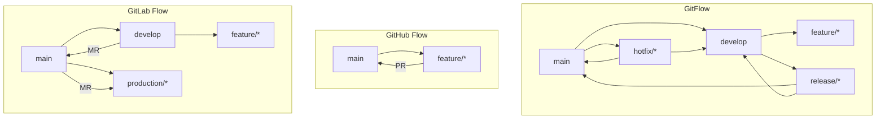
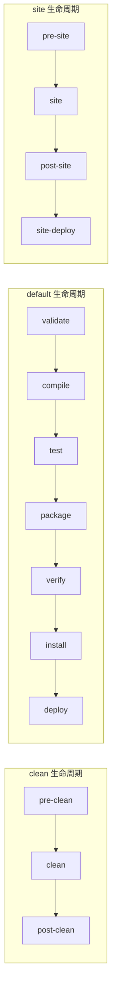
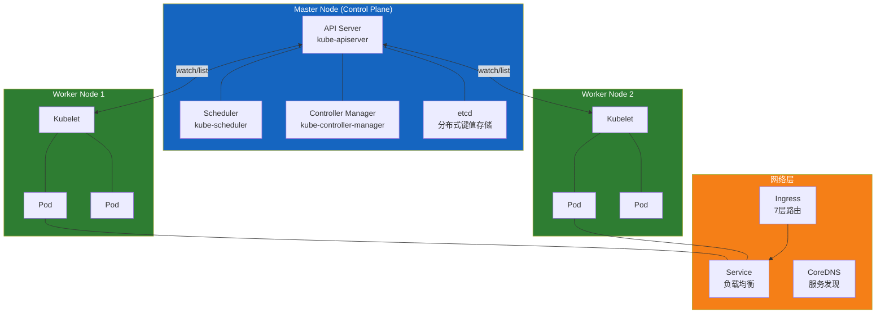
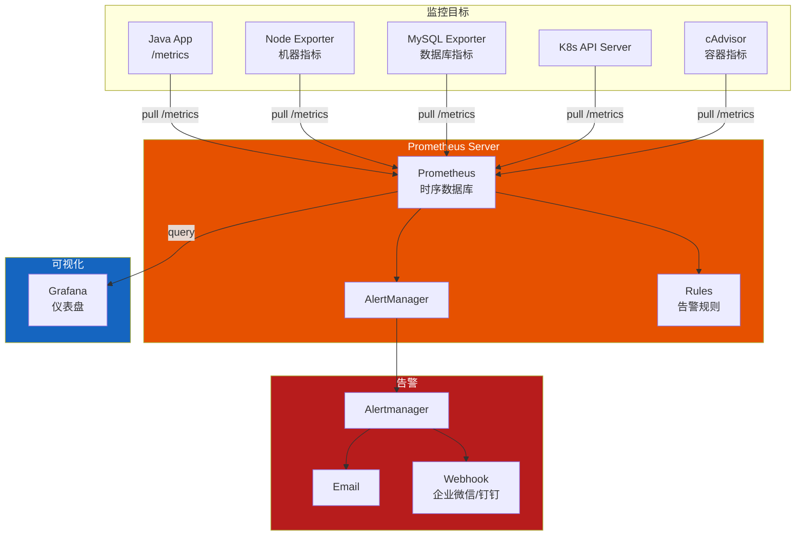
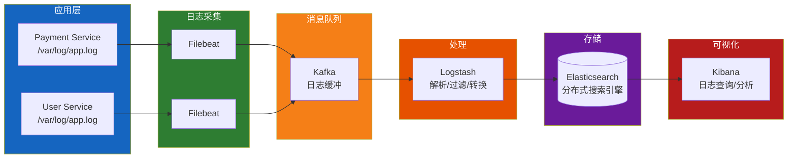
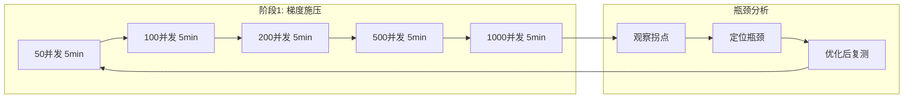

# DevOps 与工程工具

---

## 目录

1. [版本控制 Git](#1-版本控制-git)
2. [构建工具 Maven/Gradle](#2-构建工具-mavengradle)
3. [CI/CD](#3-cicd)
4. [Docker 容器化](#4-docker-容器化)
5. [Kubernetes](#5-kubernetes)
6. [监控体系](#6-监控体系)
7. [压测 JMeter](#7-压测-jmeter)

---

## 1. 版本控制 Git

### 1.1 Git 工作流对比



| 特性 | GitFlow | GitHub Flow | GitLab Flow |
|------|---------|-------------|-------------|
| 复杂度 | 高 | 低 | 中 |
| 分支数量 | 多（5+） | 少（2） | 中（3-4） |
| 适合场景 | 大型项目/版本发布 | 持续部署/Web 应用 | 企业级 CI/CD |
| 发布管理 | 专用 release 分支 | 直接 tag | 环境分支 |

### 1.2 分支管理策略

```
main        ──●────────────●─────────●──
                \          /         /
develop          ●──●──●──●──●────●──
                      \    /  \   /
feature/*              ●──●    ●─●
                      /         \
release/*            ●───────────●
                    /             \
hotfix/*           ●───────────────●
```

- **main** — 生产分支，始终可部署
- **develop** — 集成分支，包含下一个版本的所有功能
- **feature/<name>** — 功能开发分支，从 develop 创建，合并回 develop
- **release/<version>** — 发布准备分支，只做 bug 修复和文档
- **hotfix/<name>** — 紧急修复分支，从 main 创建，合并到 main 和 develop

### 1.3 rebase vs merge

| 对比项 | merge | rebase |
|--------|-------|--------|
| 提交历史 | 保留完整分支拓扑 | 线性历史 |
| 冲突处理 | 一次性解决 | 每次提交都可能冲突 |
| 安全性 | 安全（不修改历史） | 危险（改写历史） |
| 适用场景 | 公共分支（main/develop） | 私有分支（feature） |

```bash
# merge：保留分支结构
git checkout main
git merge feature/login
# 产生 merge commit (●)

# rebase：线性历史
git checkout feature/login
git rebase main
# 重新应用提交，历史为线性
```

### 1.4 Cherry-pick / Stash / Reset / Revert

```bash
# ---- Cherry-pick：挑选特定提交到当前分支 ----
git cherry-pick <commit-hash>
git cherry-pick <hash-a>..<hash-b>   # 范围挑选

# ---- Stash：暂存工作区 ----
git stash                            # 暂存当前修改
git stash list                       # 查看暂存列表
git stash pop                        # 恢复并删除
git stash apply stash@{1}            # 恢复指定暂存
git stash drop stash@{0}             # 删除指定暂存

# ---- Reset：重置（危险操作） ----
git reset --soft HEAD~1              # 撤销 commit，保留工作区和暂存区
git reset --mixed HEAD~1             # 撤销 commit 和暂存区，保留工作区（默认）
git reset --hard HEAD~1              # 完全撤销（无法恢复）

# ---- Revert：安全撤销（推荐公共分支使用） ----
git revert <commit-hash>             # 创建反向提交来撤销
git revert HEAD                      # 撤销上一次提交
git revert --no-commit HEAD~3..HEAD  # 批量撤销但不自动提交
```

---

## 2. 构建工具 Maven/Gradle

### 2.1 Maven POM 结构

```xml
<?xml version="1.0" encoding="UTF-8"?>
<project xmlns="http://maven.apache.org/POM/4.0.0"
         xmlns:xsi="http://www.w3.org/2001/XMLSchema-instance"
         xsi:schemaLocation="http://maven.apache.org/POM/4.0.0
         http://maven.apache.org/xsd/maven-4.0.0.xsd">
    <modelVersion>4.0.0</modelVersion>

    <!-- 坐标 -->
    <groupId>com.example</groupId>
    <artifactId>payment-service</artifactId>
    <version>1.0.0-SNAPSHOT</version>
    <packaging>jar</packaging>

    <!-- 父工程 -->
    <parent>
        <groupId>org.springframework.boot</groupId>
        <artifactId>spring-boot-starter-parent</artifactId>
        <version>3.2.0</version>
    </parent>

    <!-- 属性 -->
    <properties>
        <java.version>21</java.version>
        <project.build.sourceEncoding>UTF-8</project.build.sourceEncoding>
    </properties>

    <!-- 依赖 -->
    <dependencies>
        <dependency>
            <groupId>org.springframework.boot</groupId>
            <artifactId>spring-boot-starter-web</artifactId>
        </dependency>
        <dependency>
            <groupId>org.projectlombok</groupId>
            <artifactId>lombok</artifactId>
            <optional>true</optional>
        </dependency>
    </dependencies>

    <!-- 构建插件 -->
    <build>
        <plugins>
            <plugin>
                <groupId>org.springframework.boot</groupId>
                <artifactId>spring-boot-maven-plugin</artifactId>
            </plugin>
        </plugins>
    </build>
</project>
```

### 2.2 依赖传递与冲突解决

```xml
<!-- 依赖传递：A → B → C，A 自动引入 C -->

<!-- 方式一：排除传递依赖 -->
<dependency>
    <groupId>com.example</groupId>
    <artifactId>lib-a</artifactId>
    <exclusions>
        <exclusion>
            <groupId>com.example</groupId>
            <artifactId>lib-c</artifactId>
        </exclusion>
    </exclusions>
</dependency>

<!-- 方式二：第一声明策略（Maven） -->
<!-- 在 dependencyManagement 中先声明的版本获胜 -->
<dependencyManagement>
    <dependencies>
        <dependency>
            <groupId>com.example</groupId>
            <artifactId>lib-c</artifactId>
            <version>2.0.0</version>
        </dependency>
    </dependencies>
</dependencyManagement>

<!-- 方式三：最近路径策略（Gradle） -->
<!-- 依赖树中距离根最近的版本获胜 -->
```

```bash
# 查看依赖树
mvn dependency:tree

# 分析未使用/未声明的依赖
mvn dependency:analyze

# 排除冲突
mvn dependency:tree -Dincludes=com.example
```

### 2.3 Maven 生命周期



| 阶段 | 说明 | 命令 |
|------|------|------|
| `validate` | 验证项目正确性 | `mvn validate` |
| `compile` | 编译源码 | `mvn compile` |
| `test` | 运行单元测试 | `mvn test` |
| `package` | 打包（jar/war） | `mvn package` |
| `verify` | 集成测试验证 | `mvn verify` |
| `install` | 安装到本地仓库 | `mvn install` |
| `deploy` | 部署到远程仓库 | `mvn deploy` |

### 2.4 Gradle 基础

```groovy
// build.gradle (Groovy DSL)

plugins {
    id 'java'
    id 'org.springframework.boot' version '3.2.0'
    id 'io.spring.dependency-management' version '1.1.4'
}

group = 'com.example'
version = '1.0.0-SNAPSHOT'
sourceCompatibility = '21'

repositories {
    mavenCentral()
    maven { url 'https://repo.example.com/repository/maven-public/' }
}

dependencies {
    implementation 'org.springframework.boot:spring-boot-starter-web'
    implementation 'org.springframework.boot:spring-boot-starter-data-jpa'
    compileOnly 'org.projectlombok:lombok'
    annotationProcessor 'org.projectlombok:lombok'
    runtimeOnly 'com.h2database:h2'
    testImplementation 'org.springframework.boot:spring-boot-starter-test'
}

// 自定义 Task
tasks.register('hello') {
    doLast {
        println "Hello, Gradle!"
    }
}

tasks.register('copyJar', Copy) {
    from layout.buildDirectory.dir("libs")
    into layout.projectDirectory.dir("dist")
    include "*.jar"
}

// 多项目配置
subprojects {
    apply plugin: 'java'
    repositories {
        mavenCentral()
    }
}
```

### 2.5 Maven vs Gradle 对比

| 对比项 | Maven | Gradle |
|--------|-------|--------|
| **配置语言** | XML（声明式） | Groovy / Kotlin DSL |
| **构建速度** | 慢（无增量编译） | 快（增量编译+构建缓存） |
| **依赖管理** | 第一声明策略 | 最近路径策略 + 强制版本 |
| **生命周期** | 固定三阶段 | 灵活 DAG 任务图 |
| **多项目** | 模块继承 | 更灵活的配置注入 |
| **约定优于配置** | 严格 | 灵活 |
| **性能** | 单线程任务 | 并行执行 |
| **配置文件** | pom.xml (平均 3x 行数) | build.gradle (更简洁) |
| **插件生态** | 成熟稳定 | 丰富 |
| **主流使用** | 传统 Java 项目 | Android/Spring Boot/新项目 |

### 2.6 Nexus 私服配置

```xml
<!-- Maven settings.xml -->

<settings>
    <!-- 镜像配置：所有请求都走私服 -->
    <mirrors>
        <mirror>
            <id>nexus</id>
            <mirrorOf>*</mirrorOf>
            <name>Nexus Repository</name>
            <url>https://nexus.example.com/repository/maven-public/</url>
        </mirror>
    </mirrors>

    <!-- 认证配置 -->
    <servers>
        <server>
            <id>nexus-releases</id>
            <username>deployer</username>
            <password>${env.NEXUS_PASSWORD}</password>
        </server>
        <server>
            <id>nexus-snapshots</id>
            <username>deployer</username>
            <password>${env.NEXUS_PASSWORD}</password>
        </server>
    </servers>

    <!-- 发布配置（在项目的 pom.xml 中使用） -->
    <profiles>
        <profile>
            <id>nexus-deploy</id>
            <distributionManagement>
                <repository>
                    <id>nexus-releases</id>
                    <url>https://nexus.example.com/repository/maven-releases/</url>
                </repository>
                <snapshotRepository>
                    <id>nexus-snapshots</id>
                    <url>https://nexus.example.com/repository/maven-snapshots/</url>
                </snapshotRepository>
            </distributionManagement>
        </profile>
    </profiles>
</settings>
```

---

## 3. CI/CD

### 3.1 CI/CD 整体流程


### 3.2 Jenkins Pipeline

```groovy
// Jenkinsfile — 声明式 Pipeline

pipeline {
    agent any

    parameters {
        string(name: 'BRANCH', defaultValue: 'develop', description: '分支名称')
        choice(name: 'ENV', choices: ['dev', 'staging', 'prod'], description: '部署环境')
    }

    environment {
        DOCKER_REGISTRY = 'registry.example.com'
        APP_NAME = 'payment-service'
    }

    stages {
        stage('Checkout') {
            steps {
                checkout scm
            }
        }

        stage('Build') {
            steps {
                sh 'mvn clean compile -DskipTests'
            }
        }

        stage('Test') {
            parallel {
                stage('Unit Test') {
                    steps {
                        sh 'mvn test'
                    }
                    post {
                        success {
                            junit '**/target/surefire-reports/*.xml'
                        }
                    }
                }
                stage('Code Scan') {
                    steps {
                        sh 'mvn sonar:sonar -Dsonar.host.url=https://sonar.example.com'
                    }
                }
            }
        }

        stage('Package') {
            steps {
                sh 'mvn package -DskipTests'
            }
        }

        stage('Docker Build & Push') {
            steps {
                script {
                    docker.build("${DOCKER_REGISTRY}/${APP_NAME}:${BUILD_NUMBER}")
                    docker.withRegistry("https://${DOCKER_REGISTRY}", 'docker-credentials') {
                        docker.image("${DOCKER_REGISTRY}/${APP_NAME}:${BUILD_NUMBER}").push()
                        docker.image("${DOCKER_REGISTRY}/${APP_NAME}:${BUILD_NUMBER}").push('latest')
                    }
                }
            }
        }

        stage('Deploy') {
            steps {
                sh """
                    kubectl set image deployment/${APP_NAME} \
                        ${APP_NAME}=${DOCKER_REGISTRY}/${APP_NAME}:${BUILD_NUMBER} \
                        -n ${ENV}
                """
            }
        }
    }

    post {
        success {
            emailext(
                subject: "[SUCCESS] ${APP_NAME} #${BUILD_NUMBER}",
                body: "部署完成，环境：${params.ENV}",
                to: 'team@example.com'
            )
        }
        failure {
            emailext(
                subject: "[FAILED] ${APP_NAME} #${BUILD_NUMBER}",
                body: "构建失败，请检查 Jenkins 日志。",
                to: 'team@example.com'
            )
        }
    }
}
```

### 3.3 GitLab CI

```yaml
# .gitlab-ci.yml

stages:
  - build
  - test
  - package
  - deploy

variables:
  MAVEN_OPTS: "-Dmaven.repo.local=$CI_PROJECT_DIR/.m2/repository"
  DOCKER_DRIVER: overlay2

cache:
  paths:
    - .m2/repository/
    - target/

# 构建
build-job:
  stage: build
  image: maven:3.9-eclipse-temurin-21
  script:
    - mvn compile -DskipTests
  only:
    - main
    - develop
    - /^feature\/.*$/

# 测试（并行）
test-job:
  stage: test
  image: maven:3.9-eclipse-temurin-21
  script:
    - mvn test
    - mvn sonar:sonar -Dsonar.host.url=$SONAR_URL
  artifacts:
    reports:
      junit: target/surefire-reports/TEST-*.xml
    paths:
      - target/*.jar
      - Dockerfile

# 打包 & 镜像构建
package-job:
  stage: package
  image: docker:24
  services:
    - docker:24-dind
  script:
    - docker build -t $CI_REGISTRY_IMAGE:$CI_COMMIT_SHORT_SHA .
    - docker tag $CI_REGISTRY_IMAGE:$CI_COMMIT_SHORT_SHA $CI_REGISTRY_IMAGE:latest
    - docker push $CI_REGISTRY_IMAGE:$CI_COMMIT_SHORT_SHA
    - docker push $CI_REGISTRY_IMAGE:latest
  only:
    - main

# 部署
deploy-dev:
  stage: deploy
  image: bitnami/kubectl:latest
  script:
    - kubectl set image deployment/$CI_PROJECT_NAME app=$CI_REGISTRY_IMAGE:$CI_COMMIT_SHORT_SHA -n dev
  environment:
    name: dev
  only:
    - develop

deploy-prod:
  stage: deploy
  image: bitnami/kubectl:latest
  script:
    - kubectl set image deployment/$CI_PROJECT_NAME app=$CI_REGISTRY_IMAGE:$CI_COMMIT_SHORT_SHA -n prod
  environment:
    name: production
  when: manual
  only:
    - main
```

### 3.4 GitHub Actions

```yaml
# .github/workflows/ci-cd.yml

name: CI/CD Pipeline

on:
  push:
    branches: [main, develop]
  pull_request:
    branches: [main]
  workflow_dispatch:
    inputs:
      environment:
        description: 'Deploy environment'
        required: true
        default: 'dev'
        type: choice
        options:
          - dev
          - staging
          - prod

env:
  REGISTRY: ghcr.io
  IMAGE_NAME: ${{ github.repository }}

jobs:
  build:
    runs-on: ubuntu-latest
    steps:
      - uses: actions/checkout@v4

      - name: Set up JDK 21
        uses: actions/setup-java@v4
        with:
          java-version: '21'
          distribution: 'temurin'
          cache: maven

      - name: Build and Test
        run: |
          mvn clean verify
          mvn sonar:sonar \
            -Dsonar.host.url=${{ secrets.SONAR_URL }} \
            -Dsonar.login=${{ secrets.SONAR_TOKEN }}

      - name: Upload artifacts
        uses: actions/upload-artifact@v4
        with:
          name: jar
          path: target/*.jar

  docker:
    needs: build
    runs-on: ubuntu-latest
    if: github.ref == 'refs/heads/main'
    steps:
      - uses: actions/checkout@v4

      - name: Log in to Container Registry
        uses: docker/login-action@v3
        with:
          registry: ${{ env.REGISTRY }}
          username: ${{ github.actor }}
          password: ${{ secrets.GITHUB_TOKEN }}

      - name: Build and Push Docker Image
        uses: docker/build-push-action@v5
        with:
          context: .
          push: true
          tags: |
            ${{ env.REGISTRY }}/${{ env.IMAGE_NAME }}:${{ github.sha }}
            ${{ env.REGISTRY }}/${{ env.IMAGE_NAME }}:latest
          cache-from: type=gha
          cache-to: type=gha,mode=max

  deploy:
    needs: docker
    runs-on: ubuntu-latest
    environment: ${{ github.event.inputs.environment || 'dev' }}
    steps:
      - name: Deploy to Kubernetes
        run: |
          kubectl set image deployment/payment-service \
            app=${{ env.REGISTRY }}/${{ env.IMAGE_NAME }}:${{ github.sha }} \
            -n ${{ github.event.inputs.environment || 'dev' }} \
            --record
```

---

## 4. Docker 容器化

### 4.1 Dockerfile 编写最佳实践

```dockerfile
# ===== 多阶段构建 =====

# 第一阶段：编译
FROM maven:3.9-eclipse-temurin-21 AS builder
WORKDIR /app
COPY pom.xml .
RUN mvn dependency:go-offline -B
COPY src ./src
RUN mvn package -DskipTests -B

# 第二阶段：运行
FROM eclipse-temurin:21-jre-alpine AS runtime
LABEL maintainer="devops@example.com"

# 安全实践：不使用 root 运行
RUN addgroup -S appgroup && adduser -S appuser -G appgroup

WORKDIR /app
COPY --from=builder /app/target/*.jar app.jar

# 健康检查
HEALTHCHECK --interval=30s --timeout=5s --start-period=30s --retries=3 \
    CMD wget --no-verbose --tries=1 --spider http://localhost:8080/actuator/health || exit 1

# JVM 优化
ENV JVM_OPTS="-XX:+UseContainerSupport \
              -XX:MaxRAMPercentage=75.0 \
              -XX:+PrintGCDetails \
              -Xloggc:/logs/gc.log"

EXPOSE 8080

USER appuser

# 分层优化：entrypoint 脚本
COPY --chmod=755 docker-entrypoint.sh /usr/local/bin/
ENTRYPOINT ["docker-entrypoint.sh"]
CMD ["java", "-jar", "app.jar"]
```

```bash
#!/bin/sh
# docker-entrypoint.sh
set -e

if [ "$1" = 'java' ]; then
    exec java $JVM_OPTS -jar /app/app.jar
fi

exec "$@"
```

```yaml
# .dockerignore
**/target/
**/.git/
**/node_modules/
**/*.log
**/*.md
**/.classpath
**/.project
**/.settings/
**/.idea/
```

### 4.2 Docker Compose

```yaml
# docker-compose.yml

version: '3.8'

services:
  # Java 应用
  payment-service:
    build:
      context: .
      dockerfile: Dockerfile
    image: payment-service:latest
    container_name: payment-service
    ports:
      - "8080:8080"
    environment:
      SPRING_PROFILES_ACTIVE: dev
      DB_HOST: mysql
      REDIS_HOST: redis
      NACOS_ADDR: nacos:8848
    volumes:
      - logs:/app/logs
    depends_on:
      mysql:
        condition: service_healthy
      redis:
        condition: service_started
      nacos:
        condition: service_started
    networks:
      - backend
    restart: unless-stopped
    deploy:
      resources:
        limits:
          cpus: '2'
          memory: 2G
        reservations:
          cpus: '0.5'
          memory: 512M
    healthcheck:
      test: ["CMD", "curl", "-f", "http://localhost:8080/actuator/health"]
      interval: 30s
      timeout: 5s
      retries: 3

  # MySQL
  mysql:
    image: mysql:8.0
    container_name: mysql
    environment:
      MYSQL_ROOT_PASSWORD: ${DB_PASSWORD:-root123}
      MYSQL_DATABASE: payment_db
    ports:
      - "3306:3306"
    volumes:
      - mysql-data:/var/lib/mysql
      - ./init.sql:/docker-entrypoint-initdb.d/init.sql
    networks:
      - backend
    healthcheck:
      test: ["CMD", "mysqladmin", "ping", "-h", "localhost"]
      interval: 10s
      timeout: 5s
      retries: 5

  # Redis
  redis:
    image: redis:7-alpine
    container_name: redis
    ports:
      - "6379:6379"
    volumes:
      - redis-data:/data
    networks:
      - backend
    command: redis-server --appendonly yes --requirepass ${REDIS_PASSWORD:-redis123}

  # Nacos
  nacos:
    image: nacos/nacos-server:v2.2.3
    container_name: nacos
    environment:
      MODE: standalone
      MYSQL_SERVICE_HOST: mysql
      MYSQL_SERVICE_DB_NAME: nacos_config
      MYSQL_SERVICE_USER: root
      MYSQL_SERVICE_PASSWORD: ${DB_PASSWORD:-root123}
    ports:
      - "8848:8848"
    depends_on:
      mysql:
        condition: service_healthy
    networks:
      - backend

volumes:
  mysql-data:
    driver: local
  redis-data:
    driver: local
  logs:
    driver: local

networks:
  backend:
    driver: bridge
```

### 4.3 镜像仓库

```bash
# ===== Harbor 操作 =====

# 登录 Harbor
docker login harbor.example.com -u admin -p ${HARBOR_PASSWORD}

# 打标签
docker tag payment-service:latest harbor.example.com/library/payment-service:v1.0.0

# 推送镜像
docker push harbor.example.com/library/payment-service:v1.0.0

# 拉取镜像
docker pull harbor.example.com/library/payment-service:v1.0.0

# ===== Docker Hub 操作 =====
docker login -u myusername
docker tag payment-service:latest myusername/payment-service:v1.0.0
docker push myusername/payment-service:v1.0.0
```

### 4.4 常用命令速查表

| 命令 | 说明 |
|------|------|
| `docker ps` | 列出运行中的容器 |
| `docker ps -a` | 列出所有容器 |
| `docker images` | 列出镜像 |
| `docker build -t name:tag .` | 构建镜像 |
| `docker run -d -p 8080:8080 --name app img` | 运行容器 |
| `docker exec -it container_id sh` | 进入容器 |
| `docker logs -f container_id` | 查看日志 |
| `docker stop/start/restart container_id` | 停止/启动/重启 |
| `docker rm container_id` | 删除容器 |
| `docker rmi image_id` | 删除镜像 |
| `docker inspect container_id` | 查看容器详情 |
| `docker stats` | 查看资源使用 |
| `docker network ls` | 查看网络 |
| `docker volume ls` | 查看卷 |
| `docker system prune -a` | 清理未使用的资源 |
| `docker compose up -d` | 启动 Compose 服务 |
| `docker compose down` | 停止 Compose 服务 |
| `docker compose logs -f` | 查看 Compose 日志 |

---

## 5. Kubernetes

### 5.1 K8s 核心概念与 YAML 示例

#### Pod

```yaml
apiVersion: v1
kind: Pod
metadata:
  name: payment-service-pod
  labels:
    app: payment-service
    version: v1
spec:
  containers:
    - name: payment-service
      image: registry.example.com/payment-service:1.0.0
      ports:
        - containerPort: 8080
          name: http
      resources:
        requests:
          cpu: 500m
          memory: 512Mi
        limits:
          cpu: 1000m
          memory: 1Gi
      livenessProbe:
        httpGet:
          path: /actuator/health/liveness
          port: 8080
        initialDelaySeconds: 30
        periodSeconds: 10
      readinessProbe:
        httpGet:
          path: /actuator/health/readiness
          port: 8080
        initialDelaySeconds: 20
        periodSeconds: 5
      env:
        - name: SPRING_PROFILES_ACTIVE
          value: "prod"
        - name: DB_PASSWORD
          valueFrom:
            secretKeyRef:
              name: db-secret
              key: password
```

#### Deployment

```yaml
apiVersion: apps/v1
kind: Deployment
metadata:
  name: payment-service
  namespace: prod
  labels:
    app: payment-service
spec:
  replicas: 3
  strategy:
    type: RollingUpdate
    rollingUpdate:
      maxSurge: 1
      maxUnavailable: 0
  selector:
    matchLabels:
      app: payment-service
  template:
    metadata:
      labels:
        app: payment-service
    spec:
      imagePullSecrets:
        - name: harbor-secret
      containers:
        - name: payment-service
          image: registry.example.com/payment-service:1.0.0
          ports:
            - containerPort: 8080
          envFrom:
            - configMapRef:
                name: payment-config
          resources:
            requests:
              cpu: 500m
              memory: 512Mi
            limits:
              cpu: 2
              memory: 2Gi
```

#### Service

```yaml
apiVersion: v1
kind: Service
metadata:
  name: payment-service
  namespace: prod
spec:
  type: ClusterIP
  ports:
    - port: 80
      targetPort: 8080
      name: http
  selector:
    app: payment-service
```

#### ConfigMap & Secret

```yaml
# ConfigMap
apiVersion: v1
kind: ConfigMap
metadata:
  name: payment-config
  namespace: prod
data:
  application.yml: |
    server:
      port: 8080
    spring:
      datasource:
        url: jdbc:mysql://mysql-service:3306/payment_db
        username: payment_user
    logging:
      level:
        com.example: DEBUG
---
# Secret
apiVersion: v1
kind: Secret
metadata:
  name: db-secret
  namespace: prod
type: Opaque
data:
  password: cGFzc3dvcmQxMjM=     # echo -n "password123" | base64
  username: cGF5bWVudF91c2Vy
```

#### Ingress

```yaml
apiVersion: networking.k8s.io/v1
kind: Ingress
metadata:
  name: payment-ingress
  namespace: prod
  annotations:
    nginx.ingress.kubernetes.io/rewrite-target: /
    nginx.ingress.kubernetes.io/ssl-redirect: "true"
    cert-manager.io/cluster-issuer: "letsencrypt-prod"
spec:
  ingressClassName: nginx
  tls:
    - hosts:
        - payment.example.com
      secretName: payment-tls
  rules:
    - host: payment.example.com
      http:
        paths:
          - path: /api
            pathType: Prefix
            backend:
              service:
                name: payment-service
                port:
                  number: 80
```

### 5.2 K8s 架构



| 组件 | 职责 | 部署位置 |
|------|------|----------|
| **API Server** | 所有组件通信入口，REST API | Master |
| **Scheduler** | 为 Pod 选择最佳 Worker Node | Master |
| **Controller Manager** | 管理控制器（Deployment/ReplicaSet 等） | Master |
| **etcd** | 集群状态存储（键值数据库） | Master |
| **Kubelet** | 管理 Pod 生命周期 | Worker |
| **Kube-proxy** | 网络代理、负载均衡 | Worker |
| **CoreDNS** | 集群 DNS 服务发现 | Worker |

### 5.3 弹性伸缩 HPA

```yaml
apiVersion: autoscaling/v2
kind: HorizontalPodAutoscaler
metadata:
  name: payment-service-hpa
  namespace: prod
spec:
  scaleTargetRef:
    apiVersion: apps/v1
    kind: Deployment
    name: payment-service
  minReplicas: 2
  maxReplicas: 10
  metrics:
    - type: Resource
      resource:
        name: cpu
        target:
          type: Utilization
          averageUtilization: 70
    - type: Resource
      resource:
        name: memory
        target:
          type: Utilization
          averageUtilization: 80
    - type: Pods
      pods:
        metric:
          name: http_requests_per_second
        target:
          type: AverageValue
          averageValue: 1000
  behavior:
    scaleDown:
      stabilizationWindowSeconds: 300
      policies:
        - type: Percent
          value: 10
          periodSeconds: 60
    scaleUp:
      stabilizationWindowSeconds: 0
      policies:
        - type: Percent
          value: 100
          periodSeconds: 15
```

### 5.4 Helm Chart 包管理

```
payment-service/
├── Chart.yaml                  # Chart 元信息
├── values.yaml                 # 默认配置值
├── values-prod.yaml            # 生产环境覆盖
├── values-dev.yaml             # 开发环境覆盖
├── charts/                     # 子 Chart 依赖
├── templates/
│   ├── _helpers.tpl            # 模板辅助函数
│   ├── deployment.yaml         # Deployment 模板
│   ├── service.yaml            # Service 模板
│   ├── ingress.yaml            # Ingress 模板
│   ├── configmap.yaml          # ConfigMap 模板
│   ├── secret.yaml             # Secret 模板
│   ├── hpa.yaml                # HPA 模板
│   └── tests/
│       └── test-connection.yaml
└── .helmignore
```

```yaml
# Chart.yaml
apiVersion: v2
name: payment-service
description: A Helm chart for Kubernetes deployment
type: application
version: 1.0.0
appVersion: "1.0.0"
dependencies:
  - name: mysql
    version: "~9.0"
    repository: "https://charts.bitnami.com/bitnami"
    condition: mysql.enabled
```

```yaml
# values.yaml
replicaCount: 2

image:
  repository: registry.example.com/payment-service
  tag: latest
  pullPolicy: Always

service:
  type: ClusterIP
  port: 80
  targetPort: 8080

ingress:
  enabled: true
  host: payment.example.com
  tls: true

resources:
  limits:
    cpu: 2
    memory: 2Gi
  requests:
    cpu: 500m
    memory: 512Mi

autoscaling:
  enabled: true
  minReplicas: 2
  maxReplicas: 10
  targetCPUUtilizationPercentage: 70

config:
  spring.profiles.active: prod
  db.url: jdbc:mysql://mysql-service:3306/payment_db
```

```yaml
# templates/deployment.yaml
apiVersion: apps/v1
kind: Deployment
metadata:
  name: {{ include "payment-service.fullname" . }}
  labels:
    {{- include "payment-service.labels" . | nindent 4 }}
spec:
  replicas: {{ .Values.replicaCount }}
  selector:
    matchLabels:
      {{- include "payment-service.selectorLabels" . | nindent 6 }}
  template:
    metadata:
      labels:
        {{- include "payment-service.selectorLabels" . | nindent 8 }}
    spec:
      containers:
        - name: {{ .Chart.Name }}
          image: "{{ .Values.image.repository }}:{{ .Values.image.tag }}"
          imagePullPolicy: {{ .Values.image.pullPolicy }}
          ports:
            - containerPort: 8080
          env:
            - name: SPRING_PROFILES_ACTIVE
              value: {{ .Values.config.spring.profiles.active }}
          resources:
            {{- toYaml .Values.resources | nindent 12 }}
```

```bash
# Helm 常用命令
helm repo add bitnami https://charts.bitnami.com/bitnami
helm repo update

# 安装 Chart
helm install payment-service ./payment-service --values values-dev.yaml -n dev

# 升级
helm upgrade payment-service ./payment-service --values values-prod.yaml -n prod

# 回滚
helm rollback payment-service 1 -n prod

# 查看历史
helm history payment-service -n prod

# 卸载
helm uninstall payment-service -n dev

# 打包
helm package ./payment-service
```

### 5.5 K8s 部署 Java 应用完整示例

```yaml
# 1. Namespace
apiVersion: v1
kind: Namespace
metadata:
  name: payment-system
---
# 2. ConfigMap
apiVersion: v1
kind: ConfigMap
metadata:
  name: app-config
  namespace: payment-system
data:
  application.yml: |
    server:
      port: 8080
    spring:
      datasource:
        url: jdbc:mysql://mysql-svc:3306/payment_db?useSSL=false
        username: payment_user
        hikari:
          maximum-pool-size: 20
      redis:
        host: redis-svc
        port: 6379
    management:
      endpoints:
        web:
          exposure:
            include: health,metrics,prometheus
---
# 3. Secret
apiVersion: v1
kind: Secret
metadata:
  name: app-secret
  namespace: payment-system
type: Opaque
data:
  db-password: cGFzc3dvcmQxMjM=
  redis-password: cmVkaXMxMjM=
---
# 4. PersistentVolumeClaim (MySQL)
apiVersion: v1
kind: PersistentVolumeClaim
metadata:
  name: mysql-pvc
  namespace: payment-system
spec:
  accessModes:
    - ReadWriteOnce
  resources:
    requests:
      storage: 20Gi
  storageClassName: ssd
---
# 5. Deployment (Java 应用)
apiVersion: apps/v1
kind: Deployment
metadata:
  name: payment-service
  namespace: payment-system
spec:
  replicas: 3
  strategy:
    type: RollingUpdate
    rollingUpdate:
      maxUnavailable: 0
      maxSurge: 1
  selector:
    matchLabels:
      app: payment-service
  template:
    metadata:
      labels:
        app: payment-service
      annotations:
        prometheus.io/scrape: "true"
        prometheus.io/port: "8080"
    spec:
      terminationGracePeriodSeconds: 60
      containers:
        - name: payment-service
          image: registry.example.com/payment-service:1.0.0
          ports:
            - containerPort: 8080
            - containerPort: 8778  # Jolokia
          envFrom:
            - configMapRef:
                name: app-config
          env:
            - name: DB_PASSWORD
              valueFrom:
                secretKeyRef:
                  name: app-secret
                  key: db-password
            - name: REDIS_PASSWORD
              valueFrom:
                secretKeyRef:
                  name: app-secret
                  key: redis-password
            - name: JAVA_OPTS
              value: "-Xms512m -Xmx1g -XX:+UseContainerSupport -XX:MaxRAMPercentage=75.0"
          livenessProbe:
            httpGet:
              path: /actuator/health/liveness
              port: 8080
            initialDelaySeconds: 60
            periodSeconds: 15
          readinessProbe:
            httpGet:
              path: /actuator/health/readiness
              port: 8080
            initialDelaySeconds: 30
            periodSeconds: 10
          resources:
            requests:
              cpu: 500m
              memory: 512Mi
            limits:
              cpu: 2
              memory: 2Gi
---
# 6. Service
apiVersion: v1
kind: Service
metadata:
  name: payment-svc
  namespace: payment-system
spec:
  type: ClusterIP
  ports:
    - port: 80
      targetPort: 8080
      name: http
  selector:
    app: payment-service
---
# 7. HPA
apiVersion: autoscaling/v2
kind: HorizontalPodAutoscaler
metadata:
  name: payment-service-hpa
  namespace: payment-system
spec:
  scaleTargetRef:
    apiVersion: apps/v1
    kind: Deployment
    name: payment-service
  minReplicas: 2
  maxReplicas: 10
  metrics:
    - type: Resource
      resource:
        name: cpu
        target:
          type: Utilization
          averageUtilization: 70
---
# 8. Ingress
apiVersion: networking.k8s.io/v1
kind: Ingress
metadata:
  name: payment-ingress
  namespace: payment-system
  annotations:
    kubernetes.io/ingress.class: nginx
spec:
  rules:
    - host: payment.example.com
      http:
        paths:
          - path: /
            pathType: Prefix
            backend:
              service:
                name: payment-svc
                port:
                  number: 80
```

---

## 6. 监控体系

### 6.1 Prometheus 架构



```yaml
# prometheus.yml
global:
  scrape_interval: 15s
  evaluation_interval: 15s

rule_files:
  - "alert-rules.yml"

scrape_configs:
  - job_name: 'kubernetes-pods'
    kubernetes_sd_configs:
      - role: pod
    relabel_configs:
      - source_labels: [__meta_kubernetes_pod_annotation_prometheus_io_scrape]
        action: keep
        regex: true
      - source_labels: [__address__, __meta_kubernetes_pod_annotation_prometheus_io_port]
        action: replace
        regex: ([^:]+)(?::\d+)?;(\d+)
        replacement: $1:$2
        target_label: __address__

  - job_name: 'node-exporter'
    static_configs:
      - targets:
          - '10.0.1.10:9100'
          - '10.0.1.11:9100'

  - job_name: 'mysql-exporter'
    static_configs:
      - targets: ['mysql-exporter:9104']
```

```yaml
# alert-rules.yml
groups:
  - name: payment-service
    rules:
      - alert: HighErrorRate
        expr: rate(http_requests_total{status=~"5.."}[5m]) > 0.05
        for: 3m
        labels:
          severity: critical
        annotations:
          summary: "服务错误率过高"
          description: "最近5分钟错误率超过5%，当前值：{{ $value | humanizePercentage }}"

      - alert: InstanceDown
        expr: up == 0
        for: 1m
        labels:
          severity: critical
        annotations:
          summary: "实例 {{ $labels.instance }} 宕机"
          description: "{{ $labels.job }} 的实例 {{ $labels.instance }} 已停止运行"

      - alert: HighMemoryUsage
        expr: (container_memory_usage_bytes / container_spec_memory_limit_bytes) > 0.9
        for: 5m
        labels:
          severity: warning
        annotations:
          summary: "内存使用率超过90%"
          description: "Pod {{ $labels.pod }} 内存使用率超过90%"
```

### 6.2 Grafana 仪表盘配置

```json
{
  "dashboard": {
    "title": "Payment Service Dashboard",
    "tags": ["java", "spring-boot", "payment"],
    "timezone": "browser",
    "panels": [
      {
        "title": "JVM Heap Memory",
        "type": "graph",
        "targets": [
          {
            "expr": "jvm_memory_used_bytes{area=\"heap\"} / 1048576",
            "legendFormat": "Heap Used (MB)"
          },
          {
            "expr": "jvm_memory_max_bytes{area=\"heap\"} / 1048576",
            "legendFormat": "Heap Max (MB)"
          }
        ]
      },
      {
        "title": "HTTP Requests / Sec",
        "type": "graph",
        "targets": [
          {
            "expr": "rate(http_server_requests_seconds_count[1m])",
            "legendFormat": "{{method}} {{uri}}"
          }
        ]
      },
      {
        "title": "Error Rate",
        "type": "graph",
        "targets": [
          {
            "expr": "rate(http_server_requests_seconds_count{status=~\"5..\"}[1m]) / rate(http_server_requests_seconds_count[1m])",
            "legendFormat": "5xx Rate"
          }
        ]
      },
      {
        "title": "Response Time (P99/P95/P50)",
        "type": "graph",
        "targets": [
          {
            "expr": "histogram_quantile(0.99, rate(http_server_requests_seconds_bucket[1m]))",
            "legendFormat": "P99"
          },
          {
            "expr": "histogram_quantile(0.95, rate(http_server_requests_seconds_bucket[1m]))",
            "legendFormat": "P95"
          },
          {
            "expr": "histogram_quantile(0.50, rate(http_server_requests_seconds_bucket[1m]))",
            "legendFormat": "P50"
          }
        ]
      },
      {
        "title": "GC Pause Time",
        "type": "graph",
        "targets": [
          {
            "expr": "rate(jvm_gc_pause_seconds_sum[1m])",
            "legendFormat": "{{cause}}"
          }
        ]
      },
      {
        "title": "Thread States",
        "type": "graph",
        "targets": [
          {
            "expr": "jvm_threads_live_threads",
            "legendFormat": "Live"
          },
          {
            "expr": "jvm_threads_daemon_threads",
            "legendFormat": "Daemon"
          }
        ]
      }
    ]
  }
}
```

### 6.3 ELK 日志收集



```yaml
# filebeat.yml
filebeat.inputs:
  - type: container
    paths:
      - /var/log/containers/*.log
    multiline:
      pattern: '^\d{4}-\d{2}-\d{2}'
      negate: true
      match: after

processors:
  - add_kubernetes_metadata:
      host: ${NODE_NAME}
      matchers:
        - logs_path:
            logs_path: "/var/log/containers/"

output.kafka:
  hosts: ["kafka:9092"]
  topic: "app-logs"
  partition.round_robin:
    reachable_only: false
  required_acks: 1
  compression: gzip
  max_message_bytes: 1000000
```

```ruby
# logstash.conf
input {
  kafka {
    bootstrap_servers => "kafka:9092"
    topics => ["app-logs"]
    codec => json
  }
}

filter {
  # 解析 JSON 日志
  if [message] =~ /^\s*\{/ {
    json { source => "message" }
  }

  # 解析 Spring Boot 日志模式
  grok {
    match => {
      "message" => [
        "%{TIMESTAMP_ISO8601:timestamp}\s+%{LOGLEVEL:level}\s+%{DATA:logger}\s+-\s+%{GREEDYDATA:log_message}",
        "%{TIMESTAMP_ISO8601:timestamp}\s+%{DATA:thread}\s+%{LOGLEVEL:level}\s+%{DATA:logger}\s+-\s+%{GREEDYDATA:log_message}"
      ]
    }
  }

  # 解析异常栈追踪
  multiline {
    pattern => "^\s+at\s"
    negate => false
    what => "previous"
  }

  mutate {
    remove_field => ["message", "original", "@version"]
  }

  date {
    match => ["timestamp", "ISO8601"]
    target => "@timestamp"
  }
}

output {
  elasticsearch {
    hosts => ["${ES_HOSTS:-elasticsearch:9200}"]
    index => "app-logs-%{+YYYY.MM.dd}"
    user => "${ES_USERNAME:-elastic}"
    password => "${ES_PASSWORD}"
    ssl => true
    ssl_certificate_verification => true
  }
}
```

### 6.4 Loki 轻量级日志方案

```yaml
# docker-compose-loki.yml

services:
  loki:
    image: grafana/loki:2.9.0
    ports:
      - "3100:3100"
    command: -config.file=/etc/loki/local-config.yaml
    volumes:
      - loki-data:/loki

  promtail:
    image: grafana/promtail:2.9.0
    volumes:
      - /var/log:/var/log
      - ./promtail-config.yml:/etc/promtail/config.yml
    command: -config.file=/etc/promtail/config.yml

  grafana:
    image: grafana/grafana:10.2.0
    ports:
      - "3000:3000"
    environment:
      GF_PATHS_PROVISIONING: /etc/grafana/provisioning
      GF_AUTH_ANONYMOUS_ENABLED: "true"
    volumes:
      - grafana-data:/var/lib/grafana

volumes:
  loki-data:
  grafana-data:
```

```yaml
# promtail-config.yml
server:
  http_listen_port: 9080
  grpc_listen_port: 0

positions:
  filename: /tmp/positions.yaml

clients:
  - url: http://loki:3100/loki/api/v1/push

scrape_configs:
  - job_name: system
    static_configs:
      - targets:
          - localhost
        labels:
          job: varlogs
          __path__: /var/log/*.log

  - job_name: containers
    pipeline_stages:
      - json:
          expressions:
            level: level
            logger: logger
      - labels:
          level:
          logger:
    docker_sd_configs:
      - host: unix:///var/run/docker.sock
        refresh_interval: 5s
    relabel_configs:
      - source_labels: ['__meta_docker_container_name']
        regex: '/(.*)'
        target_label: 'container'
```

| 对比项 | ELK (Elastic Stack) | Loki + Promtail |
|--------|---------------------|-----------------|
| 存储引擎 | Elasticsearch（全文索引） | 类 Prometheus（仅索引元数据） |
| 资源消耗 | 高（全量索引） | 低（仅索引 labels） |
| 查询语言 | Query DSL（JSON） | LogQL（类 PromQL） |
| 日志内容索引 | 全字段索引 | 不索引内容 |
| 适合场景 | 复杂搜索/分析 | Kubernetes 日志/快速检索 |
| 部署复杂度 | 高 | 低 |
| 成本 | 高（存储大） | 低（存储小） |

```logql
# LogQL 查询示例
# 查询指定服务的错误日志
{container="payment-service"} |= "ERROR"

# 查询最近5分钟的错误日志，按级别统计
rate({container="payment-service"} |= "ERROR"[5m])

# 查询特定 traceId 的请求链路日志
{container="payment-service"} |= "traceId=abc123"

# 统计 HTTP 状态码分布
sum by (status) (
  count_over_time(
    {container="payment-service"} | pattern `<ts> <level> <msg>` [1m]
  )
)
```

### 6.5 Skywalking APM

```yaml
# docker-compose-skywalking.yml
version: '3.8'
services:
  elasticsearch:
    image: elasticsearch:7.17.16
    environment:
      - discovery.type=single-node
      - "ES_JAVA_OPTS=-Xms1g -Xmx1g"
    ports:
      - "9200:9200"

  oap-server:
    image: apache/skywalking-oap-server:9.6.0
    depends_on:
      - elasticsearch
    environment:
      SW_STORAGE: elasticsearch
      SW_STORAGE_ES_CLUSTER_NODES: elasticsearch:9200
    ports:
      - "11800:11800"   # gRPC
      - "12800:12800"   # HTTP

  skywalking-ui:
    image: apache/skywalking-ui:9.6.0
    depends_on:
      - oap-server
    environment:
      SW_OAP_ADDRESS: http://oap-server:12800
    ports:
      - "8080:8080"

  # Java 应用通过 agent 接入
  payment-service:
    image: payment-service:latest
    environment:
      JAVA_TOOL_OPTIONS: >
        -javaagent:/skywalking-agent/skywalking-agent.jar
        -Dskywalking.agent.service_name=payment-service
        -Dskywalking.collector.backend_service=oap-server:11800
    volumes:
      - ./skywalking-agent:/skywalking-agent
```

```java
// Java Agent 接入 Skywalking 的启动参数
// -javaagent:/path/to/skywalking-agent.jar
// -Dskywalking.agent.service_name=payment-service
// -Dskywalking.collector.backend_service=oap-server:11800
```

Skywalking 提供的主要功能：

- **分布式追踪** — 跨服务调用链追踪
- **服务拓扑图** — 自动绘制服务依赖关系
- **性能分析** — 方法级别的耗时分析
- **告警规则** — 基于指标的告警
- **日志集成** — 关联 traceId 和日志

---

## 7. 压测 JMeter

### 7.1 压测脚本编写流程

```
1. 创建测试计划 (Test Plan)
   │
   ├── 2. 添加线程组 (Thread Group)
   │   ├── 线程数 (Number of Threads)
   │   ├── Ramp-Up Period (秒)
   │   └── 循环次数 (Loop Count)
   │
   ├── 3. 配置元件 (Config Element)
   │   ├── HTTP 请求默认值
   │   ├── CSV 数据文件配置（参数化）
   │   └── HTTP Cookie 管理器
   │
   ├── 4. 添加取样器 (Sampler)
   │   ├── HTTP 请求
   │   ├── JDBC 请求
   │   └── 调试取样器
   │
   ├── 5. 添加监听器 (Listener)
   │   ├── 聚合报告 (Aggregate Report)
   │   ├── 图形结果 (Graph Results)
   │   └── 查看结果树 (View Results Tree)
   │
   └── 6. 添加断言 (Assertion)
       ├── 响应断言 (Response Assertion)
       └── 持续时间断言 (Duration Assertion)
```

```xml
<!-- JMeter 测试计划的简化 XML 结构 -->
<?xml version="1.0" encoding="UTF-8"?>
<jmeterTestPlan version="1.2">
  <hashTree>
    <!-- 测试计划 -->
    <TestPlan guiclass="TestPlanGui" testclass="TestPlan">
      <elementProp name="TestPlan.user_defined_variables"/>
    </TestPlan>
    <hashTree>
      <!-- 线程组：100 并发，10s 内启动，循环 10 次 -->
      <ThreadGroup guiclass="ThreadGroupGui" testclass="ThreadGroup">
        <intProp name="ThreadGroup.num_threads">100</intProp>
        <intProp name="ThreadGroup.ramp_time">10</intProp>
        <intProp name="LoopController.loops">10</intProp>
      </ThreadGroup>
      <hashTree>
        <!-- HTTP 请求默认值 -->
        <ConfigTestElement guiclass="HttpDefaultsGui" testclass="HttpDefaults">
          <stringProp name="HTTPSampler.domain">api.example.com</stringProp>
          <stringProp name="HTTPSampler.port">443</stringProp>
          <stringProp name="HTTPSampler.protocol">https</stringProp>
        </ConfigTestElement>
        <hashTree/>

        <!-- HTTP 请求：POST /api/payment -->
        <HTTPSamplerProxy guiclass="HttpGui" testclass="HTTPSamplerProxy">
          <stringProp name="HTTPSampler.method">POST</stringProp>
          <stringProp name="HTTPSampler.path">/api/payment</stringProp>
          <boolProp name="HTTPSampler.postBodyRaw">true</boolProp>
          <stringProp name="HTTPSampler.query">
            {"orderId":"${__Random(100000,999999)}","amount":99.99}
          </stringProp>
        </HTTPSamplerProxy>
        <hashTree>
          <!-- 响应断言：期望 HTTP 200 -->
          <ResponseAssertion guiclass="AssertionGui" testclass="ResponseAssertion">
            <intProp name="Assertion.test_field">806856</intProp>
            <stringProp name="Assertion.test_string">200</stringProp>
          </ResponseAssertion>
          <hashTree/>
        </hashTree>
      </hashTree>
    </hashTree>
  </hashTree>
</jmeterTestPlan>
```

### 7.2 指标解读

| 指标 | 全称 | 说明 | 健康值参考 |
|------|------|------|------------|
| **QPS** | Queries Per Second | 每秒查询数 | 根据业务目标而定 |
| **TPS** | Transactions Per Second | 每秒事务数 | 同上 |
| **RT** | Response Time | 响应时间 | < 200ms (P99) |
| **Throughput** | — | 吞吐量（请求/秒） | 越高越好 |
| **Error%** | Error Percentage | 错误率 | < 0.1% |
| **CPU** | CPU Usage | CPU 使用率 | < 80% |
| **Memory** | Memory Usage | 内存使用率 | < 80% |
| **GC Pause** | GC Pause Time | GC 暂停时间 | < 50ms (Full GC) |

#### 典型压测结果分析

```
# 聚合报告示例
Label              #Samples   Avg    Min    Max    StdDev   Error%   Throughput
/api/payment       10000      125    12     589    89.2     0.00%    812.3/sec
/api/order         10000      234    45     1234   156.7    0.50%    452.1/sec
/api/refund        5000       456    89     2890   345.2    2.10%    123.4/sec
```

- `/api/payment` — P99 响应时间良好 (~300ms)，吞吐量高，无错误
- `/api/order` — 响应时间可接受，少量错误需关注
- `/api/refund` — 响应时间偏高，错误率 > 2%，需要优化

### 7.3 梯度压测与瓶颈分析

```bash
# 使用命令行执行压测（非 GUI 模式）
jmeter -n -t payment-test.jmx -l results.jtl -e -o report/

# 参数说明：
# -n: 非 GUI 模式
# -t: 测试计划文件
# -l: 输出结果文件
# -e: 生成 HTML 报告
# -o: 报告输出目录

# 远程分布式压测
jmeter -n -t payment-test.jmx -R slave1:1099,slave2:1099
```



#### 常见瓶颈及排查方向

| 瓶颈类型 | 现象 | 排查工具 | 解决方案 |
|----------|------|----------|----------|
| **CPU 瓶颈** | 高 CPU 使用率（>90%） | `top`, `htop`, `profiler` | 优化代码/增加实例 |
| **内存瓶颈** | GC 频繁/内存溢出 | `jstat`, `jmap`, `MAT` | 调优 JVM/增加内存 |
| **IO 瓶颈** | 磁盘 IO 等待高 | `iostat`, `iotop` | 使用 SSD/异步 IO |
| **网络瓶颈** | 连接超时/带宽饱和 | `netstat`, `tcpdump` | 增加带宽/CDN/连接池 |
| **数据库瓶颈** | 慢查询/连接池耗尽 | `show processlist`, `EXPLAIN` | 索引优化/读写分离/缓存 |
| **线程瓶颈** | 线程阻塞/死锁 | `jstack`, `thread dump` | 调优线程池/异步化 |

#### 从压测到定位的完整流程

```bash
# 1. 压测过程中监控系统指标
# 监控 CPU 和内存
top -H -p $(pgrep -f payment-service)

# 监控 JVM GC
jstat -gcutil $(pgrep -f payment-service) 1000

# 2. 产生线程快照（当 CPU 异常时）
for i in {1..3}; do
    jstack $(pgrep -f payment-service) > threaddump_$(date +%H%M%S).log
    sleep 3
done

# 3. 堆转储分析
jmap -dump:live,format=b,file=heap.hprof $(pgrep -f payment-service)

# 4. 数据库慢查询监控
mysql -e "SHOW FULL PROCESSLIST;" | grep -i "query"
mysql -e "SELECT * FROM performance_schema.events_statements_summary_by_digest ORDER BY SUM_TIMER_WAIT DESC LIMIT 10\G"
```

---

## 附录：常用命令速查

```bash
# ===== Git =====
git log --oneline --graph --all          # 查看分支图谱
git diff --cached                        # 查看暂存区差异
git blame <file>                         # 查看每行最后修改人

# ===== Maven =====
mvn clean install -U -DskipTests         # 强制更新快照并构建
mvn dependency:tree -Dincludes=com.*     # 查看特定依赖树
mvn help:effective-pom                   # 查看有效 POM

# ===== Docker =====
docker stats --no-stream                 # 一次性查看容器资源
docker system df                         # 查看磁盘使用
docker system prune -a --volumes         # 完整清理

# ===== Kubernetes =====
kubectl get all -n prod                  # 查看所有资源
kubectl describe pod <name>              # 查看 Pod 详情
kubectl logs -f <pod> --tail=100         # 查看最近 100 行日志
kubectl exec -it <pod> -- sh             # 进入容器
kubectl top pod -n prod                  # 查看 Pod 资源使用
kubectl port-forward svc/app 8080:80     # 端口转发

# ===== JMeter =====
jmeter -n -t plan.jmx -l result.jtl \     # 压测并生成报告
    -e -o report/
```
