# 系统设计与架构知识体系

---

## 目录

1. [设计原则 SOLID](#1-设计原则-solid)
2. [设计模式](#2-设计模式重点实现)
3. [架构模式](#3-架构模式)
4. [分布式理论](#4-分布式理论)
5. [高可用架构设计](#5-高可用架构设计)

---

## 1. 设计原则 SOLID

### 单一职责原则（SRP）

> 一个类应该只有一个引起它变化的原因。

**反例：一个类承担过多职责**

```java
public class UserService {
    public void createUser(String name, String email) {
        // 1. 校验逻辑
        if (name == null || name.isEmpty()) throw new IllegalArgumentException("name invalid");
        if (email == null || !email.contains("@")) throw new IllegalArgumentException("email invalid");
        // 2. 持久化逻辑
        String sql = "INSERT INTO users (name, email) VALUES (?, ?)";
        try (Connection conn = DriverManager.getConnection("jdbc:mysql://localhost:3306/db");
             PreparedStatement ps = conn.prepareStatement(sql)) {
            ps.setString(1, name);
            ps.setString(2, email);
            ps.executeUpdate();
        } catch (Exception e) { throw new RuntimeException(e); }
        // 3. 发送通知
        sendEmail(email, "Welcome " + name + "!");
    }
    private void sendEmail(String to, String body) {
        // SMTP 发送逻辑
    }
}
```

**正例：职责拆分**

```java
// 校验
public class UserValidator {
    public void validate(String name, String email) {
        if (name == null || name.isEmpty()) throw new IllegalArgumentException("name invalid");
        if (email == null || !email.contains("@")) throw new IllegalArgumentException("email invalid");
    }
}
// 持久化
public class UserRepository {
    public void save(User user) {
        String sql = "INSERT INTO users (name, email) VALUES (?, ?)";
        try (Connection conn = DataSource.getConnection();
             PreparedStatement ps = conn.prepareStatement(sql)) {
            ps.setString(1, user.getName());
            ps.setString(2, user.getEmail());
            ps.executeUpdate();
        } catch (Exception e) { throw new RuntimeException(e); }
    }
}
// 通知
public class NotificationService {
    public void sendWelcomeEmail(String email, String name) {
        // SMTP 发送逻辑
    }
}
// 编排
public class UserService {
    private UserValidator validator = new UserValidator();
    private UserRepository repository = new UserRepository();
    private NotificationService notifier = new NotificationService();

    public void createUser(String name, String email) {
        validator.validate(name, email);
        repository.save(new User(name, email));
        notifier.sendWelcomeEmail(email, name);
    }
}
```

---

### 开闭原则（OCP）

> 对扩展开放，对修改关闭。

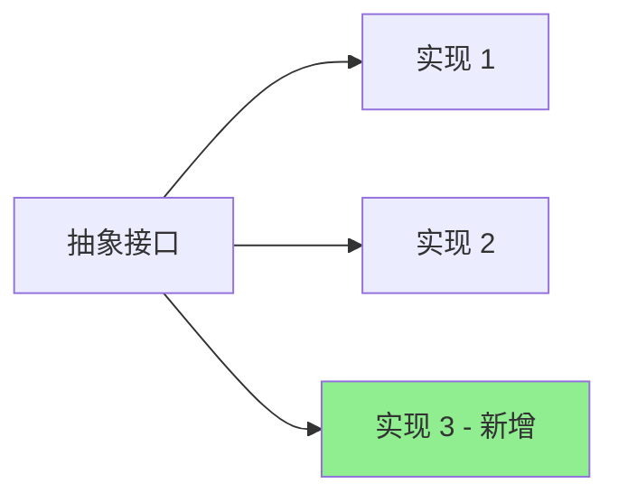

```java
// 抽象 —— 对扩展开放
public interface PaymentStrategy {
    void pay(double amount);
}

// 已有实现 —— 不动
public class AlipayStrategy implements PaymentStrategy {
    @Override
    public void pay(double amount) {
        System.out.println("支付宝支付: " + amount);
    }
}
public class WechatPayStrategy implements PaymentStrategy {
    @Override
    public void pay(double amount) {
        System.out.println("微信支付: " + amount);
    }
}

// 新增支付方式 —— 扩展，不修改原有代码
public class CreditCardPayStrategy implements PaymentStrategy {
    @Override
    public void pay(double amount) {
        System.out.println("信用卡支付: " + amount);
    }
}

public class PaymentContext {
    private PaymentStrategy strategy;
    public PaymentContext(PaymentStrategy strategy) { this.strategy = strategy; }
    public void execute(double amount) { strategy.pay(amount); }
}
```

---

### 里氏替换原则（LSP）

> 子类必须能够替换其父类而不破坏程序的正确性。

**经典反例：正方形 ≠ 长方形**

```java
// 违反 LSP
public class Rectangle {
    protected int width;
    protected int height;
    public void setWidth(int w) { this.width = w; }
    public void setHeight(int h) { this.height = h; }
    public int getArea() { return width * height; }
}

public class Square extends Rectangle {
    @Override
    public void setWidth(int w) {
        super.setWidth(w);
        super.setHeight(w); // 破坏父类行为
    }
    @Override
    public void setHeight(int h) {
        super.setWidth(h);
        super.setHeight(h);
    }
}

// 客户端代码 —— 对 Rectangle 成立，对 Square 失败
public void resize(Rectangle r) {
    r.setWidth(5);
    r.setHeight(4);
    System.out.println(r.getArea()); // Rectangle: 20, Square: 16 ❌
}
```

**正确做法：使用接口抽象**

```java
public interface Shape {
    int getArea();
}
public class Rectangle implements Shape {
    private int width, height;
    public Rectangle(int w, int h) { width = w; height = h; }
    @Override public int getArea() { return width * height; }
}
public class Square implements Shape {
    private int side;
    public Square(int s) { side = s; }
    @Override public int getArea() { return side * side; }
}
```

---

### 接口隔离原则（ISP）

> 客户端不应该被迫依赖它不使用的接口。

**反例：胖接口**

```java
public interface Worker {
    void work();
    void eat();
    void sleep();
}

public class HumanWorker implements Worker {
    @Override public void work() { System.out.println("work"); }
    @Override public void eat() { System.out.println("eat"); }
    @Override public void sleep() { System.out.println("sleep"); }
}

public class RobotWorker implements Worker {
    @Override public void work() { System.out.println("work"); }
    @Override public void eat() { throw new UnsupportedOperationException("Robot can't eat"); }
    @Override public void sleep() { throw new UnsupportedOperationException("Robot can't sleep"); }
}
```

**正例：细粒度接口**

```java
public interface Workable { void work(); }
public interface Eatable { void eat(); }
public interface Sleepable { void sleep(); }

public class HumanWorker implements Workable, Eatable, Sleepable {
    @Override public void work() { System.out.println("work"); }
    @Override public void eat() { System.out.println("eat"); }
    @Override public void sleep() { System.out.println("sleep"); }
}

public class RobotWorker implements Workable {
    @Override public void work() { System.out.println("work"); }
}
```

---

### 依赖倒置原则（DIP）

> 高层模块不应该依赖低层模块，两者都应该依赖抽象；抽象不应该依赖细节，细节应该依赖抽象。

```java
// 反例：高层依赖具体实现
public class EmailService {
    public void send(String msg) { System.out.println("Email: " + msg); }
}
public class Notification {
    private EmailService email = new EmailService(); // 直接依赖具体类
    public void notify(String msg) { email.send(msg); }
}

// 正例：依赖抽象
public interface MessageSender {
    void send(String msg);
}
public class EmailSender implements MessageSender {
    @Override public void send(String msg) { System.out.println("Email: " + msg); }
}
public class SmsSender implements MessageSender {
    @Override public void send(String msg) { System.out.println("SMS: " + msg); }
}
public class Notification {
    private final MessageSender sender; // 依赖接口
    public Notification(MessageSender sender) { this.sender = sender; }
    public void notify(String msg) { sender.send(msg); }
}
```

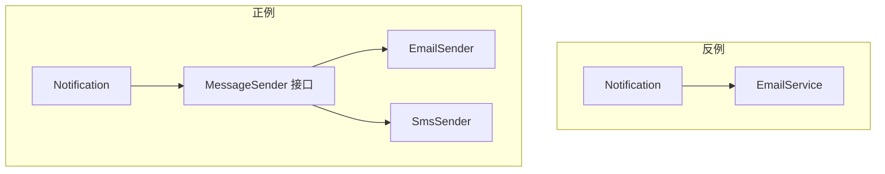

---

### KISS / YAGNI / DRY / 组合优于继承

| 原则 | 含义 | 说明 |
|------|------|------|
| **KISS** | Keep It Simple, Stupid | 简单性优先，不要过度设计 |
| **YAGNI** | You Ain't Gonna Need It | 不要添加当前不需要的功能 |
| **DRY** | Don't Repeat Yourself | 避免重复代码，抽取复用逻辑 |
| **组合优于继承** | Favor Composition over Inheritance | 用组合（has-a）代替继承（is-a）提高灵活性 |

```java
// 组合优于继承示例
// 不推荐：继承导致类爆炸
public class Dog { public void bark() { } }
public class Bird { public void fly() { } }

// 推荐：组合行为
public interface FlyBehavior { void fly(); }
public interface BarkBehavior { void bark(); }

public class Animal {
    private FlyBehavior flyBehavior;
    private BarkBehavior barkBehavior;
    public Animal(FlyBehavior fb, BarkBehavior bb) {
        this.flyBehavior = fb;
        this.barkBehavior = bb;
    }
    public void fly() { flyBehavior.fly(); }
    public void bark() { barkBehavior.bark(); }
}
// 运行时自由组合
Animal dog = new Animal(() -> {}, () -> System.out.println("bark"));
Animal flyingDog = new Animal(() -> System.out.println("fly"), () -> System.out.println("bark"));
```

---

## 2. 设计模式（重点实现）

### 单例模式（Singleton）

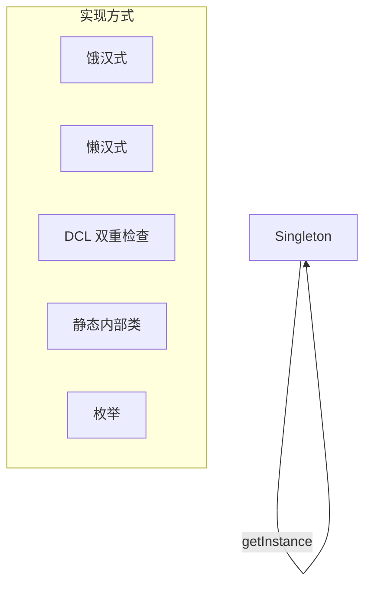

#### 饿汉式

```java
public class SingletonEager {
    private static final SingletonEager INSTANCE = new SingletonEager();
    private SingletonEager() { }
    public static SingletonEager getInstance() { return INSTANCE; }
}
```

#### 懒汉式（线程不安全）

```java
public class SingletonLazy {
    private static SingletonLazy instance;
    private SingletonLazy() { }
    public static SingletonLazy getInstance() {
        if (instance == null) instance = new SingletonLazy();
        return instance;
    }
}
```

#### DCL 双重检查锁定

```java
public class SingletonDCL {
    private static volatile SingletonDCL instance;
    private SingletonDCL() { }
    public static SingletonDCL getInstance() {
        if (instance == null) {
            synchronized (SingletonDCL.class) {
                if (instance == null) {
                    instance = new SingletonDCL();
                }
            }
        }
        return instance;
    }
}
```

#### 静态内部类

```java
public class SingletonHolder {
    private SingletonHolder() { }
    private static class Holder {
        private static final SingletonHolder INSTANCE = new SingletonHolder();
    }
    public static SingletonHolder getInstance() { return Holder.INSTANCE; }
}
```

#### 枚举

```java
public enum SingletonEnum {
    INSTANCE;
    public void doSomething() { System.out.println("Singleton via Enum"); }
}
// 使用: SingletonEnum.INSTANCE.doSomething();
```

---

### 工厂模式（Factory）

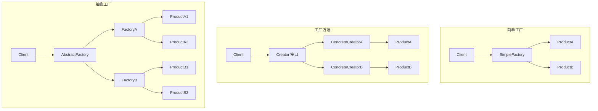

#### 简单工厂

```java
public interface Product { void use(); }
public class ConcreteProductA implements Product {
    @Override public void use() { System.out.println("Product A"); }
}
public class ConcreteProductB implements Product {
    @Override public void use() { System.out.println("Product B"); }
}

public class SimpleFactory {
    public static Product createProduct(String type) {
        return switch (type) {
            case "A" -> new ConcreteProductA();
            case "B" -> new ConcreteProductB();
            default -> throw new IllegalArgumentException("Unknown: " + type);
        };
    }
}
```

#### 工厂方法

```java
public interface Product { void use(); }
public interface Factory { Product create(); }

public class ProductA implements Product {
    @Override public void use() { System.out.println("Product A"); }
}
public class FactoryA implements Factory {
    @Override public Product create() { return new ProductA(); }
}

public class ProductB implements Product {
    @Override public void use() { System.out.println("Product B"); }
}
public class FactoryB implements Factory {
    @Override public Product create() { return new ProductB(); }
}
// 使用: Factory f = new FactoryA(); Product p = f.create();
```

#### 抽象工厂

```java
// 产品族
public interface Button { void render(); }
public interface Checkbox { void check(); }

// Windows 风格产品族
public class WinButton implements Button {
    @Override public void render() { System.out.println("Windows Button"); }
}
public class WinCheckbox implements Checkbox {
    @Override public void check() { System.out.println("Windows Checkbox"); }
}

// Mac 风格产品族
public class MacButton implements Button {
    @Override public void render() { System.out.println("Mac Button"); }
}
public class MacCheckbox implements Checkbox {
    @Override public void check() { System.out.println("Mac Checkbox"); }
}

// 抽象工厂
public interface GUIFactory {
    Button createButton();
    Checkbox createCheckbox();
}
public class WinFactory implements GUIFactory {
    @Override public Button createButton() { return new WinButton(); }
    @Override public Checkbox createCheckbox() { return new WinCheckbox(); }
}
public class MacFactory implements GUIFactory {
    @Override public Button createButton() { return new MacButton(); }
    @Override public Checkbox createCheckbox() { return new MacCheckbox(); }
}
// 使用: GUIFactory factory = new WinFactory(); Button btn = factory.createButton();
```

---

### 建造者模式（Builder）

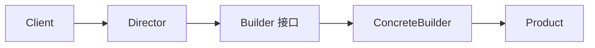

**Lombok `@Builder` 原理实现：**

```java
public class Computer {
    private final String cpu;
    private final String ram;
    private final String storage;
    private final String gpu;

    private Computer(Builder builder) {
        this.cpu = builder.cpu;
        this.ram = builder.ram;
        this.storage = builder.storage;
        this.gpu = builder.gpu;
    }

    public static class Builder {
        private String cpu;
        private String ram;
        private String storage;
        private String gpu;

        public Builder cpu(String cpu) { this.cpu = cpu; return this; }
        public Builder ram(String ram) { this.ram = ram; return this; }
        public Builder storage(String storage) { this.storage = storage; return this; }
        public Builder gpu(String gpu) { this.gpu = gpu; return this; }
        public Computer build() { return new Computer(this); }
    }

    public static Builder builder() { return new Builder(); }
}

// 使用
Computer pc = Computer.builder()
        .cpu("Intel i9")
        .ram("32GB")
        .storage("1TB SSD")
        .gpu("RTX 4090")
        .build();
```

---

### 代理模式（Proxy）

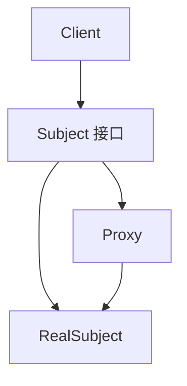

#### 静态代理

```java
public interface DataService {
    void query(String sql);
}

public class DataServiceImpl implements DataService {
    @Override
    public void query(String sql) {
        System.out.println("Executing: " + sql);
    }
}

public class DataServiceProxy implements DataService {
    private final DataServiceImpl target;
    public DataServiceProxy(DataServiceImpl target) { this.target = target; }

    @Override
    public void query(String sql) {
        System.out.println("[LOG] before query");
        long start = System.nanoTime();
        target.query(sql);
        long elapsed = (System.nanoTime() - start) / 1_000_000;
        System.out.println("[LOG] after query, cost=" + elapsed + "ms");
    }
}
```

#### JDK 动态代理

```java
import java.lang.reflect.InvocationHandler;
import java.lang.reflect.Method;
import java.lang.reflect.Proxy;

public class LogHandler implements InvocationHandler {
    private final Object target;
    public LogHandler(Object target) { this.target = target; }

    @Override
    public Object invoke(Object proxy, Method method, Object[] args) throws Throwable {
        System.out.println("[JDK Proxy] before " + method.getName());
        Object result = method.invoke(target, args);
        System.out.println("[JDK Proxy] after " + method.getName());
        return result;
    }

    @SuppressWarnings("unchecked")
    public static <T> T createProxy(T target, Class<T> interfaceType) {
        return (T) Proxy.newProxyInstance(
                target.getClass().getClassLoader(),
                new Class<?>[]{interfaceType},
                new LogHandler(target));
    }
}

// 使用
DataService proxy = LogHandler.createProxy(new DataServiceImpl(), DataService.class);
proxy.query("SELECT * FROM users");
```

#### CGLIB 动态代理（针对没有接口的类）

```java
import net.sf.cglib.proxy.Enhancer;
import net.sf.cglib.proxy.MethodInterceptor;
import net.sf.cglib.proxy.MethodProxy;
import java.lang.reflect.Method;

public class CglibProxy implements MethodInterceptor {
    @SuppressWarnings("unchecked")
    public static <T> T createProxy(Class<T> clazz) {
        Enhancer enhancer = new Enhancer();
        enhancer.setSuperclass(clazz);
        enhancer.setCallback(new CglibProxy());
        return (T) enhancer.create();
    }

    @Override
    public Object intercept(Object obj, Method method, Object[] args, MethodProxy proxy)
            throws Throwable {
        System.out.println("[CGLIB] before " + method.getName());
        Object result = proxy.invokeSuper(obj, args);
        System.out.println("[CGLIB] after " + method.getName());
        return result;
    }
}

// 使用
DataServiceImpl proxy = CglibProxy.createProxy(DataServiceImpl.class);
proxy.query("SELECT * FROM users");
```

**对比：**

| 特性 | 静态代理 | JDK 动态代理 | CGLIB 动态代理 |
|------|----------|-------------|---------------|
| 原理 | 手动编写代理类 | 反射 + Proxy | 字节码增强（继承） |
| 要求 | 实现接口 | 实现接口 | 不要求接口 |
| 性能 | 调用快 | 中等 | 较高 |
| 限制 | 每个类一个代理 | 只能代理接口 | 无法代理 final 类/方法 |
| Spring 场景 | AOP 配置 | 有接口时默认 | 无接口时默认 |

---

### 适配器模式（Adapter）

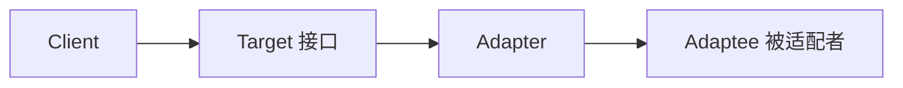

**MVC HandlerAdapter 示例：**

```java
// 目标接口
public interface HandlerAdapter {
    boolean supports(Object handler);
    ModelAndView handle(Object handler, HttpServletRequest req, HttpServletResponse resp);
}

// 被适配者 1：Controller 接口
public interface Controller {
    ModelAndView handleRequest(HttpServletRequest req, HttpServletResponse resp);
}
public class SimpleControllerAdapter implements HandlerAdapter {
    @Override
    public boolean supports(Object handler) { return handler instanceof Controller; }

    @Override
    public ModelAndView handle(Object handler, HttpServletRequest req,
                                HttpServletResponse resp) {
        return ((Controller) handler).handleRequest(req, resp);
    }
}

// 被适配者 2：HttpRequestHandler
public interface HttpRequestHandler {
    void handle(HttpServletRequest req, HttpServletResponse resp);
}
public class HttpRequestHandlerAdapter implements HandlerAdapter {
    @Override
    public boolean supports(Object handler) { return handler instanceof HttpRequestHandler; }

    @Override
    public ModelAndView handle(Object handler, HttpServletRequest req,
                                HttpServletResponse resp) {
        ((HttpRequestHandler) handler).handle(req, resp);
        return null;
    }
}
```

---

### 装饰器模式（Decorator）

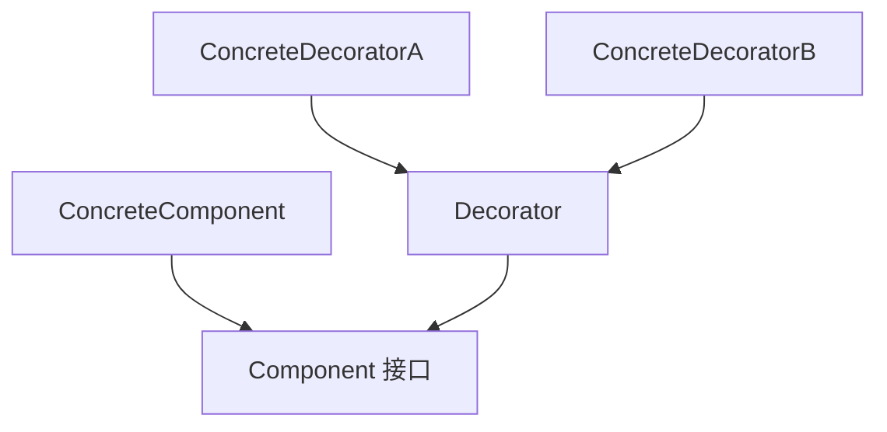

**Java IO FilterInputStream 示例：**

```java
// 抽象组件
public interface DataSource {
    void writeData(String data);
    String readData();
}

// 具体组件
public class FileDataSource implements DataSource {
    private String filename;
    public FileDataSource(String filename) { this.filename = filename; }

    @Override
    public void writeData(String data) {
        System.out.println("写入文件 " + filename + ": " + data);
    }
    @Override
    public String readData() {
        return "data from " + filename;
    }
}

// 基础装饰器
public abstract class DataSourceDecorator implements DataSource {
    protected DataSource wrappee;
    public DataSourceDecorator(DataSource wrappee) { this.wrappee = wrappee; }
    @Override public void writeData(String data) { wrappee.writeData(data); }
    @Override public String readData() { return wrappee.readData(); }
}

// 具体装饰器：加密
public class EncryptionDecorator extends DataSourceDecorator {
    public EncryptionDecorator(DataSource wrappee) { super(wrappee); }
    @Override
    public void writeData(String data) {
        String encrypted = "ENCRYPTED(" + data + ")"; // 模拟加密
        super.writeData(encrypted);
    }
    @Override
    public String readData() {
        String data = super.readData();
        return data.replace("ENCRYPTED(", "").replace(")", ""); // 模拟解密
    }
}

// 具体装饰器：压缩
public class CompressionDecorator extends DataSourceDecorator {
    public CompressionDecorator(DataSource wrappee) { super(wrappee); }
    @Override
    public void writeData(String data) {
        String compressed = "ZIP(" + data + ")"; // 模拟压缩
        super.writeData(compressed);
    }
    @Override
    public String readData() {
        String data = super.readData();
        return data.replace("ZIP(", "").replace(")", "");
    }
}

// 使用：多层装饰
DataSource source = new FileDataSource("test.txt");
source = new CompressionDecorator(source);
source = new EncryptionDecorator(source);
source.writeData("Hello World");
// 效果: 加密 → 压缩 → 写入文件
```

---

### 策略模式（Strategy）

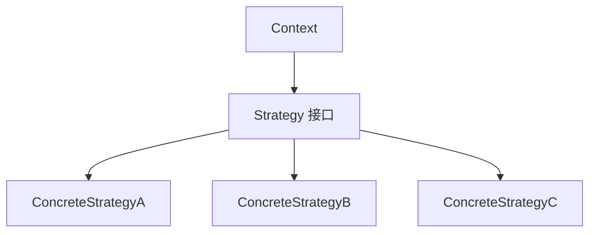

**Comparator 示例：**

```java
import java.util.*;

// java.util.Comparator<T> 就是策略接口
public class StrategyDemo {
    public static void main(String[] args) {
        List<String> names = Arrays.asList("Charlie", "Alice", "Bob");

        // 策略1：自然排序
        names.sort(null);
        System.out.println(names); // [Alice, Bob, Charlie]

        // 策略2：按长度排序
        names.sort(Comparator.comparingInt(String::length));
        System.out.println(names); // [Bob, Alice, Charlie]

        // 策略3：倒序
        names.sort(Comparator.reverseOrder());
        System.out.println(names); // [Charlie, Bob, Alice]
    }
}
```

**支付方式示例：**

```java
public interface PaymentStrategy {
    void pay(BigDecimal amount);
}

public class AlipayStrategy implements PaymentStrategy {
    @Override
    public void pay(BigDecimal amount) {
        System.out.println("支付宝支付: ¥" + amount);
    }
}

public class WechatPayStrategy implements PaymentStrategy {
    @Override
    public void pay(BigDecimal amount) {
        System.out.println("微信支付: ¥" + amount);
    }
}

public class PaymentContext {
    private PaymentStrategy strategy;
    public PaymentContext(PaymentStrategy strategy) { this.strategy = strategy; }
    public void checkout(BigDecimal amount) { strategy.pay(amount); }
}

// 使用
PaymentContext ctx = new PaymentContext(new AlipayStrategy());
ctx.checkout(new BigDecimal("99.00"));
```

---

### 模板方法模式（Template Method）

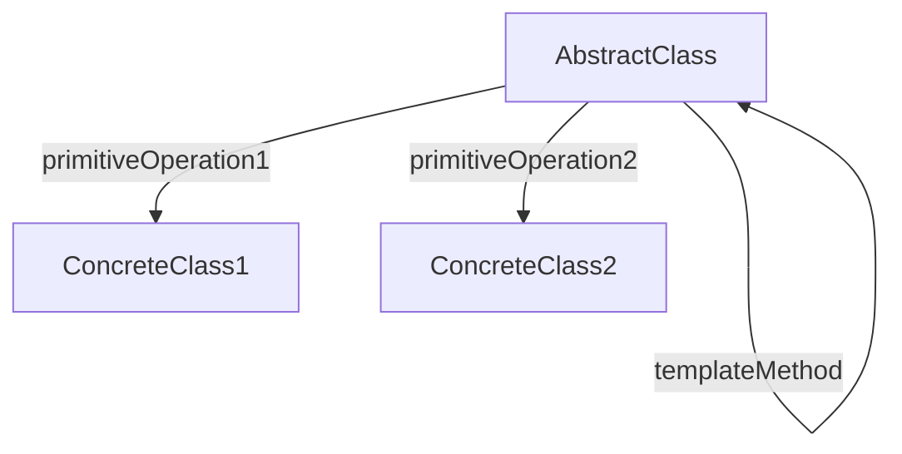

**JdbcTemplate 原理：**

```java
public abstract class JdbcTemplate {
    // 模板方法 —— 定义骨架
    public final <T> T execute(String sql, RowMapper<T> mapper) {
        Connection conn = null;
        Statement stmt = null;
        ResultSet rs = null;
        try {
            conn = getConnection();
            stmt = conn.createStatement();
            rs = stmt.executeQuery(sql);
            T result = mapper.mapRow(rs);
            return result;
        } catch (Exception e) {
            handleException(e);
            throw new RuntimeException(e);
        } finally {
            close(rs);
            close(stmt);
            close(conn);
        }
    }

    // 子类可覆盖的钩子
    protected Connection getConnection() {
        return DriverManager.getConnection("jdbc:default:connection");
    }
    protected void handleException(Exception e) {
        System.err.println("SQL error: " + e.getMessage());
    }

    // 通用资源关闭
    private void close(AutoCloseable resource) {
        if (resource != null) try { resource.close(); } catch (Exception ignored) { }
    }
}

// RowMapper 回调接口
@FunctionalInterface
public interface RowMapper<T> {
    T mapRow(ResultSet rs) throws SQLException;
}

// 使用
public class UserDao extends JdbcTemplate {
    public User findById(Long id) {
        String sql = "SELECT * FROM users WHERE id = " + id;
        return execute(sql, rs -> {
            if (rs.next()) {
                User u = new User();
                u.setId(rs.getLong("id"));
                u.setName(rs.getString("name"));
                return u;
            }
            return null;
        });
    }
}
```

---

### 观察者模式（Observer）

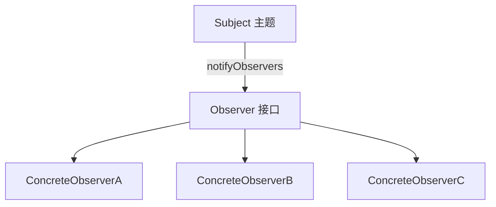

**Spring 事件机制模拟：**

```java
import java.util.*;

// 事件
public class OrderEvent {
    private final Long orderId;
    private final String type; // CREATED / PAID / SHIPPED
    public OrderEvent(Long orderId, String type) {
        this.orderId = orderId;
        this.type = type;
    }
    public Long getOrderId() { return orderId; }
    public String getType() { return type; }
}

// 观察者接口
@FunctionalInterface
public interface OrderEventListener {
    void onOrderEvent(OrderEvent event);
}

// 事件发布器
public class OrderEventPublisher {
    private final List<OrderEventListener> listeners = new ArrayList<>();

    public void register(OrderEventListener listener) {
        listeners.add(listener);
    }

    public void publish(OrderEvent event) {
        for (OrderEventListener listener : listeners) {
            listener.onOrderEvent(event);
        }
    }
}

// 具体观察者
public class SmsNotifier implements OrderEventListener {
    @Override
    public void onOrderEvent(OrderEvent event) {
        if ("PAID".equals(event.getType())) {
            System.out.println("发送支付成功短信: 订单 " + event.getOrderId());
        }
    }
}

public class InventoryUpdater implements OrderEventListener {
    @Override
    public void onOrderEvent(OrderEvent event) {
        if ("CREATED".equals(event.getType())) {
            System.out.println("扣减库存: 订单 " + event.getOrderId());
        }
    }
}

public class LogisticsService implements OrderEventListener {
    @Override
    public void onOrderEvent(OrderEvent event) {
        if ("PAID".equals(event.getType())) {
            System.out.println("通知物流发货: 订单 " + event.getOrderId());
        }
    }
}

// 使用
OrderEventPublisher publisher = new OrderEventPublisher();
publisher.register(new SmsNotifier());
publisher.register(new InventoryUpdater());
publisher.register(new LogisticsService());
publisher.publish(new OrderEvent(1001L, "PAID"));
```

---

### 责任链模式（Chain of Responsibility）

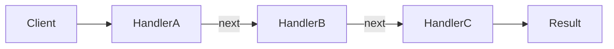

**Filter Chain 示例：**

```java
public abstract class Filter {
    protected Filter next;
    public Filter setNext(Filter next) { this.next = next; return next; }

    public abstract void doFilter(String request);

    protected void next(String request) {
        if (next != null) next.doFilter(request);
    }
}

public class AuthFilter extends Filter {
    @Override
    public void doFilter(String request) {
        System.out.println("[Auth] 校验 Token: " + request);
        next(request);
    }
}

public class RateLimitFilter extends Filter {
    @Override
    public void doFilter(String request) {
        System.out.println("[RateLimit] 检查频率: " + request);
        next(request);
    }
}

public class LogFilter extends Filter {
    @Override
    public void doFilter(String request) {
        System.out.println("[Log] 记录请求: " + request);
        next(request);
    }
}

// 使用：构建责任链
Filter chain = new AuthFilter();
chain.setNext(new RateLimitFilter())
     .setNext(new LogFilter());

chain.doFilter("GET /api/orders");
// 输出:
// [Auth] 校验 Token: GET /api/orders
// [RateLimit] 检查频率: GET /api/orders
// [Log] 记录请求: GET /api/orders
```

---

### 状态模式（State）

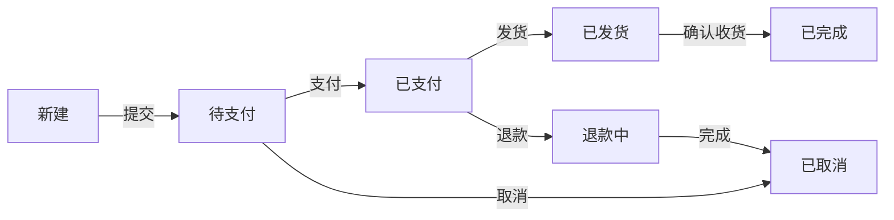

**订单状态流转：**

```java
// 状态接口
public interface OrderState {
    void pay(OrderContext context);
    void ship(OrderContext context);
    void confirm(OrderContext context);
    void cancel(OrderContext context);
}

// 上下文
public class OrderContext {
    private OrderState state;
    private String orderId;

    public OrderContext(String orderId) {
        this.orderId = orderId;
        this.state = new NewState(); // 初始状态：新建
    }

    public void setState(OrderState state) {
        System.out.println("[" + orderId + "] 状态变更: " + this.state + " → " + state);
        this.state = state;
    }

    public void pay()   { state.pay(this); }
    public void ship()  { state.ship(this); }
    public void confirm() { state.confirm(this); }
    public void cancel() { state.cancel(this); }
}

// 具体状态
public class NewState implements OrderState {
    @Override
    public void pay(OrderContext ctx)   { ctx.setState(new PaidState()); }
    @Override
    public void ship(OrderContext ctx)  { throw new IllegalStateException("未支付不能发货"); }
    @Override
    public void confirm(OrderContext ctx) { throw new IllegalStateException("未支付不能确认"); }
    @Override
    public void cancel(OrderContext ctx) { ctx.setState(new CancelledState()); }
    @Override public String toString() { return "新建"; }
}

public class PaidState implements OrderState {
    @Override
    public void pay(OrderContext ctx)   { throw new IllegalStateException("已支付，不能重复支付"); }
    @Override
    public void ship(OrderContext ctx)  { ctx.setState(new ShippedState()); }
    @Override
    public void confirm(OrderContext ctx) { throw new IllegalStateException("未发货不能确认"); }
    @Override
    public void cancel(OrderContext ctx) { ctx.setState(new RefundingState()); }
    @Override public String toString() { return "已支付"; }
}

public class ShippedState implements OrderState {
    @Override
    public void pay(OrderContext ctx)   { throw new IllegalStateException("已发货，不能支付"); }
    @Override
    public void ship(OrderContext ctx)  { throw new IllegalStateException("已发货，不能重复发货"); }
    @Override
    public void confirm(OrderContext ctx) { ctx.setState(new CompletedState()); }
    @Override
    public void cancel(OrderContext ctx) { throw new IllegalStateException("已发货不能取消"); }
    @Override public String toString() { return "已发货"; }
}

public class CompletedState implements OrderState {
    @Override public void pay(OrderContext ctx)    { throw new IllegalStateException("已完成"); }
    @Override public void ship(OrderContext ctx)   { throw new IllegalStateException("已完成"); }
    @Override public void confirm(OrderContext ctx) { throw new IllegalStateException("已完成"); }
    @Override public void cancel(OrderContext ctx) { throw new IllegalStateException("已完成"); }
    @Override public String toString() { return "已完成"; }
}

public class CancelledState implements OrderState {
    @Override public void pay(OrderContext ctx)    { throw new IllegalStateException("已取消"); }
    @Override public void ship(OrderContext ctx)   { throw new IllegalStateException("已取消"); }
    @Override public void confirm(OrderContext ctx) { throw new IllegalStateException("已取消"); }
    @Override public void cancel(OrderContext ctx) { throw new IllegalStateException("已取消"); }
    @Override public String toString() { return "已取消"; }
}

public class RefundingState implements OrderState {
    @Override
    public void pay(OrderContext ctx) { throw new IllegalStateException("退款中"); }
    @Override
    public void ship(OrderContext ctx) { throw new IllegalStateException("退款中"); }
    @Override
    public void confirm(OrderContext ctx) { throw new IllegalStateException("退款中"); }
    @Override
    public void cancel(OrderContext ctx) { ctx.setState(new CancelledState()); }
    @Override public String toString() { return "退款中"; }
}

// 使用
OrderContext order = new OrderContext("ORDER-001");
order.pay();      // 新建 → 已支付
order.ship();     // 已支付 → 已发货
order.confirm();  // 已发货 → 已完成
```

---

## 3. 架构模式

### 分层架构（Layered Architecture）

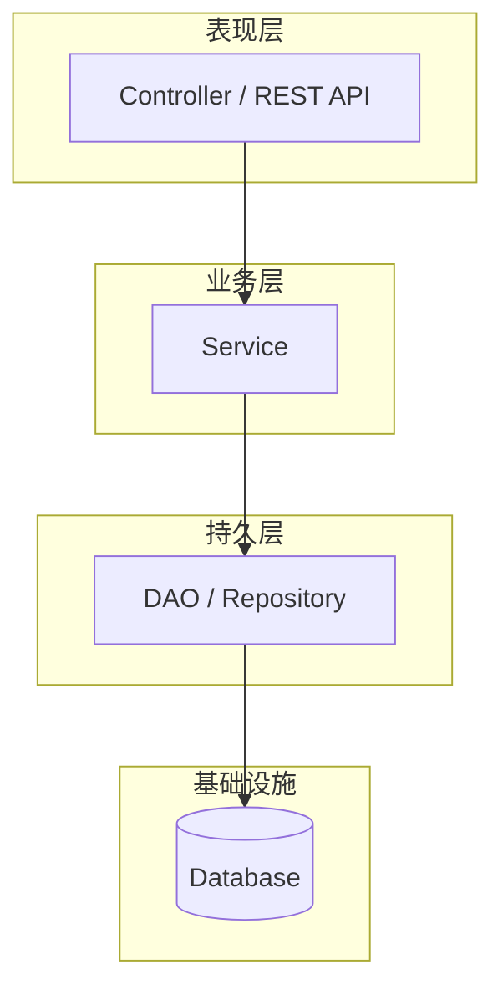

### MVC 模式

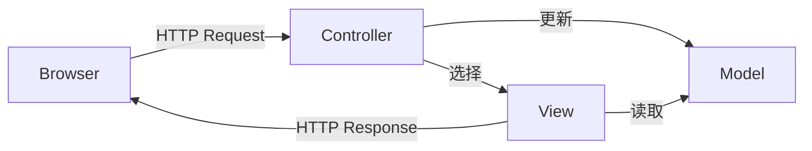

### 微服务架构

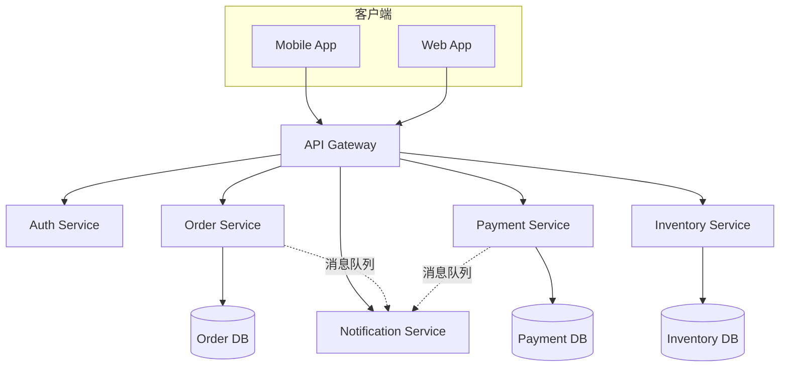

### 事件驱动架构（EDA）

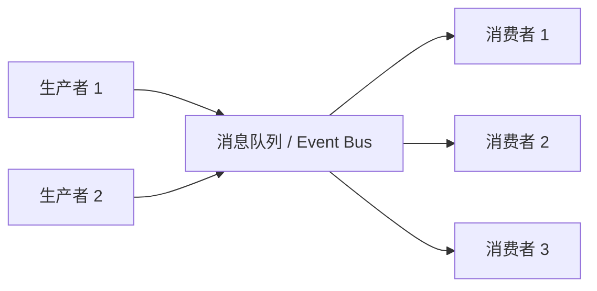

### CQRS（命令查询职责分离）

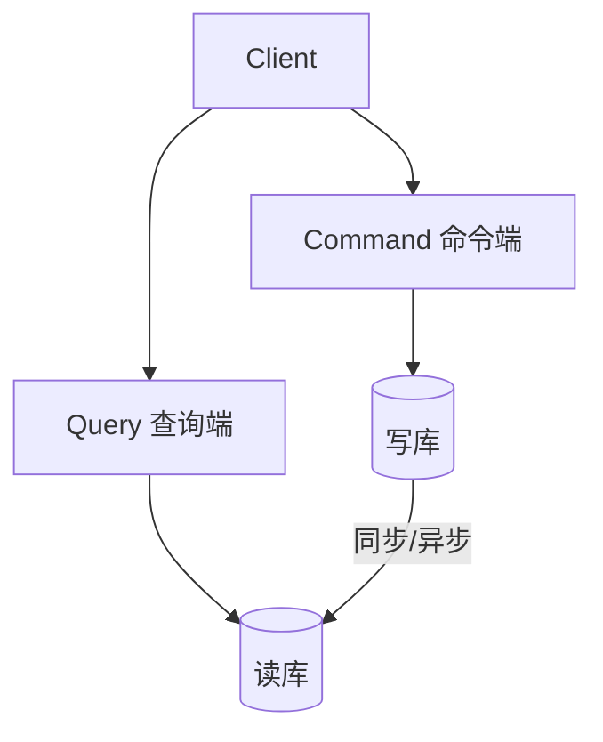

### 六边形架构（Ports & Adapters）

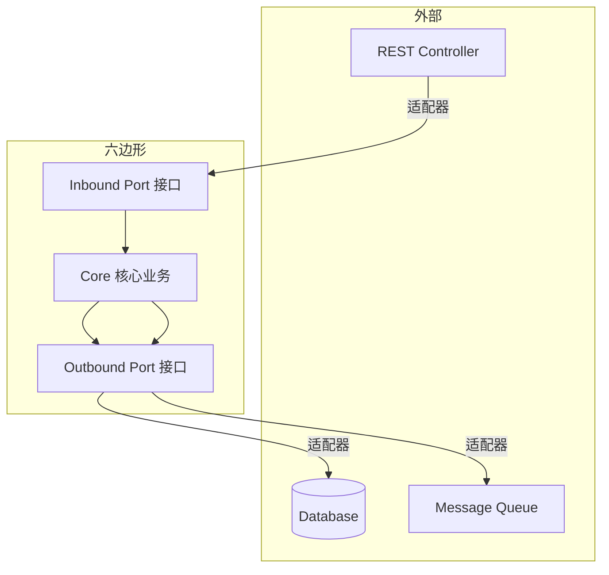

### 整洁架构（Clean Architecture）

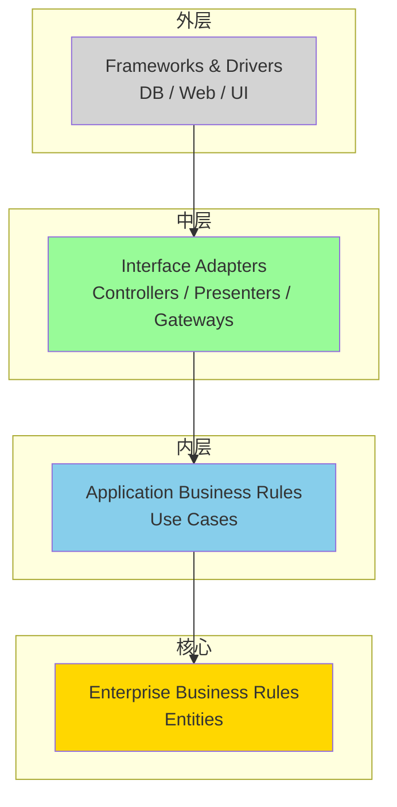

---

## 4. 分布式理论

### CAP 理论

```mermaid
graph TD
    A((CAP))
    A --> C[Consistency<br/>一致性]
    A --> A2[Availability<br/>可用性]
    A --> P[Partition Tolerance<br/>分区容忍性]
    C -.->|CA| RDBMS
    A -.->|AP| APnode[Cassandra / Eureka]
    P -.->|CP| CPnode[ZK / Etcd]
    style C fill:#FFB347
    style A2 fill:#87CECB
    style P fill:#FFD700
```

> **CAP 定理**：分布式系统最多同时满足两项。
> - **CA**：放弃分区容忍（传统 RDBMS 单机）
> - **CP**：放弃可用性（ZooKeeper / Etcd / HBase）
> - **AP**：放弃强一致性（Cassandra / Eureka / DNS）

### BASE 理论

| 特性 | 说明 |
|------|------|
| **BA** - Basically Available | 基本可用，允许部分功能降级 |
| **S** - Soft State | 软状态，允许中间状态 |
| **E** - Eventually Consistent | 最终一致性 |

### Raft 算法

```mermaid
sequenceDiagram
    participant C1 as "Candidate 1"
    participant C2 as "Candidate 2"
    participant L as "Leader"
    participant F1 as "Follower 1"
    participant F2 as "Follower 2"

    Note over C1,F2: 1. Leader 选举
    C1->>F1: RequestVote (term=1)
    C1->>F2: RequestVote (term=1)
    F1->>C1: Vote granted
    F2->>C1: Vote granted
    Note over C1: 成为 Leader (term=1)

    Note over L,F2: 2. 日志复制
    L->>F1: AppendEntries (term=1, entries=[x←3])
    L->>F2: AppendEntries (term=1, entries=[x←3])
    F1->>L: Ack
    F2->>L: Ack
    Note over L: 日志已提交 (committed)
    L->>F1: Apply log to state machine
    L->>F2: Apply log to state machine
```

**Raft 核心流程：**
1. **Leader 选举**：超时后 Follower → Candidate → 获取多数投票 → Leader
2. **日志复制**：Leader 接收客户端请求 → 追加到本地日志 → 并行发送 Follower → 多数确认后提交 → 应用到状态机
3. **安全性**：只有日志最新的节点才能当选；Leader 不能覆盖已提交日志

### 一致性哈希

```mermaid
graph TD
    subgraph 哈希环
        direction LR
        N1((Node A))
        N2((Node B))
        N3((Node C))
        K1(Key-1)
        K2(Key-2)
        K3(Key-3)
        K4(Key-4)
        VN1[虚拟节点 A1]
        VN2[虚拟节点 A2]
    end
    N1 -->|hash| Ring[0 - 2^32-1]
    N2 --> Ring
    N3 --> Ring
    K1 -->|顺时针查找| N1
    K2 -->|顺时针查找| N2
    K3 -->|顺时针查找| N3
    K4 -->|顺时针查找| N1
    VN1 --> Ring
    VN2 --> Ring
```

**一致性哈希要点：**
- 将节点和数据映射到一个 0~2^32-1 的环上
- 数据沿顺时针找到第一个节点
- **虚拟节点**解决数据倾斜问题，每个物理节点对应多个虚拟节点
- 节点增删只影响相邻节点的数据

### 分布式事务

#### 2PC（两阶段提交）

```mermaid
sequenceDiagram
    participant Coordinator as "协调者"
    participant RM1 as "资源管理器 1"
    participant RM2 as "资源管理器 2"

    Note over Coordinator,RM2: 阶段一：准备 (Prepare)
    Coordinator->>RM1: 准备事务 (prepare)
    Coordinator->>RM2: 准备事务 (prepare)
    RM1->>Coordinator: OK (就绪)
    RM2->>Coordinator: OK (就绪)

    Note over Coordinator,RM2: 阶段二：提交 (Commit)
    Coordinator->>RM1: 提交事务 (commit)
    Coordinator->>RM2: 提交事务 (commit)
    RM1->>Coordinator: ACK
    RM2->>Coordinator: ACK
```

#### 3PC（三阶段提交）

```mermaid
sequenceDiagram
    participant C as "协调者"
    participant RM1 as "RM 1"
    participant RM2 as "RM 2"

    Note over C,RM2: 阶段一：CanCommit
    C->>RM1: CanCommit?
    C->>RM2: CanCommit?
    RM1->>C: Yes
    RM2->>C: Yes

    Note over C,RM2: 阶段二：PreCommit
    C->>RM1: PreCommit
    C->>RM2: PreCommit
    RM1->>C: ACK
    RM2->>C: ACK

    Note over C,RM2: 阶段三：DoCommit
    C->>RM1: DoCommit
    C->>RM2: DoCommit
    RM1->>C: ACK
    RM2->>C: ACK
```

#### TCC（Try-Confirm-Cancel）

```mermaid
sequenceDiagram
    participant Client as "客户端"
    participant TM as "事务管理器"
    participant S1 as "服务 A"
    participant S2 as "服务 B"

    Client->>TM: 开始全局事务
    TM->>S1: Try (预留资源)
    TM->>S2: Try (预留资源)
    S1->>TM: OK
    S2->>TM: OK
    TM->>S1: Confirm (确认)
    TM->>S2: Confirm (确认)
    Note right of TM: 如果 Try 失败<br/>则执行 Cancel
```

**TCC 代码示例：**

```java
// TCC 接口定义
public interface TccService {
    boolean tryReserve(Order order);      // 预留资源
    boolean confirm(Order order);          // 确认提交
    boolean cancel(Order order);           // 回滚
}

// 库存服务 TCC 实现
public class InventoryTccService implements TccService {
    @Override
    public boolean tryReserve(Order order) {
        // 冻结库存（不实际扣减）
        System.out.println("冻结库存: " + order.getProductId() + " x " + order.getQuantity());
        return true;
    }
    @Override
    public boolean confirm(Order order) {
        // 真正扣减冻结的库存
        System.out.println("扣减库存: " + order.getProductId());
        return true;
    }
    @Override
    public boolean cancel(Order order) {
        // 释放冻结的库存
        System.out.println("释放库存: " + order.getProductId());
        return true;
    }
}
```

#### Saga 模式

```mermaid
sequenceDiagram
    participant Saga as "Saga 编排器"
    participant S1 as "服务 1: 扣库存"
    participant S2 as "服务 2: 创建订单"
    participant S3 as "服务 3: 扣款"

    Saga->>S1: 扣库存
    S1->>Saga: OK
    Saga->>S2: 创建订单
    S2->>Saga: OK
    Saga->>S3: 扣款
    S3->>Saga: ❌ 失败

    Note over Saga: 回滚补偿
    Saga->>S2: 补偿: 取消订单
    Saga->>S1: 补偿: 恢复库存
```

**分布式事务对比：**

| 方案 | 一致性 | 性能 | 隔离性 | 适用场景 |
|------|--------|------|--------|----------|
| 2PC | 强一致 | 低（同步阻塞） | 高 | 短事务、跨库操作 |
| 3PC | 强一致 | 中（引入超时） | 中 | 改进版 2PC |
| TCC | 最终一致 | 较高 | 中 | 长事务、跨服务 |
| Saga | 最终一致 | 高 | 低 | 长事务、事件驱动 |

---

## 5. 高可用架构设计

### 冗余设计

```mermaid
graph TD
    subgraph 主从
        M1[Master] --> S1[Slave 1]
        M1 --> S2[Slave 2]
    end
    subgraph 多活
        R1[Region 1] <--> R2[Region 2]
        R1 <--> R3[Region 3]
    end
    subgraph 多副本
        P1[Replica 1] <--> P2[Replica 2] <--> P3[Replica 3]
    end
```

### 限流

```mermaid
graph LR
    Client -->|请求| RateLimiter[限流器]
    RateLimiter -->|允许| Service
    RateLimiter -->|拒绝 429| Fallback[降级处理]
```

#### 令牌桶算法

```java
import java.util.concurrent.TimeUnit;
import java.util.concurrent.atomic.AtomicLong;

// 手写令牌桶
public class TokenBucketRateLimiter {
    private final long capacity;          // 桶容量
    private final long refillTokens;       // 每次补充令牌数
    private final long refillIntervalMs;   // 补充间隔
    private AtomicLong tokens;             // 当前令牌数
    private long lastRefillTime;

    public TokenBucketRateLimiter(long capacity, long refillTokens, long refillIntervalMs) {
        this.capacity = capacity;
        this.refillTokens = refillTokens;
        this.refillIntervalMs = refillIntervalMs;
        this.tokens = new AtomicLong(capacity);
        this.lastRefillTime = System.currentTimeMillis();
    }

    public synchronized boolean tryAcquire() {
        refill();
        if (tokens.get() > 0) {
            tokens.decrementAndGet();
            return true;
        }
        return false;
    }

    private void refill() {
        long now = System.currentTimeMillis();
        long elapsed = now - lastRefillTime;
        if (elapsed < refillIntervalMs) return;

        long newTokens = (elapsed / refillIntervalMs) * refillTokens;
        tokens.set(Math.min(capacity, tokens.get() + newTokens));
        lastRefillTime = now;
    }
}

// 使用 Guava RateLimiter（基于令牌桶）
import com.google.common.util.concurrent.RateLimiter;

public class GuavaRateLimiterDemo {
    public static void main(String[] args) {
        // 每秒 5 个令牌
        RateLimiter limiter = RateLimiter.create(5.0);

        for (int i = 0; i < 10; i++) {
            double waitTime = limiter.acquire(); // 阻塞直到获取令牌
            System.out.println("请求 " + i + " 等待 " + waitTime + "s");
        }
    }
}
```

#### 漏桶算法

```java
import java.util.concurrent.atomic.AtomicLong;

public class LeakyBucketRateLimiter {
    private final long capacity;          // 桶容量
    private final long leakRatePerMs;      // 漏出速率（请求/毫秒）
    private AtomicLong water;              // 当前水量
    private long lastLeakTime;

    public LeakyBucketRateLimiter(long capacity, long leakRatePerSecond) {
        this.capacity = capacity;
        this.leakRatePerMs = leakRatePerSecond / 1000; // 转换为每毫秒
        if (this.leakRatePerMs <= 0) this.leakRatePerMs = 1;
        this.water = new AtomicLong(0);
        this.lastLeakTime = System.currentTimeMillis();
    }

    public synchronized boolean tryAcquire() {
        leak();
        if (water.get() < capacity) {
            water.incrementAndGet();
            return true;
        }
        return false;
    }

    private void leak() {
        long now = System.currentTimeMillis();
        long elapsed = now - lastLeakTime;
        if (elapsed <= 0) return;
        long leaked = elapsed * leakRatePerMs;
        if (leaked > 0) {
            water.updateAndGet(w -> Math.max(0, w - leaked));
            lastLeakTime = now;
        }
    }
}
```

**令牌桶 vs 漏桶对比：**

| 特性 | 令牌桶 | 漏桶 |
|------|--------|------|
| 处理突发 | 允许一定突发（积累令牌） | 平滑速率，不允许突发 |
| 速率控制 | 平均速率 + 突发 | 严格流出速率 |
| 实现复杂度 | 中等 | 简单 |
| 推荐场景 | 通用限流、允许突发 | 流量整形、平滑输出 |

### 降级与熔断

|  | Hystrix | Sentinel |
|--|---------|----------|
| 熔断策略 | 基于信号量/线程池隔离 | 基于响应时间/异常比例/异常数 |
| 降级 | fallback 方法 | @SentinelResource fallback |
| 限流 | 不内置（配合其他） | 丰富的限流策略（QPS/线程数） |
| 控制台 | Turbine + Hystrix Dashboard | Sentinel Dashboard |
| 配置动态化 | 需配合 Config 中心 | Nacos/Apollo 原生集成 |
| 指标 | 滑动窗口 | 滑动窗口（更细粒度） |

**Sentinel 熔断降级示例：**

```java
// 使用 Sentinel 的熔断降级（概念代码）
@SentinelResource(
    value = "getOrder",
    fallback = "getOrderFallback",
    blockHandler = "getOrderBlockHandler"
)
public Order getOrder(Long orderId) {
    // 调用远程服务
    return orderServiceClient.getOrder(orderId);
}

public Order getOrderFallback(Long orderId, Throwable t) {
    // 熔断降级：返回本地缓存数据
    return localCache.get(orderId);
}

public Order getOrderBlockHandler(Long orderId, BlockException e) {
    // 限流阻塞
    return Order.empty();
}
```

### 超时与重试（指数退避）

```java
import java.time.Duration;
import java.util.function.Supplier;

public class RetryUtil {
    public static <T> T retryWithExponentialBackoff(
            Supplier<T> action,
            int maxRetries,
            Duration initialDelay) {
        Exception lastException = null;

        for (int attempt = 0; attempt <= maxRetries; attempt++) {
            try {
                return action.get();
            } catch (Exception e) {
                lastException = e;
                if (attempt >= maxRetries) break;

                // 指数退避：2^n * initialDelay + random jitter
                long delay = (long) (initialDelay.toMillis()
                        * Math.pow(2, attempt)
                        * (0.5 + Math.random()));
                System.out.println("重试 " + (attempt + 1) + "/" + maxRetries
                        + " 等待 " + delay + "ms, 异常: " + e.getMessage());

                try { Thread.sleep(delay); } catch (InterruptedException ie) {
                    Thread.currentThread().interrupt();
                    throw new RuntimeException(ie);
                }
            }
        }
        throw new RuntimeException("重试耗尽", lastException);
    }
}

// 使用
RetryUtil.retryWithExponentialBackoff(
    () -> {
        // 远程调用
        return restTemplate.getForObject("http://service/api", String.class);
    },
    3,        // 最多重试 3 次
    Duration.ofMillis(100) // 初始 100ms
);
```

### 负载均衡

```mermaid
graph TD
    Client --> LB[Load Balancer]
    LB -->|轮询 / 最小连接 / 一致性哈希| S1[Server 1]
    LB --> S2[Server 2]
    LB --> S3[Server 3]
```

| 层级 | 原理 | 代表 |
|------|------|------|
| **四层** (L4) | 基于 IP + Port 转发 | LVS / F5 / Nginx Stream |
| **七层** (L7) | 基于 HTTP 头部 / URL / Cookie | Nginx / HAProxy / Spring Cloud Gateway |
| **客户端** | 客户端从注册中心获取列表自行选择 | Ribbon / LoadBalancer |

### 灾备架构

```mermaid
graph TD
    subgraph 同城双活
        AZ1[可用区 A<br/>主集群] <--> AZ2[可用区 B<br/>主集群]
    end
    subgraph 两地三中心
        C1[城市 1 主中心<br/>生产集群]
        C2[城市 1 备用中心<br/>同城灾备]
        C3[城市 2 灾备中心<br/>异地灾备]
    end
```

| 方案 | RTO | RPO | 成本 |
|------|-----|-----|------|
| 同城双活 | 分钟级 | < 5s | 中 |
| 两地三中心 | 分钟级 | < 15s | 高 |
| 异地多活 | 秒级 | 秒级 | 极高 |

### 高并发系统设计

```mermaid
graph LR
    Client --> CDN[静态资源 CDN]
    Client --> Nginx[反向代理 / 限流]
    Nginx --> Redis[Redis 缓存集群]
    Nginx --> App1[应用实例 1]
    Nginx --> App2[应用实例 2]
    Nginx --> AppN[应用实例 N]
    App1 --> MQ[消息队列]
    MQ --> Consumer[异步消费者]
    App1 --> MasterDB[(主库写入)]
    MasterDB --> SlaveDB[(从库读取)]
    Redis --> MasterDB
```

**六大高并发策略：**

| 策略 | 说明 | 技术 |
|------|------|------|
| **缓存** | 减少数据库访问 | Redis / Memcached / CDN |
| **异步** | 削峰填谷，解耦 | MQ（Kafka / RocketMQ / RabbitMQ） |
| **池化** | 复用资源减少开销 | 线程池 / 连接池（HikariCP / Netty） |
| **读写分离** | 主库写、从库读 | MySQL Replication / ShardingSphere |
| **分库分表** | 水平拆分数据 | ShardingSphere / MyCat / Vitess |
| **弹性伸缩** | 按需扩缩容 | Docker / K8s HPA / Service Mesh |

**Java 线程池示例：**

```java
import java.util.concurrent.*;

public class AsyncOrderProcessor {
    // 自定义线程池
    private final ThreadPoolExecutor executor = new ThreadPoolExecutor(
            10,              // corePoolSize
            50,              // maximumPoolSize
            60,              // keepAliveTime
            TimeUnit.SECONDS,
            new LinkedBlockingQueue<>(1000), // 工作队列
            Executors.defaultThreadFactory(),
            new ThreadPoolExecutor.CallerRunsPolicy() // 拒绝策略
    );

    public CompletableFuture<Void> processOrderAsync(Order order) {
        return CompletableFuture.runAsync(() -> {
            // 处理订单逻辑
            System.out.println(Thread.currentThread().getName()
                    + " 处理订单: " + order.getId());
            try { Thread.sleep(100); } catch (InterruptedException ignored) { }
        }, executor);
    }
}
```

---

> **参考**：《设计模式：可复用面向对象软件的基础》GoF、《企业应用架构模式》Martin Fowler、《数据密集型应用系统设计》Martin Kleppmann
