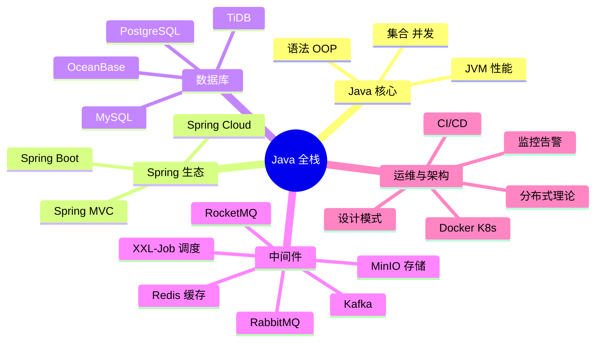

# Java 开发知识体系全栈文档

## 📚 概述

本仓库是一个全面的 Java 开发知识体系文档集合，涵盖从 Java 核心基础到微服务架构、数据库、中间件、DevOps 等 **14 大技术模块**。每个模块包含详细的原理讲解、**代码示例** 和 **Mermaid 架构图**，适合 Java 开发者系统学习、面试准备和日常参考。

---

## 📖 模块导航

| # | 模块 | 文件 | 核心内容 |
|---|------|------|----------|
| 01 | **Java 核心基础** | [01-java-core/README.md](./01-java-core/README.md) | 语法/OOP/异常/泛型/反射/注解/IO-NIO/序列化 |
| 02 | **集合框架** | [02-collections/README.md](./02-collections/README.md) | List/Set/Queue/Map 底层原理、ConcurrentHashMap、LRU |
| 03 | **并发编程** | [03-concurrency/README.md](./03-concurrency/README.md) | 线程池/AQS/锁/CAS/ThreadLocal/JMM/CompletableFuture |
| 04 | **JVM** | [04-jvm/README.md](./04-jvm/README.md) | 内存区域/类加载/GC/调优/Arthas/字节码 |
| 05 | **Spring 框架** | [05-spring/README.md](./05-spring/README.md) | IoC/AOP/事务/MVC/WebFlux/设计模式 |
| 06 | **Spring Boot** | [06-spring-boot/README.md](./06-spring-boot/README.md) | 自动配置/Starter/Actuator/测试/部署 |
| 07 | **Spring Cloud 微服务** | [07-spring-cloud/README.md](./07-spring-cloud/README.md) | Nacos/Sentinel/Gateway/Seata/Skywalking |
| 08 | **MySQL / PgSQL / TiDB / OceanBase** | [08-mysql/README.md](./08-mysql/README.md) | 索引/事务/MVCC/分库分表/多库对比/数据源切换 |
| 09 | **Redis** | [09-redis/README.md](./09-redis/README.md) | 数据结构/持久化/分布式锁/Cluster/缓存设计 |
| 10 | **RocketMQ / Kafka / RabbitMQ** | [10-rocketmq/README.md](./10-rocketmq/README.md) | 架构对比/事务消息/顺序消息/迁移方案/选型指南 |
| 11 | **MinIO 对象存储** | [11-minio/README.md](./11-minio/README.md) | 纠删码/分片上传/预签名 URL/Spring Boot 集成 |
| 12 | **XXL-Job 定时任务** | [12-xxljob/README.md](./12-xxljob/README.md) | 调度架构/分片广播/路由策略/Spring Boot 集成 |
| 13 | **DevOps 工程化** | [13-devops/README.md](./13-devops/README.md) | Git/Maven/CI-CD/Docker/K8s/Prometheus/ELK |
| 14 | **系统设计与架构** | [14-system-design/README.md](./14-system-design/README.md) | SOLID/设计模式/CAP/Raft/高可用/一致性哈希 |

---

## 🗺️ 学习路线图

```
01-java-core  →  02-collections  →  03-concurrency  →  04-jvm
                                                         ↓
08-mysql  →  09-redis  →  10-rocketmq  →  11-minio  →  12-xxljob
                                                         ↓
05-spring  →  06-spring-boot  →  07-spring-cloud
                                                         ↓
13-devops  →  14-system-design
```

---

## 📊 面试题

每个技术栈均配套面试题文件，涵盖常见面试问题与详细答案。

---

## ✨ 文档特点

- ✅ **中文学** — 全部中文编写，适合国内开发者
- ✅ **代码示例** — 每个重要知识点配有完整 Java/SQL/YAML 代码
- ✅ **架构图解** — 大量 Mermaid 图（架构图、时序图、流程图、对比图）
- ✅ **面试导向** — 知识点与面试题配套，查漏补缺
- ✅ **由浅入深** — 从基础到原理再到实战，渐进式学习
- ✅ **对比分析** — 重要技术栈（数据库/MQ/注册中心等）均有横向对比

---

## 🔧 使用方式

1. **按模块学习**：按照学习路线图顺序逐个模块学习
2. **面试准备**：先看知识体系文档，再用面试题自测
3. **日常参考**：作为知识速查手册，工作中随时查阅
4. **配合 IDE**：知识体系中的代码示例可直接在 IDE 中运行验证

---

## 📝 技术栈全景



---

## 🤝 贡献

欢迎提交 Issue 和 Pull Request 完善本知识体系。

## 📄 许可证

MIT License
